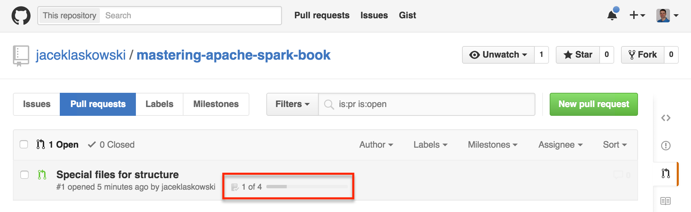

include::book-intro.adoc[]

== GitHub Flavored writing flow

=== AsciiDoc

For the first time I'm using http://powerman.name/doc/asciidoc[AsciiDoc] to write a doc that is ultimately supposed to become the book about Apache Spark.

=== GitHub for pull requests and tasks

While on writing route, I'm also aiming at mastering the git(hub) flow to write the book as described in https://medium.com/@chacon/living-the-future-of-technical-writing-2f368bd0a272[Living the Future of Technical Writing] (with pull requests for chapters, action items to show progress of each branch and such).

The branching and task progress features embrace the concept of working on a branch per chapter and using pull requests with https://guides.github.com/features/mastering-markdown/[GitHub Flavored Markdown] for Task Lists. Once the tasks are defined, GitHub shows progress of a pull request with number of tasks completed and progress bar.

.Pull request with 4 tasks of which 1 is completed

=== Atom editor
I couldn't be me if I didn't use https://atom.io/[Atom editor] with https://github.com/asciidoctor/atom-asciidoc-preview[Asciidoc preview] installed.

It's all to make things harder..._ekhm_...reach higher levels of writing zen.
