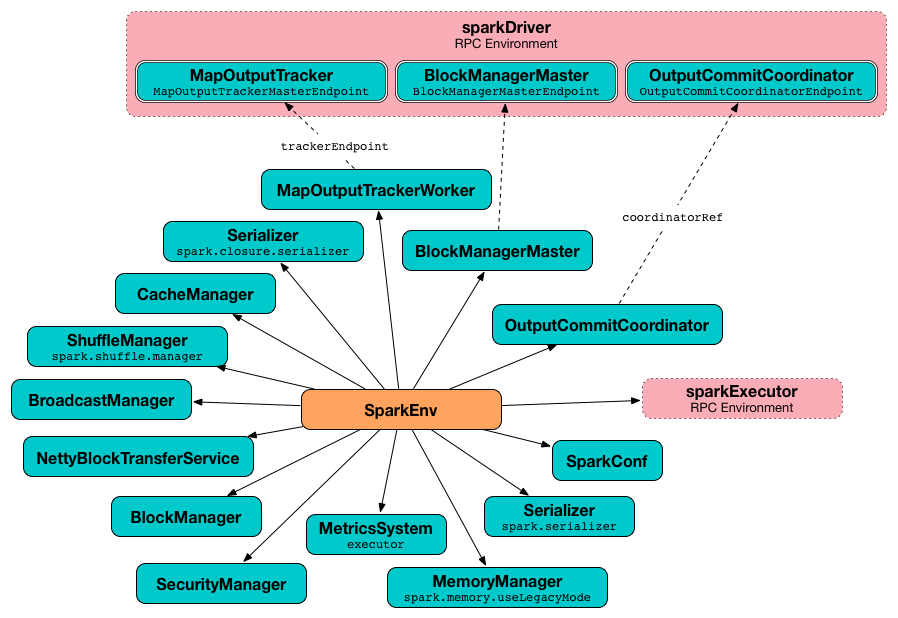
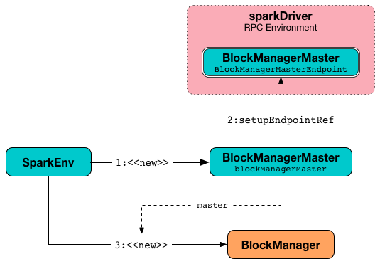

---
tags:
  - DeveloperApi
---

# SparkEnv

`SparkEnv` is a handle to **Spark Execution Environment** with the [core services](#services) of Apache Spark (that interact with each other to establish a distributed computing platform for a Spark application).

There are two separate `SparkEnv`s of the [driver](#createDriverEnv) and [executors](#createExecutorEnv).

## <span id="services"> Core Services

Property | Service
---------|----------
 <span id="blockManager"> blockManager | [BlockManager](storage/BlockManager.md)
 <span id="broadcastManager"> broadcastManager | [BroadcastManager](broadcast-variables/BroadcastManager.md)
 <span id="closureSerializer"> closureSerializer | [Serializer](serializer/Serializer.md)
 <span id="conf"> conf | [SparkConf](SparkConf.md)
 <span id="mapOutputTracker"> mapOutputTracker | [MapOutputTracker](scheduler/MapOutputTracker.md)
 <span id="memoryManager"> memoryManager | [MemoryManager](memory/MemoryManager.md)
 <span id="metricsSystem"> metricsSystem | [MetricsSystem](metrics/MetricsSystem.md)
 <span id="outputCommitCoordinator"> outputCommitCoordinator | [OutputCommitCoordinator](OutputCommitCoordinator.md)
 <span id="rpcEnv"> rpcEnv | [RpcEnv](rpc/RpcEnv.md)
 <span id="securityManager"> securityManager | SecurityManager
 <span id="serializer"> serializer | [Serializer](serializer/Serializer.md)
 <span id="serializerManager"> serializerManager | [SerializerManager](serializer/SerializerManager.md)
 <span id="shuffleManager"> shuffleManager | [ShuffleManager](shuffle/ShuffleManager.md)

## Creating Instance

`SparkEnv` takes the following to be created:

* <span id="executorId"> Executor ID
* [RpcEnv](#rpcEnv)
* [Serializer](#serializer)
* [Serializer](#closureSerializer)
* [SerializerManager](#serializerManager)
* [MapOutputTracker](#mapOutputTracker)
* [ShuffleManager](#shuffleManager)
* [BroadcastManager](#broadcastManager)
* [BlockManager](#blockManager)
* [SecurityManager](#securityManager)
* [MetricsSystem](#metricsSystem)
* [MemoryManager](#memoryManager)
* [OutputCommitCoordinator](#outputCommitCoordinator)
* [SparkConf](#conf)

`SparkEnv` is created using [create](#create) utility.

## <span id="driverTmpDir"> Driver's Temporary Directory

```scala
driverTmpDir: Option[String]
```

`SparkEnv` defines `driverTmpDir` internal registry for the driver to be used as the [root directory](SparkFiles.md#getRootDirectory) of files added using [SparkContext.addFile](SparkContext.md#addFile).

`driverTmpDir` is undefined initially and is defined for the driver only when `SparkEnv` utility is used to [create a "base" SparkEnv](#create).

### <span id="driverTmpDir-demo"> Demo

```text
import org.apache.spark.SparkEnv
```

```scala
// :pa -raw
// BEGIN
package org.apache.spark
object BypassPrivateSpark {
  def driverTmpDir(sparkEnv: SparkEnv) = {
    sparkEnv.driverTmpDir
  }
}
// END
```

```scala
val driverTmpDir = org.apache.spark.BypassPrivateSpark.driverTmpDir(SparkEnv.get).get
```

The above is equivalent to the following snippet.

```scala
import org.apache.spark.SparkFiles
SparkFiles.getRootDirectory
```

## <span id="createDriverEnv"> Creating SparkEnv for Driver

```scala
createDriverEnv(
  conf: SparkConf,
  isLocal: Boolean,
  listenerBus: LiveListenerBus,
  numCores: Int,
  mockOutputCommitCoordinator: Option[OutputCommitCoordinator] = None): SparkEnv
```

`createDriverEnv` creates a SparkEnv execution environment for the driver.


`createDriverEnv` accepts an instance of SparkConf.md[SparkConf], spark-deployment-environments.md[whether it runs in local mode or not], scheduler:LiveListenerBus.md[], the number of cores to use for execution in local mode or `0` otherwise, and a [OutputCommitCoordinator](OutputCommitCoordinator.md) (default: none).

`createDriverEnv` ensures that spark-driver.md#spark_driver_host[spark.driver.host] and spark-driver.md#spark_driver_port[spark.driver.port] settings are defined.

It then passes the call straight on to the <<create, create helper method>> (with `driver` executor id, `isDriver` enabled, and the input parameters).

`createDriverEnv` is used when `SparkContext` is [created](SparkContext.md#createSparkEnv).

## <span id="createExecutorEnv"> Creating SparkEnv for Executor

```scala
createExecutorEnv(
  conf: SparkConf,
  executorId: String,
  hostname: String,
  numCores: Int,
  ioEncryptionKey: Option[Array[Byte]],
  isLocal: Boolean): SparkEnv
createExecutorEnv(
  conf: SparkConf,
  executorId: String,
  bindAddress: String,
  hostname: String,
  numCores: Int,
  ioEncryptionKey: Option[Array[Byte]],
  isLocal: Boolean): SparkEnv
```

`createExecutorEnv` creates an **executor's (execution) environment** that is the Spark execution environment for an executor.



`createExecutorEnv` simply <<create, creates the base SparkEnv>> (passing in all the input parameters) and <<set, sets it as the current SparkEnv>>.

NOTE: The number of cores `numCores` is configured using `--cores` command-line option of `CoarseGrainedExecutorBackend` and is specific to a cluster manager.

`createExecutorEnv` is used when `CoarseGrainedExecutorBackend` utility is requested to `run`.

## <span id="create"> Creating "Base" SparkEnv

```scala
create(
  conf: SparkConf,
  executorId: String,
  bindAddress: String,
  advertiseAddress: String,
  port: Option[Int],
  isLocal: Boolean,
  numUsableCores: Int,
  ioEncryptionKey: Option[Array[Byte]],
  listenerBus: LiveListenerBus = null,
  mockOutputCommitCoordinator: Option[OutputCommitCoordinator] = None): SparkEnv
```

`create` creates the "base" `SparkEnv` (that is common across the driver and executors).

`create` [creates a RpcEnv](rpc/RpcEnv.md#create) as **sparkDriver** on the driver and **sparkExecutor** on executors.

`create` creates a [Serializer](serializer/Serializer.md) (based on [spark.serializer](configuration-properties.md#spark.serializer) configuration property). `create` prints out the following DEBUG message to the logs:

```text
Using serializer: [serializer]
```

`create` creates a [SerializerManager](serializer/SerializerManager.md).

`create` creates a `JavaSerializer` as the closure serializer.

`creates` creates a [BroadcastManager](broadcast-variables/BroadcastManager.md).

`creates` creates a [MapOutputTrackerMaster](scheduler/MapOutputTrackerMaster.md) (on the driver) or a [MapOutputTrackerWorker](scheduler/MapOutputTrackerWorker.md) (on executors). `creates` registers or looks up a [MapOutputTrackerMasterEndpoint](scheduler/MapOutputTrackerMasterEndpoint.md) under the name of **MapOutputTracker**. `creates` prints out the following INFO message to the logs (on the driver only):

```text
Registering MapOutputTracker
```

`creates` creates a [ShuffleManager](shuffle/ShuffleManager.md) (based on [spark.shuffle.manager](configuration-properties.md#spark.shuffle.manager) configuration property).

`create` creates a [UnifiedMemoryManager](memory/UnifiedMemoryManager.md).

With [spark.shuffle.service.enabled](external-shuffle-service/configuration-properties.md#spark.shuffle.service.enabled) configuration property enabled, `create` creates an [ExternalBlockStoreClient](storage/ExternalBlockStoreClient.md).

`create` creates a [BlockManagerMaster](storage/BlockManagerMaster.md).

`create` creates a [NettyBlockTransferService](storage/NettyBlockTransferService.md).




`create` creates a [BlockManager](storage/BlockManager.md).

`create` creates a [MetricsSystem](metrics/MetricsSystem.md#createMetricsSystem).

`create` creates a [OutputCommitCoordinator](OutputCommitCoordinator.md) and registers or looks up a `OutputCommitCoordinatorEndpoint` under the name of **OutputCommitCoordinator**.

`create` creates a [SparkEnv](#creating-instance) (with all the services "stitched" together).

## Logging

Enable `ALL` logging level for `org.apache.spark.SparkEnv` logger to see what happens inside.

Add the following line to `conf/log4j.properties`:

```text
log4j.logger.org.apache.spark.SparkEnv=ALL
```

Refer to [Logging](spark-logging.md).
