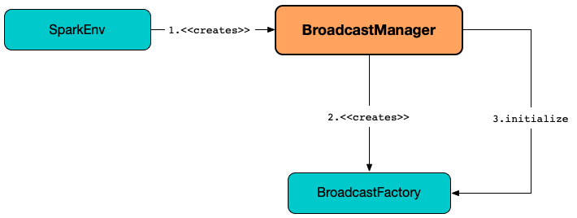

# BroadcastManager

`BroadcastManager` manages a [TorrentBroadcastFactory](#broadcastFactory).



!!! note
    As of [Spark 2.0](https://issues.apache.org/jira/browse/SPARK-12588), it is no longer possible to plug a custom [BroadcastFactory](BroadcastFactory.md) in, and [TorrentBroadcastFactory](TorrentBroadcastFactory.md) is the only known implementation.

## Creating Instance

`BroadcastManager` takes the following to be created:

* <span id="isDriver"> `isDriver` flag
* <span id="conf"> [SparkConf](../SparkConf.md)
* <span id="securityManager"> `SecurityManager`

While being created, `BroadcastManager` is requested to [initialize](#initialize).

`BroadcastManager` is created when:

* `SparkEnv` utility is used to [create a base SparkEnv](../SparkEnv.md#create) (for the driver and executors)

### <span id="initialize"> Initializing

```scala
initialize(): Unit
```

Unless initialized already, `initialize` creates a [TorrentBroadcastFactory](#broadcastFactory) and requests it to [initialize itself](TorrentBroadcastFactory.md#initialize).

## <span id="broadcastFactory"> TorrentBroadcastFactory

`BroadcastManager` manages a [BroadcastFactory](BroadcastFactory.md):

* Creates and initializes it when [created](#creating-instance) (and requested to [initialize](#initialize))

* Stops it when stopped

`BroadcastManager` uses the `BroadcastFactory` when requested for the following:

* [Creating a new broadcast variable](#newBroadcast)
* [Deleting a broadcast variable](#unbroadcast)

## <span id="newBroadcast"> Creating Broadcast Variable

```scala
newBroadcast(
  value_ : T,
  isLocal: Boolean): Broadcast[T]
```

`newBroadcast` requests the [BroadcastFactory](#broadcastFactory) for a [new broadcast variable](BroadcastFactory.md#newBroadcast) (with the [next available broadcast ID](#nextBroadcastId)).

`newBroadcast` is used when:

* `SparkContext` is requested for a [new broadcast variable](../SparkContext.md#broadcast)
* `MapOutputTracker` utility is used to [serializeMapStatuses](../scheduler/MapOutputTracker.md#serializeMapStatuses)

## <span id="nextBroadcastId"> Unique Identifiers of Broadcast Variables

`BroadcastManager` tracks [broadcast variables](#newBroadcast) and assigns unique and continuous identifiers.

## <span id="MapOutputTrackerMaster"> MapOutputTrackerMaster

`BroadcastManager` is used to create a [MapOutputTrackerMaster](../scheduler/MapOutputTrackerMaster.md#BroadcastManager)

## <span id="unbroadcast"> Deleting Broadcast Variable

```scala
unbroadcast(
  id: Long,
  removeFromDriver: Boolean,
  blocking: Boolean): Unit
```

`unbroadcast` requests the [BroadcastFactory](#broadcastFactory) to [delete a broadcast variable](BroadcastFactory.md#unbroadcast) (by `id`).

`unbroadcast` is used when:

* `ContextCleaner` is requested to [clean up a broadcast variable](../core/ContextCleaner.md#doCleanupBroadcast)
