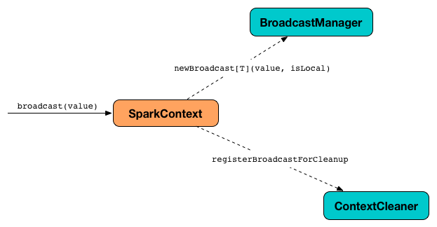

# Broadcast Variables

From [the official documentation about Broadcast Variables](http://spark.apache.org/docs/latest/programming-guide.html#broadcast-variables):

> Broadcast variables allow the programmer to keep a read-only variable cached on each machine rather than shipping a copy of it with tasks.

And later in the document:

> Explicitly creating broadcast variables is only useful when tasks across multiple stages need the same data or when caching the data in deserialized form is important.


Spark uses `SparkContext` to create [broadcast variables](../SparkContext.md#broadcast) and [BroadcastManager](BroadcastManager.md) with [ContextCleaner](../core/ContextCleaner.md) to manage their lifecycle.



Not only can Spark developers use broadcast variables for efficient data distribution, but Spark itself uses them quite often too. A very notable use case is when [Spark distributes tasks (to executors) for execution](../scheduler/DAGScheduler.md#submitMissingTasks).

The idea is to transfer values used in transformations from a driver to executors in a most effective way so they are copied once and used many times by tasks (rather than being copied every time a task is launched).

## <span id="lifecycle"> Lifecycle of Broadcast Variable

Broadcast variables ([TorrentBroadcast](TorrentBroadcast.md)s, actually) are created using [SparkContext.broadcast](../SparkContext.md#broadcast) method.

```text
scala> val b = sc.broadcast(1)
b: org.apache.spark.broadcast.Broadcast[Int] = Broadcast(0)
```

!!! tip Logging
    Enable `DEBUG` logging level for [org.apache.spark.storage.BlockManager](../storage/BlockManager.md#logging) logger to debug `broadcast` method.

With DEBUG logging level enabled, there should be the following messages printed out to the logs:

```text
Put block broadcast_0 locally took  430 ms
Putting block broadcast_0 without replication took  431 ms
Told master about block broadcast_0_piece0
Put block broadcast_0_piece0 locally took  4 ms
Putting block broadcast_0_piece0 without replication took  4 ms
```

A broadcast variable is stored on the driver's [BlockManager](../storage/BlockManager.md) as a single value and separately as chunks (of [spark.broadcast.blockSize](../configuration-properties.md#spark.broadcast.blockSize)).


When requested for the [broadcast value](Broadcast.md#value), `TorrentBroadcast` [reads the broadcast block](TorrentBroadcast.md#readBroadcastBlock) from the local [BroadcastManager](BroadcastManager.md) and, if fails, from the local [BlockManager](../storage/BlockManager.md#getLocalValues). Only when the local lookups fail, `TorrentBroadcast` [reads the broadcast block chunks](TorrentBroadcast.md#readBlocks) (from the `BlockMannager`s on the other executors), [persists them as a single broadcast variable](../storage/BlockManager.md#putSingle) (in the local `BlockManager`) and caches in `BroadcastManager`.

```text
scala> b.value
res0: Int = 1
```

[Broadcast.value](Broadcast.md#value) is the only way to access the value of a broadcast variable in a Spark transformation. You can only access the broadcast value any time until the broadcast variable is [destroyed](Broadcast.md#destroy).

With DEBUG logging level enabled, there should be the following messages printed out to the logs:

```text
Getting local block broadcast_0
Level for block broadcast_0 is StorageLevel(disk, memory, deserialized, 1 replicas)
```

In the end, broadcast variables should be [destroyed](Broadcast.md#destroy) to release memory.

```text
b.destroy
```

With DEBUG logging level enabled, there should be the following messages printed out to the logs:

```text
Removing broadcast 0
Removing block broadcast_0_piece0
Told master about block broadcast_0_piece0
Removing block broadcast_0
```

Broadcast variables can optionally be [unpersisted](Broadcast.md#unpersist).

```text
b.unpersist
```

## Introduction

You use broadcast variable to implement *map-side join*, i.e. a join using a `map`. For this, lookup tables are distributed across nodes in a cluster using `broadcast` and then looked up inside `map` (to do the join implicitly).

When you broadcast a value, it is copied to executors only once (while it is copied multiple times for tasks otherwise). It means that broadcast can help to get your Spark application faster if you have a large value to use in tasks or there are more tasks than executors.

It appears that a Spark idiom emerges that uses `broadcast` with `collectAsMap` to create a `Map` for broadcast. When an RDD is `map` over to a smaller dataset (column-wise not record-wise), `collectAsMap`, and `broadcast`, using the very big RDD to map its elements to the broadcast RDDs is computationally faster.

```text
val acMap = sc.broadcast(myRDD.map { case (a,b,c,b) => (a, c) }.collectAsMap)
val otherMap = sc.broadcast(myOtherRDD.collectAsMap)

myBigRDD.map { case (a, b, c, d) =>
  (acMap.value.get(a).get, otherMap.value.get(c).get)
}.collect
```

Use large broadcasted `HashMap`s over `RDD`s whenever possible and leave `RDD`s with a key to lookup necessary data as demonstrated above.

## Demo

You're going to use a static mapping of interesting projects with their websites, i.e. `Map[String, String]` that the tasks, i.e. closures (anonymous functions) in transformations, use.

```text
val pws = Map(
  "Apache Spark" -> "http://spark.apache.org/",
  "Scala" -> "http://www.scala-lang.org/")

val websites = sc.parallelize(Seq("Apache Spark", "Scala")).map(pws).collect
// websites: Array[String] = Array(http://spark.apache.org/, http://www.scala-lang.org/)
```

It works, but is very ineffective as the `pws` map is sent over the wire to executors while it could have been there already. If there were more tasks that need the `pws` map, you could improve their performance by minimizing the number of bytes that are going to be sent over the network for task execution.

Enter broadcast variables.

```text
val pwsB = sc.broadcast(pws)
val websites = sc.parallelize(Seq("Apache Spark", "Scala")).map(pwsB.value).collect
// websites: Array[String] = Array(http://spark.apache.org/, http://www.scala-lang.org/)
```

Semantically, the two computations - with and without the broadcast value - are exactly the same, but the broadcast-based one wins performance-wise when there are more executors spawned to execute many tasks that use `pws` map.

## Further Reading or Watching

* [Map-Side Join in Spark](http://dmtolpeko.com/2015/02/20/map-side-join-in-spark/)
