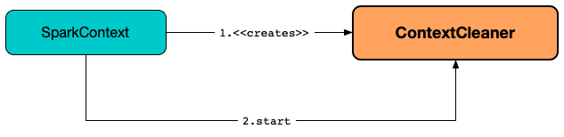

# ContextCleaner

`ContextCleaner` is a Spark service that is responsible for <<keepCleaning, application-wide garbage collection>> (_cleanup_) of <<registerShuffleForCleanup, shuffles>>, <<registerRDDForCleanup, RDDs>>, <<registerBroadcastForCleanup, broadcasts>>, <<registerAccumulatorForCleanup, accumulators>> and <<registerRDDCheckpointDataForCleanup, checkpointed RDDs>> that is aimed at reducing the memory requirements of long-running data-heavy Spark applications.

## Creating Instance

ContextCleaner takes the following to be created:

* [[sc]] SparkContext.md[]

`ContextCleaner` is created and requested to [start](#start) when [SparkContext](../SparkContext.md) is created with configuration-properties.md#spark.cleaner.referenceTracking[spark.cleaner.referenceTracking] configuration property enabled.

== [[cleaningThread]] Spark Context Cleaner Cleaning Thread

ContextCleaner uses a daemon thread *Spark Context Cleaner* to clean RDD, shuffle, and broadcast states.

The Spark Context Cleaner thread is started when ContextCleaner is requested to <<start, start>>.

== [[listeners]][[attachListener]] CleanerListeners

ContextCleaner allows attaching core:CleanerListener.md[CleanerListeners] to be informed when objects are cleaned using `attachListener` method.

[source,scala]
----
attachListener(
  listener: CleanerListener): Unit
----

== [[doCleanupRDD]] doCleanupRDD Method

[source, scala]
----
doCleanupRDD(
  rddId: Int,
  blocking: Boolean): Unit
----

doCleanupRDD...FIXME

doCleanupRDD is used when ContextCleaner is requested to <<keepCleaning, keepCleaning>> for a CleanRDD.

== [[keepCleaning]] keepCleaning Internal Method

[source, scala]
----
keepCleaning(): Unit
----

keepCleaning runs indefinitely until ContextCleaner is requested to <<stop, stop>>. keepCleaning...FIXME

keepCleaning prints out the following DEBUG message to the logs:

[source,plaintext]
----
Got cleaning task [task]
----

keepCleaning is used in <<cleaningThread, Spark Context Cleaner Cleaning Thread>> that is started once when ContextCleaner is requested to <<start, start>>.

== [[registerRDDCheckpointDataForCleanup]] registerRDDCheckpointDataForCleanup Method

[source, scala]
----
registerRDDCheckpointDataForCleanup[T](
  rdd: RDD[_],
  parentId: Int): Unit
----

registerRDDCheckpointDataForCleanup...FIXME

registerRDDCheckpointDataForCleanup is used when ContextCleaner is requested to <<doCheckpoint, doCheckpoint>> (with configuration-properties.md#spark.cleaner.referenceTracking.cleanCheckpoints[spark.cleaner.referenceTracking.cleanCheckpoints] configuration property enabled).

== [[registerBroadcastForCleanup]] registerBroadcastForCleanup Method

[source, scala]
----
registerBroadcastForCleanup[T](
  broadcast: Broadcast[T]): Unit
----

registerBroadcastForCleanup...FIXME

registerBroadcastForCleanup is used when SparkContext is used to SparkContext.md#broadcast[create a broadcast variable].

== [[registerRDDForCleanup]] registerRDDForCleanup Method

[source, scala]
----
registerRDDForCleanup(
  rdd: RDD[_]): Unit
----

registerRDDForCleanup...FIXME

registerRDDForCleanup is used for rdd:RDD.md#persist[RDD.persist] operation.

== [[registerAccumulatorForCleanup]] registerAccumulatorForCleanup Method

[source, scala]
----
registerAccumulatorForCleanup(
  a: AccumulatorV2[_, _]): Unit
----

registerAccumulatorForCleanup...FIXME

registerAccumulatorForCleanup is used when AccumulatorV2 is requested to register.

== [[stop]] Stopping ContextCleaner

[source, scala]
----
stop(): Unit
----

stop...FIXME

stop is used when SparkContext is requested to SparkContext.md#stop[stop].

== [[start]] Starting ContextCleaner

[source, scala]
----
start(): Unit
----

start starts the <<cleaningThread, cleaning thread>> and an action to request the JVM garbage collector (using `System.gc()`) on regular basis per configuration-properties.md#spark.cleaner.periodicGC.interval[spark.cleaner.periodicGC.interval] configuration property.

The action to request the JVM GC is scheduled on <<periodicGCService, periodicGCService executor service>>.

`start` is used when [SparkContext](../SparkContext.md) is created.

== [[periodicGCService]] periodicGCService Single-Thread Executor Service

periodicGCService is an internal single-thread {java-javadoc-url}/java/util/concurrent/ScheduledExecutorService.html[executor service] with the name *context-cleaner-periodic-gc* to request the JVM garbage collector.

The periodic runs are started when <<start, ContextCleaner starts>> and stopped when <<stop, ContextCleaner stops>>.

== [[registerShuffleForCleanup]] Registering ShuffleDependency for Cleanup

[source, scala]
----
registerShuffleForCleanup(
  shuffleDependency: ShuffleDependency[_, _, _]): Unit
----

registerShuffleForCleanup registers the given [ShuffleDependency](../rdd/ShuffleDependency.md) for cleanup.

Internally, registerShuffleForCleanup simply executes <<registerForCleanup, registerForCleanup>> for the given ShuffleDependency.

`registerShuffleForCleanup` is used when [ShuffleDependency](../rdd/ShuffleDependency.md) is created.

== [[registerForCleanup]] Registering Object Reference For Cleanup

[source, scala]
----
registerForCleanup(
  objectForCleanup: AnyRef,
  task: CleanupTask): Unit
----

registerForCleanup adds the input objectForCleanup to the <<referenceBuffer, referenceBuffer>> internal queue.

Despite the widest-possible `AnyRef` type of the input `objectForCleanup`, the type is really `CleanupTaskWeakReference` which is a custom Java's {java-javadoc-url}/java/lang/ref/WeakReference.html[java.lang.ref.WeakReference].

registerForCleanup is used when ContextCleaner is requested to <<registerRDDForCleanup, registerRDDForCleanup>>, <<registerAccumulatorForCleanup, registerAccumulatorForCleanup>>, <<registerShuffleForCleanup, registerShuffleForCleanup>>, <<registerBroadcastForCleanup, registerBroadcastForCleanup>>, and <<registerRDDCheckpointDataForCleanup, registerRDDCheckpointDataForCleanup>>.

== [[doCleanupShuffle]] Shuffle Cleanup

[source, scala]
----
doCleanupShuffle(
  shuffleId: Int,
  blocking: Boolean): Unit
----

doCleanupShuffle performs a shuffle cleanup which is to remove the shuffle from the current scheduler:MapOutputTrackerMaster.md[MapOutputTrackerMaster] and storage:BlockManagerMaster.md[BlockManagerMaster]. doCleanupShuffle also notifies core:CleanerListener.md[CleanerListeners].

Internally, when executed, doCleanupShuffle prints out the following DEBUG message to the logs:

[source,plaintext]
----
Cleaning shuffle [id]
----

doCleanupShuffle uses core:SparkEnv.md[SparkEnv] to access the core:SparkEnv.md#mapOutputTracker[MapOutputTracker] to scheduler:MapOutputTracker.md#unregisterShuffle[unregister the given shuffle].

doCleanupShuffle uses core:SparkEnv.md[SparkEnv] to access the core:SparkEnv.md#blockManager[BlockManagerMaster] to storage:BlockManagerMaster.md#removeShuffle[remove the shuffle blocks] (for the given shuffleId).

doCleanupShuffle informs all registered <<listeners, CleanerListeners>> that core:CleanerListener.md#shuffleCleaned[shuffle was cleaned].

In the end, doCleanupShuffle prints out the following DEBUG message to the logs:

[source,plaintext]
----
Cleaned shuffle [id]
----

In case of any exception, doCleanupShuffle prints out the following ERROR message to the logs and the exception itself:

[source,plaintext]
----
Error cleaning shuffle [id]
----

doCleanupShuffle is used when ContextCleaner is requested to <<keepCleaning, clean a shuffle reference>> and (interestingly) while fitting an `ALSModel` (in Spark MLlib).

== [[logging]] Logging

Enable `ALL` logging level for `org.apache.spark.ContextCleaner` logger to see what happens inside.

Add the following line to `conf/log4j.properties`:

[source,plaintext]
----
log4j.logger.org.apache.spark.ContextCleaner=ALL
----

Refer to spark-logging.md[Logging].

== [[internal-properties]] Internal Properties

=== [[referenceBuffer]] referenceBuffer

=== [[referenceQueue]] referenceQueue
