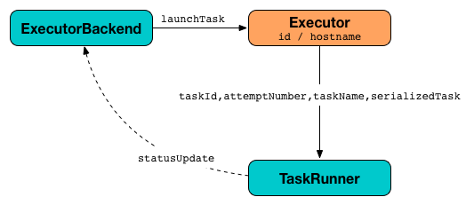

# Executor

## Creating Instance

`Executor` takes the following to be created:

* <span id="executorId"> Executor ID
* <span id="executorHostname"> Host name
* <span id="env"> [SparkEnv](../SparkEnv.md)
* [User-defined jars](#userClassPath)
* [isLocal flag](#isLocal)
* <span id="uncaughtExceptionHandler"> `UncaughtExceptionHandler` (default: `SparkUncaughtExceptionHandler`)
* <span id="resources"> Resources (`Map[String, ResourceInformation]`)

`Executor` is created when:

* `CoarseGrainedExecutorBackend` is requested to [handle a RegisteredExecutor message](CoarseGrainedExecutorBackend.md#RegisteredExecutor) (after having registered with the driver)
* `LocalEndpoint` is [created](../local/LocalEndpoint.md#executor)

### When Created

When created, `Executor` prints out the following INFO messages to the logs:

```text
Starting executor ID [executorId] on host [executorHostname]
```

(only for [non-local](#isLocal) modes) `Executor` sets `SparkUncaughtExceptionHandler` as the default handler invoked when a thread abruptly terminates due to an uncaught exception.

(only for [non-local](#isLocal) modes) `Executor` requests the [BlockManager](../SparkEnv.md#blockManager) to [initialize](../storage/BlockManager.md#initialize) (with the [Spark application id](../SparkConf.md#getAppId) of the [SparkConf](../SparkEnv.md#conf)).

<span id="creating-instance-BlockManager-shuffleMetricsSource">

(only for [non-local](#isLocal) modes) `Executor` requests the [MetricsSystem](../SparkEnv.md#metricsSystem) to [register](../metrics/MetricsSystem.md#registerSource) the following metric sources:

* [ExecutorSource](#executorSource)
* `JVMCPUSource`
* [ExecutorMetricsSource](#executorMetricsSource)
* [ShuffleMetricsSource](../storage/BlockManager.md#shuffleMetricsSource) (of the [BlockManager](../SparkEnv.md#blockManager))

`Executor` uses `SparkEnv` to access the [MetricsSystem](../SparkEnv.md#metricsSystem) and [BlockManager](../SparkEnv.md#blockManager).

`Executor` [creates a task class loader](#createClassLoader) (optionally with [REPL support](#addReplClassLoaderIfNeeded)) and requests the system `Serializer` to [use as the default classloader](../serializer/Serializer.md#setDefaultClassLoader) (for deserializing tasks).

`Executor` [starts sending heartbeats with the metrics of active tasks](#startDriverHeartbeater).

## <span id="executorSource"> ExecutorSource

When [created](#creating-instance), `Executor` creates an [ExecutorSource](ExecutorSource.md) (with the [threadPool](#threadPool), the [executorId](#executorId) and the [schemes](#schemes)).

The `ExecutorSource` is then [registered](../metrics/MetricsSystem.md#registerSource) with the application's [MetricsSystem](../SparkEnv.md#metricsSystem) (in local and non-local modes) to [report metrics](../metrics/MetricsSystem.md#report).

The metrics are updated right after a [TaskRunner](TaskRunner.md) has finished [executing a task](TaskRunner.md#run).

## <span id="executorMetricsSource"> ExecutorMetricsSource

`Executor` creates an [ExecutorMetricsSource](ExecutorMetricsSource.md) when [created](#creating-instance) with the [spark.metrics.executorMetricsSource.enabled](../metrics/configuration-properties.md#spark.metrics.executorMetricsSource.enabled) enabled.

`Executor` uses the `ExecutorMetricsSource` to create the [ExecutorMetricsPoller](#metricsPoller).

`Executor` requests the `ExecutorMetricsSource` to [register](ExecutorMetricsSource.md#register) immediately when [created](#creating-instance) with the [isLocal](#isLocal) flag disabled.

## <span id="metricsPoller"> ExecutorMetricsPoller

`Executor` creates an [ExecutorMetricsPoller](ExecutorMetricsPoller.md) when [created](#creating-instance) with the following:

* [MemoryManager](../SparkEnv.md#memoryManager) of the [SparkEnv](#env)
* [spark.executor.metrics.pollingInterval](../configuration-properties.md#spark.executor.metrics.pollingInterval)
* [ExecutorMetricsSource](#executorMetricsSource)

`Executor` requests the `ExecutorMetricsPoller` to [start](ExecutorMetricsPoller.md#start) immediately when [created](#creating-instance) and to [stop](ExecutorMetricsPoller.md#stop) when requested to [stop](#stop).

`TaskRunner` requests the `ExecutorMetricsPoller` to [onTaskStart](ExecutorMetricsPoller.md#onTaskStart) and [onTaskCompletion](ExecutorMetricsPoller.md#onTaskCompletion) at the beginning and the end of [run](TaskRunner.md#run), respectively.

When requested to [reportHeartBeat](#reportHeartBeat) with [pollOnHeartbeat](#pollOnHeartbeat) enabled, `Executor` requests the `ExecutorMetricsPoller` to [poll](ExecutorMetricsPoller.md#poll).

## <span id="updateDependencies"> Fetching File and Jar Dependencies

```scala
updateDependencies(
  newFiles: Map[String, Long],
  newJars: Map[String, Long]): Unit
```

`updateDependencies` fetches missing or outdated extra files (in the given `newFiles`). For every name-timestamp pair that...FIXME..., `updateDependencies` prints out the following INFO message to the logs:

```text
Fetching [name] with timestamp [timestamp]
```

`updateDependencies` fetches missing or outdated extra jars (in the given `newJars`). For every name-timestamp pair that...FIXME..., `updateDependencies` prints out the following INFO message to the logs:

```text
Fetching [name] with timestamp [timestamp]
```

`updateDependencies` [fetches the file](../Utils.md#fetchFile) to the [SparkFiles root directory](../SparkFiles.md#getRootDirectory).

`updateDependencies`...FIXME

`updateDependencies` is used when:

* `TaskRunner` is requested to [start](TaskRunner.md#run) (and run a task)

## <span id="maxResultSize"> spark.driver.maxResultSize

`Executor` uses the [spark.driver.maxResultSize](../configuration-properties.md#spark.driver.maxResultSize) for `TaskRunner` when requested to [run a task](TaskRunner.md#run) (and [decide on a serialized task result](TaskRunner.md#run-serializedResult)).

## <span id="maxDirectResultSize"> Maximum Size of Direct Results

`Executor` uses the minimum of [spark.task.maxDirectResultSize](../configuration-properties.md#spark.task.maxDirectResultSize) and [spark.rpc.message.maxSize](../rpc/RpcUtils.md#maxMessageSizeBytes) when `TaskRunner` is requested to [run a task](TaskRunner.md#run) (and [decide on the type of a serialized task result](TaskRunner.md#run-serializedResult)).

## <span id="isLocal"> isLocal Flag

`Executor` is given the `isLocal` flag when [created](#creating-instance) to indicate a non-local mode (whether the executor and the Spark application runs with `local` or cluster-specific master URL).

`isLocal` is disabled (`false`) by default and is off explicitly when `CoarseGrainedExecutorBackend` is requested to [handle a RegisteredExecutor message](CoarseGrainedExecutorBackend.md#RegisteredExecutor).

`isLocal` is enabled (`true`) when `LocalEndpoint` is [created](../local/LocalEndpoint.md#executor)

## <span id="userClassPathFirst"><span id="spark.executor.userClassPathFirst"> spark.executor.userClassPathFirst

`Executor` reads the value of the [spark.executor.userClassPathFirst](../configuration-properties.md#spark.executor.userClassPathFirst) configuration property when [created](#creating-instance).

When enabled, `Executor` uses `ChildFirstURLClassLoader` (not `MutableURLClassLoader`) when requested to [createClassLoader](#createClassLoader) (and [addReplClassLoaderIfNeeded](#addReplClassLoaderIfNeeded)).

## <span id="userClassPath"> User-Defined Jars

`Executor` is given user-defined jars when [created](#creating-instance). No jars are assumed by default.

The jars are specified using [spark.executor.extraClassPath](../configuration-properties.md#spark.executor.extraClassPath) configuration property (via [--user-class-path](CoarseGrainedExecutorBackend.md#main) command-line option of `CoarseGrainedExecutorBackend`).

## <span id="runningTasks"> Running Tasks Registry

```scala
runningTasks: Map[Long, TaskRunner]
```

`Executor` tracks [TaskRunners](executor:TaskRunner.md) by task IDs.

## <span id="heartbeatReceiverRef"> HeartbeatReceiver RPC Endpoint Reference

When [created](#creating-instance), `Executor` creates an [RPC endpoint reference](../rpc/RpcUtils.md#makeDriverRef) to [HeartbeatReceiver](../HeartbeatReceiver.md) (running on the driver).

`Executor` uses the RPC endpoint reference when requested to [reportHeartBeat](#reportHeartBeat).

## <span id="launchTask"> Launching Task

```scala
launchTask(
  context: ExecutorBackend,
  taskDescription: TaskDescription): Unit
```

`launchTask` creates an [TaskRunner](TaskRunner.md) (with the given [ExecutorBackend](ExecutorBackend.md), the [TaskDescription](../scheduler/TaskDescription.md) and the [plugins](#plugins)) and adds it to the [runningTasks](#runningTasks) internal registry.

`launchTask` requests the ["Executor task launch worker" thread pool](#threadPool) to execute the `TaskRunner` (sometime in the future).

In case the [decommissioned](#decommissioned) flag is enabled, `launchTask` prints out the following ERROR message to the logs:

```text
Launching a task while in decommissioned state.
```



`launchTask` is used when:

* `CoarseGrainedExecutorBackend` is requested to [handle a LaunchTask message](CoarseGrainedExecutorBackend.md#LaunchTask)
* `LocalEndpoint` RPC endpoint (of [LocalSchedulerBackend](../local/LocalSchedulerBackend.md)) is requested to [reviveOffers](../local/LocalEndpoint.md#reviveOffers)

## <span id="startDriverHeartbeater"><span id="heartbeats-and-active-task-metrics"> Sending Heartbeats and Active Tasks Metrics

Executors keep sending [metrics for active tasks](#metrics) to the driver every [spark.executor.heartbeatInterval](../configuration-properties.md#spark.executor.heartbeatInterval) (defaults to `10s` with some random initial delay so the heartbeats from different executors do not pile up on the driver).


An executor sends heartbeats using the [Heartbeat Sender Thread](#heartbeater).


For each [task](../scheduler/Task.md) in [TaskRunner](TaskRunner.md) (in [runningTasks](#runningTasks) internal registry), the task's metrics are computed and become part of the heartbeat (with accumulators).

A blocking [Heartbeat](../HeartbeatReceiver.md#Heartbeat) message that holds the executor id, all accumulator updates (per task id), and [BlockManagerId](../storage/BlockManagerId.md) is sent to [HeartbeatReceiver RPC endpoint](../HeartbeatReceiver.md).

If the response [requests to re-register BlockManager](../HeartbeatReceiver.md#Heartbeat), `Executor` prints out the following INFO message to the logs:

```text
Told to re-register on heartbeat
```

`BlockManager` is requested to [reregister](../storage/BlockManager.md#reregister).

The internal [heartbeatFailures](#heartbeatFailures) counter is reset.

If there are any issues with communicating with the driver, `Executor` prints out the following WARN message to the logs:

```text
Issue communicating with driver in heartbeater
```

The internal [heartbeatFailures](#heartbeatFailures) is incremented and checked to be less than the [spark.executor.heartbeat.maxFailures](../configuration-properties.md#spark.executor.heartbeat.maxFailures). If the number is greater, the following ERROR is printed out to the logs:

```text
Exit as unable to send heartbeats to driver more than [HEARTBEAT_MAX_FAILURES] times
```

The executor exits (using `System.exit` and exit code 56).

## <span id="heartbeater"> Heartbeat Sender Thread

`heartbeater` is a `ScheduledThreadPoolExecutor` ([Java]({{ java.api }}/java/util/concurrent/ScheduledThreadPoolExecutor.html)) with a single thread.

The name of the thread pool is **driver-heartbeater**.

## <span id="threadPool"> Executor task launch worker Thread Pool

When [created](#creating-instance), `Executor` creates `threadPool` daemon cached thread pool with the name **Executor task launch worker-[ID]** (with `ID` being the task id).

The `threadPool` thread pool is used for [launching tasks](#launchTask).

## Executor Memory

The amount of memory per executor is configured using [spark.executor.memory](../configuration-properties.md#spark.executor.memory) configuration property. It sets the available memory equally for all executors per application.

You can find the value displayed as **Memory per Node** in the web UI of the standalone Master.


## <span id="reportHeartBeat"> Heartbeating With Partial Metrics For Active Tasks To Driver

```scala
reportHeartBeat(): Unit
```

`reportHeartBeat` collects [TaskRunners](TaskRunner.md) for [currently running tasks](#runningTasks) (_active tasks_) with their [tasks](TaskRunner.md#task) deserialized (i.e. either ready for execution or already started).

[TaskRunner](TaskRunner.md) has [task](TaskRunner.md#task) deserialized when it [runs the task](TaskRunner.md#run).

For every running task, `reportHeartBeat` takes the [TaskMetrics](../scheduler/Task.md#metrics) and:

* Requests [ShuffleRead metrics to be merged](TaskMetrics.md#mergeShuffleReadMetrics)
* [Sets jvmGCTime metrics](TaskMetrics.md#setJvmGCTime)

`reportHeartBeat` then records the latest values of [internal and external accumulators](TaskMetrics.md#accumulators) for every task.

!!! note
    Internal accumulators are a task's metrics while external accumulators are a Spark application's accumulators that a user has created.

`reportHeartBeat` sends a blocking [Heartbeat](../HeartbeatReceiver.md#Heartbeat) message to the [HeartbeatReceiver](#heartbeatReceiverRef) (on the driver). `reportHeartBeat` uses the value of [spark.executor.heartbeatInterval](../configuration-properties.md#spark.executor.heartbeatInterval) configuration property for the RPC timeout.

!!! note
    A `Heartbeat` message contains the executor identifier, the accumulator updates, and the identifier of the [BlockManager](../storage/BlockManager.md).

If the response (from [HeartbeatReceiver](#heartbeatReceiverRef)) is to re-register the `BlockManager`, `reportHeartBeat` prints out the following INFO message to the logs and requests the `BlockManager` to [re-register](../storage/BlockManager.md#reregister) (which will register the blocks the `BlockManager` manages with the driver).

```text
Told to re-register on heartbeat
```

`HeartbeatResponse` requests the `BlockManager` to re-register when either [TaskScheduler](../scheduler/TaskScheduler.md#executorHeartbeatReceived) or [HeartbeatReceiver](../HeartbeatReceiver.md#Heartbeat) know nothing about the executor.

When posting the `Heartbeat` was successful, `reportHeartBeat` resets [heartbeatFailures](#heartbeatFailures) internal counter.

In case of a non-fatal exception, you should see the following WARN message in the logs (followed by the stack trace).

```text
Issue communicating with driver in heartbeater
```

Every failure `reportHeartBeat` increments [heartbeat failures](#heartbeatFailures) up to [spark.executor.heartbeat.maxFailures](../configuration-properties.md#spark.executor.heartbeat.maxFailures) configuration property. When the heartbeat failures reaches the maximum, `reportHeartBeat` prints out the following ERROR message to the logs and the executor terminates with the error code: `56`.

```text
Exit as unable to send heartbeats to driver more than [HEARTBEAT_MAX_FAILURES] times
```

`reportHeartBeat` is used when:

* Executor is requested to [schedule reporting heartbeat and partial metrics for active tasks to the driver](#startDriverHeartbeater) (that happens every [spark.executor.heartbeatInterval](../configuration-properties.md#spark.executor.heartbeatInterval)).

## Logging

Enable `ALL` logging level for `org.apache.spark.executor.Executor` logger to see what happens inside.

Add the following line to `conf/log4j.properties`:

```text
log4j.logger.org.apache.spark.executor.Executor=ALL
```

Refer to [Logging](../spark-logging.md).
