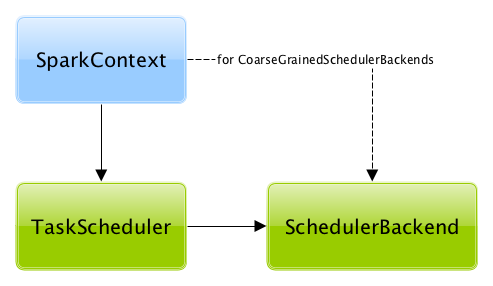

# TaskScheduler

`TaskScheduler` is an abstraction of <<implementations, Spark schedulers>> that can <<submitTasks, submit tasks for execution>> in a Spark application (per <<schedulingMode, scheduling policy>>).

NOTE: TaskScheduler works closely with scheduler:DAGScheduler.md[DAGScheduler] that <<submitTasks, submits sets of tasks for execution>> (for every stage in a Spark job).

TaskScheduler can track the executors available in a Spark application using <<executorHeartbeatReceived, executorHeartbeatReceived>> and <<executorLost, executorLost>> interceptors (that inform about active and lost executors, respectively).

== [[submitTasks]] Submitting Tasks for Execution

[source, scala]
----
submitTasks(
  taskSet: TaskSet): Unit
----

Submits the tasks (of the given scheduler:TaskSet.md[TaskSet]) for execution.

Used when DAGScheduler is requested to scheduler:DAGScheduler.md#submitMissingTasks[submit missing tasks (of a stage)].

== [[executorHeartbeatReceived]] Handling Executor Heartbeat

[source, scala]
----
executorHeartbeatReceived(
  execId: String,
  accumUpdates: Array[(Long, Seq[AccumulatorV2[_, _]])],
  blockManagerId: BlockManagerId): Boolean
----

Handles a heartbeat from an executor

Returns `true` when the `execId` executor is managed by the TaskScheduler. `false` indicates that the executor:Executor.md#reportHeartBeat[block manager (on the executor) should re-register].

Used when HeartbeatReceiver RPC endpoint is requested to [handle a Heartbeat (with task metrics) from an executor](../HeartbeatReceiver.md#Heartbeat)

== [[killTaskAttempt]] Killing Task

[source, scala]
----
killTaskAttempt(
  taskId: Long,
  interruptThread: Boolean,
  reason: String): Boolean
----

Kills a task (attempt)

Used when DAGScheduler is requested to scheduler:DAGScheduler.md#killTaskAttempt[kill a task]

== [[workerRemoved]] workerRemoved Notification

[source, scala]
----
workerRemoved(
  workerId: String,
  host: String,
  message: String): Unit
----

Used when `DriverEndpoint` is requested to [handle a RemoveWorker event](DriverEndpoint.md#removeWorker)

== [[contract]] Contract

[cols="30m,70",options="header",width="100%"]
|===
| Method
| Description

| applicationAttemptId
a| [[applicationAttemptId]]

[source, scala]
----
applicationAttemptId(): Option[String]
----

*Unique identifier of an (execution) attempt* of the Spark application

Used when [SparkContext](../SparkContext.md) is created

| cancelTasks
a| [[cancelTasks]]

[source, scala]
----
cancelTasks(
  stageId: Int,
  interruptThread: Boolean): Unit
----

Cancels all the tasks of a given Stage.md[stage]

Used when DAGScheduler is requested to DAGScheduler.md#failJobAndIndependentStages[failJobAndIndependentStages]

| defaultParallelism
a| [[defaultParallelism]]

[source, scala]
----
defaultParallelism(): Int
----

*Default level of parallelism*

Used when `SparkContext` is requested for the [default level of parallelism](../SparkContext.md#defaultParallelism)

| executorLost
a| [[executorLost]]

[source, scala]
----
executorLost(
  executorId: String,
  reason: ExecutorLossReason): Unit
----

Handles an executor lost event

Used when:

* `HeartbeatReceiver` RPC endpoint is requested to [expireDeadHosts](../HeartbeatReceiver.md#expireDeadHosts)

* `DriverEndpoint` RPC endpoint is requested to [removes](DriverEndpoint.md#removeExecutor) (_forgets_) and [disables](DriverEndpoint.md#disableExecutor) a malfunctioning executor (i.e. either lost or blacklisted for some reason)

| killAllTaskAttempts
a| [[killAllTaskAttempts]]

[source, scala]
----
killAllTaskAttempts(
  stageId: Int,
  interruptThread: Boolean,
  reason: String): Unit
----

Used when:

* DAGScheduler is requested to DAGScheduler.md#handleTaskCompletion[handleTaskCompletion]

* `TaskSchedulerImpl` is requested to TaskSchedulerImpl.md#cancelTasks[cancel all the tasks of a stage]

| rootPool
a| [[rootPool]]

[source, scala]
----
rootPool: Pool
----

Top-level (root) scheduler:spark-scheduler-Pool.md[schedulable pool]

Used when:

* `TaskSchedulerImpl` is requested to scheduler:TaskSchedulerImpl.md#initialize[initialize]

* `SparkContext` is requested to SparkContext.md#getAllPools[getAllPools] and SparkContext.md#getPoolForName[getPoolForName]

* `TaskSchedulerImpl` is requested to scheduler:TaskSchedulerImpl.md#resourceOffers[resourceOffers], scheduler:TaskSchedulerImpl.md#checkSpeculatableTasks[checkSpeculatableTasks], and scheduler:TaskSchedulerImpl.md#removeExecutor[removeExecutor]

| schedulingMode
a| [[schedulingMode]]

[source, scala]
----
schedulingMode: SchedulingMode
----

scheduler:spark-scheduler-SchedulingMode.md[Scheduling mode]

Used when:

* `TaskSchedulerImpl` is scheduler:TaskSchedulerImpl.md#rootPool[created] and scheduler:TaskSchedulerImpl.md#initialize[initialized]

* `SparkContext` is requested to SparkContext.md#getSchedulingMode[getSchedulingMode]

| setDAGScheduler
a| [[setDAGScheduler]]

[source, scala]
----
setDAGScheduler(dagScheduler: DAGScheduler): Unit
----

Associates a scheduler:DAGScheduler.md[DAGScheduler]

Used when DAGScheduler is scheduler:DAGScheduler.md#creating-instance[created]

| start
a| [[start]]

[source, scala]
----
start(): Unit
----

Starts the TaskScheduler

Used when [SparkContext](../SparkContext.md) is created

| stop
a| [[stop]]

[source, scala]
----
stop(): Unit
----

Stops the TaskScheduler

Used when DAGScheduler is requested to scheduler:DAGScheduler.md#stop[stop]

|===

== [[implementations]] TaskSchedulers

[cols="30m,70",options="header",width="100%"]
|===
| TaskScheduler
| Description

| scheduler:TaskSchedulerImpl.md[TaskSchedulerImpl]
| [[TaskSchedulerImpl]] Default Spark scheduler

| spark-on-yarn:spark-yarn-yarnscheduler.md[YarnScheduler]
| [[YarnScheduler]] TaskScheduler for tools:spark-submit.md#deploy-mode[client] deploy mode in spark-on-yarn:index.md[Spark on YARN]

| spark-on-yarn:spark-yarn-yarnclusterscheduler.md[YarnClusterScheduler]
| [[YarnClusterScheduler]] TaskScheduler for tools:spark-submit.md#deploy-mode[cluster] deploy mode in spark-on-yarn:index.md[Spark on YARN]

|===

## Lifecycle

A `TaskScheduler` is created while [SparkContext is being created](../SparkContext.md#creating-instance) (by calling [SparkContext.createTaskScheduler](../SparkContext.md#createTaskScheduler) for a given [master URL](../spark-deployment-environments.md) and [deploy mode](../tools/spark-submit.md#deploy-mode)).

At this point in SparkContext's lifecycle, the internal `_taskScheduler` points at the TaskScheduler (and it is "announced" by sending a blocking [`TaskSchedulerIsSet` message to HeartbeatReceiver RPC endpoint](../HeartbeatReceiver.md#TaskSchedulerIsSet)).

The <<start, TaskScheduler is started>> right after the blocking `TaskSchedulerIsSet` message receives a response.

The <<applicationId, application ID>> and the <<applicationAttemptId, application's attempt ID>> are set at this point (and `SparkContext` uses the application id to set SparkConf.md#spark.app.id[spark.app.id] Spark property, and configure webui:spark-webui-SparkUI.md[SparkUI], and storage:BlockManager.md[BlockManager]).

CAUTION: FIXME The application id is described as "associated with the job." in TaskScheduler, but I think it is "associated with the application" and you can have many jobs per application.

Right before SparkContext is fully initialized, <<postStartHook, TaskScheduler.postStartHook>> is called.

The internal `_taskScheduler` is cleared (i.e. set to `null`) while SparkContext.md#stop[SparkContext is being stopped].

<<stop, TaskScheduler is stopped>> while scheduler:DAGScheduler.md#stop[DAGScheduler is being stopped].

WARNING: FIXME If it is SparkContext to start a TaskScheduler, shouldn't SparkContext stop it too? Why is this the way it is now?

== [[postStartHook]] Post-Start Initialization

[source, scala]
----
postStartHook(): Unit
----

`postStartHook` does nothing by default, but allows <<implementations, custom implementations>> for some additional post-start initialization.

`postStartHook` is used when:

* [SparkContext](../SparkContext.md) is created

* Spark on YARN's `YarnClusterScheduler` is requested to spark-on-yarn:spark-yarn-yarnclusterscheduler.md#postStartHook[postStartHook]

== [[applicationId]][[appId]] Unique Identifier of Spark Application

[source, scala]
----
applicationId(): String
----

`applicationId` is the *unique identifier* of the Spark application and defaults to *spark-application-[currentTimeMillis]*.

`applicationId` is used when [SparkContext](../SparkContext.md) is created.
