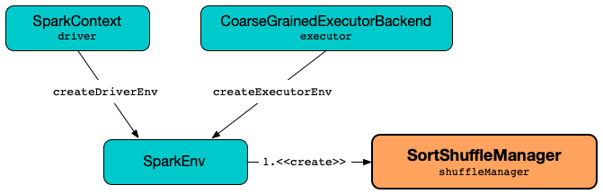

# SortShuffleManager

`SortShuffleManager` is the default and only [ShuffleManager](ShuffleManager.md) in Apache Spark (with the short name `sort` or `tungsten-sort`).



## Creating Instance

`SortShuffleManager` takes the following to be created:

* <span id="conf"> [SparkConf](../SparkConf.md)

`SortShuffleManager` is created when `SparkEnv` is [created](../SparkEnv.md#ShuffleManager) (on the driver and executors at the very beginning of a Spark application's lifecycle).

## <span id="taskIdMapsForShuffle"> taskIdMapsForShuffle Registry

```scala
taskIdMapsForShuffle: ConcurrentHashMap[Int, OpenHashSet[Long]]
```

`SortShuffleManager` uses `taskIdMapsForShuffle` internal registry to track task (attempt) IDs by shuffle.

A new shuffle and task IDs are added when `SortShuffleManager` is requested for a [ShuffleWriter](#getWriter) (for a partition and a `ShuffleHandle`).

A shuffle ID (and associated task IDs) are removed when `SortShuffleManager` is requested to [unregister a shuffle](#unregisterShuffle).

## <span id="getWriter"> Getting ShuffleWriter for Partition and ShuffleHandle

```scala
getWriter[K, V](
  handle: ShuffleHandle,
  mapId: Int,
  context: TaskContext): ShuffleWriter[K, V]
```

`getWriter` registers the given [ShuffleHandle](ShuffleHandle.md) (by the [shuffleId](ShuffleHandle.md#shuffleId) and [numMaps](BaseShuffleHandle.md#numMaps)) in the [taskIdMapsForShuffle](#taskIdMapsForShuffle) internal registry unless already done.

!!! note
    `getWriter` expects that the input `ShuffleHandle` is a [BaseShuffleHandle](BaseShuffleHandle.md). Moreover, `getWriter` expects that in two (out of three cases) it is a more specialized [IndexShuffleBlockResolver](IndexShuffleBlockResolver.md).

`getWriter` then creates a new `ShuffleWriter` based on the type of the given `ShuffleHandle`.

ShuffleHandle | ShuffleWriter
--------------|--------------
[SerializedShuffleHandle](SerializedShuffleHandle.md) | [UnsafeShuffleWriter](UnsafeShuffleWriter.md)
[BypassMergeSortShuffleHandle](BypassMergeSortShuffleHandle.md) | [BypassMergeSortShuffleWriter](BypassMergeSortShuffleWriter.md)
[BaseShuffleHandle](BaseShuffleHandle.md) | [SortShuffleWriter](SortShuffleWriter.md)

`getWriter` is part of the [ShuffleManager](ShuffleManager.md#getWriter) abstraction.

## <span id="shuffleExecutorComponents"> ShuffleExecutorComponents

```scala
shuffleExecutorComponents: ShuffleExecutorComponents
```

`SortShuffleManager` defines the `shuffleExecutorComponents` internal registry for a [ShuffleExecutorComponents](ShuffleExecutorComponents.md).

`shuffleExecutorComponents` is used when:

* `SortShuffleManager` is requested for the [ShuffleWriter](#getWriter)

### <span id="loadShuffleExecutorComponents"> loadShuffleExecutorComponents

```scala
loadShuffleExecutorComponents(
  conf: SparkConf): ShuffleExecutorComponents
```

`loadShuffleExecutorComponents` [loads the ShuffleDataIO](ShuffleDataIOUtils.md#loadShuffleDataIO) that is then requested for the [ShuffleExecutorComponents](ShuffleDataIO.md#executor).

`loadShuffleExecutorComponents` requests the `ShuffleExecutorComponents` to [initialize](ShuffleExecutorComponents.md#initializeExecutor) before returning it.

## <span id="registerShuffle"> Creating ShuffleHandle for ShuffleDependency

```scala
registerShuffle[K, V, C](
  shuffleId: Int,
  dependency: ShuffleDependency[K, V, C]): ShuffleHandle
```

`registerShuffle` is part of the [ShuffleManager](ShuffleManager.md#registerShuffle) abstraction.

`registerShuffle` creates a new [ShuffleHandle](ShuffleHandle.md) (for the given [ShuffleDependency](../rdd/ShuffleDependency.md)) that is one of the following:

1. [BypassMergeSortShuffleHandle](BypassMergeSortShuffleHandle.md) (with `ShuffleDependency[K, V, V]`) when [shouldBypassMergeSort](SortShuffleWriter.md#shouldBypassMergeSort) condition holds

2. [SerializedShuffleHandle](SerializedShuffleHandle.md) (with `ShuffleDependency[K, V, V]`) when [canUseSerializedShuffle](#canUseSerializedShuffle) condition holds

3. [BaseShuffleHandle](BaseShuffleHandle.md)

### <span id="canUseSerializedShuffle"> SerializedShuffleHandle Requirements

```scala
canUseSerializedShuffle(
  dependency: ShuffleDependency[_, _, _]): Boolean
```

`canUseSerializedShuffle` is `true` when all of the following hold for the given [ShuffleDependency](../rdd/ShuffleDependency.md):

1. [Serializer](../rdd/ShuffleDependency.md#serializer) (of the given `ShuffleDependency`) [supports relocation of serialized objects](../serializer/Serializer.md#supportsRelocationOfSerializedObjects)

1. [mapSideCombine](../rdd/ShuffleDependency.md#mapSideCombine) flag (of the given `ShuffleDependency`) is `false`

1. [Number of partitions](../rdd/Partitioner.md#numPartitions) (of the [Partitioner](../rdd/ShuffleDependency.md#partitioner) of the given `ShuffleDependency`) is not greater than the [supported maximum number](#MAX_SHUFFLE_OUTPUT_PARTITIONS_FOR_SERIALIZED_MODE)

With all of the above positive, `canUseSerializedShuffle` prints out the following DEBUG message to the logs:

```text
Can use serialized shuffle for shuffle [shuffleId]
```

Otherwise, `canUseSerializedShuffle` is `false` and prints out one of the following DEBUG messages based on the failed requirement:

```text
Can't use serialized shuffle for shuffle [id] because the serializer, [name], does not support object relocation
```

```text
Can't use serialized shuffle for shuffle [id] because we need to do map-side aggregation
```

```text
Can't use serialized shuffle for shuffle [id] because it has more than [number] partitions
```

`canUseSerializedShuffle` is used when:

* `SortShuffleManager` is requested to [register a shuffle (and creates a ShuffleHandle)](#registerShuffle)

## <span id="MAX_SHUFFLE_OUTPUT_PARTITIONS_FOR_SERIALIZED_MODE"> Maximum Number of Partition Identifiers for Serialized Mode

`SortShuffleManager` defines `MAX_SHUFFLE_OUTPUT_PARTITIONS_FOR_SERIALIZED_MODE` internal constant to be `(1 << 24)` (`16777216`) for the maximum number of shuffle output partitions.

`MAX_SHUFFLE_OUTPUT_PARTITIONS_FOR_SERIALIZED_MODE` is used when:

* `UnsafeShuffleWriter` is [created](UnsafeShuffleWriter.md)
* `SortShuffleManager` utility is used to [check out SerializedShuffleHandle requirements](#canUseSerializedShuffle)
* `ShuffleExchangeExec` ([Spark SQL]({{ book.spark_sql }}/physical-operators/ShuffleExchangeExec)) utility is used to `needToCopyObjectsBeforeShuffle`

## <span id="shuffleBlockResolver"> Creating ShuffleBlockResolver

```scala
shuffleBlockResolver: IndexShuffleBlockResolver
```

`shuffleBlockResolver` is part of the [ShuffleManager](ShuffleManager.md#shuffleBlockResolver) abstraction.

`shuffleBlockResolver` is a [IndexShuffleBlockResolver](IndexShuffleBlockResolver.md) (and is created immediately alongside this [SortShuffleManager](#creating-instance)).

## <span id="unregisterShuffle"> Unregistering Shuffle

```scala
unregisterShuffle(
  shuffleId: Int): Boolean
```

`unregisterShuffle` is part of the [ShuffleManager](ShuffleManager.md#unregisterShuffle) abstraction.

`unregisterShuffle` removes the given `shuffleId` from the [taskIdMapsForShuffle](#taskIdMapsForShuffle) internal registry.

If the `shuffleId` was found and removed successfully, `unregisterShuffle` requests the [IndexShuffleBlockResolver](#shuffleBlockResolver) to [remove the shuffle index and data files](IndexShuffleBlockResolver.md#removeDataByMap) for every `mapTaskId` (mappers producing the output for the shuffle).

`unregisterShuffle` is always `true`.

## <span id="getReader"> Getting ShuffleReader for ShuffleHandle

```scala
getReader[K, C](
  handle: ShuffleHandle,
  startMapIndex: Int,
  endMapIndex: Int,
  startPartition: Int,
  endPartition: Int,
  context: TaskContext,
  metrics: ShuffleReadMetricsReporter): ShuffleReader[K, C]
```

`getReader` is part of the [ShuffleManager](ShuffleManager.md#getReader) abstraction.

`getReader` requests the [MapOutputTracker](../scheduler/MapOutputTracker.md) (via [SparkEnv](../SparkEnv.md#mapOutputTracker)) for the [getMapSizesByExecutorId](../scheduler/MapOutputTracker.md#getMapSizesByExecutorId) for the `shuffleId` (of the given [ShuffleHandle](ShuffleHandle.md)).

In the end, `getReader` creates a new [BlockStoreShuffleReader](BlockStoreShuffleReader.md).

## <span id="stop"> Stopping ShuffleManager

```scala
stop(): Unit
```

`stop` is part of the [ShuffleManager](ShuffleManager.md#stop) abstraction.

`stop` requests the [IndexShuffleBlockResolver](#shuffleBlockResolver) to [stop](IndexShuffleBlockResolver.md#stop).

## Logging

Enable `ALL` logging level for `org.apache.spark.shuffle.sort.SortShuffleManager` logger to see what happens inside.

Add the following line to `conf/log4j.properties`:

```text
log4j.logger.org.apache.spark.shuffle.sort.SortShuffleManager=ALL
```

Refer to [Logging](../spark-logging.md).
