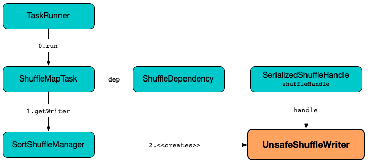

# UnsafeShuffleWriter

`UnsafeShuffleWriter<K, V>` is a [ShuffleWriter](ShuffleWriter.md) for [SerializedShuffleHandle](SerializedShuffleHandle.md)s.



`UnsafeShuffleWriter` [opens resources](#open) (a [ShuffleExternalSorter](#sorter) and the buffers) while being [created](#creating-instance).


## Creating Instance

`UnsafeShuffleWriter` takes the following to be created:

* <span id="blockManager"> [BlockManager](../storage/BlockManager.md)
* <span id="memoryManager"> [TaskMemoryManager](../memory/TaskMemoryManager.md)
* <span id="handle"> [SerializedShuffleHandle](SerializedShuffleHandle.md)
* <span id="mapId"> Map ID
* <span id="taskContext"> [TaskContext](../scheduler/TaskContext.md)
* <span id="sparkConf"> [SparkConf](../SparkConf.md)
* <span id="writeMetrics"> [ShuffleWriteMetricsReporter](ShuffleWriteMetricsReporter.md)
* <span id="shuffleExecutorComponents"> `ShuffleExecutorComponents`

`UnsafeShuffleWriter` is created when `SortShuffleManager` is requested for a [ShuffleWriter](SortShuffleManager.md#getWriter) for a [SerializedShuffleHandle](SerializedShuffleHandle.md).

`UnsafeShuffleWriter` makes sure that the number of partitions at most 16MB reduce partitions (`1 << 24`) (as the upper bound of the [partition identifiers that can be encoded](SortShuffleManager.md#MAX_SHUFFLE_OUTPUT_PARTITIONS_FOR_SERIALIZED_MODE)) or throws an `IllegalArgumentException`:

```text
UnsafeShuffleWriter can only be used for shuffles with at most 16777215 reduce partitions
```

`UnsafeShuffleWriter` uses the [number of partitions](../rdd/Partitioner.md#numPartitions) of the [Partitioner](../rdd/ShuffleDependency.md#partitioner) that is used for the [ShuffleDependency](BaseShuffleHandle.md#dependency) of the [SerializedShuffleHandle](#handle).

!!! note
    The number of shuffle output partitions is first enforced when `SortShuffleManager` is requested to [check out whether a SerializedShuffleHandle can be used for ShuffleHandle](SortShuffleManager.md#canUseSerializedShuffle) (that eventually leads to `UnsafeShuffleWriter`).

In the end, `UnsafeShuffleWriter` [creates a ShuffleExternalSorter and a SerializationStream](#open).

## <span id="sorter"> ShuffleExternalSorter

`UnsafeShuffleWriter` uses a [ShuffleExternalSorter](ShuffleExternalSorter.md).

`ShuffleExternalSorter` is created when `UnsafeShuffleWriter` is requested to [open](#open) (while being [created](#creating-instance)) and dereferenced (``null``ed) when requested to [close internal resources and merge spill files](#closeAndWriteOutput).

Used when `UnsafeShuffleWriter` is requested for the following:

* [Updating peak memory used](#updatePeakMemoryUsed)
* [Writing records](#write)
* [Closing internal resources and merging spill files](#closeAndWriteOutput)
* [Inserting a record](#insertRecordIntoSorter)
* [Stopping](#stop)

## <span id="shuffleBlockResolver"> IndexShuffleBlockResolver

`UnsafeShuffleWriter` is given a [IndexShuffleBlockResolver](IndexShuffleBlockResolver.md) when [created](#creating-instance).

`UnsafeShuffleWriter` uses the IndexShuffleBlockResolver for...FIXME

## <span id="DEFAULT_INITIAL_SER_BUFFER_SIZE"> Initial Serialized Buffer Size

`UnsafeShuffleWriter` uses a fixed buffer size for the [output stream of serialized data written into a byte array](#serBuffer) (default: `1024 * 1024`).

## <span id="inputBufferSizeInBytes"> inputBufferSizeInBytes

`UnsafeShuffleWriter` uses the [spark.shuffle.file.buffer](../configuration-properties.md#spark.shuffle.file.buffer) configuration property for...FIXME

## <span id="outputBufferSizeInBytes"> outputBufferSizeInBytes

`UnsafeShuffleWriter` uses the [spark.shuffle.unsafe.file.output.buffer](../configuration-properties.md#spark.shuffle.unsafe.file.output.buffer) configuration property for...FIXME

## <span id="transferToEnabled"> transferToEnabled

`UnsafeShuffleWriter` can use a [specialized NIO-based fast merge procedure](#mergeSpillsWithTransferTo) that avoids extra serialization/deserialization when [spark.file.transferTo](../configuration-properties.md#spark.file.transferTo) configuration property is enabled.

## <span id="initialSortBufferSize"><span id="DEFAULT_INITIAL_SORT_BUFFER_SIZE"> initialSortBufferSize

`UnsafeShuffleWriter` uses the initial buffer size for sorting (default: `4096`) when creating a [ShuffleExternalSorter](#sorter) (when requested to [open](#open)).

!!! tip
    Use [spark.shuffle.sort.initialBufferSize](../configuration-properties.md#spark.shuffle.sort.initialBufferSize) configuration property to change the buffer size.

## <span id="mergeSpills"> Merging Spills

```java
long[] mergeSpills(
  SpillInfo[] spills,
  File outputFile)
```

### <span id="mergeSpills-many-spills"> Many Spills

With multiple `SpillInfos` to merge, `mergeSpills` selects between fast and [slow merge strategies](#mergeSpillsWithFileStream). The fast merge strategy can be [transferTo](#mergeSpillsWithTransferTo)- or [fileStream](#mergeSpillsWithFileStream)-based.

mergeSpills uses the [spark.shuffle.unsafe.fastMergeEnabled](../configuration-properties.md#spark.shuffle.unsafe.fastMergeEnabled) configuration property to consider one of the fast merge strategies.

A fast merge strategy is supported when [spark.shuffle.compress](../configuration-properties.md#spark.shuffle.compress) configuration property is disabled or the IO compression codec [supports decompression of concatenated compressed streams](../CompressionCodec.md#supportsConcatenationOfSerializedStreams).

With [spark.shuffle.compress](../configuration-properties.md#spark.shuffle.compress) configuration property enabled, `mergeSpills` will always use the slow merge strategy.

With fast merge strategy enabled and supported, [transferToEnabled](#transferToEnabled) enabled and encryption disabled, `mergeSpills` prints out the following DEBUG message to the logs and [mergeSpillsWithTransferTo](#mergeSpillsWithTransferTo).

```text
Using transferTo-based fast merge
```

With fast merge strategy enabled and supported, no [transferToEnabled](#transferToEnabled) or encryption enabled, `mergeSpills` prints out the following DEBUG message to the logs and [mergeSpillsWithFileStream](#mergeSpillsWithFileStream) (with no compression codec).

```text
Using fileStream-based fast merge
```

For slow merge, `mergeSpills` prints out the following DEBUG message to the logs and [mergeSpillsWithFileStream](#mergeSpillsWithFileStream) (with the compression codec).

```text
Using slow merge
```

In the end, `mergeSpills` requests the [ShuffleWriteMetrics](#writeMetrics) to [decBytesWritten](../executor/ShuffleWriteMetrics.md#decBytesWritten) and [incBytesWritten](../executor/ShuffleWriteMetrics.md#incBytesWritten), and returns the partition length array.

### <span id="mergeSpills-one-spill"> One Spill

With one `SpillInfo` to merge, `mergeSpills` simply renames the spill file to be the output file and returns the partition length array of the one spill.

### <span id="mergeSpills-no-spills"> No Spills

With no `SpillInfo`s to merge, `mergeSpills` creates an empty output file and returns an array of ``0``s of size of the [numPartitions](../rdd/Partitioner.md#numPartitions) of the [Partitioner](#partitioner).

### <span id="mergeSpills-usage"> Usage

`mergeSpills` is used when `UnsafeShuffleWriter` is requested to [close internal resources and merge spill files](#closeAndWriteOutput).

### <span id="mergeSpillsWithTransferTo"> mergeSpillsWithTransferTo

```java
long[] mergeSpillsWithTransferTo(
  SpillInfo[] spills,
  File outputFile)
```

`mergeSpillsWithTransferTo`...FIXME

`mergeSpillsWithTransferTo` is used when `UnsafeShuffleWriter` is requested to [mergeSpills](#mergeSpills) (with the [transferToEnabled](#transferToEnabled) flag enabled and no encryption).

== [[updatePeakMemoryUsed]] updatePeakMemoryUsed Internal Method

[source, java]
----
void updatePeakMemoryUsed()
----

updatePeakMemoryUsed...FIXME

updatePeakMemoryUsed is used when UnsafeShuffleWriter is requested for the <<getPeakMemoryUsedBytes, peak memory used>> and to <<closeAndWriteOutput, close internal resources and merge spill files>>.

## <span id="write"> Writing Key-Value Records of Partition

```java
void write(
  Iterator<Product2<K, V>> records)
```

`write` traverses the input sequence of records (for a RDD partition) and [insertRecordIntoSorter](#insertRecordIntoSorter) one by one. When all the records have been processed, `write` [closes internal resources and merges spill files](#closeAndWriteOutput).

In the end, `write` requests `ShuffleExternalSorter` to [clean up](ShuffleExternalSorter.md#cleanupResources).

CAUTION: FIXME

When requested to <<write, write key-value records of a partition>>, UnsafeShuffleWriter simply <<insertRecordIntoSorter, inserts every record into ShuffleExternalSorter>> followed by <<closeAndWriteOutput, close internal resources and merge spill files>> (that, among other things, creates the <<mapStatus, MapStatus>>).

`write` is part of the [ShuffleWriter](ShuffleWriter.md#write) abstraction.

== [[stop]] Stopping ShuffleWriter

[source, java]
----
Option<MapStatus> stop(
  boolean success)
----

`stop`...FIXME

When requested to <<stop, stop>>, UnsafeShuffleWriter records the peak execution memory metric and returns the <<mapStatus, mapStatus>> (that was created when requested to <<write, write>>).

`stop` is part of the [ShuffleWriter](ShuffleWriter.md#stop) abstraction.

== [[insertRecordIntoSorter]] Inserting Record Into ShuffleExternalSorter

[source, java]
----
void insertRecordIntoSorter(
  Product2<K, V> record)
----

insertRecordIntoSorter requires that the <<sorter, ShuffleExternalSorter>> is available.

insertRecordIntoSorter requests the <<serBuffer, MyByteArrayOutputStream>> to reset (so that all currently accumulated output in the output stream is discarded and reusing the already allocated buffer space).

insertRecordIntoSorter requests the <<serOutputStream, SerializationStream>> to write out the record (write the serializer:SerializationStream.md#writeKey[key] and the serializer:SerializationStream.md#writeValue[value]) and to serializer:SerializationStream.md#flush[flush].

[[insertRecordIntoSorter-serializedRecordSize]]
insertRecordIntoSorter requests the <<serBuffer, MyByteArrayOutputStream>> for the length of the buffer.

[[insertRecordIntoSorter-partitionId]]
insertRecordIntoSorter requests the <<partitioner, Partitioner>> for the ../rdd/Partitioner.md#getPartition[partition] for the given record (by the key).

In the end, insertRecordIntoSorter requests the <<sorter, ShuffleExternalSorter>> to ShuffleExternalSorter.md#insertRecord[insert] the <<serBuffer, MyByteArrayOutputStream>> as a byte array (with the <<insertRecordIntoSorter-serializedRecordSize, length>> and the <<insertRecordIntoSorter-partitionId, partition>>).

insertRecordIntoSorter is used when UnsafeShuffleWriter is requested to <<write, write records>>.

## <span id="closeAndWriteOutput"> Closing and Writing Output (Merging Spill Files)

```java
void closeAndWriteOutput()
```

`closeAndWriteOutput` asserts that the [ShuffleExternalSorter](#sorter) is created (non-``null``).

`closeAndWriteOutput` [updates peak memory used](#updatePeakMemoryUsed).

`closeAndWriteOutput` removes the references to the <<serBuffer, ByteArrayOutputStream>> and <<serOutputStream, SerializationStream>> output streams (``null``s them).

`closeAndWriteOutput` requests the <<sorter, ShuffleExternalSorter>> to ShuffleExternalSorter.md#closeAndGetSpills[close and return spill metadata].

`closeAndWriteOutput` removes the reference to the <<sorter, ShuffleExternalSorter>> (``null``s it).

`closeAndWriteOutput` requests the <<shuffleBlockResolver, IndexShuffleBlockResolver>> for the IndexShuffleBlockResolver.md#getDataFile[output data file] for the <<shuffleId, shuffle>> and <<mapId, map>> IDs.

[[closeAndWriteOutput-partitionLengths]][[closeAndWriteOutput-tmp]]
closeAndWriteOutput creates a temporary file (along the data output file) and uses it to <<mergeSpills, merge spill files>> (that gives a partition length array). All spill files are then deleted.

closeAndWriteOutput requests the <<shuffleBlockResolver, IndexShuffleBlockResolver>> to IndexShuffleBlockResolver.md#writeIndexFileAndCommit[write shuffle index and data files] (for the <<shuffleId, shuffle>> and <<mapId, map>> IDs, the <<closeAndWriteOutput-partitionLengths, partition length array>> and the <<closeAndWriteOutput-tmp, temporary output data file>>).

In the end, closeAndWriteOutput creates a scheduler:MapStatus.md[MapStatus] with the storage:BlockManager.md#shuffleServerId[location of the local BlockManager] and the <<closeAndWriteOutput-partitionLengths, partition length array>>.

closeAndWriteOutput prints out the following ERROR message to the logs if there is an issue with deleting spill files:

```text
Error while deleting spill file [path]
```

closeAndWriteOutput prints out the following ERROR message to the logs if there is an issue with deleting the <<closeAndWriteOutput-tmp, temporary output data file>>:

```text
Error while deleting temp file [path]
```

`closeAndWriteOutput` is used when `UnsafeShuffleWriter` is requested to [write records](#write).

== [[mergeSpillsWithFileStream]] mergeSpillsWithFileStream Method

[source, java]
----
long[] mergeSpillsWithFileStream(
  SpillInfo[] spills,
  File outputFile,
  CompressionCodec compressionCodec)
----

mergeSpillsWithFileStream will be given an io:CompressionCodec.md[IO compression codec] when shuffle compression is enabled.

mergeSpillsWithFileStream...FIXME

mergeSpillsWithFileStream requires that there are at least two spills to merge.

mergeSpillsWithFileStream is used when UnsafeShuffleWriter is requested to <<mergeSpills, merge spills>>.

== [[getPeakMemoryUsedBytes]] Getting Peak Memory Used

[source, java]
----
long getPeakMemoryUsedBytes()
----

getPeakMemoryUsedBytes simply <<updatePeakMemoryUsed, updatePeakMemoryUsed>> and returns the internal <<peakMemoryUsedBytes, peakMemoryUsedBytes>> registry.

getPeakMemoryUsedBytes is used when UnsafeShuffleWriter is requested to <<stop, stop>>.

== [[open]] Opening UnsafeShuffleWriter and Buffers

[source, java]
----
void open()
----

open requires that there is no <<sorter, ShuffleExternalSorter>> available.

open creates a ShuffleExternalSorter.md[ShuffleExternalSorter].

open creates a <<serBuffer, serialized buffer>> with the capacity of <<DEFAULT_INITIAL_SER_BUFFER_SIZE, 1M>>.

open requests the <<serializer, SerializerInstance>> for a serializer:SerializerInstance.md#serializeStream[SerializationStream] to the <<serBuffer, serBuffer>> (available internally as the <<serOutputStream, serOutputStream>> reference).

open is used when UnsafeShuffleWriter is <<creating-instance, created>>.

== [[logging]] Logging

Enable `ALL` logging level for `org.apache.spark.shuffle.sort.UnsafeShuffleWriter` logger to see what happens inside.

Add the following line to `conf/log4j.properties`:

[source,plaintext]
----
log4j.logger.org.apache.spark.shuffle.sort.UnsafeShuffleWriter=ALL
----

Refer to spark-logging.md[Logging].

## Internal Properties

### <span id="mapStatus"> MapStatus

[MapStatus](../scheduler/MapStatus.md)

Created when UnsafeShuffleWriter is requested to <<closeAndWriteOutput, close internal resources and merge spill files>> (with the storage:BlockManagerId.md[] of the <<blockManager, BlockManager>> and `partitionLengths`)

Returned when UnsafeShuffleWriter is requested to <<stop, stop>>

### <span id="partitioner"> Partitioner

[Partitioner](../rdd/Partitioner.md) (as used by the BaseShuffleHandle.md#dependency[ShuffleDependency] of the <<handle, SerializedShuffleHandle>>)

Used when UnsafeShuffleWriter is requested for the following:

* <<open, open>> (and create a ShuffleExternalSorter.md[ShuffleExternalSorter] with the given ../rdd/Partitioner.md#numPartitions[number of partitions])

* <<insertRecordIntoSorter, insertRecordIntoSorter>> (and request the ../rdd/Partitioner.md#getPartition[partition for the key])

* <<mergeSpills, mergeSpills>>, <<mergeSpillsWithFileStream, mergeSpillsWithFileStream>> and <<mergeSpillsWithTransferTo, mergeSpillsWithTransferTo>> (for the ../rdd/Partitioner.md#numPartitions[number of partitions] to create partition lengths)

### <span id="peakMemoryUsedBytes"> Peak Memory Used

Peak memory used (in bytes) that is updated exclusively in <<updatePeakMemoryUsed, updatePeakMemoryUsed>> (after requesting the <<sorter, ShuffleExternalSorter>> for ShuffleExternalSorter.md#getPeakMemoryUsedBytes[getPeakMemoryUsedBytes])

Use <<getPeakMemoryUsedBytes, getPeakMemoryUsedBytes>> to access the current value

### <span id="serBuffer"> ByteArrayOutputStream for Serialized Data

{java-javadoc-url}/java/io/ByteArrayOutputStream.html[java.io.ByteArrayOutputStream] of serialized data (written into a byte array of <<DEFAULT_INITIAL_SER_BUFFER_SIZE, 1MB>> initial size)

Used when UnsafeShuffleWriter is requested for the following:

* <<open, open>> (and create the internal <<serOutputStream, SerializationStream>>)

* <<insertRecordIntoSorter, insertRecordIntoSorter>>

Destroyed (`null`) when requested to <<closeAndWriteOutput, close internal resources and merge spill files>>.

=== [[serializer]] serializer

serializer:SerializerInstance.md[SerializerInstance] (that is a new instance of the [Serializer](../rdd/ShuffleDependency.md#serializer) of the BaseShuffleHandle.md#dependency[ShuffleDependency] of the <<handle, SerializedShuffleHandle>>)

Used exclusively when UnsafeShuffleWriter is requested to <<open, open>> (and creates the <<serOutputStream, SerializationStream>>)

=== [[serOutputStream]] serOutputStream

serializer:SerializationStream.md[SerializationStream] (that is created when the <<serializer, SerializerInstance>> is requested to serializer:SerializerInstance.md#serializeStream[serializeStream] with the <<serBuffer, ByteArrayOutputStream>>)

Used when UnsafeShuffleWriter is requested to <<insertRecordIntoSorter, insertRecordIntoSorter>>

Destroyed (`null`) when requested to <<closeAndWriteOutput, close internal resources and merge spill files>>.

## <span id="shuffleId"> Shuffle ID

[Shuffle ID](../rdd/ShuffleDependency.md#shuffleId) (of the [ShuffleDependency](BaseShuffleHandle.md#dependency) of the [SerializedShuffleHandle](#handle))

Used exclusively when requested to <<closeAndWriteOutput, close internal resources and merge spill files>>

=== [[writeMetrics]] writeMetrics

executor:ShuffleWriteMetrics.md[] (of the [TaskMetrics](../scheduler/TaskContext.md#taskMetrics) of the <<taskContext, TaskContext>>)

Used when UnsafeShuffleWriter is requested for the following:

* <<open, open>> (and creates the <<sorter, ShuffleExternalSorter>>)

* <<mergeSpills, mergeSpills>>

* <<mergeSpillsWithFileStream, mergeSpillsWithFileStream>>

* <<mergeSpillsWithTransferTo, mergeSpillsWithTransferTo>>
