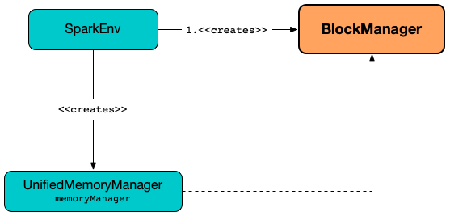
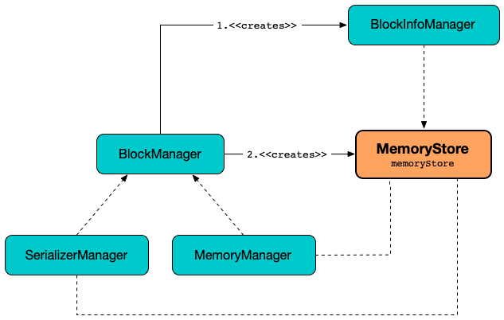

# BlockManager

`BlockManager` manages the storage for blocks (_chunks of data_) that can be stored in [memory](#memoryStore) and on [disk](#diskStore).


`BlockManager` runs as part of the [driver](../driver.md) and [executor](../executor/Executor.md) processes.

`BlockManager` provides interface for uploading and fetching blocks both locally and remotely using various [stores](#stores) (i.e. memory, disk, and off-heap).

**Cached blocks** are blocks with non-zero sum of memory and disk sizes.

!!! tip
    Use [Web UI](../webui/index.md) (esp. [Storage](../webui/StorageTab.md) and [Executors](../webui/ExecutorsTab.md) tabs) to monitor the memory used.

!!! tip
    Use [spark-submit](../tools/spark-submit.md)'s command-line options (i.e. [--driver-memory](../tools/spark-submit.md#driver-memory) for the driver and [--executor-memory](../tools/spark-submit.md#executor-memory) for executors) or their equivalents as Spark properties (i.e. [spark.executor.memory](../tools/spark-submit.md#spark.executor.memory) and [spark.driver.memory](../tools/spark-submit.md#spark_driver_memory)) to control the memory for storage memory.

When [External Shuffle Service is enabled](#externalShuffleServiceEnabled), BlockManager uses [ExternalShuffleClient](#externalBlockStoreClient) to read shuffle files (of other executors).

## Creating Instance

`BlockManager` takes the following to be created:

* [Executor ID](#executorId)
* [RpcEnv](#rpcEnv)
* [BlockManagerMaster](#master)
* <span id="serializerManager"> [SerializerManager](../serializer/SerializerManager.md)
* <span id="conf"> [SparkConf](../SparkConf.md)
* [MemoryManager](#memoryManager)
* [MapOutputTracker](#mapOutputTracker)
* [ShuffleManager](#shuffleManager)
* [BlockTransferService](#blockTransferService)
* <span id="securityManager"> `SecurityManager`
* <span id="externalBlockStoreClient"> Optional [ExternalBlockStoreClient](ExternalBlockStoreClient.md)

When created, `BlockManager` sets [externalShuffleServiceEnabled](#externalShuffleServiceEnabled) internal flag based on [spark.shuffle.service.enabled](../external-shuffle-service/configuration-properties.md#spark.shuffle.service.enabled) configuration property.

`BlockManager` then creates an instance of [DiskBlockManager](DiskBlockManager.md) (requesting `deleteFilesOnStop` when an external shuffle service is not in use).

`BlockManager` creates **block-manager-future** daemon cached thread pool with 128 threads maximum (as `futureExecutionContext`).

`BlockManager` calculates the maximum memory to use (as `maxMemory`) by requesting the maximum [on-heap](../memory/MemoryManager.md#maxOnHeapStorageMemory) and [off-heap](../memory/MemoryManager.md#maxOffHeapStorageMemory) storage memory from the assigned `MemoryManager`.

`BlockManager` calculates the port used by the external shuffle service (as `externalShuffleServicePort`).

`BlockManager` creates a client to read other executors' shuffle files (as `shuffleClient`). If the external shuffle service is used...FIXME

`BlockManager` sets the [maximum number of failures](../configuration-properties.md#spark.block.failures.beforeLocationRefresh) before this block manager refreshes the block locations from the driver (as `maxFailuresBeforeLocationRefresh`).

`BlockManager` registers a [BlockManagerSlaveEndpoint](BlockManagerSlaveEndpoint.md) with the input [RpcEnv](../rpc/RpcEnv.md), itself, and [MapOutputTracker](../scheduler/MapOutputTracker.md) (as `slaveEndpoint`).

`BlockManager` is created when `SparkEnv` is [created](../SparkEnv.md#create-BlockManager) (for the driver and executors) when a Spark application starts.



## <span id="memoryManager"> MemoryManager

`BlockManager` is given a [MemoryManager](../memory/MemoryManager.md) when [created](#creating-instance).

`BlockManager` uses the `MemoryManager` for the following:

* Create a [MemoryStore](#memoryStore) (that is then assigned to [MemoryManager](../memory/MemoryManager.md#setMemoryStore) as a "circular dependency")

* Initialize [maxOnHeapMemory](#maxOnHeapMemory) and [maxOffHeapMemory](#maxOffHeapMemory) (for reporting)

## <span id="migratableResolver"> MigratableResolver

```scala
migratableResolver: MigratableResolver
```

`BlockManager` creates a reference to a [MigratableResolver](../shuffle/MigratableResolver.md) by requesting the [ShuffleManager](#shuffleManager) for the [ShuffleBlockResolver](../shuffle/ShuffleManager.md#shuffleBlockResolver) (that is assumed a `MigratableResolver`).

??? note "Lazy Value"
    `migratableResolver` is a Scala **lazy value** to guarantee that the code to initialize it is executed once only (when accessed for the first time) and the computed value never changes afterwards.

!!! note "private[storage]"
    `migratableResolver` is a `private[storage]` so it is available to others in the `org.apache.spark.storage` package.

`migratableResolver` is used when:

* `BlockManager` is requested to [putBlockDataAsStream](#putBlockDataAsStream)
* `ShuffleMigrationRunnable` is requested to [run](ShuffleMigrationRunnable.md#run)
* `BlockManagerDecommissioner` is requested to [refreshOffloadingShuffleBlocks](BlockManagerDecommissioner.md#refreshOffloadingShuffleBlocks)
* `FallbackStorage` is requested to [copy](FallbackStorage.md#copy)

## <span id="initialize"> Initializing BlockManager

```scala
initialize(
  appId: String): Unit
```

`initialize` requests the [BlockTransferService](#blockTransferService) to [initialize](BlockTransferService.md#init).

`initialize` requests the [ExternalBlockStoreClient](#externalBlockStoreClient) to [initialize](ExternalBlockStoreClient.md#init) (if given).

`initialize` determines the [BlockReplicationPolicy](#blockReplicationPolicy) based on [spark.storage.replication.policy](../configuration-properties.md#spark.storage.replication.policy) configuration property and prints out the following INFO message to the logs:

```text
Using [priorityClass] for block replication policy
```

`initialize` creates a [BlockManagerId](BlockManagerId.md) and requests the [BlockManagerMaster](#master) to [registerBlockManager](BlockManagerMaster.md#registerBlockManager) (with the `BlockManagerId`, the [local directories](DiskBlockManager.md#localDirs) of the [DiskBlockManager](#diskBlockManager), the [maxOnHeapMemory](#maxOnHeapMemory), the [maxOffHeapMemory](#maxOffHeapMemory) and the [slaveEndpoint](#slaveEndpoint)).

`initialize` sets the internal [BlockManagerId](#blockManagerId) to be the response from the [BlockManagerMaster](#master) (if available) or the `BlockManagerId` just created.

`initialize` initializes the [External Shuffle Server's Address](#shuffleServerId) when [enabled](#externalShuffleServiceEnabled) and prints out the following INFO message to the logs (with the [externalShuffleServicePort](#externalShuffleServicePort)):

```text
external shuffle service port = [externalShuffleServicePort]
```

(only for executors and [External Shuffle Service enabled](#externalShuffleServiceEnabled)) `initialize` [registers with the External Shuffle Server](#registerWithExternalShuffleServer).

`initialize` determines the [hostLocalDirManager](#hostLocalDirManager). With [spark.shuffle.readHostLocalDisk](../configuration-properties.md#spark.shuffle.readHostLocalDisk) configuration property enabled and [spark.shuffle.useOldFetchProtocol](../configuration-properties.md#spark.shuffle.useOldFetchProtocol) disabled, `initialize` uses the [ExternalBlockStoreClient](#externalBlockStoreClient) to create a `HostLocalDirManager` (with [spark.storage.localDiskByExecutors.cacheSize](../configuration-properties.md#spark.storage.localDiskByExecutors.cacheSize) configuration property).

In the end, `initialize` prints out the following INFO message to the logs (with the [blockManagerId](#blockManagerId)):

```text
Initialized BlockManager: [blockManagerId]
```

`initialize` is used when:

* `SparkContext` is [created](../SparkContext-creating-instance-internals.md#BlockManager-initialization) (on the driver)
* `Executor` is [created](../executor/Executor.md) (with `isLocal` flag disabled)

### <span id="registerWithExternalShuffleServer"> Registering Executor's BlockManager with External Shuffle Server

```scala
registerWithExternalShuffleServer(): Unit
```

`registerWithExternalShuffleServer` registers the `BlockManager` (for an executor) with [External Shuffle Service](../external-shuffle-service/index.md).

`registerWithExternalShuffleServer` prints out the following INFO message to the logs:

```text
Registering executor with local external shuffle service.
```

`registerWithExternalShuffleServer` creates an [ExecutorShuffleInfo](../external-shuffle-service/ExecutorShuffleInfo.md) (with the [localDirs](DiskBlockManager.md#localDirs) and [subDirsPerLocalDir](DiskBlockManager.md#subDirsPerLocalDir) of the [DiskBlockManager](#diskBlockManager), and the class name of the [ShuffleManager](#shuffleManager)).

`registerWithExternalShuffleServer` uses [spark.shuffle.registration.maxAttempts](../configuration-properties.md#spark.shuffle.registration.maxAttempts) configuration property and `5` sleep time when requesting the [ExternalBlockStoreClient](#blockStoreClient) to [registerWithShuffleServer](ExternalBlockStoreClient.md#registerWithShuffleServer) (using the [BlockManagerId](#shuffleServerId) and the `ExecutorShuffleInfo`).

In case of any exception that happen below the maximum number of attempts, `registerWithExternalShuffleServer` prints out the following ERROR message to the logs and sleeps 5 seconds:

```text
Failed to connect to external shuffle server, will retry [attempts] more times after waiting 5 seconds...
```

## <span id="blockManagerId"> BlockManagerId

`BlockManager` uses a [BlockManagerId](BlockManagerId.md) for...FIXME

## <span id="hostLocalDirManager"> HostLocalDirManager

`BlockManager` can use a `HostLocalDirManager`.

Default: (undefined)

## <span id="blockReplicationPolicy"> BlockReplicationPolicy

`BlockManager` uses a [BlockReplicationPolicy](BlockReplicationPolicy.md) for...FIXME

## <span id="externalShuffleServicePort"> External Shuffle Service's Port

`BlockManager` determines the [port of an external shuffle service](StorageUtils.md#externalShuffleServicePort) when [created](#creating-instance).

The port is used to create the [shuffleServerId](#shuffleServerId) and a [HostLocalDirManager](#hostLocalDirManager).

The port is also used for [preferExecutors](#preferExecutors).

## <span id="subDirsPerLocalDir"> spark.diskStore.subDirectories Configuration Property

`BlockManager` uses [spark.diskStore.subDirectories](../configuration-properties.md#spark.diskStore.subDirectories) configuration property to initialize a `subDirsPerLocalDir` local value.

`subDirsPerLocalDir` is used when:

* `IndexShuffleBlockResolver` is requested to [getDataFile](../shuffle/IndexShuffleBlockResolver.md#getDataFile) and [getIndexFile](../shuffle/IndexShuffleBlockResolver.md#getIndexFile)
* `BlockManager` is requested to [readDiskBlockFromSameHostExecutor](#readDiskBlockFromSameHostExecutor)

## <span id="getOrElseUpdate"> Fetching Block or Computing (and Storing) it

```scala
getOrElseUpdate[T](
  blockId: BlockId,
  level: StorageLevel,
  classTag: ClassTag[T],
  makeIterator: () => Iterator[T]): Either[BlockResult, Iterator[T]]
```

!!! note "Map.getOrElseUpdate"
    _I think_ it is fair to say that `getOrElseUpdate` is like [getOrElseUpdate]({{ scala.api }}/scala/collection/mutable/Map.html#getOrElseUpdate(key:K,op:=%3EV):V) of [scala.collection.mutable.Map]({{ scala.api }}/scala/collection/mutable/Map.html) in Scala.

    ```scala
    getOrElseUpdate(key: K, op: ⇒ V): V
    ```

    Quoting the official scaladoc:

    > If given key `K` is already in this map, `getOrElseUpdate` returns the associated value `V`.

    > Otherwise, `getOrElseUpdate` computes a value `V` from given expression `op`, stores with the key `K` in the map and returns that value.

    Since `BlockManager` is a key-value store of blocks of data identified by a block ID that seems to fit so well.

`getOrElseUpdate` first attempts to [get the block](#get) by the `BlockId` (from the local block manager first and, if unavailable, requesting remote peers).

`getOrElseUpdate` gives the `BlockResult` of the block if found.

If however the block was not found (in any block manager in a Spark cluster), `getOrElseUpdate` [doPutIterator](#doPutIterator) (for the input `BlockId`, the `makeIterator` function and the `StorageLevel`).

`getOrElseUpdate` branches off per the result.

For `None`, `getOrElseUpdate` [getLocalValues](#getLocalValues) for the `BlockId` and eventually returns the `BlockResult` (unless terminated by a `SparkException` due to some internal error).

For `Some(iter)`, `getOrElseUpdate` returns an iterator of `T` values.

`getOrElseUpdate` is used when:

* `RDD` is requested to [get or compute an RDD partition](../rdd/RDD.md#getOrCompute) (for an `RDDBlockId` with the RDD's [id](../rdd/RDD.md#id) and partition index).

### <span id="get"> Fetching Block

```scala
get[T: ClassTag](
  blockId: BlockId): Option[BlockResult]
```

`get` attempts to fetch the block ([BlockId](BlockId.md)) from a local block manager first before requesting it from remote block managers. `get` returns a [BlockResult](#BlockResult) or `None` (to denote "a block is not available").

---

Internally, `get` tries to [fetch the block from the local BlockManager](#getLocalValues). If found, `get` prints out the following INFO message to the logs and returns a `BlockResult`.

```text
Found block [blockId] locally
```

If however the block was not found locally, `get` tries to [fetch the block from remote BlockManagers](#getRemoteValues). If fetched,  `get` prints out the following INFO message to the logs and returns a `BlockResult`.

```text
Found block [blockId] remotely
```

### <span id="getRemoteValues"> getRemoteValues

```scala
getRemoteValues[T: ClassTag](
  blockId: BlockId): Option[BlockResult]
```

`getRemoteValues` [getRemoteBlock](#getRemoteBlock) with the `bufferTransformer` function that takes a [ManagedBuffer](../network/ManagedBuffer.md) and does the following:

* Requests the [SerializerManager](#serializerManager) to [deserialize values from an input stream](../serializer/SerializerManager.md#dataDeserializeStream) from the `ManagedBuffer`
* Creates a `BlockResult` with the values (and their total size, and `Network` read method)

## <span id="getRemoteBytes"> Fetching Block Bytes From Remote Block Managers

```scala
getRemoteBytes(
  blockId: BlockId): Option[ChunkedByteBuffer]
```

`getRemoteBytes` [getRemoteBlock](#getRemoteBlock) with the `bufferTransformer` function that takes a [ManagedBuffer](../network/ManagedBuffer.md) and creates a `ChunkedByteBuffer`.

`getRemoteBytes` is used when:

* `TorrentBroadcast` is requested to [readBlocks](../broadcast-variables/TorrentBroadcast.md#readBlocks)
* `TaskResultGetter` is requested to [enqueueSuccessfulTask](../scheduler/TaskResultGetter.md#enqueueSuccessfulTask)

## <span id="getRemoteBlock"> Fetching Remote Block

```scala
getRemoteBlock[T](
  blockId: BlockId,
  bufferTransformer: ManagedBuffer => T): Option[T]
```

`getRemoteBlock` is used for [getRemoteValues](#getRemoteValues) and [getRemoteBytes](#getRemoteBytes).

`getRemoteBlock` prints out the following DEBUG message to the logs:

```text
Getting remote block [blockId]
```

`getRemoteBlock` requests the [BlockManagerMaster](#master) for [locations and status](BlockManagerMaster.md#getLocationsAndStatus) of the input [BlockId](BlockId.md) (with the host of [BlockManagerId](#blockManagerId)).

With some locations, `getRemoteBlock` determines the size of the block (max of `diskSize` and `memSize`). `getRemoteBlock` tries to [read the block from the local directories of another executor on the same host](#readDiskBlockFromSameHostExecutor). `getRemoteBlock` prints out the following INFO message to the logs:

```text
Read [blockId] from the disk of a same host executor is [successful|failed].
```

When a data block could not be found in any of the local directories, `getRemoteBlock` [fetchRemoteManagedBuffer](#fetchRemoteManagedBuffer).

For no locations from the [BlockManagerMaster](#master), `getRemoteBlock` prints out the following DEBUG message to the logs:

### <span id="readDiskBlockFromSameHostExecutor"> readDiskBlockFromSameHostExecutor

```scala
readDiskBlockFromSameHostExecutor(
  blockId: BlockId,
  localDirs: Array[String],
  blockSize: Long): Option[ManagedBuffer]
```

`readDiskBlockFromSameHostExecutor`...FIXME

### <span id="fetchRemoteManagedBuffer"> fetchRemoteManagedBuffer

```scala
fetchRemoteManagedBuffer(
  blockId: BlockId,
  blockSize: Long,
  locationsAndStatus: BlockManagerMessages.BlockLocationsAndStatus): Option[ManagedBuffer]
```

`fetchRemoteManagedBuffer`...FIXME

### <span id="sortLocations"> sortLocations

```scala
sortLocations(
  locations: Seq[BlockManagerId]): Seq[BlockManagerId]
```

`sortLocations`...FIXME

### <span id="preferExecutors"> preferExecutors

```scala
preferExecutors(
  locations: Seq[BlockManagerId]): Seq[BlockManagerId]
```

`preferExecutors`...FIXME

### <span id="readDiskBlockFromSameHostExecutor"> readDiskBlockFromSameHostExecutor

```scala
readDiskBlockFromSameHostExecutor(
  blockId: BlockId,
  localDirs: Array[String],
  blockSize: Long): Option[ManagedBuffer]
```

`readDiskBlockFromSameHostExecutor`...FIXME

## <span id="futureExecutionContext"> ExecutionContextExecutorService

`BlockManager` uses a Scala [ExecutionContextExecutorService]({{ scala.api }}/scala/concurrent/ExecutionContextExecutorService.html) to execute *FIXME* asynchronously (on a thread pool with **block-manager-future** prefix and maximum of 128 threads).

## <span id="BlockEvictionHandler"> BlockEvictionHandler

`BlockManager` is a [BlockEvictionHandler](BlockEvictionHandler.md) that can [drop a block from memory](#dropFromMemory) (and store it on a disk when necessary).

## <span id="shuffleClient"><span id="externalShuffleServiceEnabled"> ShuffleClient and External Shuffle Service

!!! danger Outdated
    FIXME `ShuffleClient` and `ExternalShuffleClient` are dead. Long live [BlockStoreClient](BlockStoreClient.md) and [ExternalBlockStoreClient](ExternalBlockStoreClient.md).

`BlockManager` manages the lifecycle of a `ShuffleClient`:

* Creates when [created](#creating-instance)

* Inits (and possibly [registers with an external shuffle server](#registerWithExternalShuffleServer)) when requested to [initialize](#initialize)

* Closes when requested to [stop](#stop)

The `ShuffleClient` can be an `ExternalShuffleClient` or the given [BlockTransferService](#blockTransferService) based on [spark.shuffle.service.enabled](../external-shuffle-service/configuration-properties.md#spark.shuffle.service.enabled) configuration property. When enabled, BlockManager uses the `ExternalShuffleClient`.

The `ShuffleClient` is available to other Spark services (using `shuffleClient` value) and is used when BlockStoreShuffleReader is requested to [read combined key-value records for a reduce task](../shuffle/BlockStoreShuffleReader.md#read).

When requested for [shuffle metrics](#shuffleMetricsSource), BlockManager simply requests them from the `ShuffleClient`.

## <span id="rpcEnv"> BlockManager and RpcEnv

`BlockManager` is given a [RpcEnv](../rpc/RpcEnv.md) when [created](#creating-instance).

The `RpcEnv` is used to set up a [BlockManagerSlaveEndpoint](#slaveEndpoint).

## <span id="blockInfoManager"> BlockInfoManager

`BlockManager` creates a [BlockInfoManager](BlockInfoManager.md) when [created](#creating-instance).

`BlockManager` requests the `BlockInfoManager` to [clear](BlockInfoManager.md#clear) when requested to [stop](#stop).

`BlockManager` uses the `BlockInfoManager` to create a [MemoryStore](#memoryStore).

`BlockManager` uses the `BlockInfoManager` when requested for the following:

* [reportAllBlocks](#reportAllBlocks)

* [getStatus](#getStatus)

* [getMatchingBlockIds](#getMatchingBlockIds)

* [getLocalValues](#getLocalValues) and [getLocalBytes](#getLocalBytes)

* [doPut](#doPut)

* [replicateBlock](#replicateBlock)

* [dropFromMemory](#dropFromMemory)

* [removeRdd](#removeRdd), [removeBroadcast](#removeBroadcast), [removeBlock](#removeBlock), [removeBlockInternal](#removeBlockInternal)

* [downgradeLock](#downgradeLock), [releaseLock](#releaseLock), [registerTask](#registerTask), [releaseAllLocksForTask](#releaseAllLocksForTask)

## <span id="master"> BlockManager and BlockManagerMaster

`BlockManager` is given a [BlockManagerMaster](BlockManagerMaster.md) when [created](#creating-instance).

## <span id="BlockDataManager"> BlockManager as BlockDataManager

`BlockManager` is a [BlockDataManager](BlockDataManager.md).

## <span id="mapOutputTracker"> BlockManager and MapOutputTracker

`BlockManager` is given a [MapOutputTracker](../scheduler/MapOutputTracker.md) when [created](#creating-instance).

## <span id="executorId"> Executor ID

`BlockManager` is given an Executor ID when [created](#creating-instance).

The Executor ID is one of the following:

* **driver** (`SparkContext.DRIVER_IDENTIFIER`) for the driver

* Value of [--executor-id](../executor/CoarseGrainedExecutorBackend.md#executor-id) command-line argument for [CoarseGrainedExecutorBackend](../executor/CoarseGrainedExecutorBackend.md) executors

## <span id="slaveEndpoint"> BlockManagerEndpoint RPC Endpoint

`BlockManager` requests the [RpcEnv](#rpcEnv) to [register](../rpc/RpcEnv.md#setupEndpoint) a [BlockManagerSlaveEndpoint](BlockManagerSlaveEndpoint.md) under the name `BlockManagerEndpoint[ID]`.

The RPC endpoint is used when `BlockManager` is requested to [initialize](#initialize) and [reregister](#reregister) (to register the `BlockManager` on an executor with the [BlockManagerMaster](#master) on the driver).

The endpoint is stopped (by requesting the [RpcEnv](#rpcEnv) to [stop the reference](../rpc/RpcEnv.md#stop)) when `BlockManager` is requested to [stop](#stop).

## <span id="SparkEnv"> Accessing BlockManager

`BlockManager` is available using [SparkEnv](../SparkEnv.md#blockManager) on the driver and executors.

```text
import org.apache.spark.SparkEnv
val bm = SparkEnv.get.blockManager

scala> :type bm
org.apache.spark.storage.BlockManager
```

## <span id="blockStoreClient"> BlockStoreClient

`BlockManager` uses a [BlockStoreClient](BlockStoreClient.md) to read other executors' blocks. This is an [ExternalBlockStoreClient](#externalBlockStoreClient) (when given and an external shuffle service is used) or a [BlockTransferService](#blockTransferService) (to directly connect to other executors).

This `BlockStoreClient` is used when:

* `BlockStoreShuffleReader` is requested to [read combined key-values for a reduce task](../shuffle/BlockStoreShuffleReader.md#read)
* Create the [HostLocalDirManager](#hostLocalDirManager) (when `BlockManager` is [initialized](#initialize))
* As the [shuffleMetricsSource](#shuffleMetricsSource)
* [registerWithExternalShuffleServer](#registerWithExternalShuffleServer) (when an external shuffle server is used and the [ExternalBlockStoreClient](#externalBlockStoreClient) defined)

## <span id="blockTransferService"> BlockTransferService

`BlockManager` is given a [BlockTransferService](BlockTransferService.md) when [created](#creating-instance).

!!! note
    There is only one concrete `BlockTransferService` that is [NettyBlockTransferService](NettyBlockTransferService.md) and there seem to be no way to reconfigure Apache Spark to use a different implementation (if there were any).

`BlockTransferService` is used when `BlockManager` is requested to [fetch a block from](#getRemoteBytes) and [replicate a block to](#replicate) remote block managers.

`BlockTransferService` is used as the [BlockStoreClient](#blockStoreClient) (unless an [ExternalBlockStoreClient](#externalBlockStoreClient) is specified).

`BlockTransferService` is [initialized](BlockTransferService.md#init) with this [BlockManager](#initialize).

`BlockTransferService` is [closed](BlockTransferService.md#close) when `BlockManager` is requested to [stop](#stop).

## <span id="shuffleManager"> ShuffleManager

`BlockManager` is given a [ShuffleManager](../shuffle/ShuffleManager.md) when [created](#creating-instance).

`BlockManager` uses the `ShuffleManager` for the following:

* [Retrieving a block data](#getBlockData) (for shuffle blocks)

* [Retrieving a non-shuffle block data](#getLocalBytes) (for shuffle blocks anyway)

* [Registering an executor with a local external shuffle service](#registerWithExternalShuffleServer) (when [initialized](#initialize) on an executor with [externalShuffleServiceEnabled](#externalShuffleServiceEnabled))

## <span id="diskBlockManager"> DiskBlockManager

BlockManager creates a [DiskBlockManager](DiskBlockManager.md) when [created](#creating-instance).


BlockManager uses the BlockManager for the following:

* Creating a [DiskStore](#diskStore)

* [Registering an executor with a local external shuffle service](#registerWithExternalShuffleServer) (when [initialized](#initialize) on an executor with [externalShuffleServiceEnabled](#externalShuffleServiceEnabled))

The `BlockManager` is available as `diskBlockManager` reference to other Spark systems.

```scala
import org.apache.spark.SparkEnv
SparkEnv.get.blockManager.diskBlockManager
```

## <span id="memoryStore"> MemoryStore

`BlockManager` creates a [MemoryStore](MemoryStore.md) when [created](#creating-instance) (with the [BlockInfoManager](#blockInfoManager), the [SerializerManager](#serializerManager), the [MemoryManager](#memoryManager) and itself as a [BlockEvictionHandler](BlockEvictionHandler.md)).



`BlockManager` requests the [MemoryManager](#memoryManager) to [use](../memory/MemoryManager.md#setMemoryStore) the `MemoryStore`.

`BlockManager` uses the `MemoryStore` for the following:

* [getStatus](#getStatus) and [getCurrentBlockStatus](#getCurrentBlockStatus)

* [getLocalValues](#getLocalValues)

* [doGetLocalBytes](#doGetLocalBytes)

* [doPutBytes](#doPutBytes) and [doPutIterator](#doPutIterator)

* [maybeCacheDiskBytesInMemory](#maybeCacheDiskBytesInMemory) and [maybeCacheDiskValuesInMemory](#maybeCacheDiskValuesInMemory)

* [dropFromMemory](#dropFromMemory)

* [removeBlockInternal](#removeBlockInternal)

The `MemoryStore` is requested to [clear](MemoryStore.md#clear) when `BlockManager` is requested to [stop](#stop).

The `MemoryStore` is available as `memoryStore` private reference to other Spark services.

```scala
import org.apache.spark.SparkEnv
SparkEnv.get.blockManager.memoryStore
```

The `MemoryStore` is used (via `SparkEnv.get.blockManager.memoryStore` reference) when `Task` is requested to [run](../scheduler/Task.md#run) (that has just finished execution and requests the `MemoryStore` to [release unroll memory](MemoryStore.md#releaseUnrollMemoryForThisTask)).

## <span id="diskStore"> DiskStore

`BlockManager` creates a [DiskStore](DiskStore.md) (with the [DiskBlockManager](#diskBlockManager)) when [created](#creating-instance).


`BlockManager` uses the `DiskStore` when requested for the following:

* [getStatus](#getStatus)
* [getCurrentBlockStatus](#getCurrentBlockStatus)
* [getLocalValues](#getLocalValues)
* [doGetLocalBytes](#doGetLocalBytes)
* [doPutIterator](#doPutIterator)
* [dropFromMemory](#dropFromMemory)
* [removeBlockInternal](#removeBlockInternal)

`DiskStore` is used when:

* `ByteBufferBlockStoreUpdater` is requested to [saveToDiskStore](ByteBufferBlockStoreUpdater.md#saveToDiskStore)
* `TempFileBasedBlockStoreUpdater` is requested to [blockData](TempFileBasedBlockStoreUpdater.md#blockData) and [saveToDiskStore](TempFileBasedBlockStoreUpdater.md#saveToDiskStore)

## <span id="metrics"> Performance Metrics

BlockManager uses [BlockManagerSource](BlockManagerSource.md) to report metrics under the name **BlockManager**.

## <span id="getPeers"> getPeers

```scala
getPeers(
  forceFetch: Boolean): Seq[BlockManagerId]
```

`getPeers`...FIXME

`getPeers` is used when `BlockManager` is requested to [replicateBlock](#replicateBlock) and [replicate](#replicate).

## <span id="releaseAllLocksForTask"> Releasing All Locks For Task

```scala
releaseAllLocksForTask(
  taskAttemptId: Long): Seq[BlockId]
```

`releaseAllLocksForTask`...FIXME

`releaseAllLocksForTask` is used when `TaskRunner` is requested to [run](../executor/TaskRunner.md#run) (at the end of a task).

## <span id="stop"> Stopping BlockManager

```scala
stop(): Unit
```

`stop`...FIXME

`stop` is used when `SparkEnv` is requested to [stop](../SparkEnv.md#stop).

## <span id="getMatchingBlockIds"> Getting IDs of Existing Blocks (For a Given Filter)

```scala
getMatchingBlockIds(
  filter: BlockId => Boolean): Seq[BlockId]
```

`getMatchingBlockIds`...FIXME

`getMatchingBlockIds` is used when `BlockManagerSlaveEndpoint` is requested to [handle a GetMatchingBlockIds message](BlockManagerSlaveEndpoint.md#GetMatchingBlockIds).

## <span id="getLocalValues"> Getting Local Block

```scala
getLocalValues(
  blockId: BlockId): Option[BlockResult]
```

`getLocalValues` prints out the following DEBUG message to the logs:

```text
Getting local block [blockId]
```

`getLocalValues` [obtains a read lock for `blockId`](BlockInfoManager.md#lockForReading).

When no `blockId` block was found, you should see the following DEBUG message in the logs and `getLocalValues` returns "nothing" (i.e. `NONE`).

```text
Block [blockId] was not found
```

When the `blockId` block was found, you should see the following DEBUG message in the logs:

```text
Level for block [blockId] is [level]
```

If `blockId` block has memory level and [is registered in `MemoryStore`](MemoryStore.md#contains), `getLocalValues` returns a [BlockResult](#BlockResult) as `Memory` read method and with a `CompletionIterator` for an interator:

1. [Values iterator from `MemoryStore` for `blockId`](MemoryStore.md#getValues) for "deserialized" persistence levels.
1. Iterator from [`SerializerManager` after the data stream has been deserialized](serializer:SerializerManager.md#dataDeserializeStream) for the `blockId` block and [the bytes for `blockId` block](MemoryStore.md#getBytes) for "serialized" persistence levels.

`getLocalValues` is used when:

* `TorrentBroadcast` is requested to [readBroadcastBlock](../broadcast-variables/TorrentBroadcast.md#readBroadcastBlock)

* `BlockManager` is requested to [get](#get) and [getOrElseUpdate](#getOrElseUpdate)

### <span id="maybeCacheDiskValuesInMemory"> maybeCacheDiskValuesInMemory

```scala
maybeCacheDiskValuesInMemory[T](
  blockInfo: BlockInfo,
  blockId: BlockId,
  level: StorageLevel,
  diskIterator: Iterator[T]): Iterator[T]
```

`maybeCacheDiskValuesInMemory`...FIXME

## <span id="getBlockData"> Retrieving Block Data

```scala
getBlockData(
  blockId: BlockId): ManagedBuffer
```

`getBlockData` is part of the [BlockDataManager](BlockDataManager.md#getBlockData) abstraction.

For a BlockId.md[] of a shuffle (a ShuffleBlockId), getBlockData requests the <<shuffleManager, ShuffleManager>> for the shuffle:ShuffleManager.md#shuffleBlockResolver[ShuffleBlockResolver] that is then requested for shuffle:ShuffleBlockResolver.md#getBlockData[getBlockData].

Otherwise, getBlockData <<getLocalBytes, getLocalBytes>> for the given BlockId.

If found, getBlockData creates a new BlockManagerManagedBuffer (with the <<blockInfoManager, BlockInfoManager>>, the input BlockId, the retrieved BlockData and the dispose flag enabled).

If not found, getBlockData <<reportBlockStatus, informs the BlockManagerMaster>> that the block could not be found (and that the master should no longer assume the block is available on this executor) and throws a BlockNotFoundException.

NOTE: `getBlockData` is executed for shuffle blocks or local blocks that the BlockManagerMaster knows this executor really has (unless BlockManagerMaster is outdated).

## <span id="getLocalBytes"> Retrieving Non-Shuffle Local Block Data

```scala
getLocalBytes(
  blockId: BlockId): Option[BlockData]
```

`getLocalBytes`...FIXME

`getLocalBytes` is used when:

* `TorrentBroadcast` is requested to [readBlocks](../broadcast-variables/TorrentBroadcast.md#readBlocks)
* `BlockManager` is requested for the [block data](#getBlockData) (of a non-shuffle block)

## <span id="putBlockData"> Storing Block Data Locally

```scala
putBlockData(
  blockId: BlockId,
  data: ManagedBuffer,
  level: StorageLevel,
  classTag: ClassTag[_]): Boolean
```

`putBlockData` is part of the [BlockDataManager](BlockDataManager.md#putBlockData) abstraction.

`putBlockData` [putBytes](#putBytes) with Java NIO's [ByteBuffer](../network/ManagedBuffer.md#nioByteBuffer) of the given [ManagedBuffer](../network/ManagedBuffer.md).

## <span id="putBytes"> Storing Block (ByteBuffer) Locally

```scala
putBytes(
  blockId: BlockId,
  bytes: ChunkedByteBuffer,
  level: StorageLevel,
  tellMaster: Boolean = true): Boolean
```

`putBytes` creates a [ByteBufferBlockStoreUpdater](ByteBufferBlockStoreUpdater.md) that is then requested to [store the bytes](BlockStoreUpdater.md#save).

`putBytes` is used when:

* `BlockManager` is requested to [puts a block data locally](#putBlockData)
* `TaskRunner` is requested to [run](../executor/TaskRunner.md#run-result-sent-via-blockmanager) (and the result size is above [maxDirectResultSize](../executor/Executor.md#maxDirectResultSize))
* `TorrentBroadcast` is requested to [writeBlocks](../broadcast-variables/TorrentBroadcast.md#writeBlocks) and [readBlocks](../broadcast-variables/TorrentBroadcast.md#readBlocks)

### <span id="doPutBytes"> doPutBytes

```scala
doPutBytes[T](
  blockId: BlockId,
  bytes: ChunkedByteBuffer,
  level: StorageLevel,
  classTag: ClassTag[T],
  tellMaster: Boolean = true,
  keepReadLock: Boolean = false): Boolean
```

`doPutBytes` calls the internal helper <<doPut, doPut>> with a function that accepts a `BlockInfo` and does the uploading.

Inside the function, if the StorageLevel.md[storage `level`]'s replication is greater than 1, it immediately starts <<replicate, replication>> of the `blockId` block on a separate thread (from `futureExecutionContext` thread pool). The replication uses the input `bytes` and `level` storage level.

For a memory storage level, the function checks whether the storage `level` is deserialized or not. For a deserialized storage `level`, ``BlockManager``'s serializer:SerializerManager.md#dataDeserializeStream[`SerializerManager` deserializes `bytes` into an iterator of values] that MemoryStore.md#putIteratorAsValues[`MemoryStore` stores]. If however the storage `level` is not deserialized, the function requests MemoryStore.md#putBytes[`MemoryStore` to store the bytes]

If the put did not succeed and the storage level is to use disk, you should see the following WARN message in the logs:

```text
Persisting block [blockId] to disk instead.
```

And DiskStore.md#putBytes[`DiskStore` stores the bytes].

NOTE: DiskStore.md[DiskStore] is requested to store the bytes of a block with memory and disk storage level only when MemoryStore.md[MemoryStore] has failed.

If the storage level is to use disk only, DiskStore.md#putBytes[`DiskStore` stores the bytes].

`doPutBytes` requests <<getCurrentBlockStatus, current block status>> and if the block was successfully stored, and the driver should know about it (`tellMaster`), the function <<reportBlockStatus, reports the current storage status of the block to the driver>>. The executor:TaskMetrics.md#incUpdatedBlockStatuses[current `TaskContext` metrics are updated with the updated block status] (only when executed inside a task where `TaskContext` is available).

You should see the following DEBUG message in the logs:

```text
Put block [blockId] locally took [time] ms
```

The function waits till the earlier asynchronous replication finishes for a block with replication level greater than `1`.

The final result of `doPutBytes` is the result of storing the block successful or not (as computed earlier).

NOTE: `doPutBytes` is used exclusively when BlockManager is requested to <<putBytes, putBytes>>.

## <span id="doPut"> Putting New Block

```scala
doPut[T](
  blockId: BlockId,
  level: StorageLevel,
  classTag: ClassTag[_],
  tellMaster: Boolean,
  keepReadLock: Boolean)(putBody: BlockInfo => Option[T]): Option[T]
```

`doPut` requires that the given [StorageLevel](StorageLevel.md) is [valid](StorageLevel.md#isValid).

`doPut` creates a new [BlockInfo](BlockInfo.md) and requests the [BlockInfoManager](#blockInfoManager) for a [write lock for the block](BlockInfoManager.md#lockNewBlockForWriting).

`doPut` executes the given `putBody` function (with the `BlockInfo`).

If the result of `putBody` function is `None`, the block is considered saved successfully.

For successful save, `doPut` requests the [BlockInfoManager](#blockInfoManager) to [downgradeLock](BlockInfoManager.md#downgradeLock) or [unlock](BlockInfoManager.md#unlock) based on the given `keepReadLock` flag (`true` and `false`, respectively).

For unsuccessful save (when `putBody` returned some value), `doPut` [removeBlockInternal](#removeBlockInternal) and prints out the following WARN message to the logs:

```text
Putting block [blockId] failed
```

In the end, `doPut` prints out the following DEBUG message to the logs:

```text
Putting block [blockId] [withOrWithout] replication took [usedTime] ms
```

`doPut` is used when:

* `BlockStoreUpdater` is requested to [save](BlockStoreUpdater.md#save)
* `BlockManager` is requested to [doPutIterator](#doPutIterator)

## <span id="removeBlock"> Removing Block

```scala
removeBlock(
  blockId: BlockId,
  tellMaster: Boolean = true): Unit
```

`removeBlock` prints out the following DEBUG message to the logs:

```text
Removing block [blockId]
```

`removeBlock` requests the [BlockInfoManager](#blockInfoManager) for [write lock](BlockInfoManager.md#lockForWriting) on the [block](BlockId.md).

With a write lock on the block, `removeBlock` [removeBlockInternal](#removeBlockInternal) (with the `tellMaster` flag turned on when the input `tellMaster` flag and the [tellMaster](BlockInfo.md#tellMaster) of the block itself are both turned on).

In the end, `removeBlock` [addUpdatedBlockStatusToTaskMetrics](#addUpdatedBlockStatusToTaskMetrics) (with an empty `BlockStatus`).

---

In case the block is no longer available (`None`), `removeBlock` prints out the following WARN message to the logs:

```text
Asked to remove block [blockId], which does not exist
```

---

`removeBlock` is used when:

* `BlockManager` is requested to [handleLocalReadFailure](#handleLocalReadFailure), [removeRdd](#removeRdd), [removeBroadcast](#removeBroadcast)
* `BlockManagerDecommissioner` is requested to [migrate a block](BlockManagerDecommissioner.md#migrateBlock)
* `BlockManagerStorageEndpoint` is requested to [handle a RemoveBlock message](BlockManagerStorageEndpoint.md#RemoveBlock)

## <span id="removeRdd"> Removing RDD Blocks

```scala
removeRdd(
  rddId: Int): Int
```

`removeRdd` removes all the blocks that belong to the `rddId` RDD.

It prints out the following INFO message to the logs:

```text
Removing RDD [rddId]
```

It then requests RDD blocks from BlockInfoManager.md[] and <<removeBlock, removes them (from memory and disk)>> (without informing the driver).

The number of blocks removed is the final result.

NOTE: It is used by BlockManagerSlaveEndpoint.md#RemoveRdd[`BlockManagerSlaveEndpoint` while handling `RemoveRdd` messages].

## <span id="removeBroadcast"> Removing All Blocks of Broadcast Variable

```scala
removeBroadcast(broadcastId: Long, tellMaster: Boolean): Int
```

`removeBroadcast` removes all the blocks of the input `broadcastId` broadcast.

Internally, it starts by printing out the following DEBUG message to the logs:

```text
Removing broadcast [broadcastId]
```

It then requests all the BlockId.md#BroadcastBlockId[BroadcastBlockId] objects that belong to the `broadcastId` broadcast from BlockInfoManager.md[] and <<removeBlock, removes them (from memory and disk)>>.

The number of blocks removed is the final result.

NOTE: It is used by BlockManagerSlaveEndpoint.md#RemoveBroadcast[`BlockManagerSlaveEndpoint` while handling `RemoveBroadcast` messages].

## <span id="shuffleServerId"> External Shuffle Server's Address

```scala
shuffleServerId: BlockManagerId
```

When requested to [initialize](#initialize), `BlockManager` records the location ([BlockManagerId](BlockManagerId.md)) of [External Shuffle Service](../external-shuffle-service/index.md) if [enabled](#externalShuffleServiceEnabled) or simply uses the [non-external-shuffle-service BlockManagerId](#blockManagerId).

The `BlockManagerId` is used to [register an executor with a local external shuffle service](#registerWithExternalShuffleServer).

The `BlockManagerId` is used as the location of a [shuffle map output](../scheduler/MapStatus.md) when:

* `BypassMergeSortShuffleWriter` is requested to [write partition records to a shuffle file](../shuffle/BypassMergeSortShuffleWriter.md#write)
* `UnsafeShuffleWriter` is requested to [close and write output](../shuffle/UnsafeShuffleWriter.md#closeAndWriteOutput)
* `SortShuffleWriter` is requested to [write output](../shuffle/SortShuffleWriter.md#write)

## <span id="getStatus"> getStatus

```scala
getStatus(
  blockId: BlockId): Option[BlockStatus]
```

`getStatus`...FIXME

`getStatus` is used when `BlockManagerSlaveEndpoint` is requested to handle [GetBlockStatus](BlockManagerSlaveEndpoint.md#GetBlockStatus) message.

## <span id="reregister"> Re-registering BlockManager with Driver

```scala
reregister(): Unit
```

`reregister` prints out the following INFO message to the logs:

```text
BlockManager [blockManagerId] re-registering with master
```

`reregister` requests the [BlockManagerMaster](#master) to [register this BlockManager](BlockManagerMaster.md#registerBlockManager).

In the end, `reregister` [reportAllBlocks](#reportAllBlocks).

`reregister` is used when:

* `Executor` is requested to [reportHeartBeat](../executor/Executor.md#reportHeartBeat) (and informed to re-register)
* `BlockManager` is requested to [asyncReregister](#asyncReregister)

### <span id="reportAllBlocks"> Reporting All Blocks

```scala
reportAllBlocks(): Unit
```

`reportAllBlocks` prints out the following INFO message to the logs:

```text
Reporting [n] blocks to the master.
```

For [all the blocks](BlockInfoManager.md#entries) in the [BlockInfoManager](#blockInfoManager), `reportAllBlocks` [getCurrentBlockStatus](#getCurrentBlockStatus) and [tryToReportBlockStatus](#tryToReportBlockStatus) (for [blocks tracked by the master](BlockInfo.md#tellMaster)).

`reportAllBlocks` prints out the following ERROR message to the logs and exits when block status reporting fails for any block:

```text
Failed to report [blockId] to master; giving up.
```

## <span id="getCurrentBlockStatus"> Calculate Current Block Status

```scala
getCurrentBlockStatus(
  blockId: BlockId,
  info: BlockInfo): BlockStatus
```

`getCurrentBlockStatus` gives the current `BlockStatus` of the `BlockId` block (with the block's current StorageLevel.md[StorageLevel], memory and disk sizes). It uses MemoryStore.md[MemoryStore] and DiskStore.md[DiskStore] for size and other information.

NOTE: Most of the information to build `BlockStatus` is already in `BlockInfo` except that it may not necessarily reflect the current state per MemoryStore.md[MemoryStore] and DiskStore.md[DiskStore].

Internally, it uses the input BlockInfo.md[] to know about the block's storage level. If the storage level is not set (i.e. `null`), the returned `BlockStatus` assumes the StorageLevel.md[default `NONE` storage level] and the memory and disk sizes being `0`.

If however the storage level is set, `getCurrentBlockStatus` uses MemoryStore.md[MemoryStore] and DiskStore.md[DiskStore] to check whether the block is stored in the storages or not and request for their sizes in the storages respectively (using their `getSize` or assume `0`).

NOTE: It is acceptable that the `BlockInfo` says to use memory or disk yet the block is not in the storages (yet or anymore). The method will give current status.

`getCurrentBlockStatus` is used when <<reregister, executor's BlockManager is requested to report the current status of the local blocks to the master>>, <<doPutBytes, saving a block to a storage>> or <<dropFromMemory, removing a block from memory only>> or <<removeBlock, both, i.e. from memory and disk>>.

## <span id="reportBlockStatus"> Reporting Current Storage Status of Block to Driver

```scala
reportBlockStatus(
  blockId: BlockId,
  status: BlockStatus,
  droppedMemorySize: Long = 0L): Unit
```

`reportBlockStatus` [tryToReportBlockStatus](#tryToReportBlockStatus).

 If told to re-register, `reportBlockStatus` prints out the following INFO message to the logs followed by [asynchronous re-registration](#asyncReregister):

```text
Got told to re-register updating block [blockId]
```

In the end, `reportBlockStatus` prints out the following DEBUG message to the logs:

```text
Told master about block [blockId]
```

`reportBlockStatus` is used when:

* `IndexShuffleBlockResolver` is requested to [](../shuffle/IndexShuffleBlockResolver.md#putShuffleBlockAsStream)
* `BlockStoreUpdater` is requested to [save](BlockStoreUpdater.md#save)
* `BlockManager` is requested to [getLocalBlockData](#getLocalBlockData), [doPutIterator](#doPutIterator), [dropFromMemory](#dropFromMemory), [removeBlockInternal](#removeBlockInternal)

## <span id="tryToReportBlockStatus"> Reporting Block Status Update to Driver

```scala
tryToReportBlockStatus(
  blockId: BlockId,
  status: BlockStatus,
  droppedMemorySize: Long = 0L): Boolean
```

`tryToReportBlockStatus` [reports block status update](BlockManagerMaster.md#updateBlockInfo) to the [BlockManagerMaster](#master) and returns its response.

`tryToReportBlockStatus` is used when:

* `BlockManager` is requested to [reportAllBlocks](#reportAllBlocks), [reportBlockStatus](#reportBlockStatus)

## <span id="execution-context"> Execution Context

**block-manager-future** is the execution context for...FIXME

## <span id="ByteBuffer"> ByteBuffer

The underlying abstraction for blocks in Spark is a `ByteBuffer` that limits the size of a block to 2GB (`Integer.MAX_VALUE` - see [Why does FileChannel.map take up to Integer.MAX_VALUE of data?](http://stackoverflow.com/q/8076472/1305344) and [SPARK-1476 2GB limit in spark for blocks](https://issues.apache.org/jira/browse/SPARK-1476)). This has implication not just for managed blocks in use, but also for shuffle blocks (memory mapped blocks are limited to 2GB, even though the API allows for `long`), ser-deser via byte array-backed output streams.

## <span id="BlockResult"> BlockResult

`BlockResult` is a metadata of a fetched block:

* <span id="BlockResult-data"> Data (`Iterator[Any]`)
* <span id="BlockResult-readMethod"> [DataReadMethod](#DataReadMethod)
* <span id="BlockResult-bytes"> Size (bytes)

`BlockResult` is created and returned when `BlockManager` is requested for the following:

* [getOrElseUpdate](#getOrElseUpdate)
* [get](#get)
* [getLocalValues](#getLocalValues)
* [getRemoteValues](#getRemoteValues)

### <span id="DataReadMethod"> DataReadMethod

`DataReadMethod` describes how [block data](#BlockResult-data) was read.

DataReadMethod | Source
---------------|---------
 `Disk`    | [DiskStore](#diskStore) (while [getLocalValues](#getLocalValues))
 `Hadoop`  | _seems unused_
 `Memory`  | [MemoryStore](#memoryStore) (while [getLocalValues](#getLocalValues))
 `Network` | [Remote BlockManagers](#getRemoteValues) (aka _network_)

## <span id="registerTask"> Registering Task

```scala
registerTask(
  taskAttemptId: Long): Unit
```

`registerTask` requests the [BlockInfoManager](#blockInfoManager) to [register a given task](BlockInfoManager.md#registerTask).

`registerTask` is used when `Task` is requested to [run](../scheduler/Task.md#run) (at the start of a task).

## <span id="getDiskWriter"> Creating DiskBlockObjectWriter

```scala
getDiskWriter(
  blockId: BlockId,
  file: File,
  serializerInstance: SerializerInstance,
  bufferSize: Int,
  writeMetrics: ShuffleWriteMetrics): DiskBlockObjectWriter
```

getDiskWriter creates a [DiskBlockObjectWriter](DiskBlockObjectWriter.md) (with [spark.shuffle.sync](../configuration-properties.md#spark.shuffle.sync) configuration property for `syncWrites` argument).

`getDiskWriter` uses the [SerializerManager](#serializerManager).

`getDiskWriter` is used when:

* `BypassMergeSortShuffleWriter` is requested to [write records (of a partition)](../shuffle/BypassMergeSortShuffleWriter.md#write)

* `ShuffleExternalSorter` is requested to [writeSortedFile](../shuffle/ShuffleExternalSorter.md#writeSortedFile)

* `ExternalAppendOnlyMap` is requested to [spillMemoryIteratorToDisk](../shuffle/ExternalAppendOnlyMap.md#spillMemoryIteratorToDisk)

* `ExternalSorter` is requested to [spillMemoryIteratorToDisk](../shuffle/ExternalSorter.md#spillMemoryIteratorToDisk) and [writePartitionedFile](../shuffle/ExternalSorter.md#writePartitionedFile)

* [UnsafeSorterSpillWriter](../memory/UnsafeSorterSpillWriter.md) is created

## <span id="addUpdatedBlockStatusToTaskMetrics"> Recording Updated BlockStatus in TaskMetrics (of Current Task)

```scala
addUpdatedBlockStatusToTaskMetrics(
  blockId: BlockId,
  status: BlockStatus): Unit
```

`addUpdatedBlockStatusToTaskMetrics` [takes an active `TaskContext`](../scheduler/TaskContext.md#get) (if available) and [records updated `BlockStatus` for `Block`](../executor/TaskMetrics.md#incUpdatedBlockStatuses) (in the [task's `TaskMetrics`](../scheduler/TaskContext.md#taskMetrics)).

`addUpdatedBlockStatusToTaskMetrics` is used when BlockManager [doPutBytes](#doPutBytes) (for a block that was successfully stored), [doPut](#doPut), [doPutIterator](#doPutIterator), [removes blocks from memory](#dropFromMemory) (possibly spilling it to disk) and [removes block from memory and disk](#removeBlock).

## <span id="shuffleMetricsSource"> Shuffle Metrics Source

```scala
shuffleMetricsSource: Source
```

`shuffleMetricsSource` creates a [ShuffleMetricsSource](ShuffleMetricsSource.md) with the [shuffleMetrics](BlockStoreClient.md#shuffleMetrics) (of the [ BlockStoreClient](#blockStoreClient)) and the [source name](ShuffleMetricsSource.md#sourceName) as follows:

* **ExternalShuffle** when [ExternalBlockStoreClient](#externalBlockStoreClient) is specified
* **NettyBlockTransfer** otherwise

`shuffleMetricsSource` is available using [SparkEnv](../SparkEnv.md):

```scala
env.blockManager.shuffleMetricsSource
```

`shuffleMetricsSource` is used when:

* [Executor](../executor/Executor.md) is created (for non-local / cluster modes)

## <span id="replicate"> Replicating Block To Peers

```scala
replicate(
  blockId: BlockId,
  data: BlockData,
  level: StorageLevel,
  classTag: ClassTag[_],
  existingReplicas: Set[BlockManagerId] = Set.empty): Unit
```

`replicate`...FIXME

`replicate` is used when `BlockManager` is requested to [doPutBytes](#doPutBytes), [doPutIterator](#doPutIterator) and [replicateBlock](#replicateBlock).

## <span id="replicateBlock"> replicateBlock

```scala
replicateBlock(
  blockId: BlockId,
  existingReplicas: Set[BlockManagerId],
  maxReplicas: Int): Unit
```

`replicateBlock`...FIXME

`replicateBlock` is used when `BlockManagerSlaveEndpoint` is requested to [handle a ReplicateBlock message](BlockManagerSlaveEndpoint.md#ReplicateBlock).

## <span id="putIterator"> putIterator

```scala
putIterator[T: ClassTag](
  blockId: BlockId,
  values: Iterator[T],
  level: StorageLevel,
  tellMaster: Boolean = true): Boolean
```

`putIterator`...FIXME

`putIterator` is used when:

* `BlockManager` is requested to [putSingle](#putSingle)

## <span id="putSingle"> putSingle

```scala
putSingle[T: ClassTag](
  blockId: BlockId,
  value: T,
  level: StorageLevel,
  tellMaster: Boolean = true): Boolean
```

`putSingle`...FIXME

`putSingle` is used when `TorrentBroadcast` is requested to [write the blocks](../broadcast-variables/TorrentBroadcast.md#writeBlocks) and [readBroadcastBlock](../broadcast-variables/TorrentBroadcast.md#readBroadcastBlock).

## <span id="doPutIterator"> doPutIterator

```scala
doPutIterator[T](
  blockId: BlockId,
  iterator: () => Iterator[T],
  level: StorageLevel,
  classTag: ClassTag[T],
  tellMaster: Boolean = true,
  keepReadLock: Boolean = false): Option[PartiallyUnrolledIterator[T]]
```

`doPutIterator` [doPut](#doPut) with the [putBody](#doPutIterator-putBody) function.

`doPutIterator` is used when:

* `BlockManager` is requested to [getOrElseUpdate](#getOrElseUpdate) and [putIterator](#putIterator)

### <span id="doPutIterator-putBody"> putBody

```scala
putBody: BlockInfo => Option[T]
```

For the given [StorageLevel](StorageLevel.md) that indicates to [use memory](StorageLevel.md#useMemory) for storage, `putBody` requests the [MemoryStore](#memoryStore) to [putIteratorAsValues](MemoryStore.md#putIteratorAsValues) or [putIteratorAsBytes](MemoryStore.md#putIteratorAsBytes) based on the `StorageLevel` (that indicates to use [deserialized](StorageLevel.md#deserialized) format or not, respectively).

In case storing the block in memory was not possible (due to lack of available memory), `putBody` prints out the following WARN message to the logs and falls back on the [DiskStore](#diskStore) to [store the block](DiskStore.md#put).

```text
Persisting block [blockId] to disk instead.
```

For the given [StorageLevel](StorageLevel.md) that indicates to [use disk](StorageLevel.md#useDisk) storage only ([useMemory](StorageLevel.md#useMemory) flag is disabled), `putBody` requests the [DiskStore](#diskStore) to [store the block](DiskStore.md#put).

`putBody` [gets the current block status](#getCurrentBlockStatus) and checks whether the `StorageLevel` is [valid](StorageLevel.md#isValid) (that indicates that the block was stored successfully).

If the block was stored successfully, `putBody` [reports the block status](#reportBlockStatus) (only if indicated by the the given `tellMaster` flag and the [tellMaster](BlockInfo.md#tellMaster) flag of the associated [BlockInfo](BlockInfo.md)) and [addUpdatedBlockStatusToTaskMetrics](#addUpdatedBlockStatusToTaskMetrics).

`putBody` prints out the following DEBUG message to the logs:

```text
Put block [blockId] locally took [duration] ms
```

For the given [StorageLevel](StorageLevel.md) with [replication](StorageLevel.md#replication) enabled (above `1`), `putBody` [doGetLocalBytes](#doGetLocalBytes) and [replicates the block (to other BlockManagers)](#replicate). `putBody` prints out the following DEBUG message to the logs:

```text
Put block [blockId] remotely took [duration] ms
```

## <span id="doGetLocalBytes"> doGetLocalBytes

```scala
doGetLocalBytes(
  blockId: BlockId,
  info: BlockInfo): BlockData
```

`doGetLocalBytes`...FIXME

`doGetLocalBytes` is used when:

* `BlockManager` is requested to [getLocalBytes](#getLocalBytes), [doPutIterator](#doPutIterator) and [replicateBlock](#replicateBlock)

## <span id="dropFromMemory"> Dropping Block from Memory

```scala
dropFromMemory(
  blockId: BlockId,
  data: () => Either[Array[T], ChunkedByteBuffer]): StorageLevel
```

`dropFromMemory` prints out the following INFO message to the logs:

```text
Dropping block [blockId] from memory
```

`dropFromMemory` requests the [BlockInfoManager](#blockInfoManager) to assert that the block is [locked for writing](BlockInfoManager.md#assertBlockIsLockedForWriting) (that gives a [BlockInfo](BlockInfo.md) or throws a `SparkException`).

---

`dropFromMemory` drops to disk if the [current storage level](StorageLevel.md#useDisk) requires so (based on the given `BlockInfo`) and the block [is not](DiskStore.md#contains) in the [DiskStore](#diskStore) already. `dropFromMemory` prints out the following INFO message to the logs:

```text
Writing block [blockId] to disk
```

`dropFromMemory` uses the given `data` to determine whether the [DiskStore](#diskStore) is requested to [put](DiskStore.md#put) or [putBytes](DiskStore.md#putBytes) (`Array[T]` or `ChunkedByteBuffer`, respectively).

---

`dropFromMemory` requests the [MemoryStore](#memoryStore) to [remove the block](MemoryStore.md#remove). `dropFromMemory` prints out the following WARN message to the logs if the block was not found in the [MemoryStore](#memoryStore):

```text
Block [blockId] could not be dropped from memory as it does not exist
```

`dropFromMemory` [gets the current block status](#getCurrentBlockStatus) and [reportBlockStatus](#reportBlockStatus) when requested (when the [tellMaster](BlockInfo.md#tellMaster) flag of the `BlockInfo` is turned on).

`dropFromMemory` [addUpdatedBlockStatusToTaskMetrics](#addUpdatedBlockStatusToTaskMetrics) when the block has been updated (dropped to disk or removed from the `MemoryStore`).

In the end, `dropFromMemory` returns the current [StorageLevel](StorageLevel.md) of the block (off the `BlockStatus`).

---

`dropFromMemory` is part of the [BlockEvictionHandler](BlockEvictionHandler.md#dropFromMemory) abstraction.

## <span id="releaseLock"> releaseLock Method

```scala
releaseLock(
  blockId: BlockId,
  taskAttemptId: Option[Long] = None): Unit
```

releaseLock requests the [BlockInfoManager](#blockInfoManager) to [unlock the given block](BlockInfoManager.md#unlock).

releaseLock is part of the [BlockDataManager](BlockDataManager.md#releaseLock) abstraction.

## <span id="putBlockDataAsStream"> putBlockDataAsStream

```scala
putBlockDataAsStream(
  blockId: BlockId,
  level: StorageLevel,
  classTag: ClassTag[_]): StreamCallbackWithID
```

`putBlockDataAsStream` is part of the [BlockDataManager](BlockDataManager.md#putBlockDataAsStream) abstraction.

`putBlockDataAsStream`...FIXME

## <span id="maxMemory"> Maximum Memory

Total maximum value that `BlockManager` can ever possibly use (that depends on [MemoryManager](#memoryManager) and may vary over time).

Total available [on-heap](../memory/MemoryManager.md#maxOnHeapStorageMemory) and [off-heap](../memory/MemoryManager.md#maxOffHeapStorageMemory) memory for storage (in bytes)

## <span id="maxOffHeapMemory"> Maximum Off-Heap Memory

## <span id="maxOnHeapMemory"> Maximum On-Heap Memory

## <span id="decommissionSelf"> decommissionSelf

```scala
decommissionSelf(): Unit
```

`decommissionSelf`...FIXME

`decommissionSelf` is used when:

* `BlockManagerStorageEndpoint` is requested to [handle a DecommissionBlockManager message](BlockManagerStorageEndpoint.md#DecommissionBlockManager)

## <span id="decommissionBlockManager"> decommissionBlockManager

```scala
decommissionBlockManager(): Unit
```

`decommissionBlockManager` sends a `DecommissionBlockManager` message to the [BlockManagerStorageEndpoint](#storageEndpoint).

`decommissionBlockManager` is used when:

* `CoarseGrainedExecutorBackend` is requested to [decommissionSelf](../executor/CoarseGrainedExecutorBackend.md#decommissionSelf)

## <span id="storageEndpoint"> BlockManagerStorageEndpoint

```scala
storageEndpoint: RpcEndpointRef
```

`BlockManager` sets up a [RpcEndpointRef](../rpc/RpcEndpointRef.md) (within the [RpcEnv](#rpcEnv)) under the name `BlockManagerEndpoint[ID]` with a [BlockManagerStorageEndpoint](BlockManagerStorageEndpoint.md) message handler.

## <span id="decommissioner"> BlockManagerDecommissioner

```scala
decommissioner: Option[BlockManagerDecommissioner]
```

`BlockManager` defines `decommissioner` internal registry for a [BlockManagerDecommissioner](BlockManagerDecommissioner.md).

`decommissioner` is undefined (`None`) by default.

`BlockManager` creates and [starts](BlockManagerDecommissioner.md#start) a `BlockManagerDecommissioner` when requested to [decommissionSelf](#decommissionSelf).

`decommissioner` is used for [isDecommissioning](#isDecommissioning) and [lastMigrationInfo](#lastMigrationInfo).

`BlockManager` requests the `BlockManagerDecommissioner` to [stop](BlockManagerDecommissioner.md#stop) when [stopped](#stop).

## <span id="removeBlockInternal"> Removing Block from Memory and Disk

```scala
removeBlockInternal(
  blockId: BlockId,
  tellMaster: Boolean): Unit
```

For `tellMaster` turned on, `removeBlockInternal` requests the [BlockInfoManager](#blockInfoManager) to [assert that the block is locked for writing](BlockInfoManager.md#assertBlockIsLockedForWriting) and remembers the [current block status](#getCurrentBlockStatus). Otherwise, `removeBlockInternal` leaves the block status undetermined.

`removeBlockInternal` requests the [MemoryStore](#memoryStore) to [remove the block](MemoryStore.md#remove).

`removeBlockInternal` requests the [DiskStore](#diskStore) to [remove the block](DiskStore.md#remove).

`removeBlockInternal` requests the [BlockInfoManager](#blockInfoManager) to [remove the block metadata](BlockInfoManager.md#removeBlock).

In the end, `removeBlockInternal` [reports the block status](#reportBlockStatus) (to the master) with the storage level changed to `NONE`.

---

`removeBlockInternal` prints out the following WARN message when the block was not stored in the [MemoryStore](#memoryStore) and the [DiskStore](#diskStore):

```text
Block [blockId] could not be removed as it was not found on disk or in memory
```

---

`removeBlockInternal` is used when:

* `BlockManager` is requested to [put a new block](#doPut) and [remove a block](#removeBlock)

## <span id="maybeCacheDiskBytesInMemory"> maybeCacheDiskBytesInMemory

```scala
maybeCacheDiskBytesInMemory(
  blockInfo: BlockInfo,
  blockId: BlockId,
  level: StorageLevel,
  diskData: BlockData): Option[ChunkedByteBuffer]
```

`maybeCacheDiskBytesInMemory`...FIXME

`maybeCacheDiskBytesInMemory` is used when:

* `BlockManager` is requested to [getLocalValues](#getLocalValues) and [doGetLocalBytes](#doGetLocalBytes)

## Logging

Enable `ALL` logging level for `org.apache.spark.storage.BlockManager` logger to see what happens inside.

Add the following line to `conf/log4j.properties`:

```text
log4j.logger.org.apache.spark.storage.BlockManager=ALL
```

Refer to [Logging](../spark-logging.md).
