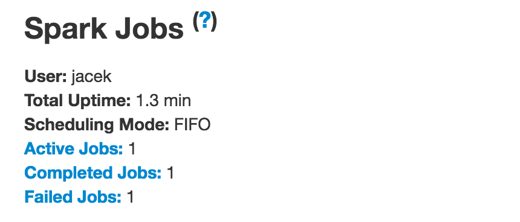

# AllJobsPage

`AllJobsPage` is a [WebUIPage](WebUIPage.md) of [JobsTab](JobsTab.md).

## Creating Instance

`AllJobsPage` takes the following to be created:

* <span id="parent"> Parent [JobsTab](JobsTab.md)
* <span id="store"> [AppStatusStore](../status/AppStatusStore.md)

## <span id="render"> Rendering Page

```scala
render(
  request: HttpServletRequest): Seq[Node]
```

`render` is part of the [WebUIPage](WebUIPage.md#render) abstraction.

`render` renders a `Spark Jobs` page with the [jobs](../status/AppStatusStore.md#jobsList) and [executors](../status/AppStatusStore.md#executorList) alongside [applicationInfo](../status/AppStatusStore.md#applicationInfo) and [appSummary](../status/AppStatusStore.md#appSummary) (from the [AppStatusStore](#store)).

## Introduction

`AllJobsPage` renders a summary, an event timeline, and active, completed, and failed jobs of a Spark application.

`AllJobsPage` displays the **Summary** section with the current Spark user, total uptime, scheduling mode, and the number of jobs per status.



Under the summary section is the **Event Timeline** section.


**Active Jobs**, **Completed Jobs**, and **Failed Jobs** sections follow.


Jobs are clickable (and give information about the stages of tasks inside it).

When you hover over a job in Event Timeline not only you see the job legend but also the job is highlighted in the Summary section.


The Event Timeline section shows not only jobs but also executors.


