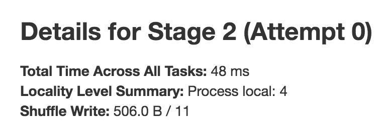

# StagePage

`StagePage` is a [WebUIPage](WebUIPage.md) of [StagesTab](StagesTab.md).


## Creating Instance

`StagePage` takes the following to be created:

* <span id="parent"> Parent [StagesTab](StagesTab.md)
* <span id="store"> [AppStatusStore](../status/AppStatusStore.md)

## <span id="prefix"> URL Prefix

`StagePage` uses `stage` [URL prefix](WebUIPage.md#prefix).

## <span id="render"> Rendering Page

```scala
render(
  request: HttpServletRequest): Seq[Node]
```

`render` is part of the [WebUIPage](WebUIPage.md#render) abstraction.

`render` requires `id` and `attempt` request parameters.

`render`...FIXME

## Tasks Section


## Summary Metrics for Completed Tasks in Stage

The summary metrics table shows the metrics for the tasks in a given stage that have already finished with `SUCCESS` status and metrics available.


The 1st row is **Duration** which includes the quantiles based on `executorRunTime`.

The 2nd row is the optional **Scheduler Delay** which includes the time to ship the task from the scheduler to executors, and the time to send the task result from the executors to the scheduler. It is not enabled by default and you should select **Scheduler Delay** checkbox under **Show Additional Metrics** to include it in the summary table.

The 3rd row is the optional **Task Deserialization Time** which includes the quantiles based on `executorDeserializeTime` task metric. It is not enabled by default and you should select **Task Deserialization Time** checkbox under **Show Additional Metrics** to include it in the summary table.

The 4th row is **GC Time** which is the time that an executor spent paused for Java garbage collection while the task was running (using `jvmGCTime` task metric).

The 5th row is the optional **Result Serialization Time** which is the time spent serializing the task result on a executor before sending it back to the driver (using `resultSerializationTime` task metric). It is not enabled by default and you should select *Result Serialization Time* checkbox under **Show Additional Metrics** to include it in the summary table.

The 6th row is the optional **Getting Result Time** which is the time that the driver spends fetching task results from workers. It is not enabled by default and you should select **Getting Result Time** checkbox under **Show Additional Metrics** to include it in the summary table.

The 7th row is the optional **Peak Execution Memory** which is the sum of the peak sizes of the internal data structures created during shuffles, aggregations and joins (using `peakExecutionMemory` task metric).

If the stage has an input, the 8th row is **Input Size / Records** which is the bytes and records read from Hadoop or from a Spark storage (using `inputMetrics.bytesRead` and `inputMetrics.recordsRead` task metrics).

If the stage has an output, the 9th row is **Output Size / Records** which is the bytes and records written to Hadoop or to a Spark storage (using `outputMetrics.bytesWritten` and `outputMetrics.recordsWritten` task metrics).

If the stage has shuffle read there will be three more rows in the table. The first row is **Shuffle Read Blocked Time** which is the time that tasks spent blocked waiting for shuffle data to be read from remote machines (using `shuffleReadMetrics.fetchWaitTime` task metric). The other row is **Shuffle Read Size / Records** which is the total shuffle bytes and records read (including both data read locally and data read from remote executors using `shuffleReadMetrics.totalBytesRead` and `shuffleReadMetrics.recordsRead` task metrics). And the last row is **Shuffle Remote Reads** which is the total shuffle bytes read from remote executors (which is a subset of the shuffle read bytes; the remaining shuffle data is read locally). It uses `shuffleReadMetrics.remoteBytesRead` task metric.

If the stage has shuffle write, the following row is **Shuffle Write Size / Records** (using [shuffleWriteMetrics.bytesWritten](../executor/ShuffleWriteMetrics.md#bytesWritten) and [shuffleWriteMetrics.recordsWritten](../executor/ShuffleWriteMetrics.md#recordsWritten) task metrics).

If the stage has bytes spilled, the following two rows are **Shuffle spill (memory)** (using `memoryBytesSpilled` task metric) and **Shuffle spill (disk)** (using `diskBytesSpilled` task metric).

## DAG Visualization


## Event Timeline


## Stage Task and Shuffle Stats



## Aggregated Metrics by Executor

`ExecutorTable` table shows the following columns:

* Executor ID
* Address
* Task Time
* Total Tasks
* Failed Tasks
* Killed Tasks
* Succeeded Tasks
* (optional) Input Size / Records (only when the stage has an input)
* (optional) Output Size / Records (only when the stage has an output)
* (optional) Shuffle Read Size / Records (only when the stage read bytes for a shuffle)
* (optional) Shuffle Write Size / Records (only when the stage wrote bytes for a shuffle)
* (optional) Shuffle Spill (Memory) (only when the stage spilled memory bytes)
* (optional) Shuffle Spill (Disk) (only when the stage spilled bytes to disk)


It gets `executorSummary` from `StageUIData` (for the stage and stage attempt id) and creates rows per executor.

## Accumulators

Stage page displays the table with [named accumulators](../accumulators/index.md#named) (only if they exist). It contains the name and value of the accumulators.


