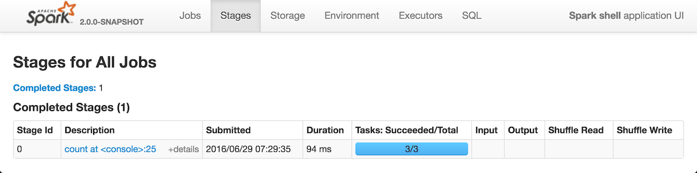

# StagesTab

`StagesTab` is a [SparkUITab](SparkUITab.md) with `stages` [URL prefix](SparkUITab.md#prefix).

## Creating Instance

`StagesTab` takes the following to be created:

*  Parent [SparkUI](SparkUI.md)
*  [AppStatusStore](../status/AppStatusStore.md)

`StagesTab` is created when:

* `SparkUI` is requested to [initialize](SparkUI.md#initialize)

## Pages

When [created](#creating-instance), `StagesTab` [attaches](WebUITab.md#attachPage) the following pages:

* [AllStagesPage](AllStagesPage.md)
* [StagePage](StagePage.md) (with the [AppStatusStore](#store))
* [PoolPage](PoolPage.md)

## Introduction

**Stages** tab shows [the current state of all stages of all jobs in a Spark application](AllStagesPage.md) with two optional pages for [the tasks and statistics for a stage](StagePage.md) (when a stage is selected) and [pool details](PoolPage.md) (when the application works in [FAIR scheduling mode](../scheduler/SchedulingMode.md#FAIR)).

The title of the tab is **Stages for All Jobs**.

With no jobs submitted yet (and hence no stages to display), the page shows nothing but the title.

The Stages page shows the stages in a Spark application per state in their respective sections:

* Active Stages
* Pending Stages
* Completed Stages
* Failed Stages

The state sections are only displayed when there are stages in a given state.

In [FAIR scheduling mode](../scheduler/SchedulingMode.md#FAIR) you have access to the table showing the scheduler pools.

