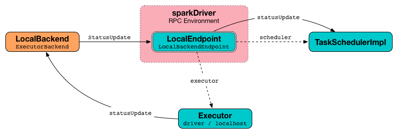

== [[LocalSchedulerBackend]] LocalSchedulerBackend

`LocalSchedulerBackend` is a <<../spark-SchedulerBackend.adoc#, SchedulerBackend>> and an <<../spark-ExecutorBackend.adoc#, ExecutorBackend>> for the <<spark-local.adoc#, Spark local>>.

`LocalSchedulerBackend` is <<creating-instance, created>> when `SparkContext` is requested to <<../spark-SparkContext.adoc#createTaskScheduler, create the SchedulerBackend with the TaskScheduler>> for the following master URLs:

* *local* (with exactly <<totalCores, 1 CPU core>>)

* *local[n]* (with exactly <<totalCores, n CPU cores>>)

* *++local[*]++* (with the <<totalCores, total number of CPU cores>> that matches the number of available CPU cores on the local machine)

* *local[n, m]* (with exactly <<totalCores, n CPU cores>>)

* *++local[*, m]++* (with the <<totalCores, total number of CPU cores>> that matches the number of available CPU cores on the local machine)

When an executor sends task status updates (using `ExecutorBackend.statusUpdate`), they are passed along as <<messages, StatusUpdate>> to <<spark-LocalEndpoint.adoc#, LocalEndpoint>>.

.Task status updates flow in local mode


While being <<creating-instance, created>>, `LocalSchedulerBackend` requests the <<launcherBackend, LauncherBackend>> to `connect`.

[[appId]]
[[applicationId]]
When requested for the <<../spark-SchedulerBackend.adoc#applicationId, applicationId>>, `LocalSchedulerBackend` uses *local-[current time millis]*.

[[maxNumConcurrentTasks]]
When requested for the <<../spark-SchedulerBackend.adoc#maxNumConcurrentTasks, maxNumConcurrentTasks>>, `LocalSchedulerBackend` simply divides the <<totalCores, total number of CPU cores>> by <<../spark-TaskSchedulerImpl.adoc#CPUS_PER_TASK, spark.task.cpus>> configuration (default: `1`).

[[defaultParallelism]]
When requested for the <<../spark-SchedulerBackend.adoc#defaultParallelism, defaultParallelism>>, `LocalSchedulerBackend` uses <<../spark-configuration-properties.adoc#spark.default.parallelism, spark.default.parallelism>> configuration (if defined) or the <<totalCores, total number of CPU cores>>.

[[userClassPath]]
When <<creating-instance, created>>, `LocalSchedulerBackend` <<getUserClasspath, uses>> the <<../spark-configuration-properties.adoc#spark.executor.extraClassPath, spark.executor.extraClassPath>> configuration property (in the given <<conf, SparkConf>>) for the *user-defined class path for executors* that is used exclusively when `LocalSchedulerBackend` is requested to <<start, start>> (and creates a <<spark-LocalEndpoint.adoc#, LocalEndpoint>> that in turn uses it to create the one <<spark-LocalEndpoint.adoc#executor, Executor>>).

[[creating-instance]]
`LocalSchedulerBackend` takes the following to be created:

* [[conf]] <<../spark-SparkConf.adoc#, SparkConf>>
* [[scheduler]] <<../spark-TaskSchedulerImpl.adoc#, TaskSchedulerImpl>>
* [[totalCores]] Total number of CPU cores (aka _totalCores_)

[[internal-registries]]
.LocalSchedulerBackend's Internal Properties (e.g. Registries, Counters and Flags)
[cols="1m,3",options="header",width="100%"]
|===
| Name
| Description

| localEndpoint
a| [[localEndpoint]] <<../spark-RpcEndpointRef.adoc#, RpcEndpointRef>>

Used when...FIXME

| launcherBackend
a| [[launcherBackend]] `LauncherBackend`

Used when...FIXME

| listenerBus
a| [[listenerBus]] <<../spark-LiveListenerBus.adoc#, LiveListenerBus>>

Used when...FIXME

|===

[[logging]]
[TIP]
====
Enable `INFO` logging level for `org.apache.spark.scheduler.local.LocalSchedulerBackend` logger to see what happens inside.

Add the following line to `conf/log4j.properties`:

```
log4j.logger.org.apache.spark.scheduler.local.LocalSchedulerBackend=INFO
```

Refer to <<../spark-logging.adoc#, Logging>>.
====

=== [[start]] Starting Scheduling Backend -- `start` Method

[source, scala]
----
start(): Unit
----

NOTE: `start` is part of the <<../spark-SchedulerBackend.adoc#start, SchedulerBackend Contract>> to start the scheduling backend.

`start`...FIXME

=== [[reviveOffers]] `reviveOffers` Method

[source, scala]
----
reviveOffers(): Unit
----

NOTE: `reviveOffers` is part of the <<../spark-SchedulerBackend.adoc#reviveOffers, SchedulerBackend Contract>> to...FIXME.

`reviveOffers`...FIXME

=== [[killTask]] `killTask` Method

[source, scala]
----
killTask(
  taskId: Long,
  executorId: String,
  interruptThread: Boolean,
  reason: String): Unit
----

NOTE: `killTask` is part of the <<../spark-SchedulerBackend.adoc#killTask, SchedulerBackend Contract>> to kill a task.

`killTask`...FIXME

=== [[statusUpdate]] `statusUpdate` Method

[source, scala]
----
statusUpdate(
  taskId: Long,
  state: TaskState,
  data: ByteBuffer): Unit
----

NOTE: `statusUpdate` is part of the <<../spark-ExecutorBackend.adoc#statusUpdate, ExecutorBackend Contract>> to...FIXME.

`statusUpdate`...FIXME

=== [[stop]] Stopping Scheduling Backend -- `stop` Method

[source, scala]
----
stop(): Unit
----

NOTE: `stop` is part of the <<../spark-SchedulerBackend.adoc#stop, SchedulerBackend Contract>> to stop a scheduling backend.

`stop`...FIXME

=== [[getUserClasspath]] User-Defined Class Path for Executors -- `getUserClasspath` Method

[source, scala]
----
getUserClasspath(conf: SparkConf): Seq[URL]
----

`getUserClasspath` simply requests the given `SparkConf` for the <<../spark-configuration-properties.adoc#spark.executor.extraClassPath, spark.executor.extraClassPath>> configuration property and converts the entries (separated by the system-dependent path separator) to URLs.

NOTE: `getUserClasspath` is used exclusively when `LocalSchedulerBackend` is <<userClassPath, created>>.
