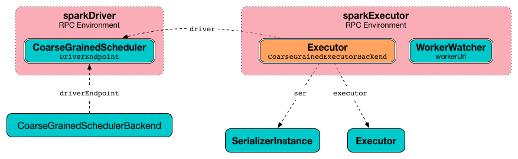
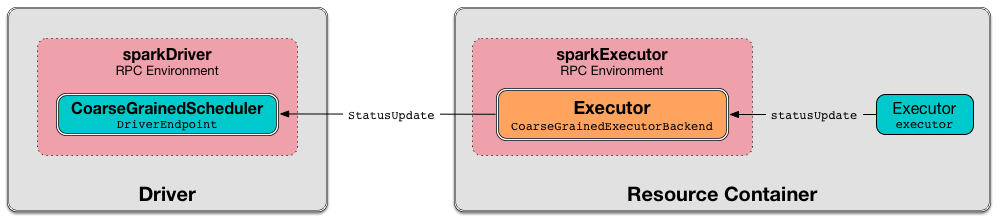

== [[CoarseGrainedExecutorBackend]] CoarseGrainedExecutorBackend

`CoarseGrainedExecutorBackend` is a <<main, standalone application>> that is started in a resource container when:

. Spark Standalone's link:spark-standalone-StandaloneSchedulerBackend.adoc#start[`StandaloneSchedulerBackend` starts]

. Spark on YARN's link:yarn/spark-yarn-ExecutorRunnable.adoc#run[`ExecutorRunnable` is started].

. Spark on Mesos's link:spark-mesos/spark-mesos-MesosCoarseGrainedSchedulerBackend.adoc#createCommand[`MesosCoarseGrainedSchedulerBackend` launches Spark executors]

When <<run, started>>, `CoarseGrainedExecutorBackend` <<creating-instance, registers the Executor RPC endpoint>> to communicate with the driver (i.e. with link:spark-CoarseGrainedSchedulerBackend-DriverEndpoint.adoc[CoarseGrainedScheduler RPC endpoint]).

.CoarseGrainedExecutorBackend Communicates with Driver's CoarseGrainedSchedulerBackend Endpoint


When <<main, launched>>, `CoarseGrainedExecutorBackend` immediately connects to the owning link:spark-CoarseGrainedSchedulerBackend.adoc[CoarseGrainedSchedulerBackend] to inform that it is ready to launch tasks.

`CoarseGrainedExecutorBackend` is an link:spark-ExecutorBackend.adoc[ExecutorBackend] that controls the lifecycle of a single <<executor, executor>> and sends <<statusUpdate, the executor's status updates>> to the driver.

.CoarseGrainedExecutorBackend Sending Task Status Updates to Driver's CoarseGrainedScheduler Endpoint


`CoarseGrainedExecutorBackend` is a link:spark-rpc.adoc#ThreadSafeRpcEndpoint[ThreadSafeRpcEndpoint] that <<onStart, connects to the driver>> (before accepting <<messages, messages>>) and <<onDisconnected, shuts down when the driver disconnects>>.

[[messages]]
.CoarseGrainedExecutorBackend's Executor RPC Endpoint Messages (in alphabetical order)
[width="100%",cols="1,2",options="header"]
|===
| Message
| Description

| <<KillTask, KillTask>>
|

| <<LaunchTask, LaunchTask>>
| Forwards launch task requests from the driver to the single managed coarse-grained <<executor, executor>>.

| <<RegisteredExecutor, RegisteredExecutor>>
| Creates the single managed <<executor, Executor>>.

Sent exclusively when `CoarseGrainedSchedulerBackend` link:spark-CoarseGrainedSchedulerBackend.adoc#RegisterExecutor[receives `RegisterExecutor`].

| <<RegisterExecutorFailed, RegisterExecutorFailed>>
|

| <<StopExecutor, StopExecutor>>
|

| <<Shutdown, Shutdown>>
|

|===

[[internal-properties]]
.CoarseGrainedExecutorBackend's Internal Properties
[cols="1,^1,3",options="header",width="100%"]
|===
| Name
| Initial Value
| Description

| [[ser]] `ser`
| link:spark-SerializerInstance.adoc[SerializerInstance]
| Initialized when <<creating-instance, `CoarseGrainedExecutorBackend` is created>>.

NOTE: `CoarseGrainedExecutorBackend` uses the input `env` to link:spark-sparkenv.adoc#closureSerializer[access `closureSerializer`].

| [[driver]] `driver`
| (empty)
| link:spark-RpcEndpointRef.adoc[RpcEndpointRef] of the driver

FIXME

| [[stopping]] `stopping`
| `false`
| Enabled when `CoarseGrainedExecutorBackend` gets notified to <<StopExecutor, stop itself>> or <<Shutdown, shut down the managed executor>>.

Used when `CoarseGrainedExecutorBackend` RPC Endpoint gets notified that <<onDisconnected, a remote RPC endpoint disconnected>>.

| [[executor]] `executor`
| (uninitialized)
| Single managed coarse-grained link:spark-Executor.adoc#coarse-grained-executor[Executor] managed exclusively by the `CoarseGrainedExecutorBackend` to forward <<LaunchTask, launch>> and <<KillTask, kill>> task requests to from the driver.

Initialized after `CoarseGrainedExecutorBackend` <<RegisteredExecutor, has registered with `CoarseGrainedSchedulerBackend`>> and stopped when `CoarseGrainedExecutorBackend` gets requested to <<Shutdown, shut down>>.
|===

[TIP]
====
Enable `INFO` logging level for `org.apache.spark.executor.CoarseGrainedExecutorBackend` logger to see what happens inside.

Add the following line to `conf/log4j.properties`:

```
log4j.logger.org.apache.spark.executor.CoarseGrainedExecutorBackend=INFO
```
====

=== [[LaunchTask]] Forwarding Launch Task Request to Executor (from Driver) -- `LaunchTask` Message Handler

[source, scala]
----
LaunchTask(data: SerializableBuffer) extends CoarseGrainedClusterMessage
----

NOTE: `CoarseGrainedExecutorBackend` acts as a proxy between the driver and the managed single <<executor, executor>> and merely re-packages `LaunchTask` payload (as serialized `data`) to pass it along for execution.

`LaunchTask` first link:spark-TaskDescription.adoc#decode[decodes `TaskDescription` from `data`]. You should see the following INFO message in the logs:

```
INFO CoarseGrainedExecutorBackend: Got assigned task [id]
```

`LaunchTask` then link:spark-Executor.adoc#launchTask[launches the task on the executor] (passing itself as the owning link:spark-ExecutorBackend.adoc[ExecutorBackend] and decoded link:spark-TaskDescription.adoc[TaskDescription]).

If <<executor, executor>> is not available, `LaunchTask` <<exitExecutor, terminates `CoarseGrainedExecutorBackend`>> with the error code `1` and `ExecutorLossReason` with the following message:

```
Received LaunchTask command but executor was null
```

NOTE: `LaunchTask` is sent when link:spark-CoarseGrainedSchedulerBackend-DriverEndpoint.adoc#launchTasks[`CoarseGrainedSchedulerBackend` launches tasks] (one `LaunchTask` per task).

=== [[statusUpdate]] Sending Task Status Updates to Driver -- `statusUpdate` Method

[source, scala]
----
statusUpdate(taskId: Long, state: TaskState, data: ByteBuffer): Unit
----

NOTE: `statusUpdate` is part of link:spark-ExecutorBackend.adoc#statusUpdate[ExecutorBackend Contract] to send task status updates to a scheduler (on the driver).

`statusUpdate` creates a link:spark-CoarseGrainedSchedulerBackend-DriverEndpoint.adoc#StatusUpdate[StatusUpdate] (with the input `taskId`, `state`, and `data` together with the <<executorId, executor id>>) and sends it to the <<driver, driver>> (if connected already).

.CoarseGrainedExecutorBackend Sending Task Status Updates to Driver's CoarseGrainedScheduler Endpoint


When no <<driver, driver>> is available, you should see the following WARN message in the logs:

```
WARN Drop [msg] because has not yet connected to driver
```

=== [[driverURL]] Driver's URL

The driver's URL is of the format `spark://[RpcEndpoint name]@[hostname]:[port]`, e.g. `spark://CoarseGrainedScheduler@192.168.1.6:64859`.

=== [[main]] Launching CoarseGrainedExecutorBackend Standalone Application (in Resource Container) -- `main` Method

`CoarseGrainedExecutorBackend` is a standalone application (i.e. comes with `main` entry method) that parses <<command-line-arguments, command-line arguments>> and <<run, runs CoarseGrainedExecutorBackend's Executor RPC endpoint>> to communicate with the driver.

[[command-line-arguments]]
.CoarseGrainedExecutorBackend Command-Line Arguments
[cols="1,^1,2",options="header",width="100%"]
|===
| Argument
| Required?
| Description

| [[driver-url]] `--driver-url`
| yes
| Driver's URL. See <<driverURL, driver's URL>>

| [[executor-id]] `--executor-id`
| yes
| Executor id

| [[hostname]] `--hostname`
| yes
| Host name

| [[cores]] `--cores`
| yes
| Number of cores (that must be greater than `0`).

| [[app-id]] `--app-id`
| yes
| Application id

| [[worker-url]] `--worker-url`
| no
| Worker's URL, e.g. `spark://Worker@192.168.1.6:64557`

NOTE: `--worker-url` is only used in link:spark-standalone-StandaloneSchedulerBackend.adoc[Spark Standalone] to enforce fate-sharing with the worker.

| [[user-class-path]] `--user-class-path`
| no
| User-defined class path entry which can be an URL or path to a resource (often a jar file) to be added to CLASSPATH; can be specified multiple times.

|===

When executed with unrecognized command-line arguments or required arguments are missing, `main` shows the usage help and exits (with exit status `1`).

[source]
----
$ ./bin/spark-class org.apache.spark.executor.CoarseGrainedExecutorBackend

Usage: CoarseGrainedExecutorBackend [options]

 Options are:
   --driver-url <driverUrl>
   --executor-id <executorId>
   --hostname <hostname>
   --cores <cores>
   --app-id <appid>
   --worker-url <workerUrl>
   --user-class-path <url>
----

[NOTE]
====
`main` is used when:

* Spark Standalone's link:spark-standalone-StandaloneSchedulerBackend.adoc#start[`StandaloneSchedulerBackend` starts].

* Spark on YARN's link:yarn/spark-yarn-ExecutorRunnable.adoc#run[`ExecutorRunnable` is started] (in a YARN resource container).

* Spark on Mesos's link:spark-mesos/spark-mesos-MesosCoarseGrainedSchedulerBackend.adoc#createCommand[`MesosCoarseGrainedSchedulerBackend` launches Spark executors]
====

=== [[run]] Running CoarseGrainedExecutorBackend (and Registering Executor RPC Endpoint) -- `run` Internal Method

[source, scala]
----
run(
  driverUrl: String,
  executorId: String,
  hostname: String,
  cores: Int,
  appId: String,
  workerUrl: Option[String],
  userClassPath: scala.Seq[URL]): Unit
----

When executed, `run` executes `Utils.initDaemon(log)`.

CAUTION: FIXME What does `initDaemon` do?

NOTE: `run` link:spark-SparkHadoopUtil.adoc#runAsSparkUser[runs itself with a Hadoop `UserGroupInformation`] (as a thread local variable distributed to child threads for authenticating HDFS and YARN calls).

NOTE: `run` expects a clear `hostname` with no `:` included (for a port perhaps).

[[run-driverPropsFetcher]]
`run` uses link:spark-Executor.adoc#spark_executor_port[spark.executor.port] Spark property (or `0` if not set) for the port to link:spark-rpc.adoc#create[create a `RpcEnv`] called *driverPropsFetcher* (together with the input `hostname` and `clientMode` enabled).

`run` link:spark-rpc.adoc#setupEndpointRefByURI[resolves `RpcEndpointRef` for the input `driverUrl`] and requests `SparkAppConfig` (by posting a blocking `RetrieveSparkAppConfig`).

IMPORTANT: This is the first moment when `CoarseGrainedExecutorBackend` initiates communication with the driver available at `driverUrl` through `RpcEnv`.

`run` uses `SparkAppConfig` to get the driver's `sparkProperties` and adds link:spark-SparkConf.adoc#spark.app.id[spark.app.id] Spark property with the value of the input `appId`.

`run` link:spark-rpc.adoc#shutdown[shuts `driverPropsFetcher` RPC Endpoint down].

`run` creates a link:spark-SparkConf.adoc[SparkConf] using the Spark properties fetched from the driver, i.e. with the link:spark-SparkConf.adoc#isExecutorStartupConf[executor-related Spark settings] if they link:spark-SparkConf.adoc#setIfMissing[were missing] and the link:spark-SparkConf.adoc#set[rest unconditionally].

If link:yarn/spark-yarn-settings.adoc#spark.yarn.credentials.file[spark.yarn.credentials.file] Spark property is defined in `SparkConf`, you should see the following INFO message in the logs:

```
INFO Will periodically update credentials from: [spark.yarn.credentials.file]
```

`run` link:spark-SparkHadoopUtil.adoc#startCredentialUpdater[requests the current `SparkHadoopUtil` to start start the credential updater].

NOTE: `run` uses link:spark-SparkHadoopUtil.adoc#get[SparkHadoopUtil.get] to access the current `SparkHadoopUtil`.

`run` link:spark-sparkenv.adoc#createExecutorEnv[creates `SparkEnv` for executors] (with the input `executorId`, `hostname` and `cores`, and `isLocal` disabled).

IMPORTANT: This is the moment when `SparkEnv` gets created with all the executor services.

`run` link:spark-rpc.adoc#setupEndpoint[sets up an RPC endpoint] with the name *Executor* and <<creating-instance, CoarseGrainedExecutorBackend>> as the endpoint.

(only in Spark Standalone) If the optional input `workerUrl` was defined, `run` sets up an RPC endpoint with the name *WorkerWatcher* and `WorkerWatcher` RPC endpoint.

[NOTE]
====
The optional input `workerUrl` is defined only when <<worker-url, `--worker-url` command-line argument>> was used to <<main, launch `CoarseGrainedExecutorBackend` standalone application>>.

`--worker-url` is only used in link:spark-standalone-StandaloneSchedulerBackend.adoc[Spark Standalone].
====

``run``'s main thread is blocked until link:spark-rpc.adoc#awaitTermination[`RpcEnv` terminates] and only the RPC endpoints process RPC messages.

Once `RpcEnv` has terminated, `run` link:spark-SparkHadoopUtil.adoc#stopCredentialUpdater[stops the credential updater].

CAUTION: FIXME Think of the place for `Utils.initDaemon`, `Utils.getProcessName` et al.

NOTE: `run` is used exclusively when <<main, `CoarseGrainedExecutorBackend` standalone application is launched>>.

=== [[creating-instance]] Creating CoarseGrainedExecutorBackend Instance

`CoarseGrainedExecutorBackend` takes the following when created:

. [[rpcEnv]] link:spark-rpc.adoc[RpcEnv]
. `driverUrl`
. [[executorId]] `executorId`
. `hostname`
. `cores`
. `userClassPath`
. link:spark-sparkenv.adoc[SparkEnv]

NOTE: `driverUrl`, `executorId`, `hostname`, `cores` and `userClassPath` correspond to `CoarseGrainedExecutorBackend` standalone application's <<command-line-arguments, command-line arguments>>.

`CoarseGrainedExecutorBackend` initializes the <<internal-properties, internal properties>>.

NOTE: `CoarseGrainedExecutorBackend` is created (to act as an RPC endpoint) when <<run, `Executor` RPC endpoint is registered>>.

=== [[onStart]] Registering with Driver -- `onStart` Method

[source, scala]
----
onStart(): Unit
----

NOTE: `onStart` is part of link:spark-rpc-RpcEndpoint.adoc#onStart[RpcEndpoint contract] that is executed before a RPC endpoint starts accepting messages.

When executed, you should see the following INFO message in the logs:

```
INFO CoarseGrainedExecutorBackend: Connecting to driver: [driverUrl]
```

NOTE: <<driverUrl, driverUrl>> is given when <<creating-instance, `CoarseGrainedExecutorBackend` is created>>.

`onStart` then link:spark-rpc.adoc#asyncSetupEndpointRefByURI[takes the `RpcEndpointRef` of the driver asynchronously] and initializes the internal <<driver, driver>> property. `onStart` sends a blocking link:spark-CoarseGrainedSchedulerBackend.adoc#RegisterExecutor[RegisterExecutor] message immediately (with <<executorId, executorId>>, link:spark-RpcEndpointRef.adoc[RpcEndpointRef] to itself, <<hostname, hostname>>, <<cores, cores>> and <<extractLogUrls, log URLs>>).

In case of failures, `onStart` <<exitExecutor, terminates `CoarseGrainedExecutorBackend`>> with the error code `1` and the reason (and no notification to the driver):

```
Cannot register with driver: [driverUrl]
```

=== [[RegisteredExecutor]] Creating Single Managed Executor -- `RegisteredExecutor` Message Handler

[source, scala]
----
RegisteredExecutor
extends CoarseGrainedClusterMessage with RegisterExecutorResponse
----

When `RegisteredExecutor` is received, you should see the following INFO in the logs:

```
INFO CoarseGrainedExecutorBackend: Successfully registered with driver
```

`CoarseGrainedExecutorBackend` link:spark-Executor.adoc#creating-instance[creates a `Executor`] (with `isLocal` disabled) that becomes the single managed <<executor, Executor>>.

NOTE: `CoarseGrainedExecutorBackend` uses `executorId`, `hostname`, `env`, `userClassPath` to create the `Executor` that are specified when `CoarseGrainedExecutorBackend` <<creating-instance, is created>>.

If creating the `Executor` fails with a non-fatal exception, `RegisteredExecutor` <<exitExecutor, terminates `CoarseGrainedExecutorBackend`>> with the reason:

```
Unable to create executor due to [message]
```

NOTE: `RegisteredExecutor` is sent exclusively when `CoarseGrainedSchedulerBackend` RPC Endpoint link:spark-CoarseGrainedSchedulerBackend-DriverEndpoint.adoc#RegisterExecutor[receives a `RegisterExecutor`] (that is sent right before `CoarseGrainedExecutorBackend` RPC Endpoint <<onStart, starts accepting messages>> which happens when `CoarseGrainedExecutorBackend` <<run, is started>>).

=== [[RegisterExecutorFailed]] RegisterExecutorFailed

[source, scala]
----
RegisterExecutorFailed(message)
----

When a `RegisterExecutorFailed` message arrives, the following ERROR is printed out to the logs:

```
ERROR CoarseGrainedExecutorBackend: Slave registration failed: [message]
```

`CoarseGrainedExecutorBackend` then exits with the exit code `1`.

=== [[KillTask]] Killing Tasks -- `KillTask` Message Handler

`KillTask(taskId, _, interruptThread)` message kills a task (calls `Executor.killTask`).

If an executor has not been initialized yet (FIXME: why?), the following ERROR message is printed out to the logs and CoarseGrainedExecutorBackend exits:

```
ERROR Received KillTask command but executor was null
```

=== [[StopExecutor]] StopExecutor Handler

[source, scala]
----
case object StopExecutor
extends CoarseGrainedClusterMessage
----

When `StopExecutor` is received, the handler turns <<stopping, stopping>> internal flag on. You should see the following INFO message in the logs:

```
INFO CoarseGrainedExecutorBackend: Driver commanded a shutdown
```

In the end, the handler sends a <<Shutdown, Shutdown>> message to itself.

NOTE: `StopExecutor` message is sent when `CoarseGrainedSchedulerBackend` RPC Endpoint (aka `DriverEndpoint`) processes link:spark-CoarseGrainedSchedulerBackend-DriverEndpoint.adoc#StopExecutors[StopExecutors] or link:spark-CoarseGrainedSchedulerBackend-DriverEndpoint.adoc#RemoveExecutor[RemoveExecutor] messages.

=== [[Shutdown]] Shutdown Handler

[source, scala]
----
case object Shutdown
extends CoarseGrainedClusterMessage
----

`Shutdown` turns <<stopping, stopping>> internal flag on and starts the `CoarseGrainedExecutorBackend-stop-executor` thread that link:spark-Executor.adoc#stop[stops the owned `Executor`] (using <<executor, executor>> reference).

NOTE: `Shutdown` message is sent exclusively when <<StopExecutor, `CoarseGrainedExecutorBackend` receives `StopExecutor`>>.

=== [[exitExecutor]] Terminating CoarseGrainedExecutorBackend (and Notifying Driver with RemoveExecutor) -- `exitExecutor` Method

[source, scala]
----
exitExecutor(
  code: Int,
  reason: String,
  throwable: Throwable = null,
  notifyDriver: Boolean = true): Unit
----

When `exitExecutor` is executed, you should see the following ERROR message in the logs (followed by `throwable` if available):

```
ERROR Executor self-exiting due to : [reason]
```

If `notifyDriver` is enabled (it is by default) `exitExecutor` informs the <<driver, driver>> that the executor should be removed (by sending a link:spark-CoarseGrainedSchedulerBackend-DriverEndpoint.adoc#RemoveExecutor[blocking `RemoveExecutor` message] with <<executorId, executor id>> and a `ExecutorLossReason` with the input `reason`).

You may see the following WARN message in the logs when the notification fails.

```
Unable to notify the driver due to [message]
```

In the end, `exitExecutor` terminates the `CoarseGrainedExecutorBackend` JVM process with the status `code`.

NOTE: `exitExecutor` uses Java's https://docs.oracle.com/javase/8/docs/api/java/lang/System.html#exit-int-[System.exit] and initiates JVM's shutdown sequence (and executing all registered shutdown hooks).

[NOTE]
====
`exitExecutor` is used when:

* `CoarseGrainedExecutorBackend` fails to <<onStart, associate with the driver>>, <<RegisteredExecutor, create a managed executor>> or <<RegisterExecutorFailed, register with the driver>>

* no <<executor, executor>> has been created before <<LaunchTask, launch>> or <<KillTask, kill>> task requests

* <<onDisconnected, driver has disconnected>>.
====

=== [[onDisconnected]] `onDisconnected` Callback

CAUTION: FIXME

=== [[start]] `start` Method

CAUTION: FIXME

=== [[stop]] `stop` Method

CAUTION: FIXME

=== [[requestTotalExecutors]] `requestTotalExecutors`

CAUTION: FIXME

=== [[extractLogUrls]] Extracting Log URLs -- `extractLogUrls` Method

CAUTION: FIXME
