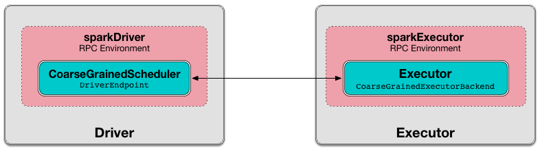
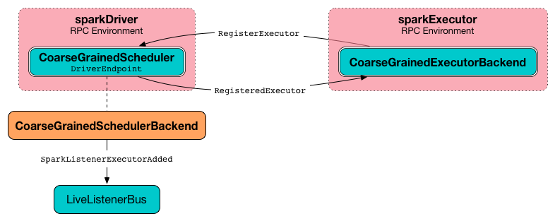

== [[DriverEndpoint]] DriverEndpoint -- CoarseGrainedSchedulerBackend RPC Endpoint

`DriverEndpoint` is a link:spark-rpc.adoc#ThreadSafeRpcEndpoint[ThreadSafeRpcEndpoint] that acts as a <<messages, message handler>> for link:spark-CoarseGrainedSchedulerBackend.adoc[CoarseGrainedSchedulerBackend] to communicate with link:spark-CoarseGrainedExecutorBackend.adoc[CoarseGrainedExecutorBackend].

.CoarseGrainedSchedulerBackend uses DriverEndpoint for communication with CoarseGrainedExecutorBackend


`DriverEndpoint` <<creating-instance, is created>> when `CoarseGrainedSchedulerBackend` link:spark-CoarseGrainedSchedulerBackend.adoc#starts[starts].

`DriverEndpoint` uses link:spark-CoarseGrainedSchedulerBackend.adoc#executorDataMap[executorDataMap] internal registry of all the link:spark-CoarseGrainedExecutorBackend.adoc#onStart[executors that registered with the driver]. An executor sends a <<RegisterExecutor, RegisterExecutor>> message to inform that it wants to register.

.Executor registration (RegisterExecutor RPC message flow)


`DriverEndpoint` uses a <<reviveThread, single thread executor>> called *driver-revive-thread* to <<makeOffers, make executor resource offers (for launching tasks)>> (by emitting <<ReviveOffers, ReviveOffers>> message every link:spark-CoarseGrainedSchedulerBackend.adoc#spark.scheduler.revive.interval[spark.scheduler.revive.interval]).

[[messages]]
.CoarseGrainedClusterMessages and Their Handlers (in alphabetical order)
[width="100%",cols="1,1,2",options="header"]
|===
| CoarseGrainedClusterMessage
| Event Handler
| When emitted?

| [[KillExecutorsOnHost]] KillExecutorsOnHost
| <<KillExecutorsOnHost-handler, KillExecutorsOnHost handler>>
| `CoarseGrainedSchedulerBackend` is requested to link:spark-CoarseGrainedSchedulerBackend.adoc#killExecutorsOnHost[kill all executors on a node].

| [[KillTask]] KillTask
| <<KillTask-handler, KillTask handler>>
| `CoarseGrainedSchedulerBackend` is requested to link:spark-CoarseGrainedSchedulerBackend.adoc#killTask[kill a task].

| [[ReviveOffers]] ReviveOffers
| <<makeOffers, makeOffers>>
a|

* Periodically (every link:spark-CoarseGrainedSchedulerBackend.adoc#spark.scheduler.revive.interval[spark.scheduler.revive.interval]) soon after `DriverEndpoint` <<onStart, starts accepting messages>>.
* `CoarseGrainedSchedulerBackend` is requested to link:spark-CoarseGrainedSchedulerBackend.adoc#reviveOffers[revive resource offers].

| [[RegisterExecutor]] RegisterExecutor
| <<RegisterExecutor-handler, RegisterExecutor handler>>
| `CoarseGrainedExecutorBackend` link:spark-CoarseGrainedExecutorBackend.adoc#onStart[registers with the driver].

| [[StatusUpdate]] StatusUpdate
| <<StatusUpdate-handler, StatusUpdate handler>>
| `CoarseGrainedExecutorBackend` link:spark-CoarseGrainedExecutorBackend.adoc#statusUpdate[sends task status updates to the driver].
|===

[[internal-properties]]
.DriverEndpoint's Internal Properties
[cols="1,1,2",options="header",width="100%"]
|===
| Name
| Initial Value
| Description

| [[addressToExecutorId]] `addressToExecutorId`
|
| Executor addresses (host and port) for executors.

Set when an executor connects to register itself. See <<RegisterExecutor, RegisterExecutor>> RPC message.

| [[executorsPendingLossReason]] `executorsPendingLossReason`
|
|

| [[reviveThread]] `reviveThread`
|
|
|===

=== [[disableExecutor]] `disableExecutor` Internal Method

CAUTION: FIXME

=== [[KillExecutorsOnHost-handler]] KillExecutorsOnHost Handler

CAUTION: FIXME

=== [[executorIsAlive]] `executorIsAlive` Internal Method

CAUTION: FIXME

=== [[onStop]] `onStop` Callback

CAUTION: FIXME

=== [[onDisconnected]] `onDisconnected` Callback

When called, `onDisconnected` removes the worker from the internal <<addressToExecutorId, addressToExecutorId registry>> (that effectively removes the worker from a cluster).

While removing, it calls <<removeExecutor, removeExecutor>> with the reason being `SlaveLost` and message:

[options="wrap"]
----
Remote RPC client disassociated. Likely due to containers exceeding thresholds, or network issues. Check driver logs for WARN messages.
----

NOTE: `onDisconnected` is called when a remote host is lost.

=== [[RemoveExecutor]] RemoveExecutor

=== [[RetrieveSparkProps]] RetrieveSparkProps

=== [[StopDriver]] StopDriver

`StopDriver` message stops the RPC endpoint.

=== [[StopExecutors]] StopExecutors

`StopExecutors` message is receive-reply and blocking. When received, the following INFO message appears in the logs:

```
INFO Asking each executor to shut down
```

It then sends a link:spark-CoarseGrainedExecutorBackend.adoc#StopExecutor[StopExecutor] message to every registered executor (from `executorDataMap`).

=== [[onStart]] Scheduling Sending ReviveOffers Periodically -- `onStart` Callback

[source, scala]
----
onStart(): Unit
----

NOTE: `onStart` is part of link:spark-rpc-RpcEndpoint.adoc#onStart[RpcEndpoint contract] that is executed before a RPC endpoint starts accepting messages.

`onStart` schedules a periodic action to send <<ReviveOffers, ReviveOffers>> immediately every link:spark-CoarseGrainedSchedulerBackend.adoc#spark.scheduler.revive.interval[spark.scheduler.revive.interval].

NOTE: link:spark-CoarseGrainedSchedulerBackend.adoc#spark.scheduler.revive.interval[spark.scheduler.revive.interval] defaults to `1s`.

=== [[makeOffers]] Making Executor Resource Offers (for Launching Tasks) -- `makeOffers` Internal Method

[source, scala]
----
makeOffers(): Unit
----

`makeOffers` first creates `WorkerOffers` for all <<executorIsAlive, active executors>> (registered in the internal link:spark-CoarseGrainedSchedulerBackend.adoc#executorDataMap[executorDataMap] cache).

NOTE: `WorkerOffer` represents a resource offer with CPU cores available on an executor.

`makeOffers` then link:spark-TaskSchedulerImpl.adoc#resourceOffers[requests `TaskSchedulerImpl` to generate tasks for the available `WorkerOffers`] followed by <<launchTasks, launching the tasks on respective executors>>.

NOTE: `makeOffers` uses link:spark-CoarseGrainedSchedulerBackend.adoc#scheduler[TaskSchedulerImpl] that was given when link:spark-CoarseGrainedSchedulerBackend.adoc#creating-instance[`CoarseGrainedSchedulerBackend` was created].

NOTE: Tasks are described using link:spark-TaskDescription.adoc[TaskDescription] that holds...FIXME

NOTE: `makeOffers` is used when `CoarseGrainedSchedulerBackend` RPC endpoint (`DriverEndpoint`) handles <<ReviveOffers, ReviveOffers>> or <<RegisterExecutor, RegisterExecutor>> messages.

=== [[makeOffers-executorId]] Making Executor Resource Offer on Single Executor (for Launching Tasks) -- `makeOffers` Internal Method

[source, scala]
----
makeOffers(executorId: String): Unit
----

`makeOffers` makes sure that the <<executorIsAlive, input `executorId` is alive>>.

NOTE: `makeOffers` does nothing when the input `executorId` is registered as pending to be removed or got lost.

`makeOffers` finds the executor data (in link:spark-CoarseGrainedSchedulerBackend.adoc#executorDataMap[executorDataMap] registry) and creates a link:spark-TaskSchedulerImpl.adoc#WorkerOffer[WorkerOffer].

NOTE: `WorkerOffer` represents a resource offer with CPU cores available on an executor.

`makeOffers` then link:spark-TaskSchedulerImpl.adoc#resourceOffers[requests `TaskSchedulerImpl` to generate tasks for the `WorkerOffer`] followed by <<launchTasks, launching the tasks>> (on the executor).

NOTE: `makeOffers` is used when `CoarseGrainedSchedulerBackend` RPC endpoint (`DriverEndpoint`) handles <<StatusUpdate, StatusUpdate>> messages.

=== [[launchTasks]] Launching Tasks on Executors -- `launchTasks` Method

[source, scala]
----
launchTasks(tasks: Seq[Seq[TaskDescription]]): Unit
----

`launchTasks` flattens (and hence "destroys" the structure of) the input `tasks` collection and takes one task at a time. Tasks are described using link:spark-TaskDescription.adoc[TaskDescription].

NOTE: The input `tasks` collection contains one or more link:spark-TaskDescription.adoc[TaskDescriptions] per executor (and the "task partitioning" per executor is of no use in `launchTasks` so it simply flattens the input data structure).

`launchTasks` link:spark-TaskDescription.adoc#encode[encodes the `TaskDescription`] and makes sure that the encoded task's size is below the link:spark-CoarseGrainedSchedulerBackend.adoc#maxRpcMessageSize[maximum RPC message size].

NOTE: The link:spark-CoarseGrainedSchedulerBackend.adoc#maxRpcMessageSize[maximum RPC message size] is calculated when `CoarseGrainedSchedulerBackend` link:spark-CoarseGrainedSchedulerBackend.adoc#creating-instance[is created] and corresponds to link:spark-CoarseGrainedSchedulerBackend.adoc#spark.rpc.message.maxSize[spark.rpc.message.maxSize] Spark property (with maximum of `2047` MB).

If the size of the encoded task is acceptable, `launchTasks` finds the `ExecutorData` of the executor that has been assigned to execute the task (in link:spark-CoarseGrainedSchedulerBackend.adoc#executorDataMap[executorDataMap] internal registry) and decreases the executor's link:spark-TaskSchedulerImpl.adoc#spark.task.cpus[available number of cores].

NOTE: `ExecutorData` tracks the number of free cores of an executor (as `freeCores`).

NOTE: The default task scheduler in Spark -- link:spark-TaskSchedulerImpl.adoc[TaskSchedulerImpl] -- uses link:spark-TaskSchedulerImpl.adoc#spark.task.cpus[spark.task.cpus] Spark property to control the number of tasks that can be scheduled per executor.

You should see the following DEBUG message in the logs:

```
DEBUG DriverEndpoint: Launching task [taskId] on executor id: [executorId] hostname: [executorHost].
```

In the end, `launchTasks` sends the (serialized) task to associated executor to launch the task (by sending a link:spark-CoarseGrainedExecutorBackend.adoc#LaunchTask[LaunchTask] message to the executor's RPC endpoint with the serialized task insize `SerializableBuffer`).

NOTE: `ExecutorData` tracks the link:spark-RpcEndpointRef.adoc[RpcEndpointRef] of executors to send serialized tasks to (as `executorEndpoint`).

IMPORTANT: This is the moment in a task's lifecycle when the driver sends the serialized task to an assigned executor.

In case the size of a serialized `TaskDescription` equals or exceeds the link:spark-CoarseGrainedSchedulerBackend.adoc#maxRpcMessageSize[maximum RPC message size], `launchTasks` finds the link:spark-TaskSetManager.adoc[TaskSetManager] (associated with the `TaskDescription`) and link:spark-TaskSetManager.adoc#abort[aborts it] with the following message:

[options="wrap"]
----
Serialized task [id]:[index] was [limit] bytes, which exceeds max allowed: spark.rpc.message.maxSize ([maxRpcMessageSize] bytes). Consider increasing spark.rpc.message.maxSize or using broadcast variables for large values.
----

NOTE: `launchTasks` uses the link:spark-TaskSchedulerImpl.adoc#taskIdToTaskSetManager[registry of active `TaskSetManagers` per task id] from <<scheduler, TaskSchedulerImpl>> that was given when <<creating-instance, `CoarseGrainedSchedulerBackend` was created>>.

NOTE: Scheduling in Spark relies on cores only (not memory), i.e. the number of tasks Spark can run on an executor is limited by the number of cores available only. When submitting a Spark application for execution both executor resources -- memory and cores -- can however be specified explicitly. It is the job of a cluster manager to monitor the memory and take action when its use exceeds what was assigned.

NOTE: `launchTasks` is used when `CoarseGrainedSchedulerBackend` makes resource offers on <<makeOffers-executorId, single>> or <<makeOffers, all>> executors in a cluster.

=== [[creating-instance]] Creating DriverEndpoint Instance

`DriverEndpoint` takes the following when created:

* [[rpcEnv]] link:spark-rpc.adoc[RpcEnv]
* [[sparkProperties]] Collection of Spark properties and their values

`DriverEndpoint` initializes the <<internal-registries, internal registries and counters>>.

=== [[RegisterExecutor-handler]] RegisterExecutor Handler

[source, scala]
----
RegisterExecutor(
  executorId: String,
  executorRef: RpcEndpointRef,
  hostname: String,
  cores: Int,
  logUrls: Map[String, String])
extends CoarseGrainedClusterMessage
----

NOTE: `RegisterExecutor` is sent when link:spark-CoarseGrainedExecutorBackend.adoc#onStart[`CoarseGrainedExecutorBackend` (RPC Endpoint) is started].

.Executor registration (RegisterExecutor RPC message flow)


When received, `DriverEndpoint` makes sure that no other link:spark-CoarseGrainedSchedulerBackend.adoc#executorDataMap[executors were registered] under the input `executorId` and that the input `hostname` is not link:spark-TaskSchedulerImpl.adoc#nodeBlacklist[blacklisted].

NOTE: `DriverEndpoint` uses <<scheduler, TaskSchedulerImpl>> (for the list of blacklisted nodes) that was specified when `CoarseGrainedSchedulerBackend` link:spark-CoarseGrainedSchedulerBackend.adoc#creating-instance[was created].

If the requirements hold, you should see the following INFO message in the logs:

```
INFO Registered executor [executorRef] ([address]) with ID [executorId]
```

`DriverEndpoint` does the bookkeeping:

* Registers `executorId` (in <<addressToExecutorId, addressToExecutorId>>)
* Adds `cores` (in link:spark-CoarseGrainedSchedulerBackend.adoc#totalCoreCount[totalCoreCount])
* Increments link:spark-CoarseGrainedSchedulerBackend.adoc#totalRegisteredExecutors[totalRegisteredExecutors]
* Creates and registers `ExecutorData` for `executorId` (in link:spark-CoarseGrainedSchedulerBackend.adoc#executorDataMap[executorDataMap])
* Updates link:spark-CoarseGrainedSchedulerBackend.adoc#currentExecutorIdCounter[currentExecutorIdCounter] if the input `executorId` is greater than the current value.

If link:spark-CoarseGrainedSchedulerBackend.adoc#numPendingExecutors[numPendingExecutors] is greater than `0`, you should see the following DEBUG message in the logs and `DriverEndpoint` decrements `numPendingExecutors`.

```
DEBUG Decremented number of pending executors ([numPendingExecutors] left)
```

`DriverEndpoint` sends link:spark-CoarseGrainedExecutorBackend.adoc#RegisteredExecutor[RegisteredExecutor] message back (that is to confirm that the executor was registered successfully).

NOTE: `DriverEndpoint` uses the input `executorRef` as the executor's link:spark-RpcEndpointRef.adoc[RpcEndpointRef].

`DriverEndpoint` replies `true` (to acknowledge the message).

`DriverEndpoint` then announces the new executor by posting link:spark-SparkListener.adoc#SparkListenerExecutorAdded[SparkListenerExecutorAdded] to link:spark-LiveListenerBus.adoc[LiveListenerBus] (with the current time, executor id, and `ExecutorData`).

In the end, `DriverEndpoint` <<makeOffers, makes executor resource offers (for launching tasks)>>.

If however there was already another executor registered under the input `executorId`, `DriverEndpoint` sends link:spark-CoarseGrainedExecutorBackend.adoc#RegisterExecutorFailed[RegisterExecutorFailed] message back with the reason:

```
Duplicate executor ID: [executorId]
```

If however the input `hostname` is link:spark-TaskSchedulerImpl.adoc#nodeBlacklist[blacklisted], you should see the following INFO message in the logs:

```
INFO Rejecting [executorId] as it has been blacklisted.
```

`DriverEndpoint` sends link:spark-CoarseGrainedExecutorBackend.adoc#RegisterExecutorFailed[RegisterExecutorFailed] message back with the reason:

```
Executor is blacklisted: [executorId]
```

=== [[StatusUpdate-handler]] StatusUpdate Handler

[source, scala]
----
StatusUpdate(
  executorId: String,
  taskId: Long,
  state: TaskState,
  data: SerializableBuffer)
extends CoarseGrainedClusterMessage
----

NOTE: `StatusUpdate` is sent when `CoarseGrainedExecutorBackend` link:spark-CoarseGrainedExecutorBackend.adoc#statusUpdate[sends task status updates to the driver].

When `StatusUpdate` is received, `DriverEndpoint` requests the link:spark-CoarseGrainedSchedulerBackend.adoc#scheduler[TaskSchedulerImpl] to link:spark-TaskSchedulerImpl.adoc#statusUpdate[handle the task status update].

If the link:spark-taskscheduler-tasks.adoc#TaskState[task has finished], `DriverEndpoint` updates the number of cores available for work on the corresponding executor (registered in link:spark-CoarseGrainedSchedulerBackend.adoc#executorDataMap[executorDataMap]).

NOTE: `DriverEndpoint` uses ``TaskSchedulerImpl``'s link:spark-TaskSchedulerImpl.adoc#spark.task.cpus[spark.task.cpus] as the number of cores that became available after the task has finished.

`DriverEndpoint` <<makeOffers, makes an executor resource offer on the single executor>>.

When `DriverEndpoint` found no executor (in link:spark-CoarseGrainedSchedulerBackend.adoc#executorDataMap[executorDataMap]), you should see the following WARN message in the logs:

```
WARN Ignored task status update ([taskId] state [state]) from unknown executor with ID [executorId]
```

=== [[KillTask-handler]] KillTask Handler

[source, scala]
----
KillTask(
  taskId: Long,
  executor: String,
  interruptThread: Boolean)
extends CoarseGrainedClusterMessage
----

NOTE: `KillTask` is sent when `CoarseGrainedSchedulerBackend` link:spark-CoarseGrainedSchedulerBackend.adoc#killTask[kills a task].

When `KillTask` is received, `DriverEndpoint` finds `executor` (in link:spark-CoarseGrainedSchedulerBackend.adoc#executorDataMap[executorDataMap] registry).

If found, `DriverEndpoint` link:spark-CoarseGrainedExecutorBackend.adoc#KillTask[passes the message on to the executor] (using its registered RPC endpoint for `CoarseGrainedExecutorBackend`).

Otherwise, you should see the following WARN in the logs:

```
WARN Attempted to kill task [taskId] for unknown executor [executor].
```

=== [[removeExecutor]] Removing Executor from Internal Registries (and Notifying TaskSchedulerImpl and Posting SparkListenerExecutorRemoved) -- `removeExecutor` Internal Method

[source, scala]
----
removeExecutor(executorId: String, reason: ExecutorLossReason): Unit
----

When `removeExecutor` is executed, you should see the following DEBUG message in the logs:

```
DEBUG Asked to remove executor [executorId] with reason [reason]
```

`removeExecutor` then tries to find the `executorId` executor (in link:spark-CoarseGrainedSchedulerBackend.adoc#executorDataMap[executorDataMap] internal registry).

If the `executorId` executor was found, `removeExecutor` removes the executor from the following registries:

* <<addressToExecutorId, addressToExecutorId>>
* link:spark-CoarseGrainedSchedulerBackend.adoc#executorDataMap[executorDataMap]
* <<executorsPendingLossReason, executorsPendingLossReason>>
* link:spark-CoarseGrainedSchedulerBackend.adoc#executorsPendingToRemove[executorsPendingToRemove]

`removeExecutor` decrements:

* link:spark-CoarseGrainedSchedulerBackend.adoc#totalCoreCount[totalCoreCount] by the executor's `totalCores`
* link:spark-CoarseGrainedSchedulerBackend.adoc#totalRegisteredExecutors[totalRegisteredExecutors]

In the end, `removeExecutor` notifies `TaskSchedulerImpl` that an link:spark-TaskSchedulerImpl.adoc#executorLost[executor was lost].

NOTE: `removeExecutor` uses link:spark-CoarseGrainedSchedulerBackend.adoc#scheduler[TaskSchedulerImpl] that is specified when `CoarseGrainedSchedulerBackend` link:spark-CoarseGrainedSchedulerBackend.adoc#creating-instance[is created].

`removeExecutor` posts link:spark-SparkListener.adoc#SparkListenerExecutorRemoved[SparkListenerExecutorRemoved] to link:spark-LiveListenerBus.adoc[LiveListenerBus] (with the `executorId` executor).

If however the `executorId` executor could not be found, `removeExecutor` link:spark-BlockManagerMaster.adoc#removeExecutorAsync[requests `BlockManagerMaster` to remove the executor asynchronously].

NOTE: `removeExecutor` uses `SparkEnv` link:spark-sparkenv.adoc#blockManager[to access the current `BlockManager`] and then link:spark-blockmanager.adoc#master[BlockManagerMaster].

You should see the following INFO message in the logs:

```
INFO Asked to remove non-existent executor [executorId]
```

NOTE: `removeExecutor` is used when `DriverEndpoint` <<RemoveExecutor, handles `RemoveExecutor` message>> and <<onDisconnected, gets disassociated with a remote RPC endpoint of an executor>>.
