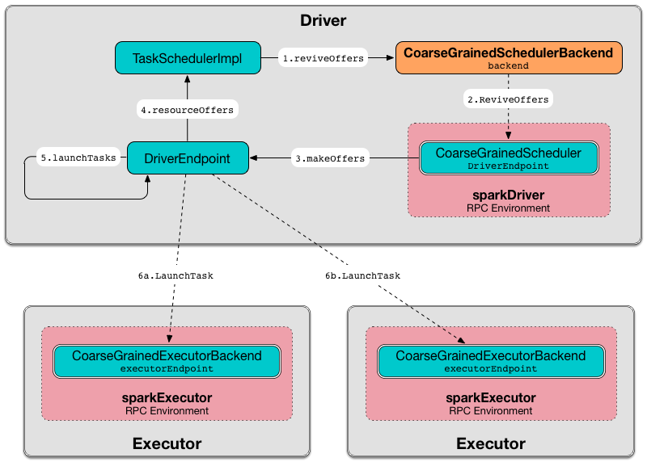

== [[CoarseGrainedSchedulerBackend]] CoarseGrainedSchedulerBackend

`CoarseGrainedSchedulerBackend` is a link:spark-SchedulerBackend.adoc[SchedulerBackend].

`CoarseGrainedSchedulerBackend` is an link:spark-service-ExecutorAllocationClient.adoc[ExecutorAllocationClient].

`CoarseGrainedSchedulerBackend` is responsible for requesting resources from a cluster manager for executors that it in turn uses to link:spark-CoarseGrainedSchedulerBackend-DriverEndpoint.adoc#launchTasks[launch tasks] (on link:spark-CoarseGrainedExecutorBackend.adoc[coarse-grained executors]).

`CoarseGrainedSchedulerBackend` holds executors for the duration of the Spark job rather than relinquishing executors whenever a task is done and asking the scheduler to launch a new executor for each new task.

CAUTION: FIXME Picture with dependencies

`CoarseGrainedSchedulerBackend` registers <<CoarseGrainedScheduler, CoarseGrainedScheduler RPC Endpoint>> that executors use for RPC communication.

NOTE: *Active executors* are executors that are not <<executorsPendingToRemove, pending to be removed>> or link:spark-CoarseGrainedSchedulerBackend-DriverEndpoint.adoc#executorsPendingLossReason[lost].

[[builtin-implementations]]
.Built-In CoarseGrainedSchedulerBackends per Cluster Environment
[cols="1,2",options="header",width="100%"]
|===
| Cluster Environment
| CoarseGrainedSchedulerBackend

| Spark Standalone
| link:spark-standalone-StandaloneSchedulerBackend.adoc[StandaloneSchedulerBackend]

| Spark on YARN
| link:yarn/spark-yarn-yarnschedulerbackend.adoc[YarnSchedulerBackend]

| Spark on Mesos
| link:spark-mesos/spark-mesos-MesosCoarseGrainedSchedulerBackend.adoc[MesosCoarseGrainedSchedulerBackend]
|===

NOTE: `CoarseGrainedSchedulerBackend` is only created indirectly through <<builtin-implementations, built-in implementations per cluster environment>>.

[[internal-properties]]
.CoarseGrainedSchedulerBackend's Internal Properties
[cols="1,1,2",options="header",width="100%"]
|===
| Name
| Initial Value
| Description

| [[currentExecutorIdCounter]] `currentExecutorIdCounter`
|
| The last (highest) identifier of all <<RegisterExecutor, allocated executors>>.

Used exclusively in link:yarn/spark-yarn-cluster-YarnSchedulerEndpoint.adoc#RetrieveLastAllocatedExecutorId[`YarnSchedulerEndpoint` to respond to `RetrieveLastAllocatedExecutorId` message].

| [[createTime]] `createTime`
| Current time
| The time <<creating-instance, `CoarseGrainedSchedulerBackend` was created>>.

| [[defaultAskTimeout]] `defaultAskTimeout`
| link:spark-rpc.adoc#spark.rpc.askTimeout[spark.rpc.askTimeout] or link:spark-rpc.adoc#spark.network.timeout[spark.network.timeout] or `120s`
| Default timeout for blocking RPC messages (_aka_ ask messages).

| [[driverEndpoint]] `driverEndpoint`
| (uninitialized)
a| link:spark-RpcEndpointRef.adoc[RPC endpoint reference] to `CoarseGrainedScheduler` RPC endpoint (with link:spark-CoarseGrainedSchedulerBackend-DriverEndpoint.adoc[DriverEndpoint] as the message handler).

Initialized when `CoarseGrainedSchedulerBackend` <<start, starts>>.

Used when `CoarseGrainedSchedulerBackend` executes the following (asynchronously, i.e. on a separate thread):

* <<killExecutorsOnHost, killExecutorsOnHost>>
* <<killTask, killTask>>
* <<removeExecutor, removeExecutor>>
* <<reviveOffers, reviveOffers>>
* <<stop, stop>>
* <<stopExecutors, stopExecutors>>

| [[executorDataMap]] `executorDataMap`
| empty
| Registry of `ExecutorData` by executor id.

NOTE: `ExecutorData` holds an executor's endpoint reference, address, host, the number of free and total CPU cores, the URL of execution logs.

Element added when link:spark-CoarseGrainedSchedulerBackend-DriverEndpoint.adoc#RegisterExecutor[`DriverEndpoint` receives `RegisterExecutor` message] and removed when link:spark-CoarseGrainedSchedulerBackend-DriverEndpoint.adoc#RemoveExecutor[`DriverEndpoint` receives `RemoveExecutor` message] or link:spark-CoarseGrainedSchedulerBackend-DriverEndpoint.adoc#onDisconnected[a remote host (with one or many executors) disconnects].

| [[executorsPendingToRemove]] `executorsPendingToRemove`
| empty
| Executors marked as removed but the confirmation from a cluster manager has not arrived yet.

| [[hostToLocalTaskCount]] `hostToLocalTaskCount`
| empty
| Registry of hostnames and possible number of task running on them.

| [[localityAwareTasks]] `localityAwareTasks`
| `0`
| Number of pending tasks...FIXME

| [[maxRegisteredWaitingTimeMs]] `maxRegisteredWaitingTimeMs`
| <<spark.scheduler.maxRegisteredResourcesWaitingTime, spark.scheduler.maxRegisteredResourcesWaitingTime>>
|

| [[maxRpcMessageSize]] `maxRpcMessageSize`
| <<spark.rpc.message.maxSize, spark.rpc.message.maxSize>> but not greater than `2047`
a| Maximum RPC message size in MB.

When above `2047` MB you should see the following `IllegalArgumentException`:

```
spark.rpc.message.maxSize should not be greater than 2047 MB
```

| [[_minRegisteredRatio]] `_minRegisteredRatio`
| <<spark.scheduler.minRegisteredResourcesRatio, spark.scheduler.minRegisteredResourcesRatio>>
|

| [[numPendingExecutors]] `numPendingExecutors`
| `0`
|

| [[totalCoreCount]] `totalCoreCount`
| `0`
| Total number of CPU cores, i.e. the sum of all the cores on all executors.

| [[totalRegisteredExecutors]] `totalRegisteredExecutors`
| `0`
| Total number of registered executors
|===

[TIP]
====
Enable `INFO` or `DEBUG` logging level for `org.apache.spark.scheduler.cluster.CoarseGrainedSchedulerBackend` logger to see what happens inside.

Add the following line to `conf/log4j.properties`:

```
log4j.logger.org.apache.spark.scheduler.cluster.CoarseGrainedSchedulerBackend=DEBUG
```

Refer to link:spark-logging.adoc[Logging].
====

=== [[killExecutorsOnHost]] Killing All Executors on Node -- `killExecutorsOnHost` Method

CAUTION: FIXME

=== [[makeOffers]] Making Fake Resource Offers on Executors -- `makeOffers` Internal Methods

[source, scala]
----
makeOffers(): Unit
makeOffers(executorId: String): Unit
----

`makeOffers` takes the active executors (out of the <<executorDataMap, executorDataMap>> internal registry) and creates `WorkerOffer` resource offers for each (one per executor with the executor's id, host and free cores).

CAUTION: Only free cores are considered in making offers. Memory is not! Why?!

It then requests link:spark-TaskSchedulerImpl.adoc#resourceOffers[`TaskSchedulerImpl` to process the resource offers] to create a collection of link:spark-TaskDescription.adoc[TaskDescription] collections that it in turn uses to link:spark-CoarseGrainedSchedulerBackend-DriverEndpoint.adoc#launchTasks[launch tasks].

=== [[creating-instance]] Creating CoarseGrainedSchedulerBackend Instance

`CoarseGrainedSchedulerBackend` takes the following when created:

. [[scheduler]] link:spark-TaskSchedulerImpl.adoc[TaskSchedulerImpl]
. [[rpcEnv]] link:spark-rpc.adoc[RpcEnv]

`CoarseGrainedSchedulerBackend` initializes the <<internal-registries, internal registries and counters>>.

=== [[getExecutorIds]] Getting Executor Ids -- `getExecutorIds` Method

When called, `getExecutorIds` simply returns executor ids from the internal <<executorDataMap, executorDataMap>> registry.

NOTE: It is called when link:spark-SparkContext.adoc#getExecutorIds[SparkContext calculates executor ids].

=== [[contract]] CoarseGrainedSchedulerBackend Contract

[source, scala]
----
class CoarseGrainedSchedulerBackend {
  def minRegisteredRatio: Double
  def createDriverEndpoint(properties: Seq[(String, String)]): DriverEndpoint
  def reset(): Unit
  def sufficientResourcesRegistered(): Boolean
  def doRequestTotalExecutors(requestedTotal: Int): Future[Boolean]
  def doKillExecutors(executorIds: Seq[String]): Future[Boolean]
}
----

NOTE: `CoarseGrainedSchedulerBackend` is a `private[spark]` contract.

.FIXME Contract
[cols="1,2",options="header",width="100%"]
|===
| Method
| Description

| [[minRegisteredRatio]] `minRegisteredRatio`
| Ratio between `0` and `1` (inclusive).

Controlled by <<spark.scheduler.minRegisteredResourcesRatio, spark.scheduler.minRegisteredResourcesRatio>>.

| <<reset, reset>>
| FIXME

| [[doRequestTotalExecutors]] `doRequestTotalExecutors`
| FIXME

| [[doKillExecutors]] `doKillExecutors`
| FIXME

| [[sufficientResourcesRegistered]] `sufficientResourcesRegistered`
| Always positive, i.e. `true`, that means that sufficient resources are available.

Used when `CoarseGrainedSchedulerBackend` <<isReady, checks if sufficient compute resources are available>>.
|===

* It can <<reset, reset a current internal state to the initial state>>.

=== [[numExistingExecutors]] `numExistingExecutors` Method

CAUTION: FIXME

=== [[killExecutors]] `killExecutors` Methods

CAUTION: FIXME

=== [[getDriverLogUrls]] `getDriverLogUrls` Method

CAUTION: FIXME

=== [[applicationAttemptId]] `applicationAttemptId` Method

CAUTION: FIXME

=== [[requestExecutors]] Requesting Additional Executors -- `requestExecutors` Method

[source, scala]
----
requestExecutors(numAdditionalExecutors: Int): Boolean
----

`requestExecutors` is a "decorator" method that ultimately calls a cluster-specific <<doRequestTotalExecutors, doRequestTotalExecutors>> method and returns whether the request was acknowledged or not (it is assumed `false` by default).

NOTE: `requestExecutors` method is part of link:spark-service-ExecutorAllocationClient.adoc[ExecutorAllocationClient Contract] that link:spark-SparkContext.adoc#requestExecutors[SparkContext uses for requesting additional executors] (as a part of a developer API for dynamic allocation of executors).

When called, you should see the following INFO message followed by DEBUG message in the logs:

```
INFO Requesting [numAdditionalExecutors] additional executor(s) from the cluster manager
DEBUG Number of pending executors is now [numPendingExecutors]
```

<<numPendingExecutors, numPendingExecutors>> is increased by the input `numAdditionalExecutors`.

`requestExecutors` <<doRequestTotalExecutors, requests executors from a cluster manager>> (that reflects the current computation needs). The "new executor total" is a sum of the internal <<numExistingExecutors, numExistingExecutors>> and <<numPendingExecutors, numPendingExecutors>> decreased by the <<executorsPendingToRemove, number of executors pending to be removed>>.

If `numAdditionalExecutors` is negative, a `IllegalArgumentException` is thrown:

```
Attempted to request a negative number of additional executor(s) [numAdditionalExecutors] from the cluster manager. Please specify a positive number!
```

NOTE: It is a final method that no other scheduler backends could customize further.

NOTE: The method is a synchronized block that makes multiple concurrent requests be handled in a serial fashion, i.e. one by one.

=== [[requestTotalExecutors]] Requesting Exact Number of Executors -- `requestTotalExecutors` Method

[source, scala]
----
requestTotalExecutors(
  numExecutors: Int,
  localityAwareTasks: Int,
  hostToLocalTaskCount: Map[String, Int]): Boolean
----

`requestTotalExecutors` is a "decorator" method that ultimately calls a cluster-specific <<doRequestTotalExecutors, doRequestTotalExecutors>> method and returns whether the request was acknowledged or not (it is assumed `false` by default).

NOTE: `requestTotalExecutors` is part of link:spark-service-ExecutorAllocationClient.adoc[ExecutorAllocationClient Contract] that link:spark-SparkContext.adoc#requestTotalExecutors[SparkContext uses for requesting the exact number of executors].

It sets the internal <<localityAwareTasks, localityAwareTasks>> and <<hostToLocalTaskCount, hostToLocalTaskCount>> registries. It then calculates the exact number of executors which is the input `numExecutors` and the <<executorsPendingToRemove, executors pending removal>> decreased by the number of <<numExistingExecutors, already-assigned executors>>.

If `numExecutors` is negative, a `IllegalArgumentException` is thrown:

```
Attempted to request a negative number of executor(s) [numExecutors] from the cluster manager. Please specify a positive number!
```

NOTE: It is a final method that no other scheduler backends could customize further.

NOTE: The method is a synchronized block that makes multiple concurrent requests be handled in a serial fashion, i.e. one by one.

=== [[defaultParallelism]] Finding Default Level of Parallelism -- `defaultParallelism` Method

[source, scala]
----
defaultParallelism(): Int
----

NOTE: `defaultParallelism` is part of the link:spark-SchedulerBackend.adoc#contract[SchedulerBackend Contract].

`defaultParallelism` is link:spark-rdd-partitions.adoc#spark.default.parallelism[spark.default.parallelism] Spark property if set.

Otherwise, `defaultParallelism` is the maximum of <<totalCoreCount, totalCoreCount>> or `2`.

=== [[killTask]] Killing Task -- `killTask` Method

[source, scala]
----
killTask(taskId: Long, executorId: String, interruptThread: Boolean): Unit
----

NOTE: `killTask` is part of the link:spark-SchedulerBackend.adoc#killTask[SchedulerBackend contract].

`killTask` simply sends a link:spark-CoarseGrainedSchedulerBackend-DriverEndpoint.adoc#KillTask[KillTask] message to <<driverEndpoint, driverEndpoint>>.

CAUTION: FIXME Image

=== [[stopExecutors]] Stopping All Executors -- `stopExecutors` Method

`stopExecutors` sends a blocking <<StopExecutors, StopExecutors>> message to <<driverEndpoint, driverEndpoint>> (if already initialized).

NOTE: It is called exclusively while `CoarseGrainedSchedulerBackend` is <<stop, being stopped>>.

You should see the following INFO message in the logs:

```
INFO CoarseGrainedSchedulerBackend: Shutting down all executors
```

=== [[reset]] Reset State -- `reset` Method

`reset` resets the internal state:

1. Sets <<numPendingExecutors, numPendingExecutors>> to 0
2. Clears `executorsPendingToRemove`
3. Sends a blocking <<RemoveExecutor, RemoveExecutor>> message to <<driverEndpoint, driverEndpoint>> for every executor (in the internal `executorDataMap`) to inform it about `SlaveLost` with the message:
+
```
Stale executor after cluster manager re-registered.
```

`reset` is a method that is defined in `CoarseGrainedSchedulerBackend`, but used and overriden exclusively by link:yarn/spark-yarn-yarnschedulerbackend.adoc[YarnSchedulerBackend].

=== [[removeExecutor]] Remove Executor -- `removeExecutor` Method

[source, scala]
----
removeExecutor(executorId: String, reason: ExecutorLossReason)
----

`removeExecutor` sends a blocking <<RemoveExecutor, RemoveExecutor>> message to <<driverEndpoint, driverEndpoint>>.

NOTE: It is called by subclasses link:spark-standalone.adoc#SparkDeploySchedulerBackend[SparkDeploySchedulerBackend], link:spark-mesos/spark-mesos.adoc#CoarseMesosSchedulerBackend[CoarseMesosSchedulerBackend], and link:yarn/spark-yarn-yarnschedulerbackend.adoc[YarnSchedulerBackend].

=== [[CoarseGrainedScheduler]] CoarseGrainedScheduler RPC Endpoint -- `driverEndpoint`

When <<start, CoarseGrainedSchedulerBackend starts>>, it registers *CoarseGrainedScheduler* RPC endpoint to be the driver's communication endpoint.

`driverEndpoint` is a link:spark-CoarseGrainedSchedulerBackend-DriverEndpoint.adoc[DriverEndpoint].

NOTE: `CoarseGrainedSchedulerBackend` is created while link:spark-sparkcontext-creating-instance-internals.adoc#createTaskScheduler[SparkContext is being created] that in turn lives inside a link:spark-driver.adoc[Spark driver]. That explains the name `driverEndpoint` (at least partially).

It is called *standalone scheduler's driver endpoint* internally.

It tracks:

It uses `driver-revive-thread` daemon single-thread thread pool for ...FIXME

CAUTION: FIXME A potential issue with `driverEndpoint.asInstanceOf[NettyRpcEndpointRef].toURI` - doubles `spark://` prefix.

=== [[start]] Starting CoarseGrainedSchedulerBackend (and Registering CoarseGrainedScheduler RPC Endpoint) -- `start` Method

[source, scala]
----
start(): Unit
----

NOTE: `start` is part of the link:spark-SchedulerBackend.adoc#contract[SchedulerBackend contract].

`start` takes all ``spark.``-prefixed properties and registers the <<driverEndpoint, `CoarseGrainedScheduler` RPC endpoint>> (backed by link:spark-CoarseGrainedSchedulerBackend-DriverEndpoint.adoc[DriverEndpoint ThreadSafeRpcEndpoint]).

.CoarseGrainedScheduler Endpoint
image::images/CoarseGrainedScheduler-rpc-endpoint.png[align="center"]

NOTE: `start` uses <<scheduler, TaskSchedulerImpl>> to access the current link:spark-SparkContext.adoc[SparkContext] and in turn link:spark-SparkConf.adoc[SparkConf].

NOTE: `start` uses <<rpcEnv, RpcEnv>> that was given when <<creating-instance, `CoarseGrainedSchedulerBackend` was created>>.

=== [[isReady]] Checking If Sufficient Compute Resources Available Or Waiting Time Passed -- `isReady` Method

[source, scala]
----
isReady(): Boolean
----

NOTE: `isReady` is part of the link:spark-SchedulerBackend.adoc#contract[SchedulerBackend contract].

`isReady` allows to delay task launching until <<sufficientResourcesRegistered, sufficient resources are available>> or <<spark.scheduler.maxRegisteredResourcesWaitingTime, spark.scheduler.maxRegisteredResourcesWaitingTime>> passes.

Internally, `isReady` <<sufficientResourcesRegistered, checks whether there are sufficient resources available>>.

NOTE: <<sufficientResourcesRegistered, sufficientResourcesRegistered>> by default responds that sufficient resources are available.

If the <<sufficientResourcesRegistered, resources are available>>, you should see the following INFO message in the logs and `isReady` is positive.

[options="wrap"]
----
INFO SchedulerBackend is ready for scheduling beginning after reached minRegisteredResourcesRatio: [minRegisteredRatio]
----

NOTE: <<minRegisteredRatio, minRegisteredRatio>> is in the range 0 to 1 (uses <<settings, spark.scheduler.minRegisteredResourcesRatio>>) to denote the minimum ratio of registered resources to total expected resources before submitting tasks.

If there are no sufficient resources available yet (the above requirement does not hold), `isReady` checks whether the time since <<createTime, startup>> passed <<spark.scheduler.maxRegisteredResourcesWaitingTime, spark.scheduler.maxRegisteredResourcesWaitingTime>> to give a way to launch tasks (even when <<minRegisteredRatio, minRegisteredRatio>> not being reached yet).

You should see the following INFO message in the logs and `isReady` is positive.

[options="wrap"]
----
INFO SchedulerBackend is ready for scheduling beginning after waiting maxRegisteredResourcesWaitingTime: [maxRegisteredWaitingTimeMs](ms)
----

Otherwise, when <<sufficientResourcesRegistered, no sufficient resources are available>> and <<spark.scheduler.maxRegisteredResourcesWaitingTime, spark.scheduler.maxRegisteredResourcesWaitingTime>> has not elapsed, `isReady` is negative.

=== [[reviveOffers]] Reviving Resource Offers (by Posting ReviveOffers to CoarseGrainedSchedulerBackend RPC Endpoint) -- `reviveOffers` Method

[source, scala]
----
reviveOffers(): Unit
----

NOTE: `reviveOffers` is part of the link:spark-SchedulerBackend.adoc#reviveOffers[SchedulerBackend contract].

`reviveOffers` simply sends a link:spark-CoarseGrainedSchedulerBackend-DriverEndpoint.adoc#ReviveOffers[ReviveOffers] message to <<driverEndpoint, `CoarseGrainedSchedulerBackend` RPC endpoint>>.

.CoarseGrainedExecutorBackend Revives Offers


=== [[stop]] Stopping CoarseGrainedSchedulerBackend (and Stopping Executors) -- `stop` Method

[source, scala]
----
stop(): Unit
----

NOTE: `stop` is part of the link:spark-SchedulerBackend.adoc#contract[SchedulerBackend contract].

`stop` <<stopExecutors, stops all executors>> and <<driverEndpoint, `CoarseGrainedScheduler` RPC endpoint>> (by sending a blocking link:spark-CoarseGrainedSchedulerBackend-DriverEndpoint.adoc#StopDriver[StopDriver] message).

In case of any `Exception`, `stop` reports a `SparkException` with the message:

```
Error stopping standalone scheduler's driver endpoint
```

=== [[createDriverEndpointRef]] `createDriverEndpointRef` Method

[source, scala]
----
createDriverEndpointRef(properties: ArrayBuffer[(String, String)]): RpcEndpointRef
----

`createDriverEndpointRef` <<createDriverEndpoint, creates `DriverEndpoint`>> and link:spark-rpc.adoc#setupEndpoint[registers it] as *CoarseGrainedScheduler*.

NOTE: `createDriverEndpointRef` is used when `CoarseGrainedSchedulerBackend` <<start, starts>>.

=== [[createDriverEndpoint]] Creating DriverEndpoint -- `createDriverEndpoint` Method

[source, scala]
----
createDriverEndpoint(properties: Seq[(String, String)]): DriverEndpoint
----

`createDriverEndpoint` simply creates a link:spark-CoarseGrainedSchedulerBackend-DriverEndpoint.adoc#creating-instance[DriverEndpoint].

NOTE: link:spark-CoarseGrainedSchedulerBackend-DriverEndpoint.adoc[DriverEndpoint] is the <<driverEndpoint, RPC endpoint of `CoarseGrainedSchedulerBackend`>>.

NOTE: The purpose of `createDriverEndpoint` is to allow YARN to use the custom `YarnDriverEndpoint`.

NOTE: `createDriverEndpoint` is used when `CoarseGrainedSchedulerBackend` <<createDriverEndpointRef, createDriverEndpointRef>>.

=== [[settings]] Settings

.Spark Properties
[cols="1,1,2",options="header",width="100%"]
|===
| Property
| Default Value
| Description

| [[spark.scheduler.revive.interval]] `spark.scheduler.revive.interval`
| `1s`
| Time (in milliseconds) between resource offers revives.

| [[spark.rpc.message.maxSize]] `spark.rpc.message.maxSize`
| `128`
| Maximum message size to allow in RPC communication. In `MB` when the unit is not given.

Generally only applies to map output size (serialized) information sent between executors and the driver.

Increase this if you are running jobs with many thousands of map and reduce tasks and see messages about the RPC message size.

| [[spark.scheduler.minRegisteredResourcesRatio]] `spark.scheduler.minRegisteredResourcesRatio`
| `0`
| Double number between 0 and 1 (including) that controls the minimum ratio of (registered resources / total expected resources) before submitting tasks.

See <<isReady, isReady>> in this document.

| [[spark.scheduler.maxRegisteredResourcesWaitingTime]] `spark.scheduler.maxRegisteredResourcesWaitingTime` | `30s` | Time to wait for sufficient resources available.

See <<isReady, isReady>> in this document.
|===
