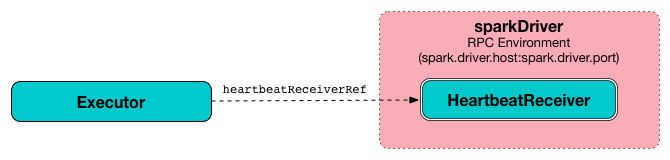

== [[Executor]] Executor

`Executor` is a distributed agent that is responsible for executing link:spark-taskscheduler-tasks.adoc[tasks].

`Executor` is created when:

* `CoarseGrainedExecutorBackend` link:spark-CoarseGrainedExecutorBackend.adoc#RegisteredExecutor[receives `RegisteredExecutor` message] (for Spark Standalone and YARN)

* Spark on Mesos's `MesosExecutorBackend` link:spark-mesos/spark-executor-backends-MesosExecutorBackend.adoc#registered[does `registered`]

* `LocalEndpoint` link:spark-LocalEndpoint.adoc#creating-instance[is created] (for local mode)

`Executor` _typically_ runs for the entire lifetime of a Spark application which is called *static allocation of executors* (but you could also opt in for link:spark-dynamic-allocation.adoc[dynamic allocation]).

NOTE: Executors are managed exclusively by link:spark-ExecutorBackend.adoc[executor backends].

Executors <<startDriverHeartbeater, reports heartbeat and partial metrics for active tasks>> to <<heartbeatReceiverRef, `HeartbeatReceiver` RPC Endpoint>> on the driver.

.HeartbeatReceiver's Heartbeat Message Handler
image::images/spark-HeartbeatReceiver-Heartbeat.png[align="center"]

Executors provide in-memory storage for RDDs that are cached in Spark applications (via link:spark-blockmanager.adoc[Block Manager]).

When an executor starts it first registers with the driver and communicates directly to execute tasks.

.Launching tasks on executor using TaskRunners
image::images/executor-taskrunner-executorbackend.png[align="center"]

*Executor offers* are described by executor id and the host on which an executor runs (see <<resource-offers, Resource Offers>> in this document).

Executors can run multiple tasks over its lifetime, both in parallel and sequentially. They track link:spark-executor-TaskRunner.adoc[running tasks] (by their task ids in <<runningTasks, runningTasks>> internal registry). Consult <<launchTask, Launching Tasks>> section.

Executors use a <<threadPool, Executor task launch worker thread pool>> for <<launchTask, launching tasks>>.

Executors send <<metrics, metrics>> (and heartbeats) using the <<heartbeater, internal heartbeater - Heartbeat Sender Thread>>.

It is recommended to have as many executors as data nodes and as many cores as you can get from the cluster.

Executors are described by their *id*, *hostname*, *environment* (as `SparkEnv`), and *classpath* (and, less importantly, and more for internal optimization, whether they run in link:spark-local.adoc[local] or link:spark-cluster.adoc[cluster mode]).

CAUTION: FIXME How many cores are assigned per executor?

[[internal-properties]]
.Executor's Internal Properties
[cols="1,1,2",options="header",width="100%"]
|===
| Name
| Initial Value
| Description

| [[executorSource]] executorSource
| link:spark-executor-ExecutorSource.adoc[ExecutorSource]
| FIXME
|===

.Executor's Internal Registries and Counters
[cols="1,2",options="header",width="100%"]
|===
| Name
| Description

| [[heartbeatFailures]] `heartbeatFailures`
|

| [[heartbeatReceiverRef]] `heartbeatReceiverRef`
| link:spark-RpcEndpointRef.adoc[RPC endpoint reference] to link:spark-HeartbeatReceiver.adoc[HeartbeatReceiver] on the driver (available on link:spark-driver.adoc#spark.driver.host[spark.driver.host] at link:spark-driver.adoc#spark.driver.port[spark.driver.port] port).

Set when `Executor` <<creating-instance, is created>>.

Used exclusively when `Executor` <<reportHeartBeat, reports heartbeats and partial metrics for active tasks to the driver>> (that happens every <<spark.executor.heartbeatInterval, spark.executor.heartbeatInterval>> interval).

| [[maxDirectResultSize]] `maxDirectResultSize`
|

| [[maxResultSize]] `maxResultSize`
|

| [[runningTasks]] `runningTasks`
| Lookup table of link:spark-executor-TaskRunner.adoc[TaskRunners] per...FIXME
|===

[TIP]
====
Enable `INFO` or `DEBUG` logging level for `org.apache.spark.executor.Executor` logger to see what happens inside.

Add the following line to `conf/log4j.properties`:

```
log4j.logger.org.apache.spark.executor.Executor=DEBUG
```

Refer to link:spark-logging.adoc[Logging].
====

=== [[updateDependencies]] `updateDependencies` Internal Method

[source, scala]
----
updateDependencies(newFiles: Map[String, Long], newJars: Map[String, Long]): Unit
----

`updateDependencies`...FIXME

NOTE: `updateDependencies` is used exclusively when `TaskRunner` is link:spark-executor-TaskRunner.adoc#run[started] to run a task.

=== [[createClassLoader]] `createClassLoader` Method

CAUTION: FIXME

=== [[addReplClassLoaderIfNeeded]] `addReplClassLoaderIfNeeded` Method

CAUTION: FIXME

=== [[creating-instance]] Creating Executor Instance

`Executor` takes the following when created:

* [[executorId]] Executor ID
* [[executorHostname]] Executor's host name
* [[env]] link:spark-sparkenv.adoc[SparkEnv]
* [[userClassPath]] Collection of user-defined JARs (<<createClassLoader, to add to tasks' class path>>). Empty by default
* [[isLocal]] Flag whether it runs in local or cluster mode (disabled by default, i.e. cluster is preferred)

NOTE: User-defined JARs are defined using link:spark-CoarseGrainedExecutorBackend.adoc#main[`--user-class-path` command-line option of `CoarseGrainedExecutorBackend`] that can be set using <<spark.executor.extraClassPath, spark.executor.extraClassPath>> property.

NOTE: `isLocal` is enabled exclusively for link:spark-LocalEndpoint.adoc[LocalEndpoint] (for link:spark-local.adoc[Spark in local mode]).

When created, you should see the following INFO messages in the logs:

```
INFO Executor: Starting executor ID [executorId] on host [executorHostname]
```

(only for <<isLocal, non-local mode>>) `Executor` sets `SparkUncaughtExceptionHandler` as the default handler invoked when a thread abruptly terminates due to an uncaught exception.

(only for <<isLocal, non-local mode>>) `Executor` link:spark-MetricsSystem.adoc#registerSource[registers `ExecutorSource`] and link:spark-blockmanager.adoc#initialize[initializes the local `BlockManager`].

NOTE: `Executor` uses `SparkEnv` to access the local link:spark-sparkenv.adoc#metricsSystem[MetricsSystem] and link:spark-sparkenv.adoc#blockManager[BlockManager].

`Executor` <<createClassLoader, creates a task class loader>> (optionally with <<addReplClassLoaderIfNeeded, REPL support>>) that the link:spark-Serializer.adoc#setDefaultClassLoader[current `Serializer` is requested to use] (when deserializing task later).

NOTE: `Executor` uses `SparkEnv` link:spark-sparkenv.adoc#serializer[to access the local `Serializer`].

`Executor` <<startDriverHeartbeater, starts sending heartbeats and active tasks metrics>>.

`Executor` initializes the <<internal-registries, internal registries and counters>> in the meantime (not necessarily at the very end).

=== [[launchTask]] Launching Task -- `launchTask` Method

[source, scala]
----
launchTask(
  context: ExecutorBackend,
  taskId: Long,
  attemptNumber: Int,
  taskName: String,
  serializedTask: ByteBuffer): Unit
----

`launchTask` executes the input `serializedTask` task concurrently.

Internally, `launchTask` creates a link:spark-executor-TaskRunner.adoc[TaskRunner], registers it in <<runningTasks, `runningTasks` internal registry>> (by `taskId`), and finally executes it on <<threadPool, "Executor task launch worker" thread pool>>.

.Launching tasks on executor using TaskRunners
image::images/executor-taskrunner-executorbackend.png[align="center"]

NOTE: `launchTask` is called by link:spark-CoarseGrainedExecutorBackend.adoc[CoarseGrainedExecutorBackend] (when it handles link:spark-CoarseGrainedExecutorBackend.adoc#LaunchTask[LaunchTask] message), link:spark-mesos/spark-executor-backends-MesosExecutorBackend.adoc[MesosExecutorBackend], and link:spark-LocalEndpoint.adoc[LocalEndpoint].

=== [[startDriverHeartbeater]][[heartbeats-and-active-task-metrics]] Sending Heartbeats and Active Tasks Metrics -- `startDriverHeartbeater` Method

Executors keep sending <<metrics, metrics for active tasks>> to the driver every <<spark.executor.heartbeatInterval, spark.executor.heartbeatInterval>> (defaults to `10s` with some random initial delay so the heartbeats from different executors do not pile up on the driver).

.Executors use HeartbeatReceiver endpoint to report task metrics


An executor sends heartbeats using the <<heartbeater, internal heartbeater -- Heartbeat Sender Thread>>.

.HeartbeatReceiver's Heartbeat Message Handler
image::images/spark-HeartbeatReceiver-Heartbeat.png[align="center"]

For each link:spark-taskscheduler-tasks.adoc[task] in link:spark-executor-TaskRunner.adoc[TaskRunner] (in <<runningTasks, runningTasks>> internal registry), the task's metrics are computed (i.e. `mergeShuffleReadMetrics` and `setJvmGCTime`) that become part of the heartbeat (with accumulators).

CAUTION: FIXME How do `mergeShuffleReadMetrics` and `setJvmGCTime` influence `accumulators`?

NOTE: Executors track the link:spark-executor-TaskRunner.adoc[TaskRunner] that run link:spark-taskscheduler-tasks.adoc[tasks]. A link:spark-executor-TaskRunner.adoc#run[task might not be assigned to a TaskRunner yet] when the executor sends a heartbeat.

A blocking link:spark-HeartbeatReceiver.adoc#Heartbeat[Heartbeat] message that holds the executor id, all accumulator updates (per task id), and link:spark-blockmanager.adoc#BlockManagerId[BlockManagerId] is sent to link:spark-HeartbeatReceiver.adoc[HeartbeatReceiver RPC endpoint] (with <<spark.executor.heartbeatInterval, spark.executor.heartbeatInterval>> timeout).

CAUTION: FIXME When is `heartbeatReceiverRef` created?

If the response link:spark-HeartbeatReceiver.adoc#Heartbeat[requests to reregister BlockManager], you should see the following INFO message in the logs:

```
INFO Executor: Told to re-register on heartbeat
```

The link:spark-blockmanager.adoc#reregister[BlockManager is reregistered].

The internal <<heartbeatFailures, heartbeatFailures>> counter is reset (i.e. becomes `0`).

If there are any issues with communicating with the driver, you should see the following WARN message in the logs:

```
WARN Executor: Issue communicating with driver in heartbeater
```

The internal <<heartbeatFailures, heartbeatFailures>> is incremented and checked to be less than the <<spark.executor.heartbeat.maxFailures, acceptable number of failures>> (i.e. `spark.executor.heartbeat.maxFailures` Spark property). If the number is greater, the following ERROR is printed out to the logs:

```
ERROR Executor: Exit as unable to send heartbeats to driver more than [HEARTBEAT_MAX_FAILURES] times
```

The executor exits (using `System.exit` and exit code 56).

TIP: Read about `TaskMetrics` in link:spark-taskscheduler-taskmetrics.adoc[TaskMetrics].

=== [[reportHeartBeat]] Reporting Heartbeat and Partial Metrics for Active Tasks to Driver -- `reportHeartBeat` Internal Method

[source, scala]
----
reportHeartBeat(): Unit
----

`reportHeartBeat` collects link:spark-executor-TaskRunner.adoc[TaskRunners] for <<runningTasks, currently running tasks>> (aka _active tasks_) with their link:spark-executor-TaskRunner.adoc#task[tasks] deserialized (i.e. either ready for execution or already started).

NOTE: link:spark-executor-TaskRunner.adoc[TaskRunner] has link:spark-executor-TaskRunner.adoc#task[task] deserialized when it link:spark-executor-TaskRunner.adoc#run[runs the task].

For every running task, `reportHeartBeat` takes its link:spark-taskscheduler-tasks.adoc#metrics[TaskMetrics] and:

* Requests link:spark-taskscheduler-taskmetrics.adoc#mergeShuffleReadMetrics[ShuffleRead metrics to be merged]
* link:spark-taskscheduler-taskmetrics.adoc#setJvmGCTime[Sets jvmGCTime metrics]

`reportHeartBeat` then records the latest values of link:spark-taskscheduler-taskmetrics.adoc#accumulators[internal and external accumulators] for every task.

NOTE: Internal accumulators are a task's metrics while external accumulators are a Spark application's accumulators that a user has created.

`reportHeartBeat` sends a blocking link:spark-HeartbeatReceiver.adoc#Heartbeat[Heartbeat] message to <<heartbeatReceiverRef, `HeartbeatReceiver` endpoint>> (running on the driver). `reportHeartBeat` uses <<spark.executor.heartbeatInterval, spark.executor.heartbeatInterval>> for the RPC timeout.

NOTE: A `Heartbeat` message contains the executor identifier, the accumulator updates, and the identifier of the link:spark-blockmanager.adoc[BlockManager].

NOTE: `reportHeartBeat` uses `SparkEnv` link:spark-sparkenv.adoc#blockManager[to access the current `BlockManager`].

If the response (from <<heartbeatReceiverRef, `HeartbeatReceiver` endpoint>>) is to re-register the `BlockManager`, you should see the following INFO message in the logs and `reportHeartBeat` link:spark-blockmanager.adoc#reregister[requests `BlockManager` to re-register] (which will register the blocks the `BlockManager` manages with the driver).

```
INFO Told to re-register on heartbeat
```

NOTE: `HeartbeatResponse` requests `BlockManager` to re-register when either link:spark-TaskScheduler.adoc#executorHeartbeatReceived[TaskScheduler] or link:spark-HeartbeatReceiver.adoc#Heartbeat[HeartbeatReceiver] know nothing about the executor.

When posting the `Heartbeat` was successful, `reportHeartBeat` resets <<heartbeatFailures, heartbeatFailures>> internal counter.

In case of a non-fatal exception, you should see the following WARN message in the logs (followed by the stack trace).

```
WARN Issue communicating with driver in heartbeater
```

Every failure `reportHeartBeat` increments <<heartbeatFailures, heartbeat failures>> up to <<spark.executor.heartbeat.maxFailures, spark.executor.heartbeat.maxFailures>> Spark property. When the heartbeat failures reaches the maximum, you should see the following ERROR message in the logs and the executor terminates with the error code: `56`.

```
ERROR Exit as unable to send heartbeats to driver more than [HEARTBEAT_MAX_FAILURES] times
```

NOTE: `reportHeartBeat` is used when `Executor` <<startDriverHeartbeater, schedules reporting heartbeat and partial metrics for active tasks to the driver>> (that happens every <<spark.executor.heartbeatInterval, spark.executor.heartbeatInterval>> Spark property).

=== [[heartbeater]] heartbeater -- Heartbeat Sender Thread

`heartbeater` is a daemon https://docs.oracle.com/javase/8/docs/api/java/util/concurrent/ScheduledThreadPoolExecutor.html[ScheduledThreadPoolExecutor] with a single thread.

The name of the thread pool is *driver-heartbeater*.

=== [[coarse-grained-executor]] Coarse-Grained Executors

*Coarse-grained executors* are executors that use link:spark-CoarseGrainedExecutorBackend.adoc[CoarseGrainedExecutorBackend] for task scheduling.

=== [[resource-offers]] Resource Offers

Read link:spark-TaskSchedulerImpl.adoc#resourceOffers[resourceOffers] in TaskSchedulerImpl and link:spark-TaskSetManager.adoc##resourceOffers[resourceOffer] in TaskSetManager.

=== [[threadPool]] "Executor task launch worker" Thread Pool -- `threadPool` Property

`Executor` uses `threadPool` daemon cached thread pool with the name *Executor task launch worker-[ID]* (with `ID` being the task id) for <<launchTask, launching tasks>>.

`threadPool` is created when <<creating-instance, `Executor` is created>> and shut down when <<stop, it stops>>.

=== [[memory]] Executor Memory -- `spark.executor.memory` or `SPARK_EXECUTOR_MEMORY` settings

You can control the amount of memory per executor using <<spark.executor.memory, spark.executor.memory>> setting. It sets the available memory equally for all executors per application.

NOTE: The amount of memory per executor is looked up when link:spark-SparkContext.adoc#creating-instance[SparkContext is created].

You can change the assigned memory per executor per node in link:spark-standalone.adoc[standalone cluster] using link:spark-SparkContext.adoc#environment-variables[SPARK_EXECUTOR_MEMORY] environment variable.

You can find the value displayed as *Memory per Node* in link:spark-standalone-master.adoc[web UI for standalone Master] (as depicted in the figure below).

.Memory per Node in Spark Standalone's web UI
image::images/spark-standalone-webui-memory-per-node.png[align="center"]

The above figure shows the result of running link:spark-shell.adoc[Spark shell] with the amount of memory per executor defined explicitly (on command line), i.e.

```
./bin/spark-shell --master spark://localhost:7077 -c spark.executor.memory=2g
```

=== [[metrics]] Metrics

Every executor registers its own link:spark-executor-ExecutorSource.adoc[ExecutorSource] to link:spark-MetricsSystem.adoc#report[report metrics].

=== [[stop]] Stopping Executor -- `stop` Method

[source, scala]
----
stop(): Unit
----

`stop` link:spark-MetricsSystem.adoc#report[requests `MetricsSystem` for a report].

NOTE: `stop` uses `SparkEnv` link:spark-sparkenv.adoc#metricsSystem[to access the current `MetricsSystem`].

`stop` shuts <<heartbeater, driver-heartbeater thread>> down (and waits at most 10 seconds).

`stop` shuts <<threadPool, Executor task launch worker thread pool>> down.

(only when <<isLocal, not local>>) `stop` link:spark-sparkenv.adoc#stop[requests `SparkEnv` to stop].

NOTE: `stop` is used when link:spark-CoarseGrainedExecutorBackend.adoc#Shutdown[CoarseGrainedExecutorBackend] and link:spark-LocalEndpoint.adoc#StopExecutor[LocalEndpoint] are requested to stop their managed executors.

=== [[settings]] Settings

.Spark Properties
[cols="1,1,2",options="header",width="100%"]
|===
| Spark Property
| Default Value
| Description

| [[spark.executor.cores]] `spark.executor.cores`
|
| Number of cores for an executor.

| [[spark.executor.extraClassPath]] `spark.executor.extraClassPath`
| (empty)
| List of URLs representing user-defined class path entries that are added to an executor's class path.

Each entry is separated by system-dependent path separator, i.e. `:` on Unix/MacOS systems and `;` on Microsoft Windows.

| [[spark.executor.extraJavaOptions]] `spark.executor.extraJavaOptions`
|
| Extra Java options for executors.

Used to link:yarn/spark-yarn-ExecutorRunnable.adoc#prepareCommand[prepare the command to launch `CoarseGrainedExecutorBackend` in a YARN container].

| [[spark.executor.extraLibraryPath]] `spark.executor.extraLibraryPath`
|
| Extra library paths separated by system-dependent path separator, i.e. `:` on Unix/MacOS systems and `;` on Microsoft Windows.

Used to link:yarn/spark-yarn-ExecutorRunnable.adoc#prepareCommand[prepare the command to launch `CoarseGrainedExecutorBackend` in a YARN container].

| [[spark.executor.heartbeat.maxFailures]] `spark.executor.heartbeat.maxFailures`
| `60`
| Number of times an executor will try to send heartbeats to the driver before it gives up and exits (with exit code `56`).

NOTE: It was introduced in https://issues.apache.org/jira/browse/SPARK-13522[SPARK-13522 Executor should kill itself when it's unable to heartbeat to the driver more than N times].

| [[spark.executor.heartbeatInterval]] `spark.executor.heartbeatInterval`
| `10s`
| Interval after which an executor reports heartbeat and metrics for active tasks to the driver.

Refer to <<heartbeats-and-active-task-metrics, Sending heartbeats and partial metrics for active tasks>> in this document.

| [[spark.executor.id]] `spark.executor.id`
|
|

| [[spark.executor.instances]] `spark.executor.instances`
| `0`
| Number of executors to use.

| `spark.executor.logs.rolling.maxSize`
|
|

| `spark.executor.logs.rolling.maxRetainedFiles`
|
|

| `spark.executor.logs.rolling.strategy`
|
|

| `spark.executor.logs.rolling.time.interval`
|
|

| [[spark.executor.memory]] `spark.executor.memory`
| `1g`
| Amount of memory to use per executor process.

Equivalent to link:spark-SparkContext.adoc#environment-variables[SPARK_EXECUTOR_MEMORY] environment variable.

Refer to <<memory, Executor Memory -- spark.executor.memory or SPARK_EXECUTOR_MEMORY settings>> in this document.

| [[spark_executor_port]] `spark.executor.port`
|
|

| `spark.executor.port`
|
|

| [[spark_executor_userClassPathFirst]] `spark.executor.userClassPathFirst`
| `false`
| Flag to control whether to load classes in user jars before those in Spark jars.

| `spark.executor.uri`
|
| Equivalent to `SPARK_EXECUTOR_URI`

| [[spark.task.maxDirectResultSize]] `spark.task.maxDirectResultSize`
| `1048576B`
|
|===
