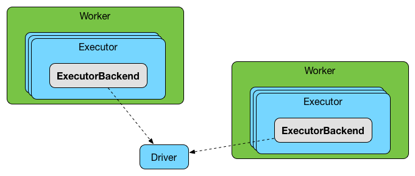

== [[ExecutorBackend]] ExecutorBackend -- Pluggable Executor Backends

`ExecutorBackend` is a <<contract, pluggable interface>> that link:spark-executor-taskrunner.adoc[TaskRunners] use to <<statusUpdate, send task status updates>> to a scheduler.

.ExecutorBackend receives notifications from TaskRunners

NOTE: `TaskRunner` manages a single individual link:spark-taskscheduler-tasks.adoc[task] and is managed by an link:spark-Executor.adoc#launchTask[`Executor` to launch a task].

CAUTION: FIXME What is "a scheduler" in this context?

It is effectively a bridge between the driver and an executor, i.e. there are two endpoints running.

There are three concrete executor backends:

1. link:spark-CoarseGrainedExecutorBackend.adoc[CoarseGrainedExecutorBackend]

2. link:spark-LocalSchedulerBackend.adoc[LocalSchedulerBackend] (for link:spark-local.adoc[local run mode])

3. link:spark-executor-backends-MesosExecutorBackend.adoc[MesosExecutorBackend]

=== [[contract]] ExecutorBackend Contract

[source, scala]
----
trait ExecutorBackend {
  def statusUpdate(taskId: Long, state: TaskState, data: ByteBuffer): Unit
}
----

NOTE: `ExecutorBackend` is a `private[spark]` contract.

.ExecutorBackend Contract
[cols="1,2",options="header",width="100%"]
|===
| Method
| Description

| [[statusUpdate]] `statusUpdate`
| Used when `TaskRunner` is requested to link:spark-executor-TaskRunner.adoc#run[run a task] (to send task status updates).

|===
