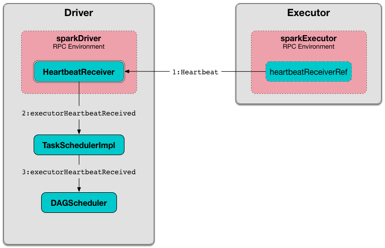

== [[HeartbeatReceiver]] HeartbeatReceiver RPC Endpoint

`HeartbeatReceiver` is a link:spark-rpc.adoc#ThreadSafeRpcEndpoint[ThreadSafeRpcEndpoint] registered on the driver under the name *HeartbeatReceiver*.

`HeartbeatReceiver` receives <<Heartbeat, Heartbeat>> messages from executors that Spark uses as the mechanism to receive accumulator updates (with task metrics and a Spark application's accumulators) and link:spark-TaskScheduler.adoc#executorHeartbeatReceived[pass them along to `TaskScheduler`].

.HeartbeatReceiver RPC Endpoint and Heartbeats from Executors


NOTE: `HeartbeatReceiver` is registered immediately after a Spark application is started, i.e. when `SparkContext` link:spark-sparkcontext-creating-instance-internals.adoc#_heartbeatReceiver[is created].

`HeartbeatReceiver` is a link:spark-SparkListener.adoc[SparkListener] to get notified when <<onExecutorAdded, a new executor is added>> to or <<onExecutorRemoved, no longer available>> in a Spark application. `HeartbeatReceiver` tracks executors (in <<executorLastSeen, executorLastSeen>> registry) to handle <<Heartbeat, Heartbeat>> and <<ExpireDeadHosts, ExpireDeadHosts>> messages from executors that are assigned to the Spark application.

[[messages]]
.HeartbeatReceiver RPC Endpoint's Messages (in alphabetical order)
[width="100%",cols="1,2",options="header"]
|===
| Message
| Description

| <<ExecutorRemoved, ExecutorRemoved>>
| Posted when `HeartbeatReceiver` <<removeExecutor, is notified that an executor is no longer available>> (to a Spark application).

| <<ExecutorRegistered, ExecutorRegistered>>
| Posted when `HeartbeatReceiver` <<addExecutor, is notified that a new executor has been registered>> (with a Spark application).

| <<ExpireDeadHosts, ExpireDeadHosts>>
| FIXME

| <<Heartbeat, Heartbeat>>
| Posted when `Executor` link:spark-Executor.adoc#reportHeartBeat[informs that it is alive and reports task metrics].

| <<TaskSchedulerIsSet, TaskSchedulerIsSet>>
| Posted when `SparkContext` link:spark-sparkcontext-creating-instance-internals.adoc#TaskSchedulerIsSet[informs that `TaskScheduler` is available].
|===

[[internal-registries]]
.HeartbeatReceiver's Internal Registries and Counters
[cols="1,2",options="header",width="100%"]
|===
| Name
| Description

| [[executorLastSeen]] `executorLastSeen`
| Executor ids and the timestamps of when the last heartbeat was received.

| [[scheduler]] `scheduler`
| link:spark-TaskScheduler.adoc[TaskScheduler]
|===

[TIP]
====
Enable `DEBUG` or `TRACE` logging levels for `org.apache.spark.HeartbeatReceiver` to see what happens inside.

Add the following line to `conf/log4j.properties`:

```
log4j.logger.org.apache.spark.HeartbeatReceiver=TRACE
```

Refer to link:spark-logging.adoc[Logging].
====

=== [[creating-instance]] Creating HeartbeatReceiver Instance

`HeartbeatReceiver` takes the following when created:

* [[sc]] link:spark-SparkContext.adoc[SparkContext]
* [[clock]] `Clock`

`HeartbeatReceiver` link:spark-SparkContext.adoc#addSparkListener[registers itself as a `SparkListener`].

`HeartbeatReceiver` initializes the <<internal-registries, internal registries and counters>>.

=== [[onStart]] Starting HeartbeatReceiver RPC Endpoint -- `onStart` Method

NOTE: `onStart` is part of the link:spark-rpc-RpcEndpoint.adoc[RpcEndpoint Contract]

When called, `HeartbeatReceiver` sends a blocking <<ExpireDeadHosts, ExpireDeadHosts>> every <<spark.network.timeoutInterval, spark.network.timeoutInterval>> on <<eventLoopThread, eventLoopThread - Heartbeat Receiver Event Loop Thread>>.

=== [[ExecutorRegistered]] ExecutorRegistered

[source, scala]
----
ExecutorRegistered(executorId: String)
----

When received, `HeartbeatReceiver` registers the `executorId` executor and the current time (in <<executorLastSeen, executorLastSeen>> internal registry).

NOTE: `HeartbeatReceiver` uses the internal <<clock, Clock>> to know the current time.

=== [[ExecutorRemoved]] ExecutorRemoved

[source, scala]
----
ExecutorRemoved(executorId: String)
----

When `ExecutorRemoved` arrives, `HeartbeatReceiver` removes `executorId` from <<executorLastSeen, executorLastSeen>> internal registry.

=== [[ExpireDeadHosts]] ExpireDeadHosts

[source, scala]
----
ExpireDeadHosts
----

When `ExpireDeadHosts` arrives the following TRACE is printed out to the logs:

```
TRACE HeartbeatReceiver: Checking for hosts with no recent heartbeats in HeartbeatReceiver.
```

Each executor (in <<executorLastSeen, executorLastSeen>> registry) is checked whether the time it was last seen is not longer than <<spark.network.timeout, spark.network.timeout>>.

For any such executor, the following WARN message is printed out to the logs:

```
WARN HeartbeatReceiver: Removing executor [executorId] with no recent heartbeats: [time] ms exceeds timeout [timeout] ms
```

link:spark-TaskScheduler.adoc#executorLost[TaskScheduler.executorLost] is called (with `SlaveLost("Executor heartbeat timed out after [timeout] ms"`).

`SparkContext.killAndReplaceExecutor` is asynchronously called for the executor (i.e. on <<killExecutorThread, killExecutorThread>>).

The executor is removed from <<executorLastSeen, executorLastSeen>>.

=== [[Heartbeat]] Heartbeat

[source, scala]
----
Heartbeat(executorId: String,
  accumUpdates: Array[(Long, Seq[AccumulatorV2[_, _]])],
  blockManagerId: BlockManagerId)
----

When received, `HeartbeatReceiver` finds the `executorId` executor (in <<executorLastSeen, executorLastSeen>> registry).

When the executor is found, `HeartbeatReceiver` updates the time the heartbeat was received (in <<executorLastSeen, executorLastSeen>>).

NOTE: `HeartbeatReceiver` uses the internal <<clock, Clock>> to know the current time.

`HeartbeatReceiver` then submits an asynchronous task to notify `TaskScheduler` that the link:spark-TaskScheduler.adoc#executorHeartbeatReceived[heartbeat was received from the executor] (using <<scheduler, TaskScheduler>> internal reference). `HeartbeatReceiver` posts a `HeartbeatResponse` back to the executor (with the response from `TaskScheduler` whether the executor has been registered already or not so it may eventually need to re-register).

If however the executor was not found (in <<executorLastSeen, executorLastSeen>> registry), i.e. the executor was not registered before, you should see the following DEBUG message in the logs and the response is to notify the executor to re-register.

```
DEBUG Received heartbeat from unknown executor [executorId]
```

In a very rare case, when <<scheduler, TaskScheduler>> is not yet assigned to `HeartbeatReceiver`, you should see the following WARN message in the logs and the response is to notify the executor to re-register.

```
WARN Dropping [heartbeat] because TaskScheduler is not ready yet
```

NOTE: <<scheduler, TaskScheduler>> can be unassigned when no <<TaskSchedulerIsSet, TaskSchedulerIsSet>> has not been received yet.

NOTE: `Heartbeats` messages are the mechanism of link:spark-Executor.adoc#heartbeats-and-active-task-metrics[executors to inform the Spark application that they are alive and update about the state of active tasks].

=== [[TaskSchedulerIsSet]] TaskSchedulerIsSet

[source, scala]
----
TaskSchedulerIsSet
----

When received, `HeartbeatReceiver` sets the internal reference to <<scheduler, TaskScheduler>>.

NOTE: `HeartbeatReceiver` uses <<sc, SparkContext>> that is given when `HeartbeatReceiver` <<creating-instance, is created>>.

=== [[onExecutorAdded]] `onExecutorAdded` Method

[source, scala]
----
onExecutorAdded(executorAdded: SparkListenerExecutorAdded): Unit
----

`onExecutorAdded` simply <<addExecutor, sends a `ExecutorRegistered` message to itself>> (that in turn registers an executor).

NOTE: `onExecutorAdded` is part of link:spark-SparkListener.adoc#onExecutorAdded[SparkListener contract] to announce that a new executor was registered with a Spark application.

=== [[addExecutor]] Sending ExecutorRegistered Message to Itself -- `addExecutor` Internal Method

[source, scala]
----
addExecutor(executorId: String): Option[Future[Boolean]]
----

`addExecutor` sends a <<ExecutorRegistered, ExecutorRegistered>> message (to register `executorId` executor).

NOTE: `addExecutor` is used when `HeartbeatReceiver` <<onExecutorAdded, is notified that a new executor was added>>.

=== [[onExecutorRemoved]] `onExecutorRemoved` Method

[source, scala]
----
onExecutorRemoved(executorRemoved: SparkListenerExecutorRemoved): Unit
----

`onExecutorRemoved` simply passes the call to <<removeExecutor, removeExecutor>> (that in turn unregisters an executor).

NOTE: `onExecutorRemoved` is part of link:spark-SparkListener.adoc#onExecutorRemoved[SparkListener contract] to announce that an executor is no longer available for a Spark application.

=== [[removeExecutor]] Sending ExecutorRemoved Message to Itself -- `removeExecutor` Method

[source, scala]
----
removeExecutor(executorId: String): Option[Future[Boolean]]
----

`removeExecutor` sends a <<ExecutorRemoved, ExecutorRemoved>> message to itself (passing in `executorId`).

NOTE: `removeExecutor` is used when `HeartbeatReceiver` <<onExecutorRemoved, is notified that an executor is no longer available>>.

=== [[onStop]] Stopping HeartbeatReceiver RPC Endpoint -- `onStop` Method

NOTE: `onStop` is part of the link:spark-rpc.adoc#RpcEndpoint[RpcEndpoint Contract]

When called, `HeartbeatReceiver` cancels the checking task (that sends a blocking <<ExpireDeadHosts, ExpireDeadHosts>> every <<spark.network.timeoutInterval, spark.network.timeoutInterval>> on <<eventLoopThread, eventLoopThread - Heartbeat Receiver Event Loop Thread>> - see <<onStart, Starting (onStart method)>>) and shuts down <<eventLoopThread, eventLoopThread>> and <<killExecutorThread, killExecutorThread>> executors.

=== [[killExecutorThread]][[kill-executor-thread]] `killExecutorThread` -- Kill Executor Thread

`killExecutorThread` is a daemon https://docs.oracle.com/javase/8/docs/api/java/util/concurrent/ScheduledThreadPoolExecutor.html[ScheduledThreadPoolExecutor] with a single thread.

The name of the thread pool is *kill-executor-thread*.

NOTE: It is used to request SparkContext to kill the executor.

=== [[eventLoopThread]][[heartbeat-receiver-event-loop-thread]] `eventLoopThread` -- Heartbeat Receiver Event Loop Thread

`eventLoopThread` is a daemon https://docs.oracle.com/javase/8/docs/api/java/util/concurrent/ScheduledThreadPoolExecutor.html[ScheduledThreadPoolExecutor] with a single thread.

The name of the thread pool is *heartbeat-receiver-event-loop-thread*.

=== [[expireDeadHosts]] `expireDeadHosts` Internal Method

[source, scala]
----
expireDeadHosts(): Unit
----

CAUTION: FIXME

NOTE: `expireDeadHosts` is used when `HeartbeatReceiver` <<ExpireDeadHosts, receives a `ExpireDeadHosts` message>>.

=== [[settings]] Settings

.Spark Properties
[cols="1,1,2",options="header",width="100%"]
|===
| Spark Property
| Default Value
| Description

| [[spark.storage.blockManagerTimeoutIntervalMs]] `spark.storage.blockManagerTimeoutIntervalMs`
| `60s`
|

| [[spark_storage_blockManagerSlaveTimeoutMs]] `spark.storage.blockManagerSlaveTimeoutMs`
| `120s`
|

| [[spark.network.timeout]] `spark.network.timeout`
| <<spark_storage_blockManagerSlaveTimeoutMs, spark.storage.blockManagerSlaveTimeoutMs>>
| See link:spark-rpc.adoc#spark.network.timeout[spark.network.timeout] in link:spark-rpc.adoc[RPC Environment (RpcEnv)]

| [[spark.network.timeoutInterval]] `spark.network.timeoutInterval`
| <<spark.storage.blockManagerTimeoutIntervalMs, spark.storage.blockManagerTimeoutIntervalMs>>
|
|===
