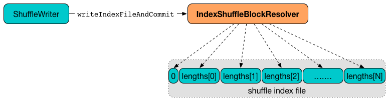

== [[IndexShuffleBlockResolver]] IndexShuffleBlockResolver

`IndexShuffleBlockResolver` is the one and only link:spark-ShuffleBlockResolver.adoc[ShuffleBlockResolver] in Spark.

`IndexShuffleBlockResolver` is used exclusively in link:spark-SortShuffleManager.adoc#shuffleBlockResolver[`SortShuffleManager` as the `shuffleBlockResolver`] (so link:spark-ShuffleManager.adoc#shuffleBlockResolver[`BlockManager` can access shuffle block data]).

`IndexShuffleBlockResolver` is later passed in when link:spark-SortShuffleManager.adoc#getWriter[`SortShuffleManager` creates a `ShuffleWriter` for `ShuffleHandle`].

[[internal-properties]]
.IndexShuffleBlockResolver's Internal Properties
[frame="topbot",cols="1,1,2",options="header",width="100%"]
|===
| Name
| Initial Value
| Description

| `transportConf`
| FIXME
| link:spark-TransportConf.adoc[TransportConf] used when <<getBlockData, `IndexShuffleBlockResolver` creates a `ManagedBuffer` for a `ShuffleBlockId`>>.

|===

=== [[getIndexFile]] `getIndexFile` Method

CAUTION: FIXME

=== [[checkIndexAndDataFile]] `checkIndexAndDataFile` Method

CAUTION: FIXME

=== [[removeDataByMap]] `removeDataByMap` Method

CAUTION: FIXME

=== [[creating-instance]] Creating IndexShuffleBlockResolver Instance

`IndexShuffleBlockResolver` takes the following when created:

1. link:spark-configuration.adoc[SparkConf],
2. link:spark-blockmanager.adoc[BlockManager] (default: unspecified)

`IndexShuffleBlockResolver` initializes the <<internal-properties, internal properties>>.

NOTE: `IndexShuffleBlockResolver` is created exclusively when link:spark-SortShuffleManager.adoc#creating-instance[`SortShuffleManager` is created].

=== [[writeIndexFileAndCommit]] Writing Shuffle Index and Data Files -- `writeIndexFileAndCommit` Method

[source, scala]
----
writeIndexFileAndCommit(
  shuffleId: Int,
  mapId: Int,
  lengths: Array[Long],
  dataTmp: File): Unit
----

Internally, `writeIndexFileAndCommit` first <<getIndexFile, finds the index file>> for the input `shuffleId` and `mapId`.

`writeIndexFileAndCommit` creates a temporary file for the index file (in the same directory) and writes offsets (as the moving sum of the input `lengths`).

NOTE: `writeIndexFileAndCommit` creates the index file for faster data access and the offsets are the sizes in the input `lengths` exactly.

.writeIndexFileAndCommit and offsets in a shuffle index file


`writeIndexFileAndCommit` <<getDataFile, requests a shuffle block data file>> for the input `shuffleId` and `mapId`.

NOTE: A shuffle block data file is also called *map outputs file*.

`writeIndexFileAndCommit` <<checkIndexAndDataFile, checks if the given index and data files match each other>> (aka _consistency check_).

If the consistency check fails, it means that another attempt for the same task has already written the map outputs successfully and so the input `dataTmp` and temporary index files are deleted (as no longer correct).

If the consistency check succeeds, the existing index and data files are deleted (if they exist) and the temporary index and data files become "official", i.e. renamed to their final names.

In case of any IO-related exception, `writeIndexFileAndCommit` throws a `IOException` with the messages:

```
fail to rename file [indexTmp] to [indexFile]
```

or

```
fail to rename file [dataTmp] to [dataFile]
```

NOTE: `writeIndexFileAndCommit` is used when link:spark-ShuffleWriter.adoc[ShuffleWriter] is requested to write records to shuffle system, i.e. link:spark-SortShuffleWriter.adoc#write[SortShuffleWriter], `BypassMergeSortShuffleWriter`, and link:spark-UnsafeShuffleWriter.adoc#closeAndWriteOutput[UnsafeShuffleWriter].

=== [[getBlockData]] Creating ManagedBuffer to Read Shuffle Block Data File -- `getBlockData` Method

[source, scala]
----
getBlockData(blockId: ShuffleBlockId): ManagedBuffer
----

NOTE: `getBlockData` is a part of link:spark-rdd.adoc#contract[ShuffleBlockResolver contract].

Internally, `getBlockData` <<getIndexFile, finds the index file>> for the input shuffle `blockId`.

NOTE: link:spark-blockdatamanager.adoc#ShuffleBlockId[ShuffleBlockId] knows `shuffleId` and `mapId`.

`getBlockData` discards `blockId.reduceId` bytes of data from the input stream.

NOTE: `getBlockData` uses Guava's link:++https://google.github.io/guava/releases/snapshot/api/docs/com/google/common/io/ByteStreams.html#skipFully-java.io.InputStream-long-++[com.google.common.io.ByteStreams] to skip the bytes.

`getBlockData` reads offsets from the index file the two creates a `FileSegmentManagedBuffer` to read the <<getDataFile, data file>> for the offsets (using <<transportConf, transportConf>> internal property).

In the end, `getBlockData` closes the index file.

=== [[getDataFile]] Requesting Shuffle Block Data File -- `getDataFile` Method

[source, scala]
----
getDataFile(shuffleId: Int, mapId: Int): File
----

`getDataFile` link:spark-blockmanager.adoc#diskBlockManager[requests `BlockManager` for the current `DiskBlockManager`].

NOTE: `getDataFile` uses link:spark-sparkenv.adoc#blockManager[`SparkEnv` to access `BlockManager`] unless specified when <<creating-instance, `IndexShuffleBlockResolver` is created>>.

`getDataFile` then link:spark-DiskBlockManager.adoc#getFile[requests `DiskBlockManager` for the shuffle block data file for `shuffleId`, `mapId`, and the special reduce id `0`].

[NOTE]
====
`getDataFile` is used when:

1. <<getBlockData, `IndexShuffleBlockResolver` creates a `ManagedBuffer` for `ShuffleBlockId`>>.

2. <<writeIndexFileAndCommit, `IndexShuffleBlockResolver` writes an index file>>.

3. link:spark-SortShuffleWriter.adoc#write[SortShuffleWriter], `BypassMergeSortShuffleWriter` and link:spark-UnsafeShuffleWriter.adoc#write[UnsafeShuffleWriter] write records.

4. <<removeDataByMap, `IndexShuffleBlockResolver` removes the data and index files that contain the output data from one map>>.
====
