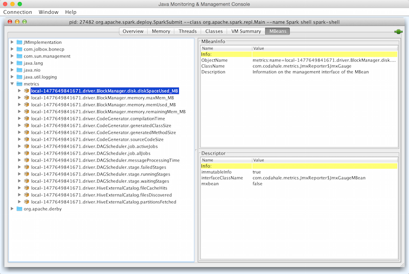

== [[MetricsSystem]] MetricsSystem

Spark uses http://metrics.dropwizard.io/3.1.0/[Metrics 3.1.0] Java library to give you insight into the <<subsystems, Spark subsystems>> (aka _instances_), e.g. link:spark-dagscheduler.adoc[DAGScheduler], link:spark-blockmanager.adoc[BlockManager], link:spark-Executor.adoc[Executor], link:spark-ExecutorAllocationManager.adoc[ExecutorAllocationManager], link:spark-ExternalShuffleService.adoc[ExternalShuffleService], etc.

NOTE: Metrics are only available for cluster modes, i.e. `local` mode turns metrics off.

[[subsystems]]
.Subsystems and Their MetricsSystems (in alphabetical order)
[cols="1,2",options="header",width="100%"]
|===
| Subsystem Name
| When created

| `driver`
| `SparkEnv` link:spark-sparkenv.adoc#create[is created] for the driver.

| `executor`
| `SparkEnv` link:spark-sparkenv.adoc#create[is created] for an executor.

| `shuffleService`
| `ExternalShuffleService` link:spark-ExternalShuffleService.adoc#creating-instance[is created].

| `applications`
| Spark Standalone's `Master` link:spark-standalone-master.adoc#creating-instance[is created].

| `master`
| Spark Standalone's `Master` link:spark-standalone-master.adoc#creating-instance[is created].

| `worker`
| Spark Standalone's `Worker` link:spark-standalone-worker.adoc#creating-instance[is created].

| `mesos_cluster`
| Spark on Mesos' `MesosClusterScheduler` is created.
|===

<<subsystems, Subsystems>> access their `MetricsSystem` using link:spark-sparkenv.adoc#metricsSystem[SparkEnv].

[source, scala]
----
val metricsSystem = SparkEnv.get.metricsSystem
----

CAUTION: FIXME Mention TaskContextImpl and Task.run

link:spark-metrics-Source.adoc[org.apache.spark.metrics.source.Source] is the top-level class for the metric registries in Spark. Sources expose their internal status.

Metrics System is available at http://localhost:4040/metrics/json/ (for the default setup of a Spark application).

```
$ http http://localhost:4040/metrics/json/
HTTP/1.1 200 OK
Cache-Control: no-cache, no-store, must-revalidate
Content-Length: 2200
Content-Type: text/json;charset=utf-8
Date: Sat, 25 Feb 2017 14:14:16 GMT
Server: Jetty(9.2.z-SNAPSHOT)
X-Frame-Options: SAMEORIGIN

{
    "counters": {
        "app-20170225151406-0000.driver.HiveExternalCatalog.fileCacheHits": {
            "count": 0
        },
        "app-20170225151406-0000.driver.HiveExternalCatalog.filesDiscovered": {
            "count": 0
        },
        "app-20170225151406-0000.driver.HiveExternalCatalog.hiveClientCalls": {
            "count": 2
        },
        "app-20170225151406-0000.driver.HiveExternalCatalog.parallelListingJobCount": {
            "count": 0
        },
        "app-20170225151406-0000.driver.HiveExternalCatalog.partitionsFetched": {
            "count": 0
        }
    },
    "gauges": {
    ...
    "timers": {
        "app-20170225151406-0000.driver.DAGScheduler.messageProcessingTime": {
            "count": 0,
            "duration_units": "milliseconds",
            "m15_rate": 0.0,
            "m1_rate": 0.0,
            "m5_rate": 0.0,
            "max": 0.0,
            "mean": 0.0,
            "mean_rate": 0.0,
            "min": 0.0,
            "p50": 0.0,
            "p75": 0.0,
            "p95": 0.0,
            "p98": 0.0,
            "p99": 0.0,
            "p999": 0.0,
            "rate_units": "calls/second",
            "stddev": 0.0
        }
    },
    "version": "3.0.0"
}
```

NOTE: You can access a Spark subsystem's `MetricsSystem` using its corresponding "leading" port, e.g. `4040` for the `driver`, `8080` for Spark Standalone's `master` and `applications`.

NOTE: You have to use the trailing slash (`/`) to have the output.

Enable `org.apache.spark.metrics.sink.JmxSink` in `conf/metrics.properties` and use jconsole to access Spark metrics through JMX.

```
*.sink.jmx.class=org.apache.spark.metrics.sink.JmxSink
```

.jconsole and JmxSink in spark-shell


[[internal-properties]]
.MetricsSystem's Internal Properties
[cols="1,1,2",options="header",width="100%"]
|===
| Name
| Initial Value
| Description

| [[metricsConfig]] `metricsConfig`
| link:spark-metrics-MetricsConfig.adoc[MetricsConfig]
| Initialized when `MetricsSystem` <<creating-instance, is created>>.

Used when `MetricsSystem` registers <<registerSinks, sinks>> and <<registerSources, sources>>.

| [[running]] `running`
| Flag whether `MetricsSystem` has already been <<start, started>> or not
| FIXME

| [[metricsServlet]] `metricsServlet`
| (uninitialized)
| FIXME
|===

[[internal-registries]]
.MetricsSystem's Internal Registries and Counters
[cols="1,2",options="header",width="100%"]
|===
| Name
| Description

| [[registry]] `registry`
| http://metrics.dropwizard.io/3.1.0/apidocs/com/codahale/metrics/MetricRegistry.html[com.codahale.metrics.MetricRegistry]
| FIXME

| [[sinks]] `sinks`
| link:spark-metrics-Sink.adoc[Metrics sinks] in a Spark application.

Used when `MetricsSystem` <<registerSinks, registers a new metrics sink>> and <<start, starts them eventually>>.

| [[sources]] `sources`
| link:spark-metrics-Source.adoc[Metrics sources] in a Spark application.

Used when `MetricsSystem` <<registerSource, registers a new metrics source>>.
|===

[TIP]
====
Enable `WARN` or `ERROR` logging levels for `org.apache.spark.metrics.MetricsSystem` logger to see what happens in `MetricsSystem`.

Add the following line to `conf/log4j.properties`:

```
log4j.logger.org.apache.spark.metrics.MetricsSystem=WARN
```

Refer to link:spark-logging.adoc[Logging].
====

=== [[StaticSources]] "Static" Metrics Sources for Spark SQL -- StaticSources

CAUTION: FIXME

=== [[registerSinks]] `registerSinks` Internal Method

CAUTION: FIXME

=== [[stop]] `stop` Method

CAUTION: FIXME

=== [[removeSource]] `removeSource` Method

CAUTION: FIXME

=== [[report]] `report` Method

CAUTION: FIXME

=== Master

```
$ http http://192.168.1.4:8080/metrics/master/json/path
HTTP/1.1 200 OK
Cache-Control: no-cache, no-store, must-revalidate
Content-Length: 207
Content-Type: text/json;charset=UTF-8
Server: Jetty(8.y.z-SNAPSHOT)
X-Frame-Options: SAMEORIGIN

{
    "counters": {},
    "gauges": {
        "master.aliveWorkers": {
            "value": 0
        },
        "master.apps": {
            "value": 0
        },
        "master.waitingApps": {
            "value": 0
        },
        "master.workers": {
            "value": 0
        }
    },
    "histograms": {},
    "meters": {},
    "timers": {},
    "version": "3.0.0"
}
```

=== [[createMetricsSystem]] Creating MetricsSystem Instance For Subsystem -- `createMetricsSystem` Factory Method

[source, scala]
----
createMetricsSystem(
  instance: String,
  conf: SparkConf,
  securityMgr: SecurityManager): MetricsSystem
----

`createMetricsSystem` <<creating-instance, creates a `MetricsSystem`>>.

NOTE: `createMetricsSystem` is used when <<subsystems, subsystems>> create their `MetricsSystems`.

=== [[creating-instance]] Creating MetricsSystem Instance

`MetricsSystem` takes the following when created:

* [[instance]] Subsystem name
* [[conf]] link:spark-SparkConf.adoc[SparkConf]
* [[securityMgr]] link:spark-security.adoc[SecurityManager]

`MetricsSystem` initializes the <<internal-registries, internal registries and counters>>.

When created, `MetricsSystem` requests <<metricsConfig, MetricsConfig>> to link:spark-metrics-MetricsConfig.adoc#initialize[initialize].

NOTE: <<createMetricsSystem, createMetricsSystem>> is used to create `MetricsSystems` instead.

=== [[registerSource]] Registering Metrics Source -- `registerSource` Method

[source, scala]
----
registerSource(source: Source): Unit
----

`registerSource` adds `source` to <<sources, sources>> internal registry.

`registerSource` <<buildRegistryName, creates an identifier>> for the metrics source and registers it with <<registry, MetricRegistry>>.

NOTE: `registerSource` uses Metrics' link:++http://metrics.dropwizard.io/3.1.0/apidocs/com/codahale/metrics/MetricRegistry.html#register-java.lang.String-T-++[MetricRegistry.register] to register a metrics source under a given name.

When `registerSource` tries to register a name more than once, you should see the following INFO message in the logs:

```
INFO Metrics already registered
```

[NOTE]
====
`registerSource` is used when:

* `SparkContext` link:spark-sparkcontext-creating-instance-internals.adoc#registerSource[registers metrics sources] for:
** link:spark-dagscheduler.adoc#metricsSource[DAGScheduler]
** link:spark-blockmanager-BlockManagerSource.adoc[BlockManager]
** link:spark-ExecutorAllocationManager.adoc#executorAllocationManagerSource[ExecutorAllocationManager] (when link:spark-dynamic-allocation.adoc#isDynamicAllocationEnabled[dynamic allocation is enabled])

* `MetricsSystem` <<start, is started>> (and registers the "static" metrics sources -- `CodegenMetrics` and `HiveCatalogMetrics`) and does <<registerSources, registerSources>>.

* `Executor` link:spark-Executor.adoc#creating-instance[is created] (and registers a link:spark-executor-ExecutorSource.adoc[ExecutorSource])

* `ExternalShuffleService` link:spark-ExternalShuffleService.adoc#start[is started] (and registers `ExternalShuffleServiceSource`)

* Spark Structured Streaming's `StreamExecution` runs batches as data arrives (when metrics are enabled).
* Spark Streaming's `StreamingContext` is started (and registers `StreamingSource`)

* Spark Standalone's `Master` and `Worker` start (and register their `MasterSource` and `WorkerSource`, respectively)
* Spark Standalone's `Master` registers a Spark application (and registers a `ApplicationSource`)
* Spark on Mesos' `MesosClusterScheduler` is started (and registers a `MesosClusterSchedulerSource`)
====

=== [[buildRegistryName]] Building Metrics Source Identifier -- `buildRegistryName` Method

[source, scala]
----
buildRegistryName(source: Source): String
----

NOTE: `buildRegistryName` is used to build the metrics source identifiers for a Spark application's driver and executors, but also for other Spark framework's components (e.g. Spark Standalone's master and workers).

NOTE: `buildRegistryName` uses <<spark.metrics.namespace, spark.metrics.namespace>> and link:spark-Executor.adoc#spark.executor.id[spark.executor.id] Spark properties to differentiate between a Spark application's driver and executors, and the other Spark framework's components.

(only when <<instance, instance>> is `driver` or `executor`) `buildRegistryName` builds metrics source name that is made up of <<spark.metrics.namespace, spark.metrics.namespace>>, link:spark-Executor.adoc#spark.executor.id[spark.executor.id] and the name of the `source`.

NOTE: `buildRegistryName` uses Metrics' http://metrics.dropwizard.io/3.2.0/apidocs/com/codahale/metrics/MetricRegistry.html[MetricRegistry] to build metrics source identifiers.

CAUTION: FIXME Finish for the other components.

NOTE: `buildRegistryName` is used when `MetricsSystem` <<registerSource, registers>> or <<removeSource, removes>> a metrics source.

=== [[start]] Starting MetricsSystem -- `start` Method

[source, scala]
----
start(): Unit
----

`start` turns <<running, running>> flag on.

NOTE: `start` can only be called once and reports an `IllegalArgumentException` otherwise.

`start` registers the <<StaticSources, "static" metrics sources>> for Spark SQL, i.e. `CodegenMetrics` and `HiveCatalogMetrics`.

`start` then <<registerSources, registerSources>> followed by <<registerSinks, registerSinks>>.

In the end, `start` link:spark-metrics-Sink.adoc#start[starts registered metrics sinks] (from <<sinks, sinks>> registry).

[NOTE]
====
`start` is used when:

* `SparkContext` link:spark-sparkcontext-creating-instance-internals.adoc#MetricsSystem-start[is created] (on the driver)

* `SparkEnv` link:spark-sparkenv.adoc#create[is created] (on executors)

* `ExternalShuffleService` link:spark-ExternalShuffleService.adoc#start[is started]

* Spark Standalone's `Master` and `Worker` start
* Spark on Mesos' `MesosClusterScheduler` is started
====

=== [[registerSources]] Registering Metrics Sources for Current Subsystem -- `registerSources` Internal Method

[source, scala]
----
registerSources(): Unit
----

`registerSources` finds <<metricsConfig, metricsConfig>> configuration for the current subsystem (aka `instance`).

NOTE: `instance` is defined when `MetricsSystem` <<creating-instance, is created>>.

`registerSources` finds the configuration of all the link:spark-metrics-Source.adoc[metrics sources] for the subsystem (as described with `source.` prefix).

For every metrics source, `registerSources` finds `class` property, creates an instance, and in the end <<registerSource, registers it>>.

When `registerSources` fails, you should see the following ERROR message in the logs followed by the exception.

```
ERROR Source class [classPath] cannot be instantiated
```

NOTE: `registerSources` is used exclusively when `MetricsSystem` <<start, is started>>.

=== [[settings]] Settings

.Spark Properties
[cols="1,1,2",options="header",width="100%"]
|===
| Spark Property
| Default Value
| Description

| [[spark.metrics.namespace]] `spark.metrics.namespace`
| link:spark-SparkConf.adoc#spark.app.id[Spark application's ID] (aka `spark.app.id`)
| Root namespace for metrics reporting.

Given a Spark application's ID changes with every invocation of a Spark application, a custom `spark.metrics.namespace` can be specified for metrics reporting.

Used when `MetricsSystem` is requested for a <<buildRegistryName, metrics source identifier>>.
|===
