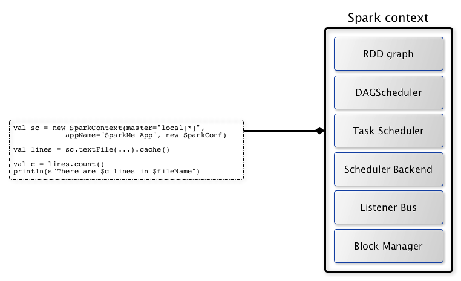
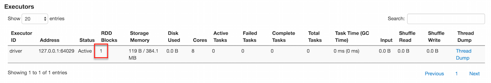

== [[SparkContext]] SparkContext -- Entry Point to Spark Core

`SparkContext` (aka *Spark context*) is the heart of a Spark application.

NOTE: You could also assume that a SparkContext instance _is_ a Spark application.

Spark context link:spark-sparkcontext-creating-instance-internals.adoc[sets up internal services] and establishes a connection to a link:spark-deployment-environments.adoc[Spark execution environment].

Once a <<creating-instance, `SparkContext` is created>> you can use it to <<creating-rdds, create RDDs>>, <<creating-accumulators, accumulators>> and <<broadcast, broadcast variables>>, access Spark services and <<runJob, run jobs>> (until `SparkContext` is <<stop, stopped>>).

A Spark context is essentially a client of Spark's execution environment and acts as the _master of your Spark application_ (don't get confused with the other meaning of link:spark-master.adoc[Master] in Spark, though).

.Spark context acts as the master of your Spark application


`SparkContext` offers the following functions:

* Getting current status of a Spark application
** <<env, SparkEnv>>
** <<getConf, SparkConf>>
** <<master, deployment environment (as master URL)>>
** <<appName, application name>>
** <<applicationAttemptId, unique identifier of execution attempt>>
** <<deployMode, deploy mode>>
** <<defaultParallelism, default level of parallelism>> that specifies the number of link:spark-rdd-partitions.adoc[partitions] in RDDs when they are created without specifying the number explicitly by a user.
** <<sparkUser, Spark user>>
** <<startTime, the time (in milliseconds) when `SparkContext` was created>>
** <<version, Spark version>>
** <<getExecutorStorageStatus, Storage status>>

* Setting Configuration
** <<master-url, master URL>>
** link:spark-sparkcontext-local-properties.adoc[Local Properties -- Creating Logical Job Groups]
** <<setJobGroup, Setting Local Properties to Group Spark Jobs>>
** <<setting-default-log-level, Default Logging Level>>

* Creating Distributed Entities
** <<creating-rdds, RDDs>>
** <<creating-accumulators, Accumulators>>
** <<broadcast, Broadcast variables>>

* Accessing services, e.g. <<taskScheduler, TaskScheduler>>, link:spark-LiveListenerBus.adoc[LiveListenerBus], link:spark-blockmanager.adoc[BlockManager], link:spark-SchedulerBackend.adoc[SchedulerBackends], link:spark-ShuffleManager.adoc[ShuffleManager] and the <<cleaner, optional ContextCleaner>>.

* <<runJob, Running jobs synchronously>>
* <<submitJob, Submitting jobs asynchronously>>
* <<cancelJob, Cancelling a job>>
* <<cancelStage, Cancelling a stage>>
* <<custom-schedulers, Assigning custom Scheduler Backend, TaskScheduler and DAGScheduler>>
* <<closure-cleaning, Closure cleaning>>
* <<getPersistentRDDs, Accessing persistent RDDs>>
* <<unpersist, Unpersisting RDDs, i.e. marking RDDs as non-persistent>>
* <<addSparkListener, Registering SparkListener>>
* <<dynamic-allocation, Programmable Dynamic Allocation>>

[[internal-registries]]
.SparkContext's Internal Registries and Counters
[cols="1,2",options="header",width="100%"]
|===
| Name
| Description

| [[persistentRdds]] `persistentRdds`
a| Lookup table of persistent/cached RDDs per their ids.

Used when `SparkContext` is requested to:

* <<persistRDD, persistRDD>>
* <<getRDDStorageInfo, getRDDStorageInfo>>
* <<getPersistentRDDs, getPersistentRDDs>>
* <<unpersistRDD, unpersistRDD>>
|===

[[internal-properties]]
.SparkContext's Internal Properties
[cols="1,1,2",options="header",width="100%"]
|===
| Name
| Initial Value
| Description

| [[_taskScheduler]] _taskScheduler
| (uninitialized)
| link:spark-TaskScheduler.adoc[TaskScheduler]
|===

TIP: Read the scaladoc of  http://spark.apache.org/docs/latest/api/scala/index.html#org.apache.spark.SparkContext[org.apache.spark.SparkContext].

[TIP]
====
Enable `INFO` logging level for `org.apache.spark.SparkContext` logger to see what happens inside.

Add the following line to `conf/log4j.properties`:

```
log4j.logger.org.apache.spark.SparkContext=INFO
```

Refer to link:spark-logging.adoc[Logging].
====

=== [[addFile]] `addFile` Method

[source, scala]
----
addFile(path: String): Unit // <1>
addFile(path: String, recursive: Boolean): Unit
----
<1> `recursive` flag is off

`addFile` adds the `path` file to be downloaded...FIXME

[NOTE]
====
`addFile` is used when:

* `SparkContext` is link:spark-sparkcontext-creating-instance-internals.adoc#files[initialized] (and `files` were defined)

* Spark SQL's `AddFileCommand` is executed

* Spark SQL's `SessionResourceLoader` is requested to load a file resource
====

=== [[unpersistRDD]] Removing RDD Blocks from BlockManagerMaster -- `unpersistRDD` Internal Method

[source, scala]
----
unpersistRDD(rddId: Int, blocking: Boolean = true): Unit
----

`unpersistRDD` requests `BlockManagerMaster` to link:spark-BlockManagerMaster.adoc#removeRdd[remove the blocks for the RDD] (given `rddId`).

NOTE: `unpersistRDD` uses `SparkEnv` link:spark-sparkenv.adoc#blockManager[to access the current `BlockManager`] that is in turn used to link:spark-blockmanager.adoc#master[access the current `BlockManagerMaster`].

`unpersistRDD` removes `rddId` from <<persistentRdds, persistentRdds>> registry.

In the end, `unpersistRDD` posts a link:spark-SparkListener.adoc#SparkListenerUnpersistRDD[SparkListenerUnpersistRDD] (with `rddId`) to <<listenerBus, LiveListenerBus Event Bus>>.

[NOTE]
====
`unpersistRDD` is used when:

* `ContextCleaner` does link:spark-service-contextcleaner.adoc#doCleanupRDD[doCleanupRDD]
* `SparkContext` <<unpersist, unpersists an RDD>> (i.e. marks an RDD as non-persistent)
====

=== [[applicationId]] Unique Identifier of Spark Application -- `applicationId` Method

CAUTION: FIXME

=== [[postApplicationStart]] `postApplicationStart` Internal Method

CAUTION: FIXME

=== [[postApplicationEnd]] `postApplicationEnd` Method

CAUTION: FIXME

=== [[clearActiveContext]] `clearActiveContext` Method

CAUTION: FIXME

=== [[getPersistentRDDs]] Accessing persistent RDDs -- `getPersistentRDDs` Method

[source, scala]
----
getPersistentRDDs: Map[Int, RDD[_]]
----

`getPersistentRDDs` returns the collection of RDDs that have marked themselves as persistent via link:spark-rdd-caching.adoc#cache[cache].

Internally, `getPersistentRDDs` returns <<persistentRdds, persistentRdds>> internal registry.

=== [[cancelJob]] Cancelling Job -- `cancelJob` Method

[source, scala]
----
cancelJob(jobId: Int)
----

`cancelJob` requests `DAGScheduler` link:spark-dagscheduler.adoc#cancelJob[to cancel a Spark job].

=== [[cancelStage]] Cancelling Stage -- `cancelStage` Methods

[source, scala]
----
cancelStage(stageId: Int): Unit
cancelStage(stageId: Int, reason: String): Unit
----

`cancelStage` simply requests `DAGScheduler` link:spark-dagscheduler.adoc#cancelJob[to cancel a Spark stage] (with an optional `reason`).

NOTE: `cancelStage` is used when `StagesTab` link:spark-webui-StagesTab.adoc#handleKillRequest[handles a kill request] (from a user in web UI).

=== [[dynamic-allocation]] Programmable Dynamic Allocation

`SparkContext` offers the following methods as the developer API for link:spark-dynamic-allocation.adoc[dynamic allocation of executors]:

* <<requestExecutors, requestExecutors>>
* <<killExecutors, killExecutors>>
* <<requestTotalExecutors, requestTotalExecutors>>
* (private!) <<getExecutorIds, getExecutorIds>>

==== [[requestExecutors]] Requesting New Executors -- `requestExecutors` Method

[source, scala]
----
requestExecutors(numAdditionalExecutors: Int): Boolean
----

`requestExecutors` requests `numAdditionalExecutors` executors from link:spark-CoarseGrainedSchedulerBackend.adoc[CoarseGrainedSchedulerBackend].

==== [[killExecutors]] Requesting to Kill Executors -- `killExecutors` Method

[source, scala]
----
killExecutors(executorIds: Seq[String]): Boolean
----

CAUTION: FIXME

==== [[requestTotalExecutors]] Requesting Total Executors -- `requestTotalExecutors` Method

[source, scala]
----
requestTotalExecutors(
  numExecutors: Int,
  localityAwareTasks: Int,
  hostToLocalTaskCount: Map[String, Int]): Boolean
----

`requestTotalExecutors` is a `private[spark]` method that link:spark-CoarseGrainedSchedulerBackend.adoc#requestTotalExecutors[requests the exact number of executors from a coarse-grained scheduler backend].

NOTE: It works for link:spark-CoarseGrainedSchedulerBackend.adoc[coarse-grained scheduler backends] only.

When called for other scheduler backends you should see the following WARN message in the logs:

```
WARN Requesting executors is only supported in coarse-grained mode
```

==== [[getExecutorIds]] Getting Executor Ids -- `getExecutorIds` Method

`getExecutorIds` is a `private[spark]` method that is part of link:spark-service-ExecutorAllocationClient.adoc[ExecutorAllocationClient contract]. It simply link:spark-CoarseGrainedSchedulerBackend.adoc#getExecutorIds[passes the call on to the current coarse-grained scheduler backend, i.e. calls `getExecutorIds`].

NOTE: It works for link:spark-CoarseGrainedSchedulerBackend.adoc[coarse-grained scheduler backends] only.

When called for other scheduler backends you should see the following WARN message in the logs:

```
WARN Requesting executors is only supported in coarse-grained mode
```

CAUTION: FIXME Why does SparkContext implement the method for coarse-grained scheduler backends? Why doesn't SparkContext throw an exception when the method is called? Nobody seems to be using it (!)

=== [[creating-instance]] Creating `SparkContext` Instance

You can create a `SparkContext` instance with or without creating a link:spark-SparkConf.adoc[SparkConf] object first.

NOTE: You may want to read link:spark-sparkcontext-creating-instance-internals.adoc[Inside Creating SparkContext] to learn what happens behind the scenes when `SparkContext` is created.

==== [[getOrCreate]] Getting Existing or Creating New SparkContext -- `getOrCreate` Methods

[source, scala]
----
getOrCreate(): SparkContext
getOrCreate(conf: SparkConf): SparkContext
----

`getOrCreate` methods allow you to get the existing `SparkContext` or create a new one.

[source, scala]
----
import org.apache.spark.SparkContext
val sc = SparkContext.getOrCreate()

// Using an explicit SparkConf object
import org.apache.spark.SparkConf
val conf = new SparkConf()
  .setMaster("local[*]")
  .setAppName("SparkMe App")
val sc = SparkContext.getOrCreate(conf)
----

The no-param `getOrCreate` method requires that the two mandatory Spark settings - <<master, master>> and <<appName, application name>> - are specified using link:spark-submit.adoc[spark-submit].

==== [[constructors]] Constructors

[source, scala]
----
SparkContext()
SparkContext(conf: SparkConf)
SparkContext(master: String, appName: String, conf: SparkConf)
SparkContext(
  master: String,
  appName: String,
  sparkHome: String = null,
  jars: Seq[String] = Nil,
  environment: Map[String, String] = Map())
----

You can create a `SparkContext` instance using the four constructors.

[source, scala]
----
import org.apache.spark.SparkConf
val conf = new SparkConf()
  .setMaster("local[*]")
  .setAppName("SparkMe App")

import org.apache.spark.SparkContext
val sc = new SparkContext(conf)
----

When a Spark context starts up you should see the following INFO in the logs (amongst the other messages that come from the Spark services):

```
INFO SparkContext: Running Spark version 2.0.0-SNAPSHOT
```

NOTE: Only one SparkContext may be running in a single JVM (check out https://issues.apache.org/jira/browse/SPARK-2243[SPARK-2243 Support multiple SparkContexts in the same JVM]). Sharing access to a SparkContext in the JVM is the solution to share data within Spark (without relying on other means of data sharing using external data stores).

=== [[env]] Accessing Current SparkEnv -- `env` Method

CAUTION: FIXME

=== [[getConf]] Getting Current SparkConf -- `getConf` Method

[source, scala]
----
getConf: SparkConf
----

`getConf` returns the current link:spark-SparkConf.adoc[SparkConf].

NOTE: Changing the `SparkConf` object does not change the current configuration (as the method returns a copy).

=== [[master]][[master-url]] Deployment Environment -- `master` Method

[source, scala]
----
master: String
----

`master` method returns the current value of link:spark-SparkConf.adoc#spark.master[spark.master] which is the link:spark-deployment-environments.adoc[deployment environment] in use.

=== [[appName]] Application Name -- `appName` Method

[source, scala]
----
appName: String
----

`appName` gives the value of the mandatory link:spark-SparkConf.adoc#spark.app.name[spark.app.name] setting.

NOTE: `appName` is used when link:spark-standalone.adoc#SparkDeploySchedulerBackend[`SparkDeploySchedulerBackend` starts], link:spark-webui-SparkUI.adoc#createLiveUI[`SparkUI` creates a web UI], when `postApplicationStart` is executed, and for Mesos and checkpointing in Spark Streaming.

=== [[applicationAttemptId]] Unique Identifier of Execution Attempt -- `applicationAttemptId` Method

[source, scala]
----
applicationAttemptId: Option[String]
----

`applicationAttemptId` gives the  unique identifier of the execution attempt of a Spark application.

[NOTE]
====
`applicationAttemptId` is used when:

* link:spark-taskscheduler-ShuffleMapTask.adoc#creating-instance[ShuffleMapTask] and link:spark-taskscheduler-ResultTask.adoc#creating-instance[ResultTask] are created

* `SparkContext` <<postApplicationStart, announces that a Spark application has started>>
====

=== [[getExecutorStorageStatus]] Storage Status (of All BlockManagers) -- `getExecutorStorageStatus` Method

[source, scala]
----
getExecutorStorageStatus: Array[StorageStatus]
----

`getExecutorStorageStatus` link:spark-BlockManagerMaster.adoc#getStorageStatus[requests `BlockManagerMaster` for storage status] (of all link:spark-blockmanager.adoc[BlockManagers]).

NOTE: `getExecutorStorageStatus` is a developer API.

[NOTE]
====
`getExecutorStorageStatus` is used when:

* `SparkContext` <<getRDDStorageInfo, is requested for storage status of cached RDDs>>

* `SparkStatusTracker` link:spark-sparkcontext-SparkStatusTracker.adoc#getExecutorInfos[is requested for information about all known executors]
====

=== [[deployMode]] Deploy Mode -- `deployMode` Method

[source,scala]
----
deployMode: String
----

`deployMode` returns the current value of link:spark-deploy-mode.adoc[spark.submit.deployMode] setting or `client` if not set.

=== [[getSchedulingMode]] Scheduling Mode -- `getSchedulingMode` Method

[source, scala]
----
getSchedulingMode: SchedulingMode.SchedulingMode
----

`getSchedulingMode` returns the current link:spark-taskscheduler-schedulingmode.adoc[Scheduling Mode].

=== [[getPoolForName]] Schedulable (Pool) by Name -- `getPoolForName` Method

[source, scala]
----
getPoolForName(pool: String): Option[Schedulable]
----

`getPoolForName` returns a link:spark-taskscheduler-schedulable.adoc[Schedulable] by the `pool` name, if one exists.

NOTE: `getPoolForName` is part of the Developer's API and may change in the future.

Internally, it requests the link:spark-TaskScheduler.adoc#rootPool[TaskScheduler for the root pool] and link:spark-taskscheduler-pool.adoc#schedulableNameToSchedulable[looks up the `Schedulable` by the `pool` name].

It is exclusively used to link:spark-webui-PoolPage.adoc[show pool details in web UI (for a stage)].

=== [[getAllPools]] All Pools -- `getAllPools` Method

[source, scala]
----
getAllPools: Seq[Schedulable]
----

`getAllPools` collects the link:spark-taskscheduler-pool.adoc[Pools] in link:spark-TaskScheduler.adoc#contract[TaskScheduler.rootPool].

NOTE: `TaskScheduler.rootPool` is part of the link:spark-TaskScheduler.adoc#contract[TaskScheduler Contract].

NOTE: `getAllPools` is part of the Developer's API.

CAUTION: FIXME Where is the method used?

NOTE: `getAllPools` is used to calculate pool names for link:spark-webui-AllStagesPage.adoc#pool-names[Stages tab in web UI] with FAIR scheduling mode used.

=== [[defaultParallelism]] Default Level of Parallelism

[source, scala]
----
defaultParallelism: Int
----

`defaultParallelism` requests <<taskScheduler, TaskScheduler>> for the link:spark-TaskScheduler.adoc#defaultParallelism[default level of parallelism].

NOTE: *Default level of parallelism* specifies the number of link:spark-rdd-partitions.adoc[partitions] in RDDs when created without specifying them explicitly by a user.

[NOTE]
====
`defaultParallelism` is used in <<parallelize, SparkContext.parallelize>>, `SparkContext.range` and <<makeRDD, SparkContext.makeRDD>> (as well as Spark Streaming's `DStream.countByValue` and `DStream.countByValueAndWindow` et al.).

`defaultParallelism` is also used to instantiate link:spark-rdd-HashPartitioner.adoc[HashPartitioner] and for the minimum number of partitions in link:spark-rdd-hadooprdd.adoc[HadoopRDDs].
====

=== [[taskScheduler]] Current Spark Scheduler (aka TaskScheduler) -- `taskScheduler` Property

[source, scala]
----
taskScheduler: TaskScheduler
taskScheduler_=(ts: TaskScheduler): Unit
----

`taskScheduler` manages (i.e. reads or writes) <<_taskScheduler, _taskScheduler>> internal property.

=== [[version]] Getting Spark Version -- `version` Property

[source, scala]
----
version: String
----

`version` returns the Spark version this `SparkContext` uses.

=== [[makeRDD]] `makeRDD` Method

CAUTION: FIXME

=== [[submitJob]] Submitting Jobs Asynchronously -- `submitJob` Method

[source, scala]
----
submitJob[T, U, R](
  rdd: RDD[T],
  processPartition: Iterator[T] => U,
  partitions: Seq[Int],
  resultHandler: (Int, U) => Unit,
  resultFunc: => R): SimpleFutureAction[R]
----

`submitJob` submits a job in an asynchronous, non-blocking way to link:spark-dagscheduler.adoc#submitJob[DAGScheduler].

It cleans the `processPartition` input function argument and returns an instance of link:spark-rdd-actions.adoc#FutureAction[SimpleFutureAction] that holds the link:spark-dagscheduler-JobWaiter.adoc[JobWaiter] instance.

CAUTION: FIXME What are `resultFunc`?

It is used in:

* link:spark-rdd-actions.adoc#AsyncRDDActions[AsyncRDDActions] methods
* link:spark-streaming/spark-streaming.adoc[Spark Streaming] for link:spark-streaming/spark-streaming-receivertracker.adoc#ReceiverTrackerEndpoint-startReceiver[ReceiverTrackerEndpoint.startReceiver]

=== [[spark-configuration]] Spark Configuration

CAUTION: FIXME

=== [[sparkcontext-and-rdd]] SparkContext and RDDs

You use a Spark context to create RDDs (see <<creating-rdds, Creating RDD>>).

When an RDD is created, it belongs to and is completely owned by the Spark context it originated from. RDDs can't by design be shared between SparkContexts.

.A Spark context creates a living space for RDDs.
image::diagrams/sparkcontext-rdds.png[align="center"]

=== [[creating-rdds]][[parallelize]] Creating RDD -- `parallelize` Method

`SparkContext` allows you to create many different RDDs from input sources like:

* Scala's collections, i.e. `sc.parallelize(0 to 100)`
* local or remote filesystems, i.e. `sc.textFile("README.md")`
* Any Hadoop `InputSource` using `sc.newAPIHadoopFile`

Read link:spark-rdd.adoc#creating-rdds[Creating RDDs] in link:spark-rdd.adoc[RDD - Resilient Distributed Dataset].

=== [[unpersist]] Unpersisting RDD (Marking RDD as Non-Persistent) -- `unpersist` Method

CAUTION: FIXME

`unpersist` removes an RDD from the master's link:spark-blockmanager.adoc[Block Manager] (calls `removeRdd(rddId: Int, blocking: Boolean)`) and the internal <<persistentRdds, persistentRdds>> mapping.

It finally posts link:spark-SparkListener.adoc#SparkListenerUnpersistRDD[SparkListenerUnpersistRDD] message to `listenerBus`.

=== [[setCheckpointDir]] Setting Checkpoint Directory -- `setCheckpointDir` Method

[source, scala]
----
setCheckpointDir(directory: String)
----

`setCheckpointDir` method is used to set up the checkpoint directory...FIXME

CAUTION: FIXME

=== [[register]] Registering Accumulator -- `register` Methods

[source, scala]
----
register(acc: AccumulatorV2[_, _]): Unit
register(acc: AccumulatorV2[_, _], name: String): Unit
----

`register` registers the `acc` link:spark-accumulators.adoc[accumulator]. You can optionally give an accumulator a `name`.

TIP: You can create built-in accumulators for longs, doubles, and collection types using <<creating-accumulators, specialized methods>>.

Internally, `register` link:spark-accumulators.adoc#register[registers `acc` accumulator] (with the current `SparkContext`).

=== [[creating-accumulators]][[longAccumulator]][[doubleAccumulator]][[collectionAccumulator]] Creating Built-In Accumulators

[source, scala]
----
longAccumulator: LongAccumulator
longAccumulator(name: String): LongAccumulator
doubleAccumulator: DoubleAccumulator
doubleAccumulator(name: String): DoubleAccumulator
collectionAccumulator[T]: CollectionAccumulator[T]
collectionAccumulator[T](name: String): CollectionAccumulator[T]
----

You can use `longAccumulator`, `doubleAccumulator` or `collectionAccumulator` to create and register link:spark-accumulators.adoc[accumulators] for simple and collection values.

`longAccumulator` returns link:spark-accumulators.adoc#LongAccumulator[LongAccumulator] with the zero value `0`.

`doubleAccumulator` returns link:spark-accumulators.adoc#DoubleAccumulator[DoubleAccumulator] with the zero value `0.0`.

`collectionAccumulator` returns link:spark-accumulators.adoc#CollectionAccumulator[CollectionAccumulator] with the zero value `java.util.List[T]`.

[source, scala]
----
scala> val acc = sc.longAccumulator
acc: org.apache.spark.util.LongAccumulator = LongAccumulator(id: 0, name: None, value: 0)

scala> val counter = sc.longAccumulator("counter")
counter: org.apache.spark.util.LongAccumulator = LongAccumulator(id: 1, name: Some(counter), value: 0)

scala> counter.value
res0: Long = 0

scala> sc.parallelize(0 to 9).foreach(n => counter.add(n))

scala> counter.value
res3: Long = 45
----

The `name` input parameter allows you to give a name to an accumulator and have it displayed in link:spark-webui-StagePage.adoc#accumulators[Spark UI] (under Stages tab for a given stage).

.Accumulators in the Spark UI
image::images/spark-webui-accumulators.png[align="center"]

TIP: You can register custom accumulators using <<register, register>> methods.

=== [[broadcast]] Creating Broadcast Variable -- `broadcast` Method

[source, scala]
----
broadcast[T](value: T): Broadcast[T]
----

`broadcast` method creates a link:spark-broadcast.adoc[broadcast variable]. It is a shared memory with `value` (as broadcast blocks) on the driver and later on all Spark executors.

```
val sc: SparkContext = ???
scala> val hello = sc.broadcast("hello")
hello: org.apache.spark.broadcast.Broadcast[String] = Broadcast(0)
```

Spark transfers the value to Spark executors _once_, and tasks can share it without incurring repetitive network transmissions when the broadcast variable is used multiple times.

.Broadcasting a value to executors
image::images/sparkcontext-broadcast-executors.png[align="center"]

Internally, `broadcast` requests the link:spark-service-broadcastmanager.adoc#newBroadcast[current `BroadcastManager` to create a new broadcast variable].

NOTE: The current `BroadcastManager` is available using link:spark-sparkenv.adoc#broadcastManager[`SparkEnv.broadcastManager`] attribute and is always link:spark-service-broadcastmanager.adoc[BroadcastManager] (with few internal configuration changes to reflect where it runs, i.e. inside the driver or executors).

You should see the following INFO message in the logs:

```
INFO SparkContext: Created broadcast [id] from [callSite]
```

If `ContextCleaner` is defined, the link:spark-service-contextcleaner.adoc#[new broadcast variable is registered for cleanup].

[NOTE]
====
Spark does not support broadcasting RDDs.

```
scala> sc.broadcast(sc.range(0, 10))
java.lang.IllegalArgumentException: requirement failed: Can not directly broadcast RDDs; instead, call collect() and broadcast the result.
  at scala.Predef$.require(Predef.scala:224)
  at org.apache.spark.SparkContext.broadcast(SparkContext.scala:1392)
  ... 48 elided
```
====

Once created, the broadcast variable (and other blocks) are displayed per executor and the driver in web UI (under link:spark-webui-executors.adoc[Executors tab]).

.Broadcast Variables In web UI's Executors Tab


=== [[jars]] Distribute JARs to workers

The jar you specify with `SparkContext.addJar` will be copied to all the worker nodes.

The configuration setting `spark.jars` is a comma-separated list of jar paths to be included in all tasks executed from this SparkContext. A path can either be a local file, a file in HDFS (or other Hadoop-supported filesystems), an HTTP, HTTPS or FTP URI, or `local:/path` for a file on every worker node.

```
scala> sc.addJar("build.sbt")
15/11/11 21:54:54 INFO SparkContext: Added JAR build.sbt at http://192.168.1.4:49427/jars/build.sbt with timestamp 1447275294457
```

CAUTION: FIXME Why is HttpFileServer used for addJar?

=== `SparkContext` as Application-Wide Counter

SparkContext keeps track of:

[[nextShuffleId]]
* shuffle ids using `nextShuffleId` internal counter for link:spark-dagscheduler-ShuffleMapStage.adoc[registering shuffle dependencies] to link:spark-ShuffleManager.adoc[Shuffle Service].

=== [[runJob]] Running Job Synchronously -- `runJob` Methods

link:spark-rdd.adoc#actions[RDD actions] run link:spark-dagscheduler-jobs.adoc[jobs] using one of `runJob` methods.

[source, scala]
----
runJob[T, U](
  rdd: RDD[T],
  func: (TaskContext, Iterator[T]) => U,
  partitions: Seq[Int],
  resultHandler: (Int, U) => Unit): Unit
runJob[T, U](
  rdd: RDD[T],
  func: (TaskContext, Iterator[T]) => U,
  partitions: Seq[Int]): Array[U]
runJob[T, U](
  rdd: RDD[T],
  func: Iterator[T] => U,
  partitions: Seq[Int]): Array[U]
runJob[T, U](rdd: RDD[T], func: (TaskContext, Iterator[T]) => U): Array[U]
runJob[T, U](rdd: RDD[T], func: Iterator[T] => U): Array[U]
runJob[T, U](
  rdd: RDD[T],
  processPartition: (TaskContext, Iterator[T]) => U,
  resultHandler: (Int, U) => Unit)
runJob[T, U: ClassTag](
  rdd: RDD[T],
  processPartition: Iterator[T] => U,
  resultHandler: (Int, U) => Unit)
----

`runJob` executes a function on one or many partitions of a RDD (in a `SparkContext` space) to produce a collection of values per partition.

NOTE: `runJob` can only work when a `SparkContext` is _not_ <<stop, stopped>>.

Internally, `runJob` first makes sure that the `SparkContext` is not <<stop, stopped>>. If it is, you should see the following `IllegalStateException` exception in the logs:

```
java.lang.IllegalStateException: SparkContext has been shutdown
  at org.apache.spark.SparkContext.runJob(SparkContext.scala:1893)
  at org.apache.spark.SparkContext.runJob(SparkContext.scala:1914)
  at org.apache.spark.SparkContext.runJob(SparkContext.scala:1934)
  ... 48 elided
```

`runJob` then <<getCallSite, calculates the call site>> and <<clean, cleans a `func` closure>>.

You should see the following INFO message in the logs:

```
INFO SparkContext: Starting job: [callSite]
```

With link:spark-rdd-lineage.adoc#spark_logLineage[spark.logLineage] enabled (which is not by default), you should see the following INFO message with link:spark-rdd-lineage.adoc#toDebugString[toDebugString] (executed on `rdd`):

```
INFO SparkContext: RDD's recursive dependencies:
[toDebugString]
```

`runJob` requests  link:spark-dagscheduler.adoc#runJob[`DAGScheduler` to run a job].

TIP: `runJob` just prepares input parameters for link:spark-dagscheduler.adoc#runJob[`DAGScheduler` to run a job].

After `DAGScheduler` is done and the job has finished, `runJob` link:spark-sparkcontext-ConsoleProgressBar.adoc#finishAll[stops `ConsoleProgressBar`] and link:spark-rdd-checkpointing.adoc#doCheckpoint[performs RDD checkpointing of `rdd`].

TIP: For some actions, e.g. `first()` and `lookup()`, there is no need to compute all the partitions of the RDD in a job. And Spark knows it.

[source,scala]
----
// RDD to work with
val lines = sc.parallelize(Seq("hello world", "nice to see you"))

import org.apache.spark.TaskContext
scala> sc.runJob(lines, (t: TaskContext, i: Iterator[String]) => 1) // <1>
res0: Array[Int] = Array(1, 1)  // <2>
----
<1> Run a job using `runJob` on `lines` RDD with a function that returns 1 for every partition (of `lines` RDD).
<2> What can you say about the number of partitions of the `lines` RDD? Is your result `res0` different than mine? Why?

TIP: Read link:spark-taskscheduler-taskcontext.adoc[TaskContext].

Running a job is essentially executing a `func` function on all or a subset of partitions in an `rdd` RDD and returning the result as an array (with elements being the results per partition).

.Executing action
image::images/spark-runjob.png[align="center"]

=== [[stop]][[stopping]] Stopping `SparkContext` -- `stop` Method

[source, scala]
----
stop(): Unit
----

`stop` stops the `SparkContext`.

Internally, `stop` enables `stopped` internal flag. If already stopped, you should see the following INFO message in the logs:

```
INFO SparkContext: SparkContext already stopped.
```

`stop` then does the following:

1. Removes `_shutdownHookRef` from `ShutdownHookManager`
2. <<postApplicationEnd, Posts a `SparkListenerApplicationEnd`>> (to <<listenerBus, LiveListenerBus Event Bus>>)
3. link:spark-webui-SparkUI.adoc#stop[Stops web UI]
4. link:spark-MetricsSystem.adoc#report[Requests `MetricSystem` to report metrics] (from all registered sinks)
5. link:spark-service-contextcleaner.adoc#stop[Stops `ContextCleaner`]
6. link:spark-ExecutorAllocationManager.adoc#stop[Requests `ExecutorAllocationManager` to stop]
7. If `LiveListenerBus` was started, link:spark-LiveListenerBus.adoc#stop[requests `LiveListenerBus` to stop]
8. Requests link:spark-scheduler-listeners-eventlogginglistener.adoc#stop[`EventLoggingListener` to stop]
9. Requests link:spark-dagscheduler.adoc#stop[`DAGScheduler` to stop]
10. Requests link:spark-rpc.adoc#stop[RpcEnv to stop `HeartbeatReceiver` endpoint]
11. Requests link:spark-sparkcontext-ConsoleProgressBar.adoc#stop[`ConsoleProgressBar` to stop]
12. Clears the reference to `TaskScheduler`, i.e. `_taskScheduler` is `null`
13. Requests link:spark-sparkenv.adoc#stop[`SparkEnv` to stop] and clears `SparkEnv`
14. Clears link:yarn/spark-yarn-client.adoc#SPARK_YARN_MODE[`SPARK_YARN_MODE` flag]
15. <<clearActiveContext, Clears an active `SparkContext`>>

Ultimately, you should see the following INFO message in the logs:

```
INFO SparkContext: Successfully stopped SparkContext
```

=== [[addSparkListener]] Registering SparkListener -- `addSparkListener` Method

[source, scala]
----
addSparkListener(listener: SparkListenerInterface): Unit
----

You can register a custom link:spark-SparkListener.adoc#SparkListenerInterface[SparkListenerInterface] using `addSparkListener` method

NOTE: You can also register custom listeners using link:spark-LiveListenerBus.adoc#spark_extraListeners[spark.extraListeners] setting.

=== [[custom-schedulers]] Custom SchedulerBackend, TaskScheduler and DAGScheduler

By default, SparkContext uses (`private[spark]` class) `org.apache.spark.scheduler.DAGScheduler`, but you can develop your own custom DAGScheduler implementation, and use (`private[spark]`) `SparkContext.dagScheduler_=(ds: DAGScheduler)` method to assign yours.

It is also applicable to `SchedulerBackend` and `TaskScheduler` using `schedulerBackend_=(sb: SchedulerBackend)` and `taskScheduler_=(ts: TaskScheduler)` methods, respectively.

CAUTION: FIXME Make it an advanced exercise.

=== [[events]] Events

When a Spark context starts, it triggers link:spark-SparkListener.adoc#SparkListenerEnvironmentUpdate[SparkListenerEnvironmentUpdate] and link:spark-SparkListener.adoc#SparkListenerApplicationStart[SparkListenerApplicationStart] messages.

Refer to the section <<creating-instance, SparkContext's initialization>>.

=== [[setLogLevel]][[setting-default-log-level]] Setting Default Logging Level -- `setLogLevel` Method

[source, scala]
----
setLogLevel(logLevel: String)
----

`setLogLevel` allows you to set the root logging level in a Spark application, e.g. link:spark-shell.adoc[Spark shell].

Internally, `setLogLevel` calls link:++http://logging.apache.org/log4j/2.x/log4j-api/apidocs/org/apache/logging/log4j/Level.html#toLevel(java.lang.String)++[org.apache.log4j.Level.toLevel(logLevel)] that it then uses to set using link:++http://logging.apache.org/log4j/2.x/log4j-api/apidocs/org/apache/logging/log4j/LogManager.html#getRootLogger()++[org.apache.log4j.LogManager.getRootLogger().setLevel(level)].

[TIP]
====
You can directly set the logging level using link:++http://logging.apache.org/log4j/2.x/log4j-api/apidocs/org/apache/logging/log4j/LogManager.html#getLogger()++[org.apache.log4j.LogManager.getLogger()].

[source, scala]
----
LogManager.getLogger("org").setLevel(Level.OFF)
----

====

=== [[clean]][[closure-cleaning]] Closure Cleaning -- `clean` Method

[source, scala]
----
clean(f: F, checkSerializable: Boolean = true): F
----

Every time an action is called, Spark cleans up the closure, i.e. the body of the action, before it is serialized and sent over the wire to executors.

SparkContext comes with `clean(f: F, checkSerializable: Boolean = true)` method that does this. It in turn calls `ClosureCleaner.clean` method.

Not only does `ClosureCleaner.clean` method clean the closure, but also does it transitively, i.e. referenced closures are cleaned transitively.

A closure is considered serializable as long as it does not explicitly reference unserializable objects. It does so by traversing the hierarchy of enclosing closures and null out any references that are not actually used by the starting closure.

[TIP]
====
Enable `DEBUG` logging level for `org.apache.spark.util.ClosureCleaner` logger to see what happens inside the class.

Add the following line to `conf/log4j.properties`:

```
log4j.logger.org.apache.spark.util.ClosureCleaner=DEBUG
```

Refer to link:spark-logging.adoc[Logging].
====

With `DEBUG` logging level you should see the following messages in the logs:

```
+++ Cleaning closure [func] ([func.getClass.getName]) +++
 + declared fields: [declaredFields.size]
     [field]
 ...
+++ closure [func] ([func.getClass.getName]) is now cleaned +++
```

Serialization is verified using a new instance of `Serializer` (as link:spark-sparkenv.adoc#closureSerializer[closure Serializer]). Refer to link:spark-serialization.adoc[Serialization].

CAUTION: FIXME an example, please.

=== [[hadoopConfiguration]] Hadoop Configuration

While a <<creating-instance, `SparkContext` is being created>>, so is a Hadoop configuration (as an instance of https://hadoop.apache.org/docs/current/api/org/apache/hadoop/conf/Configuration.html[org.apache.hadoop.conf.Configuration] that is available as `_hadoopConfiguration`).

NOTE: link:spark-SparkHadoopUtil.adoc#newConfiguration[SparkHadoopUtil.get.newConfiguration] is used.

If a SparkConf is provided it is used to build the configuration as described. Otherwise, the default `Configuration` object is returned.

If `AWS_ACCESS_KEY_ID` and `AWS_SECRET_ACCESS_KEY` are both available, the following settings are set for the Hadoop configuration:

* `fs.s3.awsAccessKeyId`, `fs.s3n.awsAccessKeyId`, `fs.s3a.access.key` are set to the value of `AWS_ACCESS_KEY_ID`
* `fs.s3.awsSecretAccessKey`, `fs.s3n.awsSecretAccessKey`, and `fs.s3a.secret.key` are set to the value of `AWS_SECRET_ACCESS_KEY`

Every `spark.hadoop.` setting becomes a setting of the configuration with the prefix `spark.hadoop.` removed for the key.

The value of `spark.buffer.size` (default: `65536`) is used as the value of `io.file.buffer.size`.

=== [[listenerBus]] `listenerBus` -- `LiveListenerBus` Event Bus

`listenerBus` is a link:spark-LiveListenerBus.adoc[LiveListenerBus] object that acts as a mechanism to announce events to other services on the link:spark-driver.adoc[driver].

NOTE: It is created and started when link:spark-sparkcontext-creating-instance-internals.adoc[SparkContext starts] and, since it is a single-JVM event bus, is exclusively used on the driver.

NOTE: `listenerBus` is a `private[spark]` value in `SparkContext`.

=== [[startTime]] Time when `SparkContext` was Created -- `startTime` Property

[source, scala]
----
startTime: Long
----

`startTime` is the time in milliseconds when <<creating-instance, SparkContext was created>>.

[source, scala]
----
scala> sc.startTime
res0: Long = 1464425605653
----

=== [[sparkUser]] Spark User -- `sparkUser` Property

[source, scala]
----
sparkUser: String
----

`sparkUser` is the user who started the `SparkContext` instance.

NOTE: It is computed when link:spark-sparkcontext-creating-instance-internals.adoc#sparkUser[SparkContext is created] using link:spark-sparkcontext-creating-instance-internals.adoc#[Utils.getCurrentUserName].

=== [[submitMapStage]] Submitting `ShuffleDependency` for Execution -- `submitMapStage` Internal Method

[source, scala]
----
submitMapStage[K, V, C](
  dependency: ShuffleDependency[K, V, C]): SimpleFutureAction[MapOutputStatistics]
----

`submitMapStage` link:spark-dagscheduler.adoc#submitMapStage[submits the input `ShuffleDependency` to `DAGScheduler` for execution] and returns a `SimpleFutureAction`.

Internally, `submitMapStage` <<getCallSite, calculates the call site>> first and submits it with `localProperties`.

NOTE: Interestingly, `submitMapStage` is used exclusively when Spark SQL's link:spark-sql-SparkPlan-ShuffleExchange.adoc[ShuffleExchange] physical operator is executed.

NOTE: `submitMapStage` _seems_ related to link:spark-dagscheduler.adoc#adaptive-query-planning[Adaptive Query Planning / Adaptive Scheduling].

=== [[getCallSite]] Calculating Call Site -- `getCallSite` Method

CAUTION: FIXME

=== [[cancelJobGroup]] Cancelling Job Group -- `cancelJobGroup` Method

[source, scala]
----
cancelJobGroup(groupId: String)
----

`cancelJobGroup` requests `DAGScheduler` link:spark-dagscheduler.adoc#cancelJobGroup[to cancel a group of active Spark jobs].

NOTE: `cancelJobGroup` is used exclusively when `SparkExecuteStatementOperation` does `cancel`.

=== [[cancelAllJobs]] Cancelling All Running and Scheduled Jobs -- `cancelAllJobs` Method

CAUTION: FIXME

NOTE: `cancelAllJobs` is used when link:spark-shell.adoc[spark-shell] is terminated (e.g. using Ctrl+C, so it can in turn terminate all active Spark jobs) or `SparkSQLCLIDriver` is terminated.

=== [[setJobGroup]] Setting Local Properties to Group Spark Jobs -- `setJobGroup` Method

[source, scala]
----
setJobGroup(
  groupId: String,
  description: String,
  interruptOnCancel: Boolean = false): Unit
----

`setJobGroup` link:spark-sparkcontext-local-properties.adoc#setLocalProperty[sets local properties]:

* `spark.jobGroup.id` as `groupId`
* `spark.job.description` as `description`
* `spark.job.interruptOnCancel` as `interruptOnCancel`

[NOTE]
====
`setJobGroup` is used when:

* Spark Thrift Server's `SparkExecuteStatementOperation` runs a query
* Structured Streaming's `StreamExecution` runs batches
====

=== [[cleaner]] `cleaner` Method

[source, scala]
----
cleaner: Option[ContextCleaner]
----

`cleaner` is a `private[spark]` method to get the optional application-wide link:spark-service-contextcleaner.adoc[ContextCleaner].

NOTE: link:spark-service-contextcleaner.adoc#creating-instance[`ContextCleaner` is created] when link:spark-sparkcontext-creating-instance-internals.adoc#_cleaner[`SparkContext` is created with `spark.cleaner.referenceTracking` Spark property enabled] (which it is by default).

=== [[getPreferredLocs]] Finding Preferred Locations (Placement Preferences) for RDD Partition -- `getPreferredLocs` Method

[source, scala]
----
getPreferredLocs(rdd: RDD[_], partition: Int): Seq[TaskLocation]
----

`getPreferredLocs` simply link:spark-dagscheduler.adoc#getPreferredLocs[requests `DAGScheduler` for the preferred locations for `partition`].

NOTE: Preferred locations of a partition of a RDD are also called *placement preferences* or *locality preferences*.

NOTE: `getPreferredLocs` is used in `CoalescedRDDPartition`, `DefaultPartitionCoalescer` and `PartitionerAwareUnionRDD`.

=== [[persistRDD]] Registering RDD in persistentRdds Internal Registry -- `persistRDD` Internal Method

[source, scala]
----
persistRDD(rdd: RDD[_]): Unit
----

`persistRDD` registers `rdd` in <<persistentRdds, persistentRdds>> internal registry.

NOTE: `persistRDD` is used exclusively when `RDD` is link:spark-rdd.adoc#persist-internal[persisted or locally checkpointed].

=== [[getRDDStorageInfo]] Getting Storage Status of Cached RDDs (as RDDInfos) -- `getRDDStorageInfo` Methods

[source, scala]
----
getRDDStorageInfo: Array[RDDInfo] // <1>
getRDDStorageInfo(filter: RDD[_] => Boolean): Array[RDDInfo]  // <2>
----
<1> Part of Spark's Developer API that uses <2> filtering no RDDs

`getRDDStorageInfo` takes all the RDDs (from <<persistentRdds, persistentRdds>> registry) that match `filter` and creates a collection of `RDDInfos`.

`getRDDStorageInfo` then link:spark-webui-StorageListener.adoc#StorageUtils.updateRddInfo[updates the RDDInfos] with the <<getExecutorStorageStatus, current status of all BlockManagers>> (in a Spark application).

In the end, `getRDDStorageInfo` gives only the RDD that are cached (i.e. the sum of memory and disk sizes as well as the number of partitions cached are greater than `0`).

NOTE: `getRDDStorageInfo` is used when `RDD` link:spark-rdd-lineage.adoc#toDebugString[is requested for RDD lineage graph].

=== [[settings]] Settings

==== [[spark.driver.allowMultipleContexts]] spark.driver.allowMultipleContexts

Quoting the scaladoc of  http://spark.apache.org/docs/latest/api/scala/index.html#org.apache.spark.SparkContext[org.apache.spark.SparkContext]:

> Only one SparkContext may be active per JVM. You must `stop()` the active SparkContext before creating a new one.

You can however control the behaviour using `spark.driver.allowMultipleContexts` flag.

It is disabled, i.e. `false`, by default.

If enabled (i.e. `true`), Spark prints the following WARN message to the logs:

```
WARN Multiple running SparkContexts detected in the same JVM!
```

If disabled (default), it will throw an `SparkException` exception:

```
Only one SparkContext may be running in this JVM (see SPARK-2243). To ignore this error, set spark.driver.allowMultipleContexts = true. The currently running SparkContext was created at:
[ctx.creationSite.longForm]
```

When creating an instance of `SparkContext`, Spark marks the current thread as having it being created (very early in the instantiation process).

CAUTION: It's not guaranteed that Spark will work properly with two or more SparkContexts. Consider the feature a work in progress.

=== [[environment-variables]] Environment Variables

.Environment Variables
[cols="1,1,2",options="header",width="100%"]
|===
| Environment Variable
| Default Value
| Description

| [[SPARK_EXECUTOR_MEMORY]] `SPARK_EXECUTOR_MEMORY`
| `1024`
| Amount of memory to allocate for a Spark executor in  MB.

See link:spark-Executor.adoc#memory[Executor Memory].

| [[SPARK_USER]] `SPARK_USER`
|
| The user who is running `SparkContext`. Available later as <<sparkUser, sparkUser>>.
|===
