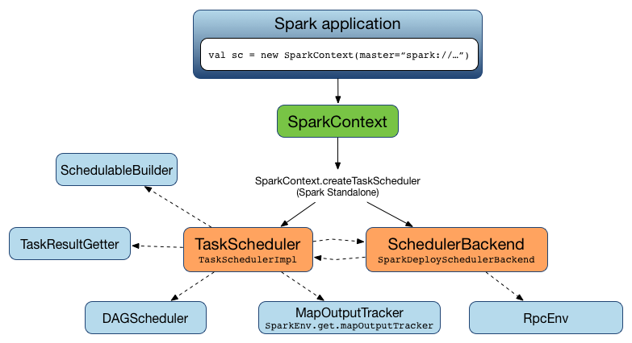
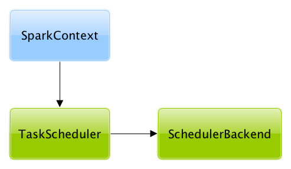

== [[TaskScheduler]] TaskScheduler -- Spark Scheduler

`TaskScheduler` is responsible for <<submitTasks, submitting tasks for execution>> in a Spark application (per <<schedulingMode, scheduling policy>>).

.TaskScheduler works for a single SparkContext

NOTE: `TaskScheduler` works closely with link:spark-dagscheduler.adoc[DAGScheduler] that <<submitTasks, submits sets of tasks for execution>> (for every stage in a Spark job).

`TaskScheduler` tracks the executors in a Spark application using <<executorHeartbeatReceived, executorHeartbeatReceived>> and <<executorLost, executorLost>> methods that are to inform about <<executorHeartbeatReceived, active>> and <<executorLost, lost>> executors, respectively.

Spark comes with the following custom `TaskSchedulers`:

* link:spark-TaskSchedulerImpl.adoc[TaskSchedulerImpl] -- the default `TaskScheduler` (that the following two YARN-specific `TaskSchedulers` extend).

* link:yarn/spark-yarn-yarnscheduler.adoc[YarnScheduler] for Spark on YARN in link:spark-submit.adoc#deploy-mode[client deploy mode].

* link:yarn/spark-yarn-yarnclusterscheduler.adoc[YarnClusterScheduler] for Spark on YARN in link:spark-submit.adoc#deploy-mode[cluster deploy mode].

NOTE: The source of `TaskScheduler` is available in https://github.com/apache/spark/blob/master/core/src/main/scala/org/apache/spark/scheduler/TaskScheduler.scala[org.apache.spark.scheduler.TaskScheduler].

=== [[contract]] TaskScheduler Contract

[source, scala]
----
trait TaskScheduler {
  def applicationAttemptId(): Option[String]
  def applicationId(): String
  def cancelTasks(stageId: Int, interruptThread: Boolean): Unit
  def defaultParallelism(): Int
  def executorHeartbeatReceived(
    execId: String,
    accumUpdates: Array[(Long, Seq[AccumulatorV2[_, _]])],
    blockManagerId: BlockManagerId): Boolean
  def executorLost(executorId: String, reason: ExecutorLossReason): Unit
  def postStartHook(): Unit
  def rootPool: Pool
  def schedulingMode: SchedulingMode
  def setDAGScheduler(dagScheduler: DAGScheduler): Unit
  def start(): Unit
  def stop(): Unit
  def submitTasks(taskSet: TaskSet): Unit
}
----

NOTE: `TaskScheduler` is a `private[spark]` contract.

.TaskScheduler Contract
[cols="1,2",options="header",width="100%"]
|===
| Method
| Description

| [[applicationAttemptId]] applicationAttemptId
| Unique identifier of an (execution) attempt of a Spark application.

Used exclusively when `SparkContext` link:spark-sparkcontext-creating-instance-internals.adoc#_applicationAttemptId[is initialized].

| [[applicationId]] applicationId
| Unique identifier of a Spark application.

By default, it is in the format `spark-application-[System.currentTimeMillis]`.

Used exclusively when `SparkContext` link:spark-sparkcontext-creating-instance-internals.adoc#_applicationId[is initialized] (to set link:spark-SparkConf.adoc#spark.app.id[spark.app.id]).

| [[cancelTasks]] cancelTasks
| Cancels all tasks of a given link:spark-DAGScheduler-Stage.adoc[stage].

Used exclusively when `DAGScheduler` link:spark-dagscheduler.adoc#failJobAndIndependentStages[fails a Spark job and independent single-job stages].

| [[defaultParallelism]] defaultParallelism
| Calculates the default level of parallelism.

Used when `SparkContext` link:spark-SparkContext.adoc#defaultParallelism[is requested for the default level of parallelism].

| [[executorHeartbeatReceived]] executorHeartbeatReceived
a| Intercepts heartbeats (with task metrics) from executors.

[source, scala]
----
executorHeartbeatReceived(
  execId: String,
  accumUpdates: Array[(Long, Seq[AccumulatorV2[_, _]])],
  blockManagerId: BlockManagerId): Boolean
----

Expected to return `true` when the executor `execId` is managed by the `TaskScheduler`. `false` is to indicate that the link:spark-Executor.adoc#reportHeartBeat[block manager (on the executor) should re-register].

Used exclusively when `HeartbeatReceiver` RPC endpoint link:spark-HeartbeatReceiver.adoc#Heartbeat[receives a heartbeat and task metrics from an executor].

| [[executorLost]] executorLost
| Intercepts events about executors getting lost.

Used when `HeartbeatReceiver` RPC endpoint link:spark-HeartbeatReceiver.adoc#expireDeadHosts[gets informed about disconnected executors] (i.e. that are no longer available) and when `DriverEndpoint` link:spark-CoarseGrainedSchedulerBackend-DriverEndpoint.adoc#removeExecutor[forgets] or link:spark-CoarseGrainedSchedulerBackend-DriverEndpoint.adoc#[disables] malfunctioning executors (i.e. either lost or blacklisted for some reason).

| <<postStartHook, postStartHook>>
| Post-start initialization.

Does nothing by default, but allows custom implementations for some additional post-start initialization.

Used exclusively when `SparkContext` link:spark-sparkcontext-creating-instance-internals.adoc#postStartHook[is created] (right before `SparkContext` is considered fully initialized).

| [[rootPool]] rootPool
| link:spark-taskscheduler-pool.adoc[Pool] (of link:spark-taskscheduler-schedulable.adoc[Schedulables]).

| [[schedulingMode]] schedulingMode
| Scheduling mode.

Puts tasks in order according to a link:spark-taskscheduler-schedulingmode.adoc[scheduling policy] (as `schedulingMode`). It is used in link:spark-SparkContext.adoc#getSchedulingMode[SparkContext.getSchedulingMode].

| [[setDAGScheduler]] setDAGScheduler
| Assigns link:spark-dagscheduler.adoc[DAGScheduler].

Used exclusively when `DAGScheduler` link:spark-dagscheduler.adoc#creating-instance[is created] (and passes on a reference to itself).

| [[start]] start
| Starts `TaskScheduler`.

Used exclusively when `SparkContext` link:spark-sparkcontext-creating-instance-internals.adoc#taskScheduler-start[is created].

| [[stop]] stop
| Stops `TaskScheduler`.

Used exclusively when `DAGScheduler` link:spark-dagscheduler.adoc#stop[is stopped].

| [[submitTasks]] submitTasks
| Submits tasks for execution (as link:spark-taskscheduler-tasksets.adoc[TaskSet]) of a given link:spark-DAGScheduler-Stage.adoc[stage].

Used exclusively when `DAGScheduler` link:spark-dagscheduler.adoc#submitMissingTasks[submits tasks (of a stage) for execution].
|===

=== [[lifecycle]] TaskScheduler's Lifecycle

A `TaskScheduler` is created while link:spark-SparkContext.adoc#creating-instance[SparkContext is being created] (by calling link:spark-sparkcontext-creating-instance-internals.adoc#createTaskScheduler[SparkContext.createTaskScheduler] for a given link:spark-deployment-environments.adoc[master URL] and link:spark-submit.adoc#deploy-mode[deploy mode]).

.TaskScheduler uses SchedulerBackend to support different clusters

At this point in SparkContext's lifecycle, the internal `_taskScheduler` points at the `TaskScheduler` (and it is "announced" by sending a blocking link:spark-HeartbeatReceiver.adoc#TaskSchedulerIsSet[`TaskSchedulerIsSet` message to HeartbeatReceiver RPC endpoint]).

The <<start, TaskScheduler is started>> right after the blocking `TaskSchedulerIsSet` message receives a response.

The <<applicationId, application ID>> and the <<applicationAttemptId, application's attempt ID>> are set at this point (and `SparkContext` uses the application id to set link:spark-SparkConf.adoc#spark.app.id[spark.app.id] Spark property, and configure link:spark-webui-SparkUI.adoc[SparkUI], and link:spark-blockmanager.adoc[BlockManager]).

CAUTION: FIXME The application id is described as "associated with the job." in TaskScheduler, but I think it is "associated with the application" and you can have many jobs per application.

Right before SparkContext is fully initialized, <<postStartHook, TaskScheduler.postStartHook>> is called.

The internal `_taskScheduler` is cleared (i.e. set to `null`) while link:spark-SparkContext.adoc#stop[SparkContext is being stopped].

<<stop, TaskScheduler is stopped>> while link:spark-dagscheduler.adoc#stop[DAGScheduler is being stopped].

WARNING: FIXME If it is SparkContext to start a TaskScheduler, shouldn't SparkContext stop it too? Why is this the way it is now?
