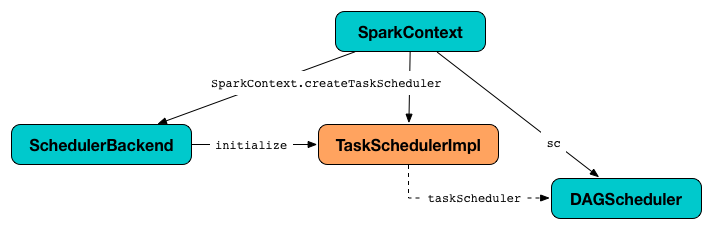
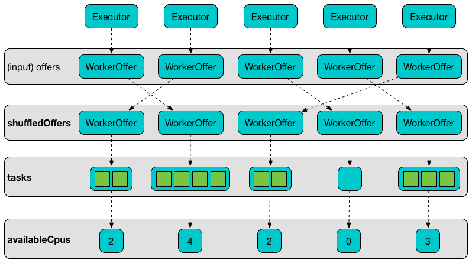
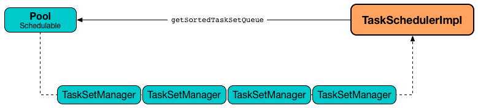

== [[TaskSchedulerImpl]] TaskSchedulerImpl -- Default TaskScheduler

`TaskSchedulerImpl` is the default link:spark-TaskScheduler.adoc[TaskScheduler].

`TaskSchedulerImpl` can schedule tasks for multiple types of cluster managers by means of link:spark-SchedulerBackend.adoc[SchedulerBackends].

When a Spark application starts (and so an instance of link:spark-SparkContext.adoc#creating-instance[SparkContext is created]) `TaskSchedulerImpl` with a link:spark-SchedulerBackend.adoc[SchedulerBackend] and link:spark-dagscheduler.adoc[DAGScheduler] are created and soon started.

.TaskSchedulerImpl and Other Services


`TaskSchedulerImpl` <<resourceOffers, generates tasks for executor resource offers>>.

`TaskSchedulerImpl` can <<getRackForHost, track racks per host and port>> (that however is link:yarn/spark-yarn-yarnscheduler.adoc[only used with Hadoop YARN cluster manager]).

Using <<spark_scheduler_mode, spark.scheduler.mode>> setting you can select the link:spark-taskscheduler-schedulingmode.adoc[scheduling policy].

`TaskSchedulerImpl` <<submitTasks, submits tasks>> using link:spark-taskscheduler-schedulablebuilders.adoc[SchedulableBuilders].

[[internal-registries]]
.TaskSchedulerImpl's Internal Registries and Counters
[cols="1,2",options="header",width="100%"]
|===
| Name
| Description

| [[backend]] `backend`
| link:spark-SchedulerBackend.adoc[SchedulerBackend]

Set when `TaskSchedulerImpl` <<initialize, is initialized>>.

| [[dagScheduler]] `dagScheduler`
| link:spark-dagscheduler.adoc[DAGScheduler]

Used when...FIXME

| [[executorIdToHost]] `executorIdToHost`
| Lookup table of hosts per executor.

Used when...FIXME

| [[executorIdToRunningTaskIds]] `executorIdToRunningTaskIds`
| Lookup table of running tasks per executor.

Used when...FIXME

| [[executorIdToTaskCount]] `executorIdToTaskCount`
| Lookup table of the number of running tasks by link:spark-Executor.adoc[executor].

| [[executorsByHost]] `executorsByHost`
| Collection of link:spark-Executor.adoc[executors] per host

| [[hasLaunchedTask]] `hasLaunchedTask`
| Flag...FIXME

Used when...FIXME

| [[hostToExecutors]] `hostToExecutors`
| Lookup table of executors per hosts in a cluster.

Used when...FIXME

| [[hostsByRack]] `hostsByRack`
| Lookup table of hosts per rack.

Used when...FIXME

| [[nextTaskId]] `nextTaskId`
| The next link:spark-taskscheduler-tasks.adoc[task] id counting from `0`.

Used when `TaskSchedulerImpl`...

| [[rootPool]] `rootPool`
| Schedulable link:spark-taskscheduler-pool.adoc[Pool]

Used when `TaskSchedulerImpl`...

| [[schedulingMode]] `schedulingMode`
| link:spark-taskscheduler-schedulingmode.adoc[SchedulingMode]

Used when `TaskSchedulerImpl`...

| [[taskSetsByStageIdAndAttempt]] `taskSetsByStageIdAndAttempt`
| Lookup table of link:spark-taskscheduler-tasksets.adoc[TaskSet] by stage and attempt ids.

| [[taskIdToExecutorId]] `taskIdToExecutorId`
| Lookup table of link:spark-Executor.adoc[executor] by task id.

| [[taskIdToTaskSetManager]] `taskIdToTaskSetManager`
| Registry of active link:spark-TaskSetManager.adoc[TaskSetManager] per task id.
|===

[TIP]
====
Enable `INFO` or `DEBUG` logging levels for `org.apache.spark.scheduler.TaskSchedulerImpl` logger to see what happens inside.

Add the following line to `conf/log4j.properties`:

```
log4j.logger.org.apache.spark.scheduler.TaskSchedulerImpl=DEBUG
```

Refer to link:spark-logging.adoc[Logging].
====

=== [[applicationId]] Finding Unique Identifier of Spark Application -- `applicationId` Method

[source, scala]
----
applicationId(): String
----

NOTE: `applicationId` is part of link:spark-TaskScheduler.adoc#contract[TaskScheduler contract] to find the Spark application's id.

`applicationId` simply request <<backend, SchedulerBackend>> for the link:spark-SchedulerBackend.adoc#applicationId[Spark application's id].

=== [[nodeBlacklist]] `nodeBlacklist` Method

CAUTION: FIXME

=== [[cleanupTaskState]] `cleanupTaskState` Method

CAUTION: FIXME

=== [[newTaskId]] `newTaskId` Method

CAUTION: FIXME

=== [[getExecutorsAliveOnHost]] `getExecutorsAliveOnHost` Method

CAUTION: FIXME

=== [[isExecutorAlive]] `isExecutorAlive` Method

CAUTION: FIXME

=== [[hasExecutorsAliveOnHost]] `hasExecutorsAliveOnHost` Method

CAUTION: FIXME

=== [[hasHostAliveOnRack]] `hasHostAliveOnRack` Method

CAUTION: FIXME

=== [[executorLost]] `executorLost` Method

CAUTION: FIXME

=== [[mapOutputTracker]] `mapOutputTracker`

CAUTION: FIXME

=== [[starvationTimer]] `starvationTimer`

CAUTION: FIXME

=== [[executorHeartbeatReceived]] `executorHeartbeatReceived` Method

[source, scala]
----
executorHeartbeatReceived(
  execId: String,
  accumUpdates: Array[(Long, Seq[AccumulatorV2[_, _]])],
  blockManagerId: BlockManagerId): Boolean
----

`executorHeartbeatReceived` is...

CAUTION: FIXME

NOTE: `executorHeartbeatReceived` is part of the link:spark-TaskScheduler.adoc#contract[TaskScheduler Contract].

=== [[cancelTasks]] Cancelling Tasks for Stage -- `cancelTasks` Method

[source, scala]
----
cancelTasks(stageId: Int, interruptThread: Boolean): Unit
----

NOTE: `cancelTasks` is part of link:spark-TaskScheduler.adoc#contract[TaskScheduler contract].

`cancelTasks` cancels all tasks submitted for execution in a stage `stageId`.

NOTE: `cancelTasks` is used exclusively when `DAGScheduler` link:spark-dagscheduler.adoc#failJobAndIndependentStages[cancels a stage].

=== [[handleSuccessfulTask]] `handleSuccessfulTask` Method

[source, scala]
----
handleSuccessfulTask(
  taskSetManager: TaskSetManager,
  tid: Long,
  taskResult: DirectTaskResult[_]): Unit
----

`handleSuccessfulTask` simply link:spark-TaskSetManager.adoc#handleSuccessfulTask[forwards the call to the input `taskSetManager`] (passing `tid` and `taskResult`).

NOTE: `handleSuccessfulTask` is called when link:spark-TaskResultGetter.adoc#enqueueSuccessfulTask[`TaskSchedulerGetter` has managed to deserialize the task result of a task that finished successfully].

=== [[handleTaskGettingResult]] `handleTaskGettingResult` Method

[source, scala]
----
handleTaskGettingResult(taskSetManager: TaskSetManager, tid: Long): Unit
----

`handleTaskGettingResult` simply link:spark-TaskSetManager.adoc#handleTaskGettingResult[forwards the call to the `taskSetManager`].

NOTE: `handleTaskGettingResult` is used to inform that link:spark-TaskResultGetter.adoc#enqueueSuccessfulTask[`TaskResultGetter` enqueues a successful task with `IndirectTaskResult` task result (and so is about to fetch a remote block from a `BlockManager`)].

=== [[applicationAttemptId]] `applicationAttemptId` Method

[source, scala]
----
applicationAttemptId(): Option[String]
----

CAUTION: FIXME

=== [[schedulableBuilder]] `schedulableBuilder` Attribute

`schedulableBuilder` is a link:spark-taskscheduler-schedulablebuilders.adoc[SchedulableBuilder] for the `TaskSchedulerImpl`.

It is set up when a <<initialize, `TaskSchedulerImpl` is initialized>> and can be one of two available builders:

* link:spark-taskscheduler-FIFOSchedulableBuilder.adoc[FIFOSchedulableBuilder] when scheduling policy is FIFO (which is the default scheduling policy).

* link:spark-taskscheduler-FairSchedulableBuilder.adoc[FairSchedulableBuilder] for FAIR scheduling policy.

NOTE: Use <<spark_scheduler_mode, spark.scheduler.mode>> setting to select the scheduling policy.

=== [[getRackForHost]] Tracking Racks per Hosts and Ports -- `getRackForHost` Method

[source, scala]
----
getRackForHost(value: String): Option[String]
----

`getRackForHost` is a method to know about the racks per hosts and ports. By default, it assumes that racks are unknown (i.e. the method returns `None`).

NOTE: It is overriden by the YARN-specific TaskScheduler link:yarn/spark-yarn-yarnscheduler.adoc[YarnScheduler].

`getRackForHost` is currently used in two places:

* <<resourceOffers, TaskSchedulerImpl.resourceOffers>> to track hosts per rack (using the <<internal-registries, internal `hostsByRack` registry>>) while processing resource offers.

* <<removeExecutor, TaskSchedulerImpl.removeExecutor>> to...FIXME

* link:spark-TaskSetManager.adoc#addPendingTask[TaskSetManager.addPendingTask], link:spark-TaskSetManager.adoc#[TaskSetManager.dequeueTask], and link:spark-TaskSetManager.adoc#dequeueSpeculativeTask[TaskSetManager.dequeueSpeculativeTask]

=== [[creating-instance]] Creating TaskSchedulerImpl Instance

`TaskSchedulerImpl` takes the following when created:

* [[sc]] link:spark-SparkContext.adoc[SparkContext]
* <<maxTaskFailures, Acceptable number of task failures>>
* [[blacklistTrackerOpt]] optional `BlacklistTracker`
* [[isLocal]] optional `isLocal` flag to differentiate between local and cluster run modes (defaults to `false`)

`TaskSchedulerImpl` initializes the <<internal-registries, internal registries and counters>>.

NOTE: There is another `TaskSchedulerImpl` constructor that requires a link:spark-SparkContext.adoc[SparkContext] object only and sets <<maxTaskFailures, maxTaskFailures>> to <<spark_task_maxFailures, spark.task.maxFailures>> or, if not set, defaults to `4`.

`TaskSchedulerImpl` sets link:spark-TaskScheduler.adoc#contract[schedulingMode] to the value of <<spark_scheduler_mode, spark.scheduler.mode>> setting (defaults to `FIFO`).

NOTE: `schedulingMode` is part of link:spark-TaskScheduler.adoc#contract[TaskScheduler Contract].

Failure to set `schedulingMode` results in a `SparkException`:

```
Unrecognized spark.scheduler.mode: [schedulingModeConf]
```

Ultimately, `TaskSchedulerImpl` creates a link:spark-TaskResultGetter.adoc[TaskResultGetter].

=== [[initialize]] Saving SchedulerBackend and Building Schedulable Pools (aka Initializing TaskSchedulerImpl) -- `initialize` Method

[source, scala]
----
initialize(backend: SchedulerBackend): Unit
----

`initialize` initializes `TaskSchedulerImpl`.

.TaskSchedulerImpl initialization
image::images/TaskSchedulerImpl-initialize.png[align="center"]

`initialize` saves the input <<backend, SchedulerBackend>>.

`initialize` then sets <<rootPool, schedulable `Pool`>> as an empty-named link:spark-taskscheduler-pool.adoc[Pool] (passing in <<schedulingMode, SchedulingMode>>, `initMinShare` and `initWeight` as `0`).

NOTE: <<schedulingMode, SchedulingMode>> is defined when <<creating-instance, `TaskSchedulerImpl` is created>>.

NOTE: <<schedulingMode, schedulingMode>> and <<rootPool, rootPool>> are a part of link:spark-TaskScheduler.adoc#contract[TaskScheduler Contract].

`initialize` sets <<schedulableBuilder, SchedulableBuilder>> (based on <<schedulingMode, SchedulingMode>>):

* link:spark-taskscheduler-FIFOSchedulableBuilder.adoc[FIFOSchedulableBuilder] for `FIFO` scheduling mode
* link:spark-taskscheduler-FairSchedulableBuilder.adoc[FairSchedulableBuilder] for `FAIR` scheduling mode

`initialize` link:spark-taskscheduler-schedulablebuilders.adoc#buildPools[requests `SchedulableBuilder` to build pools].

CAUTION: FIXME Why are `rootPool` and `schedulableBuilder` created only now? What do they need that it is not available when `TaskSchedulerImpl` is created?

NOTE: `initialize` is called while link:spark-sparkcontext-creating-instance-internals.adoc#createTaskScheduler[SparkContext is created and creates `SchedulerBackend` and `TaskScheduler`].

=== [[start]] Starting TaskSchedulerImpl -- `start` Method

As part of link:spark-sparkcontext-creating-instance-internals.adoc[initialization of a `SparkContext`], `TaskSchedulerImpl` is started (using `start` from the link:spark-TaskScheduler.adoc#contract[TaskScheduler Contract]).

[source, scala]
----
start(): Unit
----

`start` starts the link:spark-SchedulerBackend.adoc[scheduler backend].

.Starting `TaskSchedulerImpl` in Spark Standalone
image::images/taskschedulerimpl-start-standalone.png[align="center"]

`start` also starts <<task-scheduler-speculation, `task-scheduler-speculation` executor service>>.

=== [[statusUpdate]] Handling Task Status Update -- `statusUpdate` Method

[source, scala]
----
statusUpdate(tid: Long, state: TaskState, serializedData: ByteBuffer): Unit
----

`statusUpdate` finds link:spark-TaskSetManager.adoc[TaskSetManager] for the input `tid` task (in <<taskIdToTaskSetManager, taskIdToTaskSetManager>>).

When `state` is `LOST`, `statusUpdate`...FIXME

NOTE: `TaskState.LOST` is only used by the deprecated Mesos fine-grained scheduling mode.

When `state` is one of the link:spark-taskscheduler-tasks.adoc#states[finished states], i.e. `FINISHED`, `FAILED`, `KILLED` or `LOST`, `statusUpdate` <<cleanupTaskState, cleanupTaskState>> for the input `tid`.

`statusUpdate` link:spark-TaskSetManager.adoc#removeRunningTask[requests `TaskSetManager` to unregister `tid` from running tasks].

`statusUpdate` requests <<taskResultGetter, TaskResultGetter>> to link:spark-TaskResultGetter.adoc#enqueueSuccessfulTask[schedule an asynchrounous task to deserialize the task result (and notify `TaskSchedulerImpl` back)] for `tid` in `FINISHED` state and link:spark-TaskResultGetter.adoc#enqueueFailedTask[schedule an asynchrounous task to deserialize `TaskFailedReason` (and notify `TaskSchedulerImpl` back)] for `tid` in the other finished states (i.e. `FAILED`, `KILLED`, `LOST`).

If a task is in `LOST` state, `statusUpdate` link:spark-dagscheduler.adoc#executorLost[notifies `DAGScheduler` that the executor was lost] (with `SlaveLost` and the reason `Task [tid] was lost, so marking the executor as lost as well.`) and link:spark-SchedulerBackend.adoc#reviveOffers[requests `SchedulerBackend` to revive offers].

In case the `TaskSetManager` for `tid` could not be found (in <<taskIdToTaskSetManager, taskIdToTaskSetManager>> registry), you should see the following ERROR message in the logs:

```
ERROR Ignoring update with state [state] for TID [tid] because its task set is gone (this is likely the result of receiving duplicate task finished status updates)
```

Any exception is caught and reported as ERROR message in the logs:

```
ERROR Exception in statusUpdate
```

CAUTION: FIXME image with scheduler backends calling `TaskSchedulerImpl.statusUpdate`.

[NOTE]
====
`statusUpdate` is used when:

1. `DriverEndpoint` (of link:spark-CoarseGrainedSchedulerBackend.adoc[CoarseGrainedSchedulerBackend]) is requested to link:spark-CoarseGrainedSchedulerBackend-DriverEndpoint.adoc#StatusUpdate[handle a StatusUpdate message]

1. `LocalEndpoint` is requested to link:spark-LocalEndpoint.adoc#StatusUpdate[handle a StatusUpdate message]

1. `MesosFineGrainedSchedulerBackend` is requested to handle a task status update
====

=== [[speculationScheduler]][[task-scheduler-speculation]] task-scheduler-speculation Scheduled Executor Service -- `speculationScheduler` Internal Attribute

`speculationScheduler` is a http://docs.oracle.com/javase/8/docs/api/java/util/concurrent/ScheduledExecutorService.html[java.util.concurrent.ScheduledExecutorService] with the name *task-scheduler-speculation* for link:spark-taskschedulerimpl-speculative-execution.adoc[speculative execution of tasks].

When <<start, `TaskSchedulerImpl` starts>> (in non-local run mode) with link:spark-taskschedulerimpl-speculative-execution.adoc#spark_speculation[spark.speculation] enabled, `speculationScheduler` is used to schedule <<checkSpeculatableTasks, checkSpeculatableTasks>> to execute periodically every link:spark-taskschedulerimpl-speculative-execution.adoc#spark_speculation_interval[spark.speculation.interval] after the initial `spark.speculation.interval` passes.

`speculationScheduler` is shut down when <<stop, `TaskSchedulerImpl` stops>>.

=== [[checkSpeculatableTasks]] Checking for Speculatable Tasks -- `checkSpeculatableTasks` Method

[source, scala]
----
checkSpeculatableTasks(): Unit
----

`checkSpeculatableTasks` requests `rootPool` to check for speculatable tasks (if they ran for more than `100` ms) and, if there any, requests link:spark-SchedulerBackend.adoc#reviveOffers[`SchedulerBackend` to revive offers].

NOTE: `checkSpeculatableTasks` is executed periodically as part of link:spark-taskschedulerimpl-speculative-execution.adoc[speculative execution of tasks].

=== [[maxTaskFailures]] Acceptable Number of Task Failures -- `maxTaskFailures` Attribute

The acceptable number of task failures (`maxTaskFailures`) can be explicitly defined when <<creating-instance, creating TaskSchedulerImpl instance>> or based on <<spark_task_maxFailures, spark.task.maxFailures>> setting that defaults to 4 failures.

NOTE: It is exclusively used when <<submitTasks, submitting tasks>> through link:spark-TaskSetManager.adoc[TaskSetManager].

=== [[removeExecutor]] Cleaning up After Removing Executor -- `removeExecutor` Internal Method

[source, scala]
----
removeExecutor(executorId: String, reason: ExecutorLossReason): Unit
----

`removeExecutor` removes the `executorId` executor from the following <<internal-registries, internal registries>>: <<executorIdToTaskCount, executorIdToTaskCount>>, `executorIdToHost`, `executorsByHost`, and `hostsByRack`. If the affected hosts and racks are the last entries in `executorsByHost` and `hostsByRack`, appropriately, they are removed from the registries.

Unless `reason` is `LossReasonPending`, the executor is removed from `executorIdToHost` registry and link:spark-taskscheduler-schedulable.adoc#executorLost[TaskSetManagers get notified].

NOTE: The internal `removeExecutor` is called as part of <<statusUpdate, statusUpdate>> and link:spark-TaskScheduler.adoc#executorLost[executorLost].

=== [[postStartHook]] Intercepting Nearly-Completed SparkContext Initialization -- `postStartHook` Callback

`postStartHook` is a custom implementation of link:spark-TaskScheduler.adoc#contract[postStartHook from the TaskScheduler Contract] that waits until a scheduler backend is ready (using the internal blocking <<waitBackendReady, waitBackendReady>>).

NOTE: `postStartHook` is used when link:spark-SparkContext.adoc#creating-instance[SparkContext is created] (before it is fully created) and link:yarn/spark-yarn-yarnclusterscheduler.adoc#postStartHook[YarnClusterScheduler.postStartHook].

=== [[stop]] Stopping TaskSchedulerImpl -- `stop` Method

[source, scala]
----
stop(): Unit
----

`stop()` stops all the internal services, i.e. <<task-scheduler-speculation, `task-scheduler-speculation` executor service>>, link:spark-SchedulerBackend.adoc[SchedulerBackend], link:spark-TaskResultGetter.adoc[TaskResultGetter], and <<starvationTimer, starvationTimer>> timer.

=== [[defaultParallelism]] Finding Default Level of Parallelism -- `defaultParallelism` Method

[source, scala]
----
defaultParallelism(): Int
----

NOTE: `defaultParallelism` is part of link:spark-TaskScheduler.adoc#defaultParallelism[TaskScheduler contract] as a hint for sizing jobs.

`defaultParallelism` simply requests <<backend, SchedulerBackend>> for the link:spark-SchedulerBackend.adoc#defaultParallelism[default level of parallelism].

NOTE: *Default level of parallelism* is a hint for sizing jobs that `SparkContext` link:spark-SparkContext.adoc#defaultParallelism[uses to create RDDs with the right number of partitions when not specified explicitly].

=== [[submitTasks]] Submitting Tasks for Execution (from TaskSet for Stage) -- `submitTasks` Method

[source, scala]
----
submitTasks(taskSet: TaskSet): Unit
----

NOTE: `submitTasks` is part of link:spark-TaskScheduler.adoc#contract[TaskScheduler Contract].

.TaskSchedulerImpl.submitTasks
image::images/taskschedulerImpl-submitTasks.png[align="center"]

When executed, you should see the following INFO message in the logs:

```
INFO TaskSchedulerImpl: Adding task set [id] with [count] tasks
```

`submitTasks` <<createTaskSetManager, creates a `TaskSetManager`>> (for the input `taskSet` and <<maxTaskFailures, acceptable number of task failures>>).

NOTE: `submitTasks` uses <<maxTaskFailures, acceptable number of task failures>> that is defined when <<creating-instance, `TaskSchedulerImpl` is created>>.

`submitTasks` registers the `TaskSetManager` per stage and stage attempt id (in <<taskSetsByStageIdAndAttempt, taskSetsByStageIdAndAttempt>>).

NOTE: The stage and the stage attempt id are attributes of a link:spark-taskscheduler-tasksets.adoc[TaskSet].

NOTE: `submitTasks` assumes that only one `TaskSet` can be active for a `Stage`.

If there is more than one active link:spark-TaskSetManager.adoc[TaskSetManager] for the stage, `submitTasks` reports a `IllegalStateException` with the message:

```
more than one active taskSet for stage [stage]: [TaskSet ids]
```

NOTE: `TaskSetManager` is considered *active* when it is not a *zombie*.
`submitTasks` link:spark-taskscheduler-schedulablebuilders.adoc#addTaskSetManager[adds the `TaskSetManager` to the `Schedulable` root pool] (available as <<schedulableBuilder, schedulableBuilder>>).

NOTE: The link:spark-TaskScheduler.adoc#rootPool[root pool] can be a single flat linked queue (in link:spark-taskscheduler-FIFOSchedulableBuilder.adoc[FIFO scheduling mode]) or a hierarchy of pools of `Schedulables` (in link:spark-taskscheduler-FairSchedulableBuilder.adoc[FAIR scheduling mode]).

`submitTasks` makes sure that the requested resources, i.e. CPU and memory, are assigned to the Spark application for a <<isLocal, non-local environment>>.

When `submitTasks` is called the very first time (`hasReceivedTask` is `false`) in cluster mode only (i.e. `isLocal` of the `TaskSchedulerImpl` is `false`), `starvationTimer` is scheduled to execute after <<spark_starvation_timeout, spark.starvation.timeout>>  to ensure that the requested resources, i.e. CPUs and memory, were assigned by a cluster manager.

NOTE: After the first `spark.starvation.timeout` passes, the internal `hasReceivedTask` flag becomes `true`.

Every time the starvation timer thread is executed and `hasLaunchedTask` flag is `false`, the following WARN message is printed out to the logs:

```
WARN Initial job has not accepted any resources; check your cluster UI to ensure that workers are registered and have sufficient resources
```

Otherwise, when the `hasLaunchedTask` flag is `true` the timer thread cancels itself.

In the end, `submitTasks` link:spark-SchedulerBackend.adoc#reviveOffers[requests the current `SchedulerBackend` to revive offers] (available as <<backend, backend>>).

TIP: Use `dag-scheduler-event-loop` thread to step through the code in a debugger.

=== [[createTaskSetManager]] Creating TaskSetManager -- `createTaskSetManager` Method

[source, scala]
----
createTaskSetManager(taskSet: TaskSet, maxTaskFailures: Int): TaskSetManager
----

`createTaskSetManager` link:spark-TaskSetManager.adoc#creating-instance[creates a `TaskSetManager`] (passing on the reference to `TaskSchedulerImpl`, the input `taskSet` and `maxTaskFailures`, and optional `BlacklistTracker`).

NOTE: `createTaskSetManager` uses the optional <<blacklistTrackerOpt, BlacklistTracker>> that is specified when <<creating-instance, `TaskSchedulerImpl` is created>>.

NOTE: `createTaskSetManager` is used exclusively when <<submitTasks, `TaskSchedulerImpl` submits tasks (for a given `TaskSet`)>>.

=== [[handleFailedTask]] Notifying TaskSetManager that Task Failed -- `handleFailedTask` Method

[source, scala]
----
handleFailedTask(
  taskSetManager: TaskSetManager,
  tid: Long,
  taskState: TaskState,
  reason: TaskFailedReason): Unit
----

`handleFailedTask` link:spark-TaskSetManager.adoc#handleFailedTask[notifies `taskSetManager` that `tid` task has failed] and, only when link:spark-TaskSetManager.adoc#zombie-state[`taskSetManager` is not in zombie state] and `tid` is not in `KILLED` state, link:spark-SchedulerBackend.adoc#reviveOffers[requests `SchedulerBackend` to revive offers].

NOTE: `handleFailedTask` is called when link:spark-TaskResultGetter.adoc#enqueueSuccessfulTask[`TaskResultGetter` deserializes a `TaskFailedReason`] for a failed task.

=== [[taskSetFinished]] `taskSetFinished` Method

[source, scala]
----
taskSetFinished(manager: TaskSetManager): Unit
----

`taskSetFinished` looks all link:spark-taskscheduler-tasksets.adoc[TaskSet]s up by the stage id (in <<taskSetsByStageIdAndAttempt, taskSetsByStageIdAndAttempt>> registry) and removes the stage attempt from them, possibly with removing the entire stage record from `taskSetsByStageIdAndAttempt` registry completely (if there are no other attempts registered).

.TaskSchedulerImpl.taskSetFinished is called when all tasks are finished
image::images/taskschedulerimpl-tasksetmanager-tasksetfinished.png[align="center"]

NOTE: A `TaskSetManager` manages a `TaskSet` for a stage.

`taskSetFinished` then link:spark-taskscheduler-pool.adoc#removeSchedulable[removes `manager` from the parent's schedulable pool].

You should see the following INFO message in the logs:

```
INFO Removed TaskSet [id], whose tasks have all completed, from pool [name]
```

NOTE: `taskSetFinished` method is called when link:spark-TaskSetManager.adoc#maybeFinishTaskSet[`TaskSetManager` has received the results of all the tasks in a `TaskSet`].

=== [[executorAdded]] Notifying DAGScheduler About New Executor -- `executorAdded` Method

[source, scala]
----
executorAdded(execId: String, host: String)
----

`executorAdded` just link:spark-dagscheduler.adoc#executorAdded[notifies `DAGScheduler` that an executor was added].

CAUTION: FIXME Image with a call from TaskSchedulerImpl to DAGScheduler, please.

NOTE: `executorAdded` uses <<dagScheduler, DAGScheduler>> that was given when <<setDAGScheduler, setDAGScheduler>>.

=== [[waitBackendReady]] Waiting Until SchedulerBackend is Ready -- `waitBackendReady` Internal Method

[source, scala]
----
waitBackendReady(): Unit
----

`waitBackendReady` waits until a link:spark-SchedulerBackend.adoc#isReady[SchedulerBackend is ready].

NOTE: link:spark-SchedulerBackend.adoc#isReady[`SchedulerBackend` is ready] by default.

`waitBackendReady` keeps checking the status every `100` milliseconds until `SchedulerBackend` is ready or the link:spark-SparkContext.adoc#stop[SparkContext is stopped].

If the `SparkContext` happens to be stopped while waiting, `waitBackendReady` reports a `IllegalStateException`:

```
Spark context stopped while waiting for backend
```

NOTE: `waitBackendReady` is used when `TaskSchedulerImpl` <<postStartHook, is notified that `SparkContext` is near to get fully initialized>>.

=== [[resourceOffers]] Creating TaskDescriptions For Available Executor Resource Offers (with CPU Cores) -- `resourceOffers` Method

[source, scala]
----
resourceOffers(offers: Seq[WorkerOffer]): Seq[Seq[TaskDescription]]
----

`resourceOffers` takes the resources `offers` (as <<WorkerOffer, WorkerOffers>>) and generates a collection of tasks (as link:spark-TaskDescription.adoc[TaskDescription]) to launch (given the resources available).

NOTE: <<WorkerOffer, WorkerOffer>> represents a resource offer with CPU cores free to use on an executor.

.Processing Executor Resource Offers
image::images/taskscheduler-resourceOffers.png[align="center"]

Internally, `resourceOffers` first updates <<hostToExecutors, hostToExecutors>> and <<executorIdToHost, executorIdToHost>> lookup tables to record new hosts and executors (given the input `offers`).

For new executors (not in <<executorIdToRunningTaskIds, executorIdToRunningTaskIds>>) `resourceOffers` <<executorAdded, notifies `DAGScheduler` that an executor was added>>.

NOTE: `TaskSchedulerImpl` uses `resourceOffers` to track active executors.

CAUTION: FIXME a picture with `executorAdded` call from TaskSchedulerImpl to DAGScheduler.

`resourceOffers` requests `BlacklistTracker` to `applyBlacklistTimeout` and filters out offers on blacklisted nodes and executors.

NOTE: `resourceOffers` uses the optional <<blacklistTrackerOpt, BlacklistTracker>> that was given when <<creating-instance, `TaskSchedulerImpl` was created>>.

CAUTION: FIXME Expand on blacklisting

`resourceOffers` then randomly shuffles offers (to evenly distribute tasks across executors and avoid over-utilizing some executors) and initializes the local data structures `tasks` and `availableCpus` (as shown in the figure below).

.Internal Structures of resourceOffers with 5 WorkerOffers (with 4, 2, 0, 3, 2 free cores)


`resourceOffers` link:spark-taskscheduler-pool.adoc#getSortedTaskSetQueue[takes `TaskSets` in scheduling order] from link:spark-TaskScheduler.adoc#rootPool[top-level Schedulable Pool].

.TaskSchedulerImpl Requesting TaskSets (as TaskSetManagers) from Root Pool


[NOTE]
====
`rootPool` is configured when <<initialize, `TaskSchedulerImpl` is initialized>>.

`rootPool` is part of the link:spark-TaskScheduler.adoc#rootPool[TaskScheduler Contract] and exclusively managed by link:spark-taskscheduler-schedulablebuilders.adoc[SchedulableBuilders], i.e. link:spark-taskscheduler-FIFOSchedulableBuilder.adoc[FIFOSchedulableBuilder] and link:spark-taskscheduler-FairSchedulableBuilder.adoc[FairSchedulableBuilder] (that  link:spark-taskscheduler-schedulablebuilders.adoc#addTaskSetManager[manage registering TaskSetManagers with the root pool]).

link:spark-TaskSetManager.adoc[TaskSetManager] manages execution of the tasks in a single link:spark-taskscheduler-tasksets.adoc[TaskSet] that represents a single link:spark-DAGScheduler-Stage.adoc[Stage].
====

For every `TaskSetManager` (in scheduling order), you should see the following DEBUG message in the logs:

```
DEBUG TaskSchedulerImpl: parentName: [name], name: [name], runningTasks: [count]
```

Only if a new executor was added, `resourceOffers` link:spark-TaskSetManager.adoc#executorAdded[notifies every `TaskSetManager` about the change] (to recompute locality preferences).

`resourceOffers` then takes every `TaskSetManager` (in scheduling order) and offers them each node in increasing order of locality levels (per link:spark-TaskSetManager.adoc#computeValidLocalityLevels[TaskSetManager's valid locality levels]).

NOTE: A `TaskSetManager` link:spark-TaskSetManager.adoc##computeValidLocalityLevels[computes locality levels of the tasks] it manages.

For every `TaskSetManager` and the ``TaskSetManager``'s valid locality level, `resourceOffers` tries to <<resourceOfferSingleTaskSet, find tasks to schedule (on executors)>> as long as the `TaskSetManager` manages to launch a task (given the locality level).

If `resourceOffers` did not manage to offer resources to a `TaskSetManager` so it could launch any task, `resourceOffers` link:spark-TaskSetManager.adoc#abortIfCompletelyBlacklisted[requests the `TaskSetManager` to abort the `TaskSet` if completely blacklisted].

When `resourceOffers` managed to launch a task, the internal <<hasLaunchedTask, hasLaunchedTask>> flag gets enabled (that effectively means what the name says _"there were executors and I managed to launch a task"_).

[NOTE]
====
`resourceOffers` is used when:

* link:spark-CoarseGrainedSchedulerBackend-DriverEndpoint.adoc#makeOffers[`CoarseGrainedSchedulerBackend` (via RPC endpoint) makes executor resource offers]

* link:spark-LocalEndpoint.adoc#reviveOffers[`LocalEndpoint` revives resource offers]

* Spark on Mesos' `MesosFineGrainedSchedulerBackend` does `resourceOffers`
====

=== [[resourceOfferSingleTaskSet]] Finding Tasks from TaskSetManager to Schedule on Executors -- `resourceOfferSingleTaskSet` Internal Method

[source, scala]
----
resourceOfferSingleTaskSet(
  taskSet: TaskSetManager,
  maxLocality: TaskLocality,
  shuffledOffers: Seq[WorkerOffer],
  availableCpus: Array[Int],
  tasks: Seq[ArrayBuffer[TaskDescription]]): Boolean
----

`resourceOfferSingleTaskSet` takes every `WorkerOffer` (from the input `shuffledOffers`) and (only if the number of available CPU cores (using the input `availableCpus`) is at least <<spark.task.cpus, spark.task.cpus>>) link:spark-TaskSetManager.adoc#resourceOffer[requests `TaskSetManager` (as the input `taskSet`) to find a `Task` to execute (given the resource offer)] (as an executor, a host, and the input `maxLocality`).

`resourceOfferSingleTaskSet` adds the task to the input `tasks` collection.

`resourceOfferSingleTaskSet` records the task id and `TaskSetManager` in the following registries:

* <<taskIdToTaskSetManager, taskIdToTaskSetManager>>
* <<taskIdToExecutorId, taskIdToExecutorId>>
* <<executorIdToRunningTaskIds, executorIdToRunningTaskIds>>

`resourceOfferSingleTaskSet` decreases <<spark.task.cpus, spark.task.cpus>> from the input `availableCpus` (for the `WorkerOffer`).

NOTE: `resourceOfferSingleTaskSet` makes sure that the number of available CPU cores (in the input `availableCpus` per `WorkerOffer`) is at least `0`.

If there is a `TaskNotSerializableException`, you should see the following ERROR in the logs:

```
ERROR Resource offer failed, task set [name] was not serializable
```

`resourceOfferSingleTaskSet` returns whether a task was launched or not.

NOTE: `resourceOfferSingleTaskSet` is used when `TaskSchedulerImpl` <<resourceOffers, creates `TaskDescriptions` for available executor resource offers (with CPU cores)>>.

=== [[TaskLocality]] TaskLocality -- Task Locality Preference

`TaskLocality` represents a task locality preference and can be one of the following (from most localized to the widest):

. `PROCESS_LOCAL`
. `NODE_LOCAL`
. `NO_PREF`
. `RACK_LOCAL`
. `ANY`

=== [[WorkerOffer]] WorkerOffer -- Free CPU Cores on Executor

[source, scala]
----
WorkerOffer(executorId: String, host: String, cores: Int)
----

`WorkerOffer` represents a resource offer with free CPU `cores` available on an `executorId` executor on a `host`.

=== [[settings]] Settings

.Spark Properties
[cols="1,1,2",options="header",width="100%"]
|===
| Spark Property
| Default Value
| Description

| [[spark_task_maxFailures]][[spark.task.maxFailures]] `spark.task.maxFailures`
a|

* `4` in link:spark-cluster.adoc[cluster mode]
* `1` in link:spark-local.adoc[local]
* `maxFailures` in link:spark-local.adoc#masterURL[local-with-retries]

| The number of individual task failures before giving up on the entire link:spark-taskscheduler-tasksets.adoc[TaskSet] and the job afterwards.

| [[spark.task.cpus]] `spark.task.cpus`
| `1`
| The number of CPU cores per task.

| [[spark_starvation_timeout]] `spark.starvation.timeout` | `15s` | Threshold above which Spark warns a user that an initial TaskSet may be starved.

| [[spark_scheduler_mode]] `spark.scheduler.mode` | `FIFO` | A case-insensitive name of the link:spark-taskscheduler-schedulingmode.adoc[scheduling mode] -- `FAIR`, `FIFO`, or `NONE`.

NOTE: Only `FAIR` and `FIFO` are supported by `TaskSchedulerImpl`. See <<schedulableBuilder, schedulableBuilder>>.
|===
