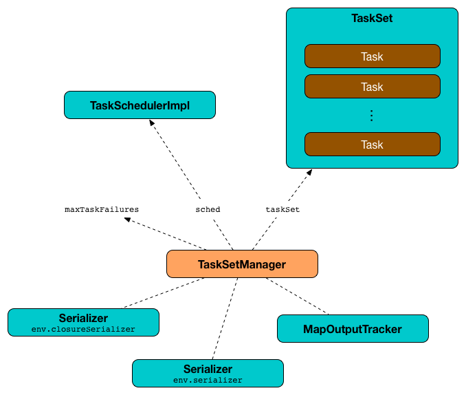
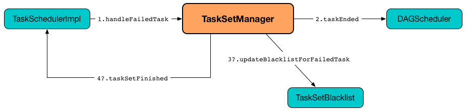

== [[TaskSetManager]] TaskSetManager

`TaskSetManager` is a <<schedulable, Schedulable>> that manages scheduling of tasks in a <<taskSet, TaskSet>>.

NOTE: A link:spark-taskscheduler-tasksets.adoc[TaskSet] represents a set of link:spark-taskscheduler-tasks.adoc[tasks] that correspond to missing link:spark-rdd-partitions.adoc[partitions] of a link:spark-DAGScheduler-Stage.adoc[stage].

<<creating-instance, `TaskSetManager` is created>> when link:spark-TaskSchedulerImpl.adoc#createTaskSetManager[`TaskSchedulerImpl` submits tasks (for a given `TaskSet`)].

.TaskSetManager and its Dependencies


When <<creating-instance, `TaskSetManager` is created>> for a <<taskSet, TaskSet>>, `TaskSetManager` <<addPendingTask, registers all the tasks as pending execution>>.

`TaskSetManager` is notified when a task (from the `TaskSet` it manages) finishes -- <<handleSuccessfulTask, sucessfully>> or due to a <<handleFailedTask, failure>> (in task execution or <<executorLost, an executor being lost>>).

`TaskSetManager` uses <<maxTaskFailures, maxTaskFailures>> to control how many times a <<handleFailedTask, single task can fail>> before an <<abort, entire `TaskSet` gets aborted>> that can take the following values:

* `1` for link:spark-local.adoc[`local` run mode]
* `maxFailures` in link:spark-local.adoc#local-with-retries[Spark local-with-retries] (i.e. `local[N, maxFailures]`)
* link:spark-TaskSchedulerImpl.adoc#spark.task.maxFailures[spark.task.maxFailures] property for link:spark-local.adoc[Spark local-cluster] and link:spark-cluster.adoc[Spark clustered] (using Spark Standalone, Mesos and YARN)

The responsibilities of a `TaskSetManager` include:

* <<scheduling-tasks, Scheduling the tasks in a taskset>>
* <<task-retries, Retrying tasks on failure>>
* <<locality-aware-scheduling, Locality-aware scheduling via delay scheduling>>

[TIP]
====
Enable DEBUG logging levels for `org.apache.spark.scheduler.TaskSchedulerImpl` (or `org.apache.spark.scheduler.cluster.YarnScheduler` for YARN) and `org.apache.spark.scheduler.TaskSetManager` and execute the following two-stage job to see their low-level innerworkings.

A cluster manager is recommended since it gives more task localization choices (with YARN additionally supporting rack localization).

```
$ ./bin/spark-shell --master yarn --conf spark.ui.showConsoleProgress=false

// Keep # partitions low to keep # messages low
scala> sc.parallelize(0 to 9, 3).groupBy(_ % 3).count
INFO YarnScheduler: Adding task set 0.0 with 3 tasks
DEBUG TaskSetManager: Epoch for TaskSet 0.0: 0
DEBUG TaskSetManager: Valid locality levels for TaskSet 0.0: NO_PREF, ANY
DEBUG YarnScheduler: parentName: , name: TaskSet_0.0, runningTasks: 0
INFO TaskSetManager: Starting task 0.0 in stage 0.0 (TID 0, 10.0.2.87, executor 1, partition 0, PROCESS_LOCAL, 7541 bytes)
INFO TaskSetManager: Starting task 1.0 in stage 0.0 (TID 1, 10.0.2.87, executor 2, partition 1, PROCESS_LOCAL, 7541 bytes)
DEBUG YarnScheduler: parentName: , name: TaskSet_0.0, runningTasks: 1
INFO TaskSetManager: Starting task 2.0 in stage 0.0 (TID 2, 10.0.2.87, executor 1, partition 2, PROCESS_LOCAL, 7598 bytes)
DEBUG YarnScheduler: parentName: , name: TaskSet_0.0, runningTasks: 1
DEBUG TaskSetManager: No tasks for locality level NO_PREF, so moving to locality level ANY
INFO TaskSetManager: Finished task 0.0 in stage 0.0 (TID 0) in 518 ms on 10.0.2.87 (executor 1) (1/3)
INFO TaskSetManager: Finished task 1.0 in stage 0.0 (TID 1) in 512 ms on 10.0.2.87 (executor 2) (2/3)
DEBUG YarnScheduler: parentName: , name: TaskSet_0.0, runningTasks: 0
INFO TaskSetManager: Finished task 2.0 in stage 0.0 (TID 2) in 51 ms on 10.0.2.87 (executor 1) (3/3)
INFO YarnScheduler: Removed TaskSet 0.0, whose tasks have all completed, from pool
INFO YarnScheduler: Adding task set 1.0 with 3 tasks
DEBUG TaskSetManager: Epoch for TaskSet 1.0: 1
DEBUG TaskSetManager: Valid locality levels for TaskSet 1.0: NODE_LOCAL, RACK_LOCAL, ANY
DEBUG YarnScheduler: parentName: , name: TaskSet_1.0, runningTasks: 0
INFO TaskSetManager: Starting task 0.0 in stage 1.0 (TID 3, 10.0.2.87, executor 2, partition 0, NODE_LOCAL, 7348 bytes)
INFO TaskSetManager: Starting task 1.0 in stage 1.0 (TID 4, 10.0.2.87, executor 1, partition 1, NODE_LOCAL, 7348 bytes)
DEBUG YarnScheduler: parentName: , name: TaskSet_1.0, runningTasks: 1
INFO TaskSetManager: Starting task 2.0 in stage 1.0 (TID 5, 10.0.2.87, executor 1, partition 2, NODE_LOCAL, 7348 bytes)
INFO TaskSetManager: Finished task 1.0 in stage 1.0 (TID 4) in 130 ms on 10.0.2.87 (executor 1) (1/3)
DEBUG YarnScheduler: parentName: , name: TaskSet_1.0, runningTasks: 1
DEBUG TaskSetManager: No tasks for locality level NODE_LOCAL, so moving to locality level RACK_LOCAL
DEBUG TaskSetManager: No tasks for locality level RACK_LOCAL, so moving to locality level ANY
INFO TaskSetManager: Finished task 0.0 in stage 1.0 (TID 3) in 133 ms on 10.0.2.87 (executor 2) (2/3)
DEBUG YarnScheduler: parentName: , name: TaskSet_1.0, runningTasks: 0
INFO TaskSetManager: Finished task 2.0 in stage 1.0 (TID 5) in 21 ms on 10.0.2.87 (executor 1) (3/3)
INFO YarnScheduler: Removed TaskSet 1.0, whose tasks have all completed, from pool
res0: Long = 3
```

====

.TaskSetManager's Internal Registries and Counters
[cols="1,2",options="header",width="100%"]
|===
| Name
| Description

| [[allPendingTasks]] `allPendingTasks`
| Indices of all the pending tasks to execute (regardless of their localization preferences).

Updated with an task index when `TaskSetManager` <<addPendingTask, registers a task as pending execution (per preferred locations)>>.

| [[calculatedTasks]] `calculatedTasks`
| The number of the tasks that have already completed execution.

Starts from `0` when a <<creating-instance, `TaskSetManager` is created>> and is only incremented when the <<canFetchMoreResults, `TaskSetManager` checks that there is enough memory to fetch a task result>>.

| [[copiesRunning]] `copiesRunning`
| The number of task copies currently running per task (index in its task set).

The number of task copies of a task is increased when <<resourceOffer, finds a task for execution (given resource offer)>> or <<checkSpeculatableTasks, checking for speculatable tasks>> and decreased when <<handleFailedTask, a task fails>> or <<executorLost, an executor is lost>> (for a shuffle map stage and no external shuffle service).

| [[currentLocalityIndex]] `currentLocalityIndex`
|

| [[epoch]] `epoch`
| Current link:spark-service-mapoutputtracker.adoc#getEpoch[map output tracker epoch].

| [[failedExecutors]] `failedExecutors`
| Lookup table of link:spark-TaskInfo.adoc[TaskInfo] indices that failed to executor ids and the time of the failure.

Used in <<handleFailedTask, handleFailedTask>>.

| [[isZombie]] `isZombie`
| Disabled, i.e. `false`, by default.

Read <<zombie-state, Zombie state>> in this document.

| [[lastLaunchTime]] `lastLaunchTime`
|

| [[localityWaits]] `localityWaits`
|

| [[myLocalityLevels]] `myLocalityLevels`
| link:spark-TaskSchedulerImpl.adoc#TaskLocality[`TaskLocality` locality preferences] of the pending tasks in the <<taskSet, TaskSet>> ranging from `PROCESS_LOCAL` through `NODE_LOCAL`, `NO_PREF`, and `RACK_LOCAL` to `ANY`.

NOTE: `myLocalityLevels` may contain only a few of all the available `TaskLocality` preferences with `ANY` as a mandatory task locality preference.

<<computeValidLocalityLevels, Set>> immediately when <<creating-instance, `TaskSetManager` is created>>.

<<recomputeLocality, Recomputed>> every change in the status of executors.

| [[name]] `name`
|

| [[numFailures]] `numFailures`
| Array of the number of task failures per <<tasks, task>>.

Incremented when `TaskSetManager` <<handleFailedTask, handles a task failure>> and immediatelly checked if above <<maxTaskFailures, acceptable number of task failures>>.

| [[numTasks]] `numTasks`
| Number of <<tasks, tasks>> to compute.

| [[pendingTasksForExecutor]] `pendingTasksForExecutor`
| Lookup table of the indices of tasks pending execution per executor.

Updated with an task index and executor when `TaskSetManager` <<addPendingTask, registers a task as pending execution (per preferred locations)>> (and the location is a `ExecutorCacheTaskLocation` or `HDFSCacheTaskLocation`).

| [[pendingTasksForHost]] `pendingTasksForHost`
| Lookup table of the indices of tasks pending execution per host.

Updated with an task index and host when `TaskSetManager` <<addPendingTask, registers a task as pending execution (per preferred locations)>>.

| [[pendingTasksForRack]] `pendingTasksForRack`
| Lookup table of the indices of tasks pending execution per rack.

Updated with an task index and rack when `TaskSetManager` <<addPendingTask, registers a task as pending execution (per preferred locations)>>.

| [[pendingTasksWithNoPrefs]] `pendingTasksWithNoPrefs`
| Lookup table of the indices of tasks pending execution with no location preferences.

Updated with an task index when `TaskSetManager` <<addPendingTask, registers a task as pending execution (per preferred locations)>>.

| [[priority]] `priority`
|

| [[recentExceptions]] `recentExceptions`
|

| [[runningTasksSet]] `runningTasksSet`
| Collection of running tasks that a `TaskSetManager` manages.

Used to implement <<runningTasks, runningTasks>> (that is simply the size of `runningTasksSet` but a required part of any link:spark-taskscheduler-schedulable.adoc#contract[Schedulable]). `runningTasksSet` is expanded when <<addRunningTask, registering a running task>> and shrinked when <<removeRunningTask, unregistering a running task>>.

Used in link:spark-TaskSchedulerImpl.adoc#cancelTasks[`TaskSchedulerImpl` to cancel tasks].

| [[speculatableTasks]] `speculatableTasks`
|

| [[stageId]] `stageId`
| The stage's id a `TaskSetManager` runs for.

Set when <<creating-instance, `TaskSetManager` is created>>.

NOTE: `stageId` is part of link:spark-taskscheduler-schedulable.adoc#contract[Schedulable contract].

| [[successful]] `successful`
| Status of <<tasks, tasks>> (with a boolean flag, i.e. `true` or `false`, per task).

All tasks start with their flags disabled, i.e. `false`, when <<creating-instance, `TaskSetManager` is created>>.

The flag for a task is turned on, i.e. `true`, when a task finishes <<handleSuccessfulTask, successfully>> but also <<handleFailedTask, with a failure>>.

A flag is explicitly turned off only for <<executorLost, `ShuffleMapTask` tasks when their executor is lost>>.

| [[taskAttempts]] `taskAttempts`
| Registry of link:spark-TaskInfo.adoc[TaskInfos] per every task attempt per task.

| [[taskInfos]] `taskInfos`
| Registry of link:spark-TaskInfo.adoc[TaskInfos] per task id.

Updated with the task (id) and the corresponding `TaskInfo` when `TaskSetManager` <<resourceOffer, finds a task for execution (given resource offer)>>.

NOTE: It _appears_ that the entires stay forever, i.e. are never removed (perhaps because the maintenance overhead is not needed given a `TaskSetManager` is a short-lived entity).

| [[tasks]] `tasks`
| Lookup table of link:spark-taskscheduler-tasks.adoc[Tasks] (per partition id) to schedule execution of.

NOTE: The tasks all belong to a single <<taskSet, TaskSet>> that was given when <<creating-instance, `TaskSetManager` was created>> (which actually represent a single link:spark-DAGScheduler-Stage.adoc[Stage]).

| [[tasksSuccessful]] `tasksSuccessful`
|

| [[totalResultSize]] `totalResultSize`
| The current total size of the result of all the tasks that have finished.

Starts from `0` when <<creating-instance, `TaskSetManager` is created>>.

Only increased with the size of a task result whenever a `TaskSetManager` <<canFetchMoreResults, checks that there is enough memory to fetch the task result>>.
|===

[TIP]
====
Enable `DEBUG` logging level for `org.apache.spark.scheduler.TaskSetManager` logger to see what happens inside.

Add the following line to `conf/log4j.properties`:

```
log4j.logger.org.apache.spark.scheduler.TaskSetManager=DEBUG
```

Refer to link:spark-logging.adoc[Logging].
====

=== [[isTaskBlacklistedOnExecOrNode]] `isTaskBlacklistedOnExecOrNode` Method

CAUTION: FIXME

=== [[getLocalityIndex]] `getLocalityIndex` Method

CAUTION: FIXME

=== [[dequeueSpeculativeTask]] `dequeueSpeculativeTask` Method

CAUTION: FIXME

=== [[executorAdded]] `executorAdded` Method

`executorAdded` simply calls <<recomputeLocality, recomputeLocality>> method.

=== [[abortIfCompletelyBlacklisted]] `abortIfCompletelyBlacklisted` Method

CAUTION: FIXME

=== [[schedulable]] TaskSetManager is Schedulable

`TaskSetManager` is a link:spark-taskscheduler-schedulable.adoc[Schedulable] with the following implementation:

* `name` is `TaskSet_[taskSet.stageId.toString]`
* no `parent` is ever assigned, i.e. it is always `null`.
+
It means that it can only be a leaf in the tree of Schedulables (with link:spark-taskscheduler-pool.adoc[Pools] being the nodes).

* `schedulingMode` always returns `SchedulingMode.NONE` (since there is nothing to schedule).
* `weight` is always `1`.
* `minShare` is always `0`.
* `runningTasks` is the number of running tasks in the internal  `runningTasksSet`.
* `priority` is the priority of the owned link:spark-taskscheduler-tasksets.adoc[TaskSet] (using `taskSet.priority`).
* `stageId` is the stage id of the owned link:spark-taskscheduler-tasksets.adoc[TaskSet] (using `taskSet.stageId`).

* `schedulableQueue` returns no queue, i.e. `null`.
* `addSchedulable` and `removeSchedulable` do nothing.
* `getSchedulableByName` always returns `null`.

* `getSortedTaskSetQueue` returns a one-element collection with the sole element being itself.

* <<executorLost, executorLost>>
* <<checkSpeculatableTasks, checkSpeculatableTasks>>

=== [[handleTaskGettingResult]] Marking Task As Fetching Indirect Result -- `handleTaskGettingResult` Method

[source, scala]
----
handleTaskGettingResult(tid: Long): Unit
----

`handleTaskGettingResult` finds link:spark-TaskInfo.adoc[TaskInfo] for `tid` task in <<taskInfos, taskInfos>> internal registry and marks it as fetching indirect task result. It then link:spark-dagscheduler.adoc#taskGettingResult[notifies `DAGScheduler`].

NOTE: `handleTaskGettingResult` is executed when link:spark-TaskSchedulerImpl.adoc#handleTaskGettingResult[`TaskSchedulerImpl` is notified about fetching indirect task result].

=== [[addRunningTask]] Registering Running Task -- `addRunningTask` Method

[source, scala]
----
addRunningTask(tid: Long): Unit
----

`addRunningTask` adds `tid` to <<runningTasksSet, runningTasksSet>> internal registry and link:spark-taskscheduler-pool.adoc#increaseRunningTasks[requests the `parent` pool to increase the number of running tasks] (if defined).

=== [[removeRunningTask]] Unregistering Running Task -- `removeRunningTask` Method

[source, scala]
----
removeRunningTask(tid: Long): Unit
----

`removeRunningTask` removes `tid` from <<runningTasksSet, runningTasksSet>> internal registry and link:spark-taskscheduler-pool.adoc#decreaseRunningTasks[requests the `parent` pool to decrease the number of running task] (if defined).

=== [[checkSpeculatableTasks]] Checking Speculatable Tasks -- `checkSpeculatableTasks` Method

NOTE: `checkSpeculatableTasks` is part of the link:spark-taskscheduler-schedulable.adoc#contract[Schedulable Contract].

[source, scala]
----
checkSpeculatableTasks(minTimeToSpeculation: Int): Boolean
----

`checkSpeculatableTasks` checks whether there are speculatable tasks in a `TaskSet`.

NOTE: `checkSpeculatableTasks` is called when link:spark-taskschedulerimpl-speculative-execution.adoc[`TaskSchedulerImpl` checks for speculatable tasks].

If the TaskSetManager is <<zombie-state, zombie>> or has a single task in TaskSet, it assumes no speculatable tasks.

The method goes on with the assumption of no speculatable tasks by default.

It computes the minimum number of finished tasks for speculation (as link:spark-taskschedulerimpl-speculative-execution.adoc#spark_speculation_quantile[spark.speculation.quantile] of all the finished tasks).

You should see the DEBUG message in the logs:

```
DEBUG Checking for speculative tasks: minFinished = [minFinishedForSpeculation]
```

It then checks whether the number is equal or greater than the number of tasks completed successfully (using `tasksSuccessful`).

Having done that, it computes the median duration of all the successfully completed tasks (using <<taskInfos, `taskInfos` internal registry>>) and task length threshold using the median duration multiplied by link:spark-taskschedulerimpl-speculative-execution.adoc#spark_speculation_multiplier[spark.speculation.multiplier] that has to be equal or less than `100`.

You should see the DEBUG message in the logs:

```
DEBUG Task length threshold for speculation: [threshold]
```

For each task (using <<taskInfos, `taskInfos` internal registry>>) that is not marked as successful yet (using `successful`) for which there is only one copy running (using `copiesRunning`) and the task takes more time than the calculated threshold, but it was not in `speculatableTasks` it is assumed *speculatable*.

You should see the following INFO message in the logs:

```
INFO Marking task [index] in stage [taskSet.id] (on [info.host]) as speculatable because it ran more than [threshold] ms
```

The task gets added to the internal `speculatableTasks` collection. The method responds positively.

=== [[getAllowedLocalityLevel]] `getAllowedLocalityLevel` Method

CAUTION: FIXME

=== [[resourceOffer]] Finding Task For Execution (Given Resource Offer) -- `resourceOffer` Method

[source, scala]
----
resourceOffer(
  execId: String,
  host: String,
  maxLocality: TaskLocality): Option[TaskDescription]
----

(only if <<taskSetBlacklistHelperOpt, TaskSetBlacklist>> is defined) `resourceOffer` requests `TaskSetBlacklist` to check if the input link:spark-taskscheduler-TaskSetBlacklist.adoc#isExecutorBlacklistedForTaskSet[`execId` executor] or link:spark-taskscheduler-TaskSetBlacklist.adoc#isNodeBlacklistedForTaskSet[`host` node] are blacklisted.

When `TaskSetManager` is a <<zombie-state, zombie>> or the resource offer (as executor and host) is blacklisted, `resourceOffer` finds no tasks to execute (and returns no link:spark-TaskDescription.adoc[TaskDescription]).

NOTE: `resourceOffer` finds a task to schedule for a resource offer when neither `TaskSetManager` is a <<zombie-state, zombie>> nor the resource offer is blacklisted.

`resourceOffer` calculates the allowed task locality for task selection. When the input `maxLocality` is not `NO_PREF` task locality, `resourceOffer` <<getAllowedLocalityLevel, getAllowedLocalityLevel>> (for the current time) and sets it as the current task locality if more localized (specific).

NOTE: link:spark-TaskSchedulerImpl.adoc[TaskLocality] can be the most localized `PROCESS_LOCAL`, `NODE_LOCAL` through `NO_PREF` and `RACK_LOCAL` to `ANY`.

`resourceOffer` <<dequeueTask, dequeues a task tor execution (given locality information)>>.

If a task (index) is found, `resourceOffer` takes the link:spark-taskscheduler-tasks.adoc[Task] (from <<tasks, tasks>> registry).

`resourceOffer` link:spark-TaskSchedulerImpl.adoc#newTaskId[requests `TaskSchedulerImpl` for the id for the new task].

`resourceOffer` increments the <<copiesRunning, number of the copies of the task that are currently running>> and finds the task attempt number (as the size of <<taskAttempts, taskAttempts>> entries for the task index).

`resourceOffer` link:spark-TaskInfo.adoc#creating-instance[creates a `TaskInfo`] that is then registered in <<taskInfos, taskInfos>> and <<taskAttempts, taskAttempts>>.

If the maximum acceptable task locality is not `NO_PREF`, `resourceOffer` <<getLocalityIndex, getLocalityIndex>> (using the task's locality) and records it as <<currentLocalityIndex, currentLocalityIndex>> with the current time as <<lastLaunchTime, lastLaunchTime>>.

`resourceOffer` serializes the task.

NOTE: `resourceOffer` uses link:spark-sparkenv.adoc#closureSerializer[`SparkEnv` to access the closure `Serializer`] and link:spark-Serializer.adoc#newInstance[create an instance thereof].

If the task serialization fails, you should see the following ERROR message in the logs:

```
Failed to serialize task [taskId], not attempting to retry it.
```

`resourceOffer` <<abort, aborts the `TaskSet`>> with the following message and reports a `TaskNotSerializableException`.

[options="wrap"]
----
Failed to serialize task [taskId], not attempting to retry it. Exception during serialization: [exception]
----

`resourceOffer` checks the size of the serialized task. If it is greater than `100` kB, you should see the following WARN message in the logs:

[options="wrap"]
----
WARN Stage [id] contains a task of very large size ([size] KB). The maximum recommended task size is 100 KB.
----

NOTE: The size of the serializable task, i.e. `100` kB, is not configurable.

If however the serialization went well and the size is fine too, `resourceOffer` <<addRunningTask, registers the task as running>>.

You should see the following INFO message in the logs:

[options="wrap"]
----
INFO TaskSetManager: Starting [name] (TID [id], [host], executor [id], partition [id], [taskLocality], [size] bytes)
----

For example:

[options="wrap"]
----
INFO TaskSetManager: Starting task 1.0 in stage 0.0 (TID 1, localhost, partition 1, PROCESS_LOCAL, 2054 bytes)
----

`resourceOffer` link:spark-dagscheduler.adoc#taskStarted[notifies `DAGScheduler` that the task has been started].

IMPORTANT: This is the moment when `TaskSetManager` informs `DAGScheduler` that a task has started.

NOTE: `resourceOffer` is used when `TaskSchedulerImpl` link:spark-TaskSchedulerImpl.adoc#resourceOfferSingleTaskSet[resourceOfferSingleTaskSet].

=== [[dequeueTask]] Dequeueing Task For Execution (Given Locality Information) -- `dequeueTask` Internal Method

[source, scala]
----
dequeueTask(execId: String, host: String, maxLocality: TaskLocality): Option[(Int, TaskLocality, Boolean)]
----

`dequeueTask` tries to <<dequeueTaskFromList, find the higest task index>> (meeting localization requirements) using <<getPendingTasksForExecutor, tasks (indices) registered for execution on `execId` executor>>. If a task is found, `dequeueTask` returns its index, `PROCESS_LOCAL` task locality and the speculative marker disabled.

`dequeueTask` then goes over all the possible link:spark-TaskSchedulerImpl.adoc#TaskLocality[task localities] and checks what locality is allowed given the input `maxLocality`.

`dequeueTask` checks out `NODE_LOCAL`, `NO_PREF`, `RACK_LOCAL` and `ANY` in that order.

For `NODE_LOCAL` `dequeueTask` tries to <<dequeueTaskFromList, find the higest task index>> (meeting localization requirements) using <<getPendingTasksForHost, tasks (indices) registered for execution on `host` host>> and if found returns its index, `NODE_LOCAL` task locality and the speculative marker disabled.

For `NO_PREF` `dequeueTask` tries to <<dequeueTaskFromList, find the higest task index>> (meeting localization requirements) using <<pendingTasksWithNoPrefs, pendingTasksWithNoPrefs>> internal registry and if found returns its index, `PROCESS_LOCAL` task locality and the speculative marker disabled.

NOTE: For `NO_PREF` the task locality is `PROCESS_LOCAL`.

For `RACK_LOCAL` `dequeueTask` link:spark-TaskSchedulerImpl.adoc#getRackForHost[finds the rack for the input `host`] and if available tries to <<dequeueTaskFromList, find the higest task index>> (meeting localization requirements) using <<getPendingTasksForRack, tasks (indices) registered for execution on the rack>>. If a task is found, `dequeueTask` returns its index, `RACK_LOCAL` task locality and the speculative marker disabled.

For `ANY` `dequeueTask` tries to <<dequeueTaskFromList, find the higest task index>> (meeting localization requirements) using <<allPendingTasks, allPendingTasks>> internal registry and if found returns its index, `ANY` task locality and the speculative marker disabled.

In the end, when no task could be found, `dequeueTask` <<dequeueSpeculativeTask, dequeueSpeculativeTask>> and if found returns its index, locality and the speculative marker enabled.

NOTE: The speculative marker is enabled for a task only when `dequeueTask` did not manage to find a task for the available task localities and did find a speculative task.

NOTE: `dequeueTask` is used exclusively when `TaskSetManager` <<resourceOffer, finds a task for execution (given resource offer)>>.

=== [[dequeueTaskFromList]] Finding Higest Task Index (Not Blacklisted, With No Copies Running and Not Completed Already) -- `dequeueTaskFromList` Internal Method

[source, scala]
----
dequeueTaskFromList(
  execId: String,
  host: String,
  list: ArrayBuffer[Int]): Option[Int]
----

`dequeueTaskFromList` takes task indices from the input `list` backwards (from the last to the first entry). For every index `dequeueTaskFromList` checks if it is not <<isTaskBlacklistedOnExecOrNode, blacklisted on the input `execId` executor and `host`>> and if not, checks that:

* <<copiesRunning, number of the copies of the task currently running>> is `0`

* the task has not been marked as <<successful, completed>>

If so, `dequeueTaskFromList` returns the task index.

If `dequeueTaskFromList` has checked all the indices and no index has passed the checks, `dequeueTaskFromList` returns `None` (to indicate that no index has met the requirements).

NOTE: `dequeueTaskFromList` is used exclusively when `TaskSetManager` <<dequeueTask, dequeues a task tor execution (given locality information)>>.

=== [[getPendingTasksForExecutor]] Finding Tasks (Indices) Registered For Execution on Executor -- `getPendingTasksForExecutor` Internal Method

[source, scala]
----
getPendingTasksForExecutor(executorId: String): ArrayBuffer[Int]
----

`getPendingTasksForExecutor` finds pending tasks (indices) registered for execution on the input `executorId` executor (in <<pendingTasksForExecutor, pendingTasksForExecutor>> internal registry).

NOTE: `getPendingTasksForExecutor` may find no matching tasks and return an empty collection.

NOTE: `getPendingTasksForExecutor` is used exclusively when `TaskSetManager` <<dequeueTask, dequeues a task tor execution (given locality information)>>.

=== [[getPendingTasksForHost]] Finding Tasks (Indices) Registered For Execution on Host -- `getPendingTasksForHost` Internal Method

[source, scala]
----
getPendingTasksForHost(host: String): ArrayBuffer[Int]
----

`getPendingTasksForHost` finds pending tasks (indices) registered for execution on the input `host` host (in <<pendingTasksForHost, pendingTasksForHost>> internal registry).

NOTE: `getPendingTasksForHost` may find no matching tasks and return an empty collection.

NOTE: `getPendingTasksForHost` is used exclusively when `TaskSetManager` <<dequeueTask, dequeues a task tor execution (given locality information)>>.

=== [[getPendingTasksForRack]] Finding Tasks (Indices) Registered For Execution on Rack -- `getPendingTasksForRack` Internal Method

[source, scala]
----
getPendingTasksForRack(rack: String): ArrayBuffer[Int]
----

`getPendingTasksForRack` finds pending tasks (indices) registered for execution on the input `rack` rack (in <<pendingTasksForRack, pendingTasksForRack>> internal registry).

NOTE: `getPendingTasksForRack` may find no matching tasks and return an empty collection.

NOTE: `getPendingTasksForRack` is used exclusively when `TaskSetManager` <<dequeueTask, dequeues a task tor execution (given locality information)>>.

=== [[scheduling-tasks]] Scheduling Tasks in TaskSet

CAUTION: FIXME

For each submitted <<taskset, TaskSet>>, a new TaskSetManager is created. The TaskSetManager completely and exclusively owns a TaskSet submitted for execution.

CAUTION: FIXME A picture with `TaskSetManager` owning TaskSet

CAUTION: FIXME What component knows about TaskSet and TaskSetManager. Isn't it that TaskSets are *created* by  DAGScheduler while TaskSetManager is used by TaskSchedulerImpl only?

TaskSetManager keeps track of the tasks pending execution per executor, host, rack or with no locality preferences.

=== [[locality-aware-scheduling]] Locality-Aware Scheduling aka Delay Scheduling

TaskSetManager computes locality levels for the TaskSet for delay scheduling. While computing you should see the following DEBUG in the logs:

```
DEBUG Valid locality levels for [taskSet]:  [levels]
```

CAUTION: FIXME What's delay scheduling?

=== [[events]] Events

Once a task has finished, `TaskSetManager` informs link:spark-dagscheduler.adoc#taskEnded[DAGScheduler].

CAUTION: FIXME

=== [[handleSuccessfulTask]] Recording Successful Task And Notifying DAGScheduler -- `handleSuccessfulTask` Method

[source, scala]
----
handleSuccessfulTask(tid: Long, result: DirectTaskResult[_]): Unit
----

`handleSuccessfulTask` records the `tid` task as finished, link:spark-dagscheduler.adoc#taskEnded[notifies the `DAGScheduler` that the task has ended] and <<maybeFinishTaskSet, attempts to mark the `TaskSet` finished>>.

NOTE: `handleSuccessfulTask` is executed after link:spark-TaskSchedulerImpl.adoc#handleSuccessfulTask[`TaskSchedulerImpl` has been informed that `tid` task finished successfully (and the task result was deserialized)].

Internally, `handleSuccessfulTask` finds link:spark-TaskInfo.adoc[TaskInfo] (in <<taskInfos, taskInfos>> internal registry) and marks it as `FINISHED`.

It then removes `tid` task from <<runningTasksSet, runningTasksSet>> internal registry.

`handleSuccessfulTask` link:spark-dagscheduler.adoc#taskEnded[notifies `DAGScheduler` that `tid` task ended successfully] (with the `Task` object from <<tasks, tasks>> internal registry and the result as `Success`).

At this point, `handleSuccessfulTask` finds the other <<taskAttempts, running task attempts>> of `tid` task and link:spark-SchedulerBackend.adoc#killTask[requests `SchedulerBackend` to kill them] (since they are no longer necessary now when at least one task attempt has completed successfully). You should see the following INFO message in the logs:

[options="wrap"]
----
INFO Killing attempt [attemptNumber] for task [id] in stage [id] (TID [id]) on [host] as the attempt [attemptNumber] succeeded on [host]
----

CAUTION: FIXME Review `taskAttempts`

If `tid` has _not_ yet been recorded as <<successful, successful>>, `handleSuccessfulTask` increases <<tasksSuccessful, tasksSuccessful>> counter. You should see the following INFO message in the logs:

[options="wrap"]
----
INFO Finished task [id] in stage [id] (TID [taskId]) in [duration] ms on [host] (executor [executorId]) ([tasksSuccessful]/[numTasks])
----

`tid` task is marked as <<successful, successful>>. If the number of task that have finished successfully is exactly the number of the tasks to execute (in the `TaskSet`), the `TaskSetManager` becomes a <<isZombie, zombie>>.

If `tid` task was already recorded as <<successful, successful>>, you should _merely_ see the following INFO message in the logs:

[options="wrap"]
----
INFO Ignoring task-finished event for [id] in stage [id] because task [index] has already completed successfully
----

Ultimately, `handleSuccessfulTask` <<maybeFinishTaskSet, attempts to mark the `TaskSet` finished>>.

=== [[maybeFinishTaskSet]] Attempting to Mark TaskSet Finished -- `maybeFinishTaskSet` Internal Method

[source, scala]
----
maybeFinishTaskSet(): Unit
----

`maybeFinishTaskSet` link:spark-TaskSchedulerImpl.adoc#taskSetFinished[notifies `TaskSchedulerImpl` that a `TaskSet` has finished] when there are no other <<runningTasksSet, running tasks>> and the <<isZombie, TaskSetManager is not in zombie state>>.

=== [[task-retries]] Retrying Tasks on Failure

CAUTION: FIXME

Up to link:spark-TaskSchedulerImpl.adoc#spark_task_maxFailures[spark.task.maxFailures] attempts

=== Task retries and `spark.task.maxFailures`

When you start Spark program you set up link:spark-TaskSchedulerImpl.adoc#spark_task_maxFailures[spark.task.maxFailures] for the number of failures that are acceptable until TaskSetManager gives up and marks a job failed.

TIP: In Spark shell with local master, `spark.task.maxFailures` is fixed to `1` and you need to use link:spark-local.adoc[local-with-retries master] to change it to some other value.

In the following example, you are going to execute a job with two partitions and keep one failing at all times (by throwing an exception). The aim is to learn the behavior of retrying task execution in a stage in TaskSet. You will only look at a single task execution, namely `0.0`.

```
$ ./bin/spark-shell --master "local[*, 5]"
...
scala> sc.textFile("README.md", 2).mapPartitionsWithIndex((idx, it) => if (idx == 0) throw new Exception("Partition 2 marked failed") else it).count
...
15/10/27 17:24:56 INFO DAGScheduler: Submitting 2 missing tasks from ResultStage 1 (MapPartitionsRDD[7] at mapPartitionsWithIndex at <console>:25)
15/10/27 17:24:56 DEBUG DAGScheduler: New pending partitions: Set(0, 1)
15/10/27 17:24:56 INFO TaskSchedulerImpl: Adding task set 1.0 with 2 tasks
...
15/10/27 17:24:56 INFO TaskSetManager: Starting task 0.0 in stage 1.0 (TID 2, localhost, partition 0,PROCESS_LOCAL, 2062 bytes)
...
15/10/27 17:24:56 INFO Executor: Running task 0.0 in stage 1.0 (TID 2)
...
15/10/27 17:24:56 ERROR Executor: Exception in task 0.0 in stage 1.0 (TID 2)
java.lang.Exception: Partition 2 marked failed
...
15/10/27 17:24:56 INFO TaskSetManager: Starting task 0.1 in stage 1.0 (TID 4, localhost, partition 0,PROCESS_LOCAL, 2062 bytes)
15/10/27 17:24:56 INFO Executor: Running task 0.1 in stage 1.0 (TID 4)
15/10/27 17:24:56 INFO HadoopRDD: Input split: file:/Users/jacek/dev/oss/spark/README.md:0+1784
15/10/27 17:24:56 ERROR Executor: Exception in task 0.1 in stage 1.0 (TID 4)
java.lang.Exception: Partition 2 marked failed
...
15/10/27 17:24:56 ERROR Executor: Exception in task 0.4 in stage 1.0 (TID 7)
java.lang.Exception: Partition 2 marked failed
...
15/10/27 17:24:56 INFO TaskSetManager: Lost task 0.4 in stage 1.0 (TID 7) on executor localhost: java.lang.Exception (Partition 2 marked failed) [duplicate 4]
15/10/27 17:24:56 ERROR TaskSetManager: Task 0 in stage 1.0 failed 5 times; aborting job
15/10/27 17:24:56 INFO TaskSchedulerImpl: Removed TaskSet 1.0, whose tasks have all completed, from pool
15/10/27 17:24:56 INFO TaskSchedulerImpl: Cancelling stage 1
15/10/27 17:24:56 INFO DAGScheduler: ResultStage 1 (count at <console>:25) failed in 0.058 s
15/10/27 17:24:56 DEBUG DAGScheduler: After removal of stage 1, remaining stages = 0
15/10/27 17:24:56 INFO DAGScheduler: Job 1 failed: count at <console>:25, took 0.085810 s
org.apache.spark.SparkException: Job aborted due to stage failure: Task 0 in stage 1.0 failed 5 times, most recent failure: Lost task 0.4 in stage 1.0 (TID 7, localhost): java.lang.Exception: Partition 2 marked failed
```

=== [[zombie-state]] Zombie state

A `TaskSetManager` is in *zombie* state when all tasks in a taskset have completed successfully (regardless of the number of task attempts), or if the taskset has been <<abort, aborted>>.

While in zombie state, a `TaskSetManager` can launch no new tasks and <<resourceOffer, responds with no `TaskDescription` to resourceOffers>>.

A `TaskSetManager` remains in the zombie state until all tasks have finished running, i.e. to continue to track and account for the running tasks.

=== [[abort]] Aborting TaskSet -- `abort` Method

[source, scala]
----
abort(message: String, exception: Option[Throwable] = None): Unit
----

`abort` informs link:spark-dagscheduler.adoc#taskSetFailed[`DAGScheduler` that the `TaskSet` has been aborted].

CAUTION: FIXME image with DAGScheduler call

The TaskSetManager enters <<zombie-state, zombie state>>.

Finally, `abort` <<maybeFinishTaskSet, attempts to mark the `TaskSet` finished>>.

=== [[creating-instance]] Creating TaskSetManager Instance

`TaskSetManager` takes the following when created:

* [[sched]] link:spark-TaskSchedulerImpl.adoc[TaskSchedulerImpl]
* [[taskSet]] link:spark-taskscheduler-tasksets.adoc[TaskSet] that the `TaskSetManager` manages scheduling for
* [[maxTaskFailures]] Acceptable number of task failure, i.e. how many times a <<handleFailedTask, single task can fail>> before an <<abort, entire `TaskSet` gets aborted>>.
* [[blacklistTracker]] (optional) BlacklistTracker
* [[clock]] `Clock` (defaults to `SystemClock`)

`TaskSetManager` initializes the <<internal-registries, internal registries and counters>>.

NOTE: `maxTaskFailures` is `1` for `local` run mode, `maxFailures` for Spark local-with-retries, and link:spark-TaskSchedulerImpl.adoc#spark.task.maxFailures[spark.task.maxFailures] property for Spark local-cluster and Spark with cluster managers (Spark Standalone, Mesos and YARN).

`TaskSetManager` link:spark-service-mapoutputtracker.adoc#getEpoch[requests the current epoch from `MapOutputTracker`] and sets it on all tasks in the taskset.

NOTE: `TaskSetManager` uses <<sched, TaskSchedulerImpl>> (that was given when <<creating-instance, created>>) to link:spark-TaskSchedulerImpl.adoc#mapOutputTracker[access the current `MapOutputTracker`].

You should see the following DEBUG in the logs:

```
DEBUG Epoch for [taskSet]: [epoch]
```

CAUTION: FIXME Why is the epoch important?

NOTE: `TaskSetManager` requests link:spark-TaskSchedulerImpl.adoc#mapOutputTracker[`MapOutputTracker` from `TaskSchedulerImpl`] which is _likely_ for unit testing only since link:spark-sparkenv.adoc#mapOutputTracker[`MapOutputTracker` is available using `SparkEnv`].

`TaskSetManager` <<addPendingTask, adds the tasks as pending execution>> (in reverse order from the highest partition to the lowest).

CAUTION: FIXME Why is reverse order important? The code says it's to execute tasks with low indices first.

=== [[handleFailedTask]] Getting Notified that Task Failed -- `handleFailedTask` Method

[source, scala]
----
handleFailedTask(
  tid: Long,
  state: TaskState,
  reason: TaskFailedReason): Unit
----

`handleFailedTask` finds link:spark-TaskInfo.adoc[TaskInfo] of `tid` task in <<taskInfos, taskInfos>> internal registry and simply quits if the task is already marked as failed or killed.

.TaskSetManager Gets Notified that Task Has Failed


NOTE: `handleFailedTask` is executed after link:spark-TaskSchedulerImpl.adoc#handleFailedTask[`TaskSchedulerImpl` has been informed that `tid` task failed] or <<executorLost, an executor was lost>>. In either case, tasks could not finish successfully or could not report their status back.

`handleFailedTask` <<removeRunningTask, unregisters `tid` task from the internal registry of running tasks>> and then link:spark-TaskInfo.adoc#markFinished[marks the corresponding `TaskInfo` as finished] (passing in the input `state`).

`handleFailedTask` decrements the number of the running copies of `tid` task (in <<copiesRunning, copiesRunning>> internal registry).

NOTE: With link:spark-taskschedulerimpl-speculative-execution.adoc[speculative execution of tasks] enabled, there can be many copies of a task running simultaneuosly.

`handleFailedTask` uses the following pattern as the reason of the failure:

```
Lost task [id] in stage [taskSetId] (TID [tid], [host], executor [executorId]): [reason]
```

`handleFailedTask` then calculates the failure exception per the input `reason` (follow the links for more details):

* <<handleFailedTask-FetchFailed, FetchFailed>>
* <<handleFailedTask-ExceptionFailure, ExceptionFailure>>
* <<handleFailedTask-ExecutorLostFailure, ExecutorLostFailure>>
* <<handleFailedTask-TaskFailedReason, other TaskFailedReasons>>

NOTE: Description of how the final failure exception is "computed" was moved to respective sections below to make the reading slightly more pleasant and comprehensible.

`handleFailedTask` link:spark-dagscheduler.adoc#taskEnded[informs `DAGScheduler` that `tid` task has ended] (passing on the `Task` instance from <<tasks, tasks>> internal registry, the input `reason`, `null` result, calculated `accumUpdates` per failure, and the link:spark-TaskInfo.adoc[TaskInfo]).

IMPORTANT: This is the moment when `TaskSetManager` informs `DAGScheduler` that a task has ended.

If `tid` task has already been marked as completed (in <<successful, successful>> internal registry) you should see the following INFO message in the logs:

[options="wrap"]
----
INFO Task [id] in stage [id] (TID [tid]) failed, but the task will not be re-executed (either because the task failed with a shuffle data fetch failure, so the previous stage needs to be re-run, or because a different copy of the task has already succeeded).
----

TIP: Read up on link:spark-taskschedulerimpl-speculative-execution.adoc[Speculative Execution of Tasks] to find out why a single task could be executed multiple times.

If however `tid` task was not recorded as <<successful, completed>>, `handleFailedTask` <<addPendingTask, records it as pending>>.

If the `TaskSetManager` is not a <<zombie-state, zombie>> and the task failed `reason` should be counted towards the maximum number of times the task is allowed to fail before the stage is aborted (i.e. `TaskFailedReason.countTowardsTaskFailures` attribute is enabled), the optional link:spark-taskscheduler-TaskSetBlacklist.adoc#updateBlacklistForFailedTask[`TaskSetBlacklist` is notified] (passing on the host, executor and the task's index). `handleFailedTask` then increments the <<numFailures, number of failures>> for `tid` task and checks if the number of failures is equal or greater than the <<maxTaskFailures, allowed number of task failures per `TaskSet`>> (as defined when the <<creating-instance, `TaskSetManager` was created>>).

If so, i.e. the number of task failures of `tid` task reached the maximum value, you should see the following ERROR message in the logs:

```
ERROR Task [id] in stage [id] failed [maxTaskFailures] times; aborting job
```

And `handleFailedTask` <<abort, aborts the `TaskSet`>> with the following message and then quits:

```
Task [index] in stage [id] failed [maxTaskFailures] times, most recent failure: [failureReason]
```

In the end (except when the number of failures of `tid` task grew beyond the acceptable number), `handleFailedTask` <<maybeFinishTaskSet, attempts to mark the `TaskSet` as finished>>.

NOTE: `handleFailedTask` is used when `TaskSchedulerImpl` link:spark-TaskSchedulerImpl.adoc#handleFailedTask[is informed that a task has failed] or when `TaskSetManager` <<executorLost, is informed that an executor has been lost>>.

==== [[handleFailedTask-FetchFailed]] `FetchFailed` TaskFailedReason

For `FetchFailed` you should see the following WARN message in the logs:

```
WARN Lost task [id] in stage [id] (TID [tid], [host], executor [id]): [reason]
```

Unless `tid` has already been marked as successful (in <<successful, successful>> internal registry), it becomes so and the <<tasksSuccessful, number of successful tasks in `TaskSet`>> gets increased.

The `TaskSetManager` enters <<isZombie, zombie state>>.

The failure exception is empty.

==== [[handleFailedTask-ExceptionFailure]] `ExceptionFailure` TaskFailedReason

For `ExceptionFailure`, `handleFailedTask` checks if the exception is of type `NotSerializableException`. If so, you should see the following ERROR message in the logs:

```
ERROR Task [id] in stage [id] (TID [tid]) had a not serializable result: [description]; not retrying
```

And `handleFailedTask` <<abort, aborts the `TaskSet`>> and then quits.

Otherwise, if the exception is not of type `NotSerializableException`, `handleFailedTask` accesses accumulators and calculates whether to print the WARN message (with the failure reason) or the INFO message.

If the failure has already been reported (and is therefore a duplication), <<spark_logging_exceptionPrintInterval, spark.logging.exceptionPrintInterval>> is checked before reprinting the duplicate exception in its entirety.

For full printout of the `ExceptionFailure`, the following WARN appears in the logs:

```
WARN Lost task [id] in stage [id] (TID [tid], [host], executor [id]): [reason]
```

Otherwise, the following INFO appears in the logs:

```
INFO Lost task [id] in stage [id] (TID [tid]) on [host], executor [id]: [className] ([description]) [duplicate [dupCount]]
```

The exception in `ExceptionFailure` becomes the failure exception.

==== [[handleFailedTask-ExecutorLostFailure]] `ExecutorLostFailure` TaskFailedReason

For `ExecutorLostFailure` if not `exitCausedByApp`, you should see the following INFO in the logs:

```
INFO Task [tid] failed because while it was being computed, its executor exited for a reason unrelated to the task. Not counting this failure towards the maximum number of failures for the task.
```

The failure exception is empty.

==== [[handleFailedTask-TaskFailedReason]] Other TaskFailedReasons

For the other TaskFailedReasons, you should see the following WARN message in the logs:

```
WARN Lost task [id] in stage [id] (TID [tid], [host], executor [id]): [reason]
```

The failure exception is empty.

=== [[addPendingTask]] Registering Task As Pending Execution (Per Preferred Locations) -- `addPendingTask` Internal Method

[source, scala]
----
addPendingTask(index: Int): Unit
----

`addPendingTask` registers a `index` task in the pending-task lists that the task should be eventually scheduled to (per its preferred locations).

Internally, `addPendingTask` takes the link:spark-taskscheduler-tasks.adoc#preferredLocations[preferred locations of the task] (given `index`) and registers the task in the internal pending-task registries for every preferred location:

* <<pendingTasksForExecutor, pendingTasksForExecutor>> when the link:spark-TaskLocation.adoc[TaskLocation] is `ExecutorCacheTaskLocation`.
* <<pendingTasksForHost, pendingTasksForHost>> for the hosts of a link:spark-TaskLocation.adoc[TaskLocation].
* <<pendingTasksForRack, pendingTasksForRack>> for the link:spark-TaskSchedulerImpl.adoc#getRackForHost[racks from  `TaskSchedulerImpl` per the host] (of a link:spark-TaskLocation.adoc[TaskLocation]).

For a link:spark-TaskLocation.adoc[TaskLocation] being `HDFSCacheTaskLocation`, `addPendingTask` link:spark-TaskSchedulerImpl.adoc#getExecutorsAliveOnHost[requests `TaskSchedulerImpl` for the executors on the host] (of a preferred location) and registers the task in <<pendingTasksForExecutor, pendingTasksForExecutor>> for every executor (if available).

You should see the following INFO message in the logs:

```
INFO Pending task [index] has a cached location at [host] , where there are executors [executors]
```

When `addPendingTask` could not find executors for a `HDFSCacheTaskLocation` preferred location, you should see the following DEBUG message in the logs:

```
DEBUG Pending task [index] has a cached location at [host] , but there are no executors alive there.
```

If the task has no location preferences, `addPendingTask` registers it in <<pendingTasksWithNoPrefs, pendingTasksWithNoPrefs>>.

`addPendingTask` always registers the task in <<allPendingTasks, allPendingTasks>>.

NOTE: `addPendingTask` is used immediatelly when `TaskSetManager` <<creating-instance, is created>> and later when handling a <<handleFailedTask, task failure>> or <<executorLost, lost executor>>.

=== [[executorLost]] Re-enqueuing ShuffleMapTasks (with no ExternalShuffleService) and Reporting All Running Tasks on Lost Executor as Failed -- `executorLost` Method

[source, scala]
----
executorLost(execId: String, host: String, reason: ExecutorLossReason): Unit
----

`executorLost` re-enqueues all the link:spark-taskscheduler-ShuffleMapTask.adoc[ShuffleMapTasks] that have completed already on the lost executor (when link:spark-ExternalShuffleService.adoc[external shuffle service] is not in use) and <<handleFailedTask, reports all currently-running tasks on the lost executor as failed>>.

NOTE: `executorLost` is part of the link:spark-taskscheduler-schedulable.adoc#contract[Schedulable contract] that link:spark-TaskSchedulerImpl.adoc#removeExecutor[`TaskSchedulerImpl` uses to inform `TaskSetManagers` about lost executors].

NOTE: Since `TaskSetManager` manages execution of the tasks in a single link:spark-taskscheduler-tasksets.adoc[TaskSet], when an executor gets lost, the affected tasks that have been running on the failed executor need to be re-enqueued. `executorLost` is the mechanism to "announce" the event to all `TaskSetManagers`.

Internally, `executorLost` first checks whether the <<tasks, tasks>> are link:spark-taskscheduler-ShuffleMapTask.adoc[ShuffleMapTasks] and whether an link:spark-ExternalShuffleService.adoc[external shuffle service] is enabled (that could serve the map shuffle outputs in case of failure).

NOTE: `executorLost` checks out the first task in <<tasks, tasks>> as it is assumed the other belong to the same stage. If the task is a link:spark-taskscheduler-ShuffleMapTask.adoc[ShuffleMapTask], the entire <<taskSet, TaskSet>> is for a link:spark-dagscheduler-ShuffleMapStage.adoc[ShuffleMapStage].

NOTE: `executorLost` uses link:spark-sparkenv.adoc#blockManager[`SparkEnv` to access the current `BlockManager`] and finds out whether an link:spark-blockmanager.adoc#externalShuffleServiceEnabled[external shuffle service is enabled] or not (that is controlled using link:spark-ExternalShuffleService.adoc#spark.shuffle.service.enabled[spark.shuffle.service.enabled] property).

If `executorLost` is indeed due to an executor lost that executed tasks for a link:spark-dagscheduler-ShuffleMapStage.adoc[ShuffleMapStage] (that this `TaskSetManager` manages) and no external shuffle server is enabled, `executorLost` finds <<taskInfos, all the tasks>> that were scheduled on this lost executor and marks the <<successful, ones that were already successfully completed>> as not executed yet.

NOTE: `executorLost` uses records every tasks on the lost executor in <<successful, successful>> (as `false`) and decrements <<copiesRunning copiesRunning>>, and <<tasksSuccessful, tasksSuccessful>> for every task.

`executorLost` <<addPendingTask, registers every task as pending execution (per preferred locations)>> and link:spark-dagscheduler.adoc#taskEnded[informs `DAGScheduler` that the tasks (on the lost executor) have ended] (with link:spark-dagscheduler.adoc#handleTaskCompletion-Resubmitted[Resubmitted] reason).

NOTE: `executorLost` uses link:spark-TaskSchedulerImpl.adoc#dagScheduler[`TaskSchedulerImpl` to access the `DAGScheduler`]. `TaskSchedulerImpl` is given when the <<creating-instance, `TaskSetManager` was created>>.

Regardless of whether this `TaskSetManager` manages `ShuffleMapTasks` or not (it could also manage link:spark-taskscheduler-ResultTask.adoc[ResultTasks]) and whether the external shuffle service is used or not, `executorLost` finds all <<taskInfos, currently-running tasks>> on this lost executor and <<handleFailedTask, reports them as failed>> (with the task state `FAILED`).

NOTE: `executorLost` finds out if the reason for the executor lost is due to application fault, i.e. assumes ``ExecutorExited``'s exit status as the indicator, `ExecutorKilled` for non-application's fault and any other reason is an application fault.

`executorLost` <<recomputeLocality, recomputes locality preferences>>.

=== [[recomputeLocality]] Recomputing Task Locality Preferences -- `recomputeLocality` Method

[source, scala]
----
recomputeLocality(): Unit
----

`recomputeLocality` recomputes the internal caches: <<myLocalityLevels, myLocalityLevels>>, <<localityWaits, localityWaits>> and <<currentLocalityIndex, currentLocalityIndex>>.

CAUTION: FIXME But *why* are the caches important (and have to be recomputed)?

`recomputeLocality` records the current link:spark-TaskSchedulerImpl.adoc#TaskLocality[TaskLocality] level of this `TaskSetManager` (that is <<currentLocalityIndex, currentLocalityIndex>> in <<myLocalityLevels, myLocalityLevels>>).

NOTE: `TaskLocality` is one of `PROCESS_LOCAL`, `NODE_LOCAL`, `NO_PREF`, `RACK_LOCAL` and `ANY` values.

`recomputeLocality` <<computeValidLocalityLevels, computes locality levels (for scheduled tasks)>> and saves the result in <<myLocalityLevels, myLocalityLevels>> internal cache.

`recomputeLocality` computes <<localityWaits, localityWaits>> (by <<getLocalityWait, finding locality wait>> for every locality level in <<myLocalityLevels, myLocalityLevels>> internal cache).

In the end, `recomputeLocality` <<getLocalityIndex, getLocalityIndex>> of the previous locality level and records it in <<currentLocalityIndex, currentLocalityIndex>>.

NOTE: `recomputeLocality` is used when `TaskSetManager` gets notified about status change in executors, i.e. when an executor is <<executorLost, lost>> or <<executorAdded, added>>.

=== [[computeValidLocalityLevels]] Computing Locality Levels (for Scheduled Tasks) -- `computeValidLocalityLevels` Internal Method

[source, scala]
----
computeValidLocalityLevels(): Array[TaskLocality]
----

`computeValidLocalityLevels` computes valid locality levels for tasks that were registered in corresponding registries per locality level.

NOTE: link:spark-TaskSchedulerImpl.adoc[TaskLocality] is a task locality preference and can be the most localized `PROCESS_LOCAL`, `NODE_LOCAL` through `NO_PREF` and `RACK_LOCAL` to `ANY`.

.TaskLocalities and Corresponding Internal Registries
[cols="1,2",options="header",width="100%"]
|===
| TaskLocality
| Internal Registry

| `PROCESS_LOCAL`
| <<pendingTasksForExecutor, pendingTasksForExecutor>>
| `NODE_LOCAL`
| <<pendingTasksForHost, pendingTasksForHost>>
| `NO_PREF`
| <<pendingTasksWithNoPrefs, pendingTasksWithNoPrefs>>
| `RACK_LOCAL`
| <<pendingTasksForRack, pendingTasksForRack>>

|===

`computeValidLocalityLevels` walks over every internal registry and if it is not empty <<getLocalityWait, computes locality wait>> for the corresponding `TaskLocality` and proceeds with it only when the locality wait is not `0`.

For `TaskLocality` with pending tasks, `computeValidLocalityLevels` asks `TaskSchedulerImpl` whether there is at least one executor alive (for link:spark-TaskSchedulerImpl.adoc#isExecutorAlive[PROCESS_LOCAL], link:spark-TaskSchedulerImpl.adoc#hasExecutorsAliveOnHost[NODE_LOCAL] and link:spark-TaskSchedulerImpl.adoc#hasHostAliveOnRack[RACK_LOCAL]) and if so registers the `TaskLocality`.

NOTE: `computeValidLocalityLevels` uses <<sched, TaskSchedulerImpl>> that was given when <<TaskSetManager, `TaskSetManager` was created>>.

`computeValidLocalityLevels` always registers `ANY` task locality level.

In the end, you should see the following DEBUG message in the logs:

```
DEBUG TaskSetManager: Valid locality levels for [taskSet]: [comma-separated levels]
```

NOTE: `computeValidLocalityLevels` is used when `TaskSetManager` <<creating-instance, is created>> and later to <<recomputeLocality, recompute locality>>.

=== [[getLocalityWait]] Finding Locality Wait -- `getLocalityWait` Internal Method

[source, scala]
----
getLocalityWait(level: TaskLocality): Long
----

`getLocalityWait` finds *locality wait* (in milliseconds) for a given link:spark-TaskSchedulerImpl.adoc#TaskLocality[TaskLocality].

`getLocalityWait` uses <<spark.locality.wait, spark.locality.wait>> (default: `3s`) when the ``TaskLocality``-specific property is not defined or `0` for `NO_PREF` and `ANY`.

NOTE: `NO_PREF` and `ANY` task localities have no locality wait.

.TaskLocalities and Corresponding Spark Properties
[cols="1,2",options="header",width="100%"]
|===
| TaskLocality
| Spark Property

| PROCESS_LOCAL
| <<spark.locality.wait.process, spark.locality.wait.process>>

| NODE_LOCAL
| <<spark.locality.wait.node, spark.locality.wait.node>>

| RACK_LOCAL
| <<spark.locality.wait.rack, spark.locality.wait.rack>>
|===

NOTE: `getLocalityWait` is used when `TaskSetManager` calculates <<localityWaits, localityWaits>>, <<computeValidLocalityLevels, computes locality levels (for scheduled tasks)>> and <<recomputeLocality, recomputes locality preferences>>.

=== [[canFetchMoreResults]] Checking Available Memory For Task Results -- `canFetchMoreResults` Method

[source, scala]
----
canFetchMoreResults(size: Long): Boolean
----

`canFetchMoreResults` checks whether there is enough memory to fetch the result of a task.

Internally, `canFetchMoreResults` increments the internal <<totalResultSize, totalResultSize>> with the input `size` (which is the size of the result of a task) and increments the internal <<calculatedTasks, calculatedTasks>>.

If the current internal <<totalResultSize, totalResultSize>> is bigger than the <<maxResultSize, maximum result size>>, `canFetchMoreResults` prints out the following ERROR message to the logs:

```
Total size of serialized results of [calculatedTasks] tasks ([totalResultSize]) is bigger than spark.driver.maxResultSize ([maxResultSize])
```

NOTE: `canFetchMoreResults` uses <<spark.driver.maxResultSize, spark.driver.maxResultSize>> configuration property to control the maximum result size. The default value is `1g`.

In the end, `canFetchMoreResults` <<abort, aborts>> the <<taskSet, TaskSet>> and returns `false`.

Otherwise, `canFetchMoreResults` returns `true`.

NOTE: `canFetchMoreResults` is used exclusively when `TaskResultGetter` is requested to  link:spark-TaskResultGetter.adoc#enqueueSuccessfulTask[enqueue a successful task].

=== [[settings]] Settings

.Spark Properties
[cols="1,1,2",options="header",width="100%"]
|===
| Spark Property
| Default Value
| Description

| [[maxResultSize]][[spark.driver.maxResultSize]] `spark.driver.maxResultSize`
| `1g`
| The maximum size of all the task results in a `TaskSet`. If the value is smaller than `1m` or `1048576` (1024 * 1024), it is considered `0`.

Used when <<canFetchMoreResults, `TaskSetManager` checks available memory for a task result>> and `Utils.getMaxResultSize`.

| `spark.scheduler.executorTaskBlacklistTime`
| `0L`
| Time interval to pass after which a task can be re-launched on the executor where it has once failed. It is to prevent repeated task failures due to executor failures.

| [[spark_logging_exceptionPrintInterval]] `spark.logging.exceptionPrintInterval`
| `10000`
| How frequently to reprint duplicate exceptions in full (in millis).

| [[spark.locality.wait]] `spark.locality.wait`
| `3s`
| For locality-aware delay scheduling for `PROCESS_LOCAL`, `NODE_LOCAL`, and `RACK_LOCAL` link:spark-TaskSchedulerImpl.adoc#TaskLocality[TaskLocalities] when locality-specific setting is not set.

| [[spark.locality.wait.process]] `spark.locality.wait.process`
| The value of <<spark.locality.wait, spark.locality.wait>>
| Scheduling delay for `PROCESS_LOCAL` link:spark-TaskSchedulerImpl.adoc#TaskLocality[TaskLocality]

| [[spark.locality.wait.node]] `spark.locality.wait.node`
| The value of <<spark.locality.wait, spark.locality.wait>>
| Scheduling delay for `NODE_LOCAL` link:spark-TaskSchedulerImpl.adoc#TaskLocality[TaskLocality]

| [[spark.locality.wait.rack]] `spark.locality.wait.rack`
| The value of <<spark.locality.wait, spark.locality.wait>>
| Scheduling delay for `RACK_LOCAL` link:spark-TaskSchedulerImpl.adoc#TaskLocality[TaskLocality]
|===
