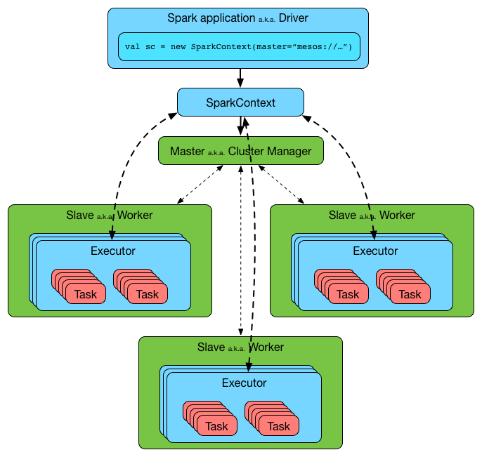

== Spark Architecture

Spark uses a *master/worker architecture*. There is a link:spark-driver.adoc[driver] that talks to a single coordinator link:spark-master.adoc[master] that communicates with one or more link:spark-workers.adoc[workers] in which link:spark-executors.adoc[executors] run.

.Spark architecture
image::images/driver-sparkcontext-clustermanager-workers-executors.png[align="center"]

The driver and the executors run in their own Java processes. You can run them all on the same (_horizontal cluster_) or separate machines (_vertical cluster_) or in a mixed machine configuration.

.Spark architecture in detail

=== [[executor-backends]] Executor Backends

An *Executor Backend* manages a single executor. At startup, it connects to the driver and creates an executor. It then launches and kills tasks. It stops when the driver orders so.

An executor backend acts as a bridge between the driver and an executor, i.e. there are two endpoints.

It asks the driver for the driver's Spark properties

TIP: Enable `INFO` for `org.apache.spark.executor.CoarseGrainedExecutorBackend` to see the inner-workings.

There are the following kinds of executor backends:

* local executor backend
* <<coarse-grained, coarse-grained executor backend>>
** used for YARN and coarse-grained mode in Mesos
* Mesos executor backend
