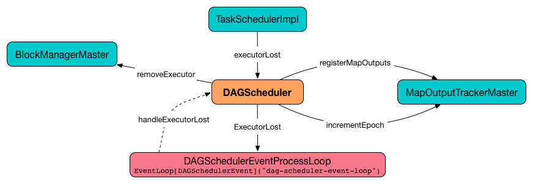

== [[DAGSchedulerEventProcessLoop]] DAGSchedulerEventProcessLoop -- dag-scheduler-event-loop DAGScheduler Event Bus

`DAGSchedulerEventProcessLoop` (*dag-scheduler-event-loop*) is a `EventLoop` single "business logic" thread for processing `DAGSchedulerEvent` events.

.DAGSchedulerEvent Events
[width="100%",cols="1,2",frame="topbot",options="header"]
|======================
| DAGSchedulerEvent | Reason
| <<JobSubmitted, JobSubmitted>> | An action job was submitted to DAGScheduler (using link:spark-dagscheduler.adoc#submitJob[submitJob] or `runApproximateJob`)
| <<MapStageSubmitted, MapStageSubmitted>> | A link:spark-dagscheduler-ShuffleMapStage.adoc[ShuffleMapStage] was submitted (using `submitMapStage`)
| <<StageCancelled, StageCancelled>> |

| <<JobCancelled, JobCancelled>> | link:spark-dagscheduler.adoc#cancelJob[`DAGScheduler` is requested to cancel a job].

| `JobGroupCancelled` |
| `AllJobsCancelled` |
| `BeginEvent` | link:spark-tasksetmanager.adoc[TaskSetManager] reports that a task is starting.
| `GettingResultEvent` |  link:spark-tasksetmanager.adoc[TaskSetManager] reports that a task has completed and results are being fetched remotely.

| <<CompletionEvent, CompletionEvent>> | link:spark-tasksetmanager.adoc[TaskSetManager] reports that a task has completed successfully or failed.

| <<ExecutorAdded, ExecutorAdded>> | An executor has been spun up on a host. Remove it from the failed executors list if it was included, and call link:spark-dagscheduler.adoc#submitWaitingStages[DAGScheduler.submitWaitingStages].

| <<ExecutorLost, ExecutorLost>> |
| `TaskSetFailed` |
| `ResubmitFailedStages` |
|======================

When created, `DAGSchedulerEventProcessLoop` gets the reference to the owning link:spark-dagscheduler.adoc[DAGScheduler] that it uses to call event handler methods on.

NOTE: `DAGSchedulerEventProcessLoop` uses https://docs.oracle.com/javase/7/docs/api/java/util/concurrent/LinkedBlockingDeque.html[java.util.concurrent.LinkedBlockingDeque] blocking deque that grows indefinitely, i.e. up to https://docs.oracle.com/javase/7/docs/api/java/lang/Integer.html#MAX_VALUE[Integer.MAX_VALUE] events.

NOTE: The name of the reference in `DAGScheduler` is `eventProcessLoop`.

=== [[JobCancelled]] `JobCancelled` Event and `handleJobCancellation` Handler

[source, scala]
----
JobCancelled(jobId: Int) extends DAGSchedulerEvent
----

`JobCancelled` is a `DAGSchedulerEvent` that triggers <<handleJobCancellation, handleJobCancellation>> method (on a separate thread).

NOTE: It seems that although `SparkContext.cancelJob(jobId: Int)` calls `DAGScheduler.cancelJob`, no feature/code in Spark calls `SparkContext.cancelJob(jobId: Int)`. A dead code?

==== [[handleJobCancellation]] `handleJobCancellation` Handler

[source, scala]
----
handleJobCancellation(jobId: Int, reason: String = "")
----

`handleJobCancellation` ensures that the input `jobId` has been registered earlier (using `jobIdToStageIds` internal registry).

If not registered, you should see the following DEBUG message in the logs:

```
DEBUG Trying to cancel unregistered job [jobId]
```

Otherwise, `handleJobCancellation` executes link:spark-dagscheduler.adoc#failJobAndIndependentStages[failJobAndIndependentStages] for the active job (using `jobIdToActiveJob`) and failure reason:

```
Job [jobId] cancelled [reason]
```

=== [[CompletionEvent]][[handleTaskCompletion]] `CompletionEvent` Event and `handleTaskCompletion` Handler

`CompletionEvent` event informs `DAGScheduler` about task completions. It is handled by `handleTaskCompletion` method.

[source, scala]
----
handleTaskCompletion(event: CompletionEvent): Unit
----

.DAGScheduler and CompletionEvent
image::images/dagscheduler-tasksetmanager.png[align="center"]

NOTE: `CompletionEvent` holds contextual information about the completed task.

The task knows about the stage it belongs to (using `Task.stageId`), the partition it works on (using `Task.partitionId`), and the stage attempt (using `Task.stageAttemptId`).

`OutputCommitCoordinator.taskCompleted` is called.

If the reason for task completion is not `Success`, link:spark-SparkListener.adoc#SparkListenerTaskEnd[SparkListenerTaskEnd] is posted to link:spark-LiveListenerBus.adoc[LiveListenerBus]. The only difference with <<handleTaskCompletion-Success, TaskEndReason: Success>> is how the stage attempt id is calculated. Here, it is `Task.stageAttemptId` (not `Stage.latestInfo.attemptId`).

CAUTION: FIXME What is the difference between stage attempt ids?

If the stage the task belongs to has been cancelled, `stageIdToStage` should not contain it, and the method quits.

The main processing depends on the `TaskEndReason` - the reason for task completion (using `event.reason`). The method skips processing `TaskEndReasons`: `TaskCommitDenied`, `ExceptionFailure`, `TaskResultLost`, `ExecutorLostFailure`, `TaskKilled`, and `UnknownReason`, i.e. it does nothing.

==== [[handleTaskCompletion-Success]] TaskEndReason: Success

link:spark-SparkListener.adoc#SparkListenerTaskEnd[SparkListenerTaskEnd] is posted to link:spark-LiveListenerBus.adoc[LiveListenerBus].

The partition the task worked on is removed from `pendingPartitions` of the stage.

The processing splits per task type - ResultTask or ShuffleMapTask - and link:spark-dagscheduler.adoc#submitWaitingStages[DAGScheduler.submitWaitingStages] is called.

===== [[handleTaskCompletion-Success-ResultTask]] ResultTask

For `ResultTask`, the stage is link:spark-dagscheduler-ResultStage.adoc[ResultStage]. If there is no job active for the stage (using `resultStage.activeJob`), the following INFO message appears in the logs:

```
INFO Ignoring result from [task] because its job has finished
```

Otherwise, check whether the task is marked as running for the job (using `job.finished`) and proceed. The method skips execution when the task has already been marked as completed in the job.

CAUTION: FIXME When could a task that has just finished be ignored, i.e. the job has already marked `finished`? Could it be for stragglers?

link:spark-dagscheduler.adoc#updateAccumulators[DAGScheduler.updateAccumulators(event)] is called.

The partition is marked as `finished` (using `job.finished`) and the number of partitions calculated increased (using `job.numFinished`).

If the whole job has finished (when `job.numFinished == job.numPartitions`), then:

* `markStageAsFinished` is called
* `cleanupStateForJobAndIndependentStages(job)`
* link:spark-SparkListener.adoc#SparkListenerJobEnd[SparkListenerJobEnd] is posted to link:spark-LiveListenerBus.adoc[LiveListenerBus] with `JobSucceeded`

The `JobListener` of the job (using `job.listener`) is informed about the task completion (using `job.listener.taskSucceeded(rt.outputId, event.result)`). If the step fails, i.e. throws an exception, the JobListener is informed about it (using `job.listener.jobFailed(new SparkDriverExecutionException(e))`).

CAUTION: FIXME When would `job.listener.taskSucceeded` throw an exception? How?

===== [[handleTaskCompletion-Success-ShuffleMapTask]] ShuffleMapTask

For ShuffleMapTask, the stage is link:spark-dagscheduler-ShuffleMapStage.adoc[ShuffleMapStage].

link:spark-dagscheduler.adoc#updateAccumulators[DAGScheduler.updateAccumulators(event)] is called.

`event.result` is `MapStatus` that knows the executor id where the task has finished (using `status.location.executorId`).

You should see the following DEBUG message in the logs:

```
DEBUG ShuffleMapTask finished on [execId]
```

If link:spark-dagscheduler.adoc#internal-registries[failedEpoch] contains the executor and the epoch of the ShuffleMapTask is not greater than that in `failedEpoch`, you should see the following INFO message in the logs:

```
INFO Ignoring possibly bogus [task] completion from executor [executorId]
```

Otherwise, `shuffleStage.addOutputLoc(smt.partitionId, status)` is called.

The method does more processing only if the internal `runningStages` contains the link:spark-dagscheduler-ShuffleMapStage.adoc[ShuffleMapStage] with no more pending partitions to compute (using `shuffleStage.pendingPartitions`).

`markStageAsFinished(shuffleStage)` is called.

The following INFO logs appear in the logs:

```
INFO looking for newly runnable stages
INFO running: [runningStages]
INFO waiting: [waitingStages]
INFO failed: [failedStages]
```

link:spark-service-mapoutputtracker.adoc#registerMapOutputs[mapOutputTracker.registerMapOutputs] with `changeEpoch` is called.

link:spark-dagscheduler.adoc#internal-registries[DAGScheduler.cacheLocs] is cleared.

If the map stage is ready, i.e. all partitions have shuffle outputs, map-stage jobs waiting on this stage (using `shuffleStage.mapStageJobs`) are marked as finished. link:spark-service-mapoutputtracker.adoc#getStatistics[MapOutputTrackerMaster.getStatistics(shuffleStage.shuffleDep)] is called and every map-stage job is `markMapStageJobAsFinished(job, stats)`.

Otherwise, if the map stage is _not_ ready, the following INFO message appears in the logs:

```
INFO Resubmitting [shuffleStage] ([shuffleStage.name]) because some of its tasks had failed: [missingPartitions]
```

`shuffleStage` is link:spark-dagscheduler.adoc#submitStage[submitted to `DAGScheduler` for execution].

==== [[TaskEndReason-Resubmitted]] TaskEndReason: Resubmitted

For `Resubmitted` case, you should see the following INFO message in the logs:

```
INFO Resubmitted [task], so marking it as still running
```

The task (by `task.partitionId`) is added to the collection of pending partitions of the stage (using `stage.pendingPartitions`).

TIP: A stage knows how many partitions are yet to be calculated. A task knows about the partition id for which it was launched.

==== [[handleTaskCompletion-FetchFailed]] TaskEndReason: FetchFailed

`FetchFailed(bmAddress, shuffleId, mapId, reduceId, failureMessage)` comes with `BlockManagerId` (as `bmAddress`) and the other self-explanatory values.

NOTE: A task knows about the id of the stage it belongs to.

When `FetchFailed` happens, `stageIdToStage` is used to access the failed stage (using `task.stageId` and the `task` is available in `event` in `handleTaskCompletion(event: CompletionEvent)`). `shuffleToMapStage` is used to access the map stage (using `shuffleId`).

If `failedStage.latestInfo.attemptId != task.stageAttemptId`, you should see the following INFO in the logs:

```
INFO Ignoring fetch failure from [task] as it's from [failedStage] attempt [task.stageAttemptId] and there is a more recent attempt for that stage (attempt ID [failedStage.latestInfo.attemptId]) running
```

CAUTION: FIXME What does `failedStage.latestInfo.attemptId != task.stageAttemptId` mean?

And the case finishes. Otherwise, the case continues.

If the failed stage is in `runningStages`, the following INFO message shows in the logs:

```
INFO Marking [failedStage] ([failedStage.name]) as failed due to a fetch failure from [mapStage] ([mapStage.name])
```

`markStageAsFinished(failedStage, Some(failureMessage))` is called.

CAUTION: FIXME What does `markStageAsFinished` do?

If the failed stage is not in `runningStages`, the following DEBUG message shows in the logs:

```
DEBUG Received fetch failure from [task], but its from [failedStage] which is no longer running
```

When `disallowStageRetryForTest` is set, `abortStage(failedStage, "Fetch failure will not retry stage due to testing config", None)` is called.

CAUTION: FIXME Describe `disallowStageRetryForTest` and `abortStage`.

If the number of fetch failed attempts for the stage exceeds the allowed number (using link:spark-dagscheduler-stages.adoc#failedOnFetchAndShouldAbort[Stage.failedOnFetchAndShouldAbort]), the following method is called:

```
abortStage(failedStage, s"$failedStage (${failedStage.name}) has failed the maximum allowable number of times: ${Stage.MAX_CONSECUTIVE_FETCH_FAILURES}. Most recent failure reason: ${failureMessage}", None)
```

If there are no failed stages reported (link:spark-dagscheduler.adoc#internal-registries[DAGScheduler.failedStages] is empty), the following INFO shows in the logs:

```
INFO Resubmitting [mapStage] ([mapStage.name]) and [failedStage] ([failedStage.name]) due to fetch failure
```

And the following code is executed:

```
messageScheduler.schedule(
  new Runnable {
    override def run(): Unit = eventProcessLoop.post(ResubmitFailedStages)
  }, DAGScheduler.RESUBMIT_TIMEOUT, TimeUnit.MILLISECONDS)
```

CAUTION: FIXME What does the above code do?

For all the cases, the failed stage and map stages are both added to the internal link:spark-dagscheduler.adoc#internal-registries[collection of failed stages].

If `mapId` (in the `FetchFailed` object for the case) is provided, the map stage output is cleaned up (as it is broken) using `mapStage.removeOutputLoc(mapId, bmAddress)` and link:spark-service-mapoutputtracker.adoc#unregisterMapOutput[MapOutputTrackerMaster.unregisterMapOutput(shuffleId, mapId, bmAddress)] methods.

CAUTION: FIXME What does `mapStage.removeOutputLoc` do?

If `bmAddress` (in the `FetchFailed` object for the case) is provided, `handleExecutorLost(bmAddress.executorId, fetchFailed = true, Some(task.epoch))` is called. See <<ExecutorLost, ExecutorLost and handleExecutorLost (with fetchFailed being false)>>.

CAUTION: FIXME What does `handleExecutorLost` do?

=== [[MapStageSubmitted]] MapStageSubmitted and handleMapStageSubmitted

When a *MapStageSubmitted* event is posted, it triggers execution of `DAGScheduler.handleMapStageSubmitted` method.

.DAGScheduler.handleMapStageSubmitted handles MapStageSubmitted events
image::diagrams/scheduler-handlemapstagesubmitted.png[align="center"]

It is called with a job id (for a new job to be created), a link:spark-rdd-dependencies.adoc#ShuffleDependency[ShuffleDependency], and a <<JobListener, JobListener>>.

You should see the following INFOs in the logs:

```
Got map stage job %s (%s) with %d output partitions
Final stage: [finalStage] ([finalStage.name])
Parents of final stage: [finalStage.parents]
Missing parents: [list of stages]
```

link:spark-SparkListener.adoc#SparkListenerJobStart[SparkListenerJobStart] event is posted to link:spark-LiveListenerBus.adoc[LiveListenerBus] (so other event listeners know about the event - not only DAGScheduler).

The execution procedure of MapStageSubmitted events is then exactly (FIXME ?) as for link:spark-dagscheduler-DAGSchedulerEventProcessLoop.adoc#JobSubmitted[JobSubmitted].

[TIP]
====
The difference between `handleMapStageSubmitted` and link:spark-dagscheduler-DAGSchedulerEventProcessLoop.adoc#handleJobSubmitted[handleJobSubmitted]:

* `handleMapStageSubmitted` has `ShuffleDependency` among the input parameters while `handleJobSubmitted` has `finalRDD`, `func`, and `partitions`.
* `handleMapStageSubmitted` initializes `finalStage` as `getShuffleMapStage(dependency, jobId)` while `handleJobSubmitted` as `finalStage = newResultStage(finalRDD, func, partitions, jobId, callSite)`
* `handleMapStageSubmitted` INFO logs `Got map stage job %s (%s) with %d output partitions` with `dependency.rdd.partitions.length` while `handleJobSubmitted` does `Got job %s (%s) with %d output partitions` with `partitions.length`.
* FIXME: Could the above be cut to `ActiveJob.numPartitions`?
* `handleMapStageSubmitted` adds a new job with `finalStage.addActiveJob(job)` while `handleJobSubmitted` sets with `finalStage.setActiveJob(job)`.
* `handleMapStageSubmitted` checks if the final stage has already finished, tells the listener and removes it using the code:
+
[source, scala]
----
if (finalStage.isAvailable) {
  markMapStageJobAsFinished(job, mapOutputTracker.getStatistics(dependency))
}
----
====

=== [[StageCancelled]][[handleStageCancellation]] `StageCancelled` Event and `handleStageCancellation` Handler

`StageCancelled(stageId: Int)` event is posted to cancel a stage and all jobs associated with it. It triggers execution of `DAGScheduler.handleStageCancellation(stageId)`.

It is the result of executing `SparkContext.cancelStage(stageId: Int)` that is called from the web UI (controlled by link:spark-webui.adoc#spark_ui_killEnabled[spark.ui.killEnabled]).

CAUTION: FIXME Image of the tab with kill

`DAGScheduler.handleStageCancellation(stageId)` checks whether the `stageId` stage exists and for each job associated with the stage, it calls `handleJobCancellation(jobId, s"because Stage [stageId] was cancelled")`.

NOTE: A stage knows what jobs it is part of using the internal set `jobIds`.

`def handleJobCancellation(jobId: Int, reason: String = "")` checks whether the job exists in `jobIdToStageIds` and if not, prints the following DEBUG to the logs:

```
DEBUG Trying to cancel unregistered job [jobId]
```

However, if the job exists, the job and all the stages that are only used by it (using the internal link:spark-dagscheduler.adoc#failJobAndIndependentStages[failJobAndIndependentStages] method).

For each running stage associated with the job (`jobIdToStageIds`), if there is only one job for the stage (`stageIdToStage`), link:spark-taskscheduler.adoc#contract[TaskScheduler.cancelTasks] is called, `outputCommitCoordinator.stageEnd(stage.id)`, and link:spark-SparkListener.adoc#SparkListenerStageCompleted[SparkListenerStageCompleted] is posted. The stage is no longer a running one (removed from `runningStages`).

CAUTION: FIXME Image please with the call to TaskScheduler.

* `spark.job.interruptOnCancel` (default: `false`) - controls whether or not to interrupt a job on cancel.

In case link:spark-taskscheduler.adoc#contract[TaskScheduler.cancelTasks] completed successfully, <<JobListener, JobListener>> is informed about job failure, `cleanupStateForJobAndIndependentStages` is called, and link:spark-SparkListener.adoc#SparkListenerJobEnd[SparkListenerJobEnd] posted.

CAUTION: FIXME `cleanupStateForJobAndIndependentStages` code review.

CAUTION: FIXME Where are `job.properties` assigned to a job?

```
"Job %d cancelled %s".format(jobId, reason)
```

If no stage exists for `stageId`, the following INFO message shows in the logs:

```
INFO No active jobs to kill for Stage [stageId]
```

At the end, link:spark-dagscheduler.adoc#submitWaitingStages[DAGScheduler.submitWaitingStages] is called.

=== [[ExecutorLost]] `ExecutorLost` Event and `handleExecutorLost` Handler (`fetchFailed` being false)

`ExecutorLost(execId)` event triggers execution of `DAGScheduler.handleExecutorLost(execId: String, fetchFailed: Boolean, maybeEpoch: Option[Long] = None)` with `fetchFailed` being `false`.

[NOTE]
====
`handleExecutorLost` recognizes two cases (by means of `fetchFailed`):

* fetch failures (`fetchFailed` is `true`) from executors that are indirectly assumed lost. See <<handleTaskCompletion-FetchFailed, FetchFailed case in handleTaskCompletion>.
* lost executors (`fetchFailed` is `false`) for executors that did not report being alive in a given timeframe
====

The current epoch number could be provided (as `maybeEpoch`) or it is calculated by requesting it from  link:spark-service-mapoutputtracker.adoc#MapOutputTrackerMaster[MapOutputTrackerMaster] (using link:spark-service-mapoutputtracker.adoc#getEpoch[MapOutputTrackerMaster.getEpoch]).

.DAGScheduler.handleExecutorLost


Recurring ExecutorLost events merely lead to the following DEBUG message in the logs:

```
DEBUG Additional executor lost message for [execId] (epoch [currentEpoch])
```

If however the executor is not in the list of executor lost or the failed epoch number is smaller than the current one, the executor is added to <<internal-registries, failedEpoch>>.

The following INFO message appears in the logs:

```
INFO Executor lost: [execId] (epoch [currentEpoch])
```

The executor `execId` is link:spark-BlockManagerMaster.adoc#removeExecutor[removed (from `BlockManagerMaster` on the driver)].

If the link:spark-ExternalShuffleService.adoc[external shuffle service] is not used or the `ExecutorLost` event was for a map output fetch operation, all link:spark-dagscheduler-ShuffleMapStage.adoc[ShuffleMapStage] (using `shuffleToMapStage`) are called (in order):

* `ShuffleMapStage.removeOutputsOnExecutor(execId)`
* link:spark-service-mapoutputtracker.adoc#registerMapOutputs[MapOutputTrackerMaster.registerMapOutputs(shuffleId, stage.outputLocInMapOutputTrackerFormat(), changeEpoch = true)]

For no link:spark-dagscheduler-ShuffleMapStage.adoc[ShuffleMapStages] (in `shuffleToMapStage`), link:spark-service-mapoutputtracker.adoc#incrementEpoch[MapOutputTrackerMaster.incrementEpoch] is called.

<<internal-registries, cacheLocs>> is cleared.

At the end, link:spark-dagscheduler.adoc#submitWaitingStages[DAGScheduler.submitWaitingStages] is called.

=== [[JobSubmitted]] `JobSubmitted` Event and `handleJobSubmitted` Handler

[source, scala]
----
JobSubmitted(
  jobId: Int,
  finalRDD: RDD[_],
  func: (TaskContext, Iterator[_]) => _,
  partitions: Array[Int],
  callSite: CallSite,
  listener: JobListener,
  properties: Properties = null)
extends DAGSchedulerEvent
----

`JobSubmitted` is a `DAGSchedulerEvent` that triggers <<handleJobSubmitted, handleJobSubmitted>> method (on a separate thread).

==== [[handleJobSubmitted]] `handleJobSubmitted` Handler

[source, scala]
----
handleJobSubmitted(
  jobId: Int,
  finalRDD: RDD[_],
  func: (TaskContext, Iterator[_]) => _,
  partitions: Array[Int],
  callSite: CallSite,
  listener: JobListener,
  properties: Properties)
----

`handleJobSubmitted` link:spark-dagscheduler.adoc#createResultStage[creates a new `ResultStage`] (as `finalStage` in the picture above) and a `ActiveJob`.

.DAGScheduler.handleJobSubmitted Method
image::images/dagscheduler-handleJobSubmitted.png[align="center"]

You should see the following INFO messages in the logs:

```
INFO DAGScheduler: Got job [jobId] ([callSite.shortForm]) with [partitions.length] output partitions
INFO DAGScheduler: Final stage: [finalStage] ([name])
INFO DAGScheduler: Parents of final stage: [parents]
INFO DAGScheduler: Missing parents: [getMissingParentStages(finalStage)]
```

`handleJobSubmitted` then saves the job (in `jobIdToActiveJob` and `activeJobs`) for future reference and sets the job for the stage (using `setActiveJob`).

Ultimately, `handleJobSubmitted` posts  link:spark-SparkListener.adoc#SparkListenerJobStart[SparkListenerJobStart] message to link:spark-LiveListenerBus.adoc[LiveListenerBus] and <<submitStage, submits the stage>>.

=== [[ExecutorAdded]][[handleExecutorAdded]] `ExecutorAdded` Event and `handleExecutorAdded` Handler

`ExecutorAdded(execId, host)` event triggers execution of `DAGScheduler.handleExecutorAdded(execId: String, host: String)`.

It checks <<internal-registries, failedEpoch>> for the executor id (using `execId`) and if it is found the following INFO message appears in the logs:

```
INFO Host added was in lost list earlier: [host]
```

The executor is removed from the list of failed nodes.

At the end, link:spark-dagscheduler.adoc#submitWaitingStages[DAGScheduler.submitWaitingStages] is called.
