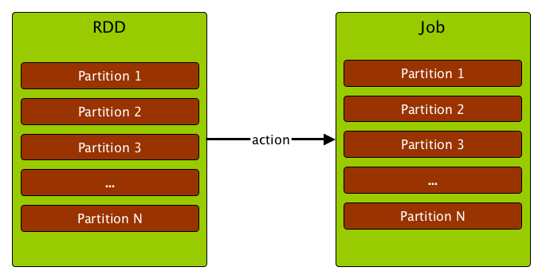

== [[ActiveJob]] ActiveJob

A *job* (aka _action job_ or _active job_) is a top-level work item (computation) submitted to link:spark-dagscheduler.adoc[DAGScheduler] to link:spark-rdd-actions.adoc[compute the result of an action] (or for link:spark-dagscheduler.adoc#adaptive-query-planning[Adaptive Query Planning / Adaptive Scheduling]).

.RDD actions submit jobs to DAGScheduler

Computing a job is equivalent to computing the partitions of the RDD the action has been executed upon. The number of partitions in a job depends on the type of a stage - link:spark-dagscheduler-ResultStage.adoc[ResultStage] or link:spark-dagscheduler-ShuffleMapStage.adoc[ShuffleMapStage].

A job starts with a single target RDD, but can ultimately include other RDDs that are all part of link:spark-rdd#lineage[the target RDD's lineage graph].

The parent stages are the instances of link:spark-dagscheduler-ShuffleMapStage.adoc[ShuffleMapStage].

.Computing a job is computing the partitions of an RDD

NOTE: Note that not all partitions have always to be computed for link:spark-dagscheduler-ResultStage.adoc[ResultStages] for actions like `first()` and `lookup()`.

Internally, a job is represented by an instance of https://github.com/apache/spark/blob/master/core/src/main/scala/org/apache/spark/scheduler/ActiveJob.scala[private[spark\] class org.apache.spark.scheduler.ActiveJob].

[CAUTION]
====
FIXME

* Where are instances of ActiveJob used?
====

A job can be one of two logical types (that are only distinguished by an internal `finalStage` field of `ActiveJob`):

* *Map-stage job* that computes the map output files for a link:spark-dagscheduler-ShuffleMapStage.adoc[ShuffleMapStage] (for `submitMapStage`) before any downstream stages are submitted.
+
It is also used for link:spark-dagscheduler.adoc#adaptive-query-planning[Adaptive Query Planning / Adaptive Scheduling], to look at map output statistics before submitting later stages.
* *Result job* that computes a link:spark-dagscheduler-ResultStage.adoc[ResultStage] to execute an action.

Jobs track how many partitions have already been computed (using `finished` array of `Boolean` elements).
