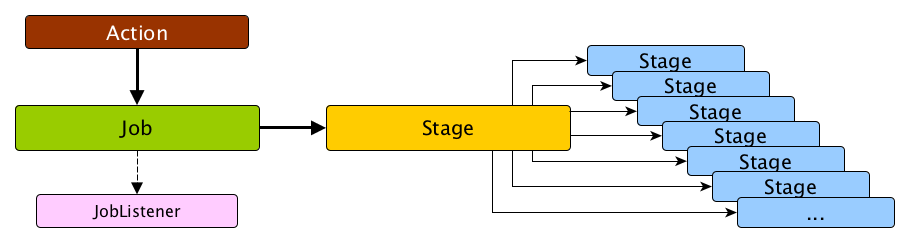
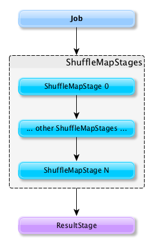
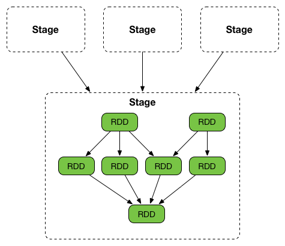

== Stages

=== Introduction

A *stage* is a set of parallel tasks, one per partition of an RDD, that compute partial results of a function executed as part of a Spark job.

.Stage, tasks and submitting a job
image::diagrams/stage-tasks.png[align="center"]

A stage is uniquely identified by `id`. When a stage is created, link:spark-dagscheduler.adoc[DAGScheduler] increments internal counter `nextStageId` to track the number of link:spark-dagscheduler.adoc#stage-submission[stage submissions].

A stage can only work on the partitions of a single RDD (identified by `rdd`), but can be associated with many other dependent parent stages (via internal field `parents`), with the boundary of a stage marked by shuffle dependencies.

Submitting a stage can therefore trigger execution of a series of dependent parent stages (refer to link:spark-dagscheduler.adoc#runJob[RDDs, Job Execution, Stages, and Partitions]).

.Submitting a job triggers execution of the stage and its parent stages


Finally, every stage has a `firstJobId` that is the id of the job that submitted the stage.

There are two types of stages:

* <<ShuffleMapStage, ShuffleMapStage>> is an intermediate stage (in the execution DAG) that produces data for other stage(s). It writes *map output files* for a shuffle. It can also be the final stage in a job in <<adaptive-query-planning, adaptive query planning>>.
* <<ResultStage, ResultStage>> is the final stage that executes link:spark-rdd.adoc#actions[a Spark action] in a user program by running a function on an RDD.

When a job is submitted, a new stage is created with the parent ShuffleMapStages linked -- they can be created from scratch or linked to, i.e. shared, if other jobs use them already.

.DAGScheduler and Stages for a job


A stage knows about the jobs it belongs to (using the internal field `jobIds`).

DAGScheduler splits up a job into a collection of stages. Each stage contains a sequence of link:spark-rdd.adoc[narrow transformations] that can be completed without link:spark-rdd-shuffle.adoc[shuffling] the entire data set, separated at *shuffle boundaries*, i.e. where shuffle occurs. Stages are thus a result of breaking the RDD graph at shuffle boundaries.

.Graph of Stages


Shuffle boundaries introduce a barrier where stages/tasks must wait for the previous stage to finish before they fetch map outputs.

.DAGScheduler splits a job into stages
image::diagrams/scheduler-job-splits-into-stages.png[align="center"]

RDD operations with link:spark-rdd.adoc[narrow dependencies], like `map()` and `filter()`, are pipelined together into one set of tasks in each stage, but operations with shuffle dependencies require multiple stages, i.e. one to write a set of map output files, and another to read those files after a barrier.

In the end, every stage will have only shuffle dependencies on other stages, and may compute multiple operations inside it. The actual pipelining of these operations happens in the `RDD.compute()` functions of various RDDs, e.g. `MappedRDD`, `FilteredRDD`, etc.

At some point of time in a stage's life, every partition of the stage gets transformed into a task - <<spark-taskscheduler.adoc#shufflemaptask, ShuffleMapTask>> or `ResultTask` for `ShuffleMapStage` and `ResultStage`, respectively.

Partitions are computed in jobs, and result stages may not always need to compute all partitions in their target RDD, e.g. for actions like `first()` and `lookup()`.

`DAGScheduler` prints the following INFO message when there are tasks to submit:

```
INFO DAGScheduler: Submitting 1 missing tasks from ResultStage 36 (ShuffledRDD[86] at reduceByKey at <console>:24)
```

There is also the following DEBUG message with pending partitions:

```
DEBUG DAGScheduler: New pending partitions: Set(0)
```

Tasks are later submitted to link:spark-taskscheduler.adoc[Task Scheduler] (via `taskScheduler.submitTasks`).

When no tasks in a stage can be submitted, the following DEBUG message shows in the logs:

```
FIXME
```

=== numTasks - where and what

CAUTION: FIXME Why do stages have `numTasks`? Where is this used? How does this correspond to the number of partitions in a RDD?

=== [[ShuffleMapStage]] ShuffleMapStage

A *ShuffleMapStage* (aka *shuffle map stage*, or simply *map stage*) is an intermediate stage in the execution DAG that produces data for link:spark-rdd-shuffle.adoc[shuffle operation]. It is an input for the other following stages in the DAG of stages. That is why it is also called a *shuffle dependency's map side* (see link:spark-rdd-dependencies.adoc#ShuffleDependency[ShuffleDependency])

ShuffleMapStages usually contain multiple pipelined operations, e.g. `map` and `filter`, before shuffle operation.

CAUTION: FIXME: Show the example and the logs + figures

A single ShuffleMapStage can be part of many jobs -- refer to the section <<stage-sharing, ShuffleMapStage sharing>>.

A ShuffleMapStage is a stage with a link:spark-rdd-dependencies.adoc#ShuffleDependency[ShuffleDependency] - the shuffle that it is part of and `outputLocs` and `numAvailableOutputs` track how many map outputs are ready.

NOTE: ShuffleMapStages can also be submitted independently as jobs with `DAGScheduler.submitMapStage` for <<adaptive-query-planning, Adaptive Query Planning>>.

When executed, ShuffleMapStages save *map output files* that can later be fetched by reduce tasks.

CAUTION: FIXME Figure with ShuffleMapStages saving files

The number of the partitions of an RDD is exactly the number of the tasks in a ShuffleMapStage.

The output locations (`outputLocs`) of a ShuffleMapStage are the same as used by its link:spark-rdd-dependencies.adoc#ShuffleDependency[ShuffleDependency]. Output locations can be missing, i.e. partitions have not been cached or are lost.

ShuffleMapStages are registered to DAGScheduler that tracks the mapping of shuffles (by their ids from SparkContext) to corresponding ShuffleMapStages that compute them, stored in `shuffleToMapStage`.

A new ShuffleMapStage is created from an input <<spark-rdd-dependencies.adoc#shuffle-dependency, ShuffleDependency>> and a job's id (in `DAGScheduler#newOrUsedShuffleStage`).

FIXME: Where's `shuffleToMapStage` used?

* getShuffleMapStage - see <<stage-sharing, Stage sharing>>
* getAncestorShuffleDependencies
* cleanupStateForJobAndIndependentStages
* handleExecutorLost

When there is no ShuffleMapStage for a shuffle id (of a ShuffleDependency), one is created with the ancestor shuffle dependencies of the RDD (of a ShuffleDependency) that are registered to link:spark-service-mapoutputtracker.adoc[MapOutputTrackerMaster].

FIXME Where is `ShuffleMapStage` used?

* newShuffleMapStage - the proper way to create shuffle map stages (with the additional setup steps)
* <<MapStageSubmitted, MapStageSubmitted>>
* `getShuffleMapStage` - see <<stage-sharing, Stage sharing>>

[CAUTION]
====
FIXME

* What's `ShuffleMapStage.outputLocs` and `MapStatus`?
* `newShuffleMapStage`
====

=== [[ResultStage]] ResultStage

A *ResultStage* is the final stage in running any job that applies a function on some partitions of the target RDD to compute the result of an action.

.Job creates ResultStage as the first stage
image::diagrams/dagscheduler-job-resultstage.png[align="center"]

The partitions are given as a collection of partition ids (`partitions`) and the function `func: (TaskContext, Iterator[_]) => _`.

.ResultStage and partitions
image::images/dagscheduler-resultstage-partitions.png[align="center"]

=== [[stage-sharing]] ShuffleMapStage Sharing

ShuffleMapStages can be shared across multiple jobs, if these jobs reuse the same RDDs.

When a ShuffleMapStage is submitted to DAGScheduler to execute, `getShuffleMapStage` is called (as part of <<MapStageSubmitted, handleMapStageSubmitted>> while `newResultStage` - note the `new` part - for <<JobSubmitted, handleJobSubmitted>>).

[source, scala]
----
scala> val rdd = sc.parallelize(0 to 5).map((_,1)).sortByKey()  // <1>

scala> rdd.count  // <2>

scala> rdd.count  // <3>
----
<1> Shuffle at `sortByKey()`
<2> Submits a job with two stages with two being executed
<3> Intentionally repeat the last action that submits a new job with two stages with one being shared as already-being-computed

.Skipped Stages are already-computed ShuffleMapStages
image::images/dagscheduler-webui-skipped-stages.png[align="center"]

=== [[findMissingPartitions]] Stage.findMissingPartitions

`Stage.findMissingPartitions()` calculates the ids of the missing partitions, i.e. partitions for which the ActiveJob knows they are not finished (and so they are missing).

A ResultStage stage knows it by querying the active job about partition ids (`numPartitions`) that are not finished (using `ActiveJob.finished` array of booleans).

.ResultStage.findMissingPartitions and ActiveJob
image::images/resultstage-findMissingPartitions.png[align="center"]

In the above figure, partitions 1 and 2 are not finished (`F` is false while `T` is true).
