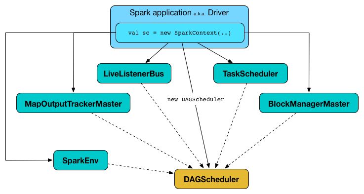
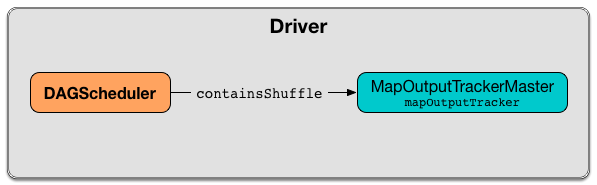

== [[DAGScheduler]] DAGScheduler -- Stage-Oriented Scheduler

[NOTE]
====
The introduction that follows was highly influenced by the scaladoc of https://github.com/apache/spark/blob/master/core/src/main/scala/org/apache/spark/scheduler/DAGScheduler.scala[org.apache.spark.scheduler.DAGScheduler]. As DAGScheduler is a private class it does not appear in the official API documentation. You are strongly encouraged to read https://github.com/apache/spark/blob/master/core/src/main/scala/org/apache/spark/scheduler/DAGScheduler.scala[the sources] and only then read this and the related pages afterwards.

_"Reading the sources"_, I say?! Yes, I _am_ kidding!
====

=== Introduction

*DAGScheduler* is the scheduling layer of Apache Spark that implements *stage-oriented scheduling*. It transforms a *logical execution plan* (i.e. link:spark-rdd-lineage.adoc[RDD lineage] of dependencies built using link:spark-rdd-transformations.adoc[RDD transformations]) to a *physical execution plan* (using link:spark-DAGScheduler-Stage.adoc[stages]).

.`DAGScheduler` Transforming RDD Lineage Into Stage DAG
image::images/dagscheduler-rdd-lineage-stage-dag.png[align="center"]

After an link:spark-rdd-actions.adoc[action] has been called, link:spark-SparkContext.adoc[SparkContext] hands over a logical plan to `DAGScheduler` that it in turn translates to a set of stages that are submitted as link:spark-taskscheduler-tasksets.adoc[TaskSets] for execution (see link:spark-execution-model.adoc[Execution Model]).

.Executing action leads to new ResultStage and ActiveJob in DAGScheduler
image::images/dagscheduler-rdd-partitions-job-resultstage.png[align="center"]

The fundamental concepts of `DAGScheduler` are *jobs* and *stages* (refer to link:spark-dagscheduler-jobs.adoc[Jobs] and link:spark-DAGScheduler-Stage.adoc[Stages] respectively) that it tracks through <<internal-registries, internal registries and counters>>.

DAGScheduler works solely on the driver and is created as part of link:spark-SparkContext.adoc#creating-instance[SparkContext's initialization] (right after link:spark-TaskScheduler.adoc[TaskScheduler] and link:spark-SchedulerBackend.adoc[SchedulerBackend] are ready).

.DAGScheduler as created by SparkContext with other services


DAGScheduler does three things in Spark (thorough explanations follow):

* Computes an *execution DAG*, i.e. DAG of stages, for a job.
* Determines the <<preferred-locations, preferred locations>> to run each task on.
* Handles failures due to *shuffle output files* being lost.

`DAGScheduler` computes https://en.wikipedia.org/wiki/Directed_acyclic_graph[a directed acyclic graph (DAG)] of stages for each job, keeps track of which RDDs and stage outputs are materialized, and finds a minimal schedule to run jobs. It then submits stages to link:spark-TaskScheduler.adoc[TaskScheduler].

In addition to coming up with the execution DAG, DAGScheduler also determines the preferred locations to run each task on, based on the current cache status, and passes the information to link:spark-TaskScheduler.adoc[TaskScheduler].

`DAGScheduler` tracks which link:spark-rdd-caching.adoc[RDDs are cached (or persisted)] to avoid "recomputing" them, i.e. redoing the map side of a shuffle. `DAGScheduler` remembers what link:spark-dagscheduler-ShuffleMapStage.adoc[ShuffleMapStage]s have already produced output files (that are stored in link:spark-blockmanager.adoc[BlockManager]s).

DAGScheduler is only interested in cache location coordinates, i.e. host and executor id, per partition of a RDD.

CAUTION: FIXME: A diagram, please

Furthermore, it handles failures due to shuffle output files being lost, in which case old stages may need to be resubmitted. Failures within a stage that are not caused by shuffle file loss are handled by the TaskScheduler itself, which will retry each task a small number of times before cancelling the whole stage.

DAGScheduler uses an *event queue architecture* in which a thread can post `DAGSchedulerEvent` events, e.g. a new job or stage being submitted, that DAGScheduler reads and executes sequentially. See the section <<event-loop, Internal Event Loop - dag-scheduler-event-loop>>.

DAGScheduler runs stages in topological order.

[[internal-properties]]
.DAGScheduler's Internal Properties
[cols="1,1,2",options="header",width="100%"]
|===
| Name
| Initial Value
| Description

| [[metricsSource]] metricsSource
| <<DAGSchedulerSource, DAGSchedulerSource>>
| FIXME
|===

[[internal-registries]]
.DAGScheduler's Internal Registries and Counters
[cols="1,2",options="header",width="100%"]
|===
| Name
| Description

| [[activeJobs]] `activeJobs`
| `ActiveJob` instances

| [[cacheLocs]] `cacheLocs`
| Block locations per RDD and partition.

Uses link:spark-TaskLocation.adoc[TaskLocation] that includes a host name and an executor id on that host (as `ExecutorCacheTaskLocation`).

The keys are RDDs (their ids) and the values are arrays indexed by partition numbers.

Each entry is a set of block locations where a RDD partition is cached, i.e. the link:spark-blockmanager.adoc[BlockManager]s of the blocks.

Initialized empty when <<creating-instance, `DAGScheduler` is created>>.

Used when `DAGScheduler` is requested for the <<getCacheLocs, locations of the cache blocks of a RDD>> or <<clearCacheLocs, clear them>>.

| [[failedEpoch]] `failedEpoch`
| The lookup table of lost executors and the epoch of the event.

| [[failedStages]] `failedStages`
| Stages that failed due to fetch failures (when a link:spark-dagscheduler-DAGSchedulerEventProcessLoop.adoc#handleTaskCompletion-FetchFailed[task fails with `FetchFailed` exception]).

| [[jobIdToActiveJob]] `jobIdToActiveJob`
| The lookup table of ``ActiveJob``s per job id.

| [[jobIdToStageIds]] `jobIdToStageIds`
| The lookup table of all stages per `ActiveJob` id

| [[nextJobId]] `nextJobId`
| The next job id counting from `0`.

Used when `DAGScheduler` <<submitJob, submits a job>> and <<submitMapStage, a map stage>>, and <<runApproximateJob, runs an approximate job>>.

| [[nextStageId]] `nextStageId`
| The next stage id counting from `0`.

Used when `DAGScheduler` creates a <<createShuffleMapStage, shuffle map stage>> and a <<createResultStage, result stage>>. It is the key in <<stageIdToStage, stageIdToStage>>.

| [[runningStages]] `runningStages`
| The set of stages that are currently "running".

A stage is added when <<submitMissingTasks, submitMissingTasks>> gets executed (without first checking if the stage has not already been added).

| [[shuffleIdToMapStage]] `shuffleIdToMapStage`
| The lookup table of link:spark-dagscheduler-ShuffleMapStage.adoc[ShuffleMapStage]s per link:spark-rdd-ShuffleDependency.adoc[ShuffleDependency].

| [[stageIdToStage]] `stageIdToStage`
| The lookup table for stages per their ids.

Used when `DAGScheduler` <<createShuffleMapStage, creates a shuffle map stage>>, <<createResultStage, creates a result stage>>, <<cleanupStateForJobAndIndependentStages, cleans up job state and independent stages>>, is informed that link:spark-dagscheduler-DAGSchedulerEventProcessLoop.adoc#handleBeginEvent[a task is started], link:spark-dagscheduler-DAGSchedulerEventProcessLoop.adoc#handleTaskSetFailed[a taskset has failed], link:spark-dagscheduler-DAGSchedulerEventProcessLoop.adoc#handleJobSubmitted[a job is submitted (to compute a `ResultStage`)], link:spark-dagscheduler-DAGSchedulerEventProcessLoop.adoc#handleMapStageSubmitted[a map stage was submitted], link:spark-dagscheduler-DAGSchedulerEventProcessLoop.adoc#handleTaskCompletion[a task has completed] or link:spark-dagscheduler-DAGSchedulerEventProcessLoop.adoc#handleStageCancellation[a stage was cancelled], <<updateAccumulators, updates accumulators>>, <<abortStage, aborts a stage>> and <<failJobAndIndependentStages, fails a job and independent stages>>.

| [[waitingStages]] `waitingStages`
| The stages with parents to be computed
|===

[TIP]
====
Enable `INFO`, `DEBUG` or `TRACE` logging levels for `org.apache.spark.scheduler.DAGSchedule` logger to see what happens inside `DAGScheduler`.

Add the following line to `conf/log4j.properties`:

```
log4j.logger.org.apache.spark.scheduler.DAGScheduler=TRACE
```

Refer to link:spark-logging.adoc[Logging].
====

DAGScheduler uses link:spark-SparkContext.adoc[SparkContext], link:spark-TaskScheduler.adoc[TaskScheduler], link:spark-LiveListenerBus.adoc[LiveListenerBus], link:spark-service-mapoutputtracker.adoc[MapOutputTracker] and link:spark-blockmanager.adoc[BlockManager] for its services. However, at the very minimum, `DAGScheduler` takes a `SparkContext` only (and requests `SparkContext` for the other services).

DAGScheduler reports metrics about its execution (refer to the section <<metrics, Metrics>>).

When DAGScheduler schedules a job as a result of link:spark-rdd.adoc#actions[executing an action on a RDD] or link:spark-SparkContext.adoc#runJob[calling SparkContext.runJob() method directly], it spawns parallel tasks to compute (partial) results per partition.

=== [[runApproximateJob]] Running Approximate Job -- `runApproximateJob` Method

CAUTION: FIXME

=== [[createResultStage]] `createResultStage` Internal Method

[source, scala]
----
createResultStage(
  rdd: RDD[_],
  func: (TaskContext, Iterator[_]) => _,
  partitions: Array[Int],
  jobId: Int,
  callSite: CallSite): ResultStage
----

CAUTION: FIXME

=== [[updateJobIdStageIdMaps]] `updateJobIdStageIdMaps` Method

CAUTION: FIXME

=== [[creating-instance]][[initialization]] Creating DAGScheduler Instance

`DAGScheduler` takes the following when created:

* [[sc]] link:spark-SparkContext.adoc[SparkContext]
* [[taskScheduler]] link:spark-TaskScheduler.adoc[TaskScheduler]
* [[listenerBus]] link:spark-LiveListenerBus.adoc[LiveListenerBus]
* [[mapOutputTracker]] link:spark-service-MapOutputTrackerMaster.adoc[MapOutputTrackerMaster]
* [[blockManagerMaster]] link:spark-BlockManagerMaster.adoc[BlockManagerMaster]
* [[env]] link:spark-sparkenv.adoc[SparkEnv]
* [[clock]] `Clock` (defaults to `SystemClock`)

`DAGScheduler` initializes the <<internal-registries, internal registries and counters>>.

`DAGScheduler` link:spark-TaskScheduler.adoc#setDAGScheduler[sets itself in the given `TaskScheduler`] and in the end starts <<eventProcessLoop, DAGScheduler Event Bus>>.

NOTE: `DAGScheduler` can reference all the services through a single link:spark-SparkContext.adoc[SparkContext] with or without specifying explicit link:spark-TaskScheduler.adoc[TaskScheduler].

=== [[listenerBus]] LiveListenerBus Event Bus for SparkListenerEvents -- `listenerBus` Property

[source, scala]
----
listenerBus: LiveListenerBus
----

`listenerBus` is a link:spark-LiveListenerBus.adoc[LiveListenerBus] to post scheduling events and is passed in when <<creating-instance, `DAGScheduler` is created>>.

=== [[executorHeartbeatReceived]] `executorHeartbeatReceived` Method

[source, scala]
----
executorHeartbeatReceived(
  execId: String,
  accumUpdates: Array[(Long, Int, Int, Seq[AccumulableInfo])],
  blockManagerId: BlockManagerId): Boolean
----

`executorHeartbeatReceived` posts a link:spark-SparkListener.adoc#SparkListenerExecutorMetricsUpdate[SparkListenerExecutorMetricsUpdate] (to <<listenerBus, listenerBus>>) and informs link:spark-BlockManagerMaster.adoc[BlockManagerMaster] that `blockManagerId` block manager is alive (by posting link:spark-BlockManagerMaster.adoc#BlockManagerHeartbeat[BlockManagerHeartbeat]).

NOTE: `executorHeartbeatReceived` is called when `TaskSchedulerImpl` link:spark-TaskSchedulerImpl.adoc#executorHeartbeatReceived[handles `executorHeartbeatReceived`].

=== [[cleanupStateForJobAndIndependentStages]] Cleaning Up After ActiveJob and Independent Stages -- `cleanupStateForJobAndIndependentStages` Method

[source, scala]
----
cleanupStateForJobAndIndependentStages(job: ActiveJob): Unit
----

`cleanupStateForJobAndIndependentStages` cleans up the state for `job` and any stages that are _not_ part of any other job.

`cleanupStateForJobAndIndependentStages` looks the `job` up in the internal <<jobIdToStageIds, jobIdToStageIds>> registry.

If no stages are found, the following ERROR is printed out to the logs:

```
ERROR No stages registered for job [jobId]
```

Oterwise, `cleanupStateForJobAndIndependentStages` uses <<stageIdToStage, stageIdToStage>> registry to find the stages (the real objects not ids!).

For each stage, `cleanupStateForJobAndIndependentStages` reads the jobs the stage belongs to.

If the `job` does not belong to the jobs of the stage, the following ERROR is printed out to the logs:

```
ERROR Job [jobId] not registered for stage [stageId] even though that stage was registered for the job
```

If the `job` was the only job for the stage, the stage (and the stage id) gets cleaned up from the registries, i.e. <<runningStages, runningStages>>, <<shuffleIdToMapStage, shuffleIdToMapStage>>, <<waitingStages, waitingStages>>, <<failedStages, failedStages>> and <<stageIdToStage, stageIdToStage>>.

While removing from <<runningStages, runningStages>>, you should see the following DEBUG message in the logs:

```
DEBUG Removing running stage [stageId]
```

While removing from <<waitingStages, waitingStages>>, you should see the following DEBUG message in the logs:

```
DEBUG Removing stage [stageId] from waiting set.
```

While removing from <<failedStages, failedStages>>, you should see the following DEBUG message in the logs:

```
DEBUG Removing stage [stageId] from failed set.
```

After all cleaning (using <<stageIdToStage, stageIdToStage>> as the source registry), if the stage belonged to the one and only `job`, you should see the following DEBUG message in the logs:

```
DEBUG After removal of stage [stageId], remaining stages = [stageIdToStage.size]
```

The `job` is removed from <<jobIdToStageIds, jobIdToStageIds>>, <<jobIdToActiveJob, jobIdToActiveJob>>, <<activeJobs, activeJobs>> registries.

The final stage of the `job` is removed, i.e. link:spark-dagscheduler-ResultStage.adoc#removeActiveJob[ResultStage] or link:spark-dagscheduler-ShuffleMapStage.adoc#removeActiveJob[ShuffleMapStage].

NOTE: `cleanupStateForJobAndIndependentStages` is used in link:spark-dagscheduler-DAGSchedulerEventProcessLoop.adoc#handleTaskCompletion-Success-ResultTask[`handleTaskCompletion` when a `ResultTask` has completed successfully], <<failJobAndIndependentStages, failJobAndIndependentStages>> and <<markMapStageJobAsFinished, markMapStageJobAsFinished>>.

=== [[markMapStageJobAsFinished]] Marking ShuffleMapStage Job Finished -- `markMapStageJobAsFinished` Method

[source, scala]
----
markMapStageJobAsFinished(job: ActiveJob, stats: MapOutputStatistics): Unit
----

`markMapStageJobAsFinished` marks the active `job` finished and notifies Spark listeners.

Internally, `markMapStageJobAsFinished` marks the zeroth partition finished and increases the number of tasks finished in `job`.

The link:spark-dagscheduler-JobListener.adoc#taskSucceeded[`job` listener is notified about the 0th task succeeded].

The <<cleanupStateForJobAndIndependentStages, state of the `job` and independent stages are cleaned up>>.

Ultimately, link:spark-SparkListener.adoc#SparkListenerJobEnd[SparkListenerJobEnd] is posted to link:spark-LiveListenerBus.adoc[LiveListenerBus] (as <<listenerBus, listenerBus>>) for the `job`, the current time (in millis) and `JobSucceeded` job result.

NOTE: `markMapStageJobAsFinished` is used in link:spark-dagscheduler-DAGSchedulerEventProcessLoop.adoc#handleMapStageSubmitted[handleMapStageSubmitted] and link:spark-dagscheduler-DAGSchedulerEventProcessLoop.adoc##handleTaskCompletion[handleTaskCompletion].

=== [[submitJob]] Submitting Job -- `submitJob` method

[source, scala]
----
submitJob[T, U](
  rdd: RDD[T],
  func: (TaskContext, Iterator[T]) => U,
  partitions: Seq[Int],
  callSite: CallSite,
  resultHandler: (Int, U) => Unit,
  properties: Properties): JobWaiter[U]
----

`submitJob` creates a link:spark-dagscheduler-JobWaiter.adoc[JobWaiter] and posts a link:spark-dagscheduler-DAGSchedulerEventProcessLoop.adoc#JobSubmitted[`JobSubmitted` event].

.DAGScheduler.submitJob
image::images/dagscheduler-submitjob.png[align="center"]

Internally, `submitJob` does the following:

1. Checks whether `partitions` reference available partitions of the input `rdd`.
2. Increments <<nextJobId, nextJobId>> internal job counter.
3. Returns a 0-task link:spark-dagscheduler-JobWaiter.adoc[JobWaiter] when the number of `partitions` is zero.
4. Posts a `JobSubmitted` event and returns a `JobWaiter`.

You may see a `IllegalArgumentException` thrown when the input `partitions` references partitions not in the input `rdd`:

```
Attempting to access a non-existent partition: [p]. Total number of partitions: [maxPartitions]
```

NOTE: `submitJob` is called when link:spark-SparkContext.adoc#submitJob[`SparkContext` submits a job] and <<runJob, `DAGScheduler` runs a job>>.

NOTE: `submitJob` assumes that the partitions of a RDD are indexed from 0 onwards in sequential order.

=== [[submitMapStage]] Submitting ShuffleDependency for Execution -- `submitMapStage` Method

[source, scala]
----
submitMapStage[K, V, C](
  dependency: ShuffleDependency[K, V, C],
  callback: MapOutputStatistics => Unit,
  callSite: CallSite,
  properties: Properties): JobWaiter[MapOutputStatistics]
----

`submitMapStage` creates a link:spark-dagscheduler-JobWaiter.adoc[JobWaiter] (that it eventually returns) and posts a link:spark-dagscheduler-DAGSchedulerEventProcessLoop.adoc#MapStageSubmitted[MapStageSubmitted] event to <<eventProcessLoop, DAGScheduler Event Bus>>).

Internally, `submitMapStage` increments <<nextJobId, `nextJobId` internal counter>> to get the job id.

`submitMapStage` then creates a link:spark-dagscheduler-JobWaiter.adoc[JobWaiter] (with the job id and with one artificial task that will however get completed only when the entire stage finishes).

`submitMapStage` announces the map stage submission application-wide (by posting a link:spark-dagscheduler-DAGSchedulerEventProcessLoop.adoc#MapStageSubmitted[MapStageSubmitted] to link:spark-LiveListenerBus.adoc[LiveListenerBus]).

NOTE: A `MapStageSubmitted` holds the newly-created job id and `JobWaiter` with the input `dependency`, `callSite` and `properties` parameters.

`submitMapStage` returns the `JobWaiter`.

If the number of partition to compute is `0`, `submitMapStage` throws a `SparkException`:

```
Can't run submitMapStage on RDD with 0 partitions
```

NOTE: `submitMapStage` is used when link:spark-SparkContext.adoc#submitMapStage[`SparkContext` submits a map stage for execution].

=== [[cancelStage]] Relaying Stage Cancellation From SparkContext (by Posting StageCancelled to DAGScheduler Event Bus) -- `cancelStage` Method

[source, scala]
----
cancelStage(stageId: Int)
----

`cancelJobGroup` merely posts a link:spark-dagscheduler-DAGSchedulerEventProcessLoop.adoc#StageCancelled[StageCancelled] event to the <<eventProcessLoop, DAGScheduler Event Bus>>.

NOTE: `cancelStage` is used exclusively when `SparkContext` link:spark-SparkContext.adoc#cancelStage[cancels a stage].

=== [[cancelJobGroup]] Relaying Job Group Cancellation From SparkContext (by Posting JobGroupCancelled to DAGScheduler Event Bus) -- `cancelJobGroup` Method

[source, scala]
----
cancelJobGroup(groupId: String): Unit
----

`cancelJobGroup` prints the following INFO message to the logs followed by posting a link:spark-dagscheduler-DAGSchedulerEventProcessLoop.adoc#JobGroupCancelled[JobGroupCancelled] event to the <<eventProcessLoop, DAGScheduler Event Bus>>.

```
INFO Asked to cancel job group [groupId]
```

NOTE: `cancelJobGroup` is used exclusively when `SparkContext` link:spark-SparkContext.adoc#cancelJobGroup[cancels a job group].

=== [[cancelAllJobs]] Relaying All Jobs Cancellation From SparkContext (by Posting AllJobsCancelled to DAGScheduler Event Bus) -- `cancelAllJobs` Method

[source, scala]
----
cancelAllJobs(): Unit
----

`cancelAllJobs` merely posts a link:spark-dagscheduler-DAGSchedulerEventProcessLoop.adoc#AllJobsCancelled[AllJobsCancelled] event to the <<eventProcessLoop, DAGScheduler Event Bus>>.

NOTE: `cancelAllJobs` is used exclusively when `SparkContext` link:spark-SparkContext.adoc#cancelAllJobs[cancels all running or scheduled Spark jobs].

=== [[taskStarted]] Relaying Task Started From TaskSetManager (by Posting BeginEvent to DAGScheduler Event Bus) -- `taskStarted` Method

[source, scala]
----
taskStarted(task: Task[_], taskInfo: TaskInfo)
----

`taskStarted` merely posts a link:spark-dagscheduler-DAGSchedulerEventProcessLoop.adoc#BeginEvent[BeginEvent] event to the <<eventProcessLoop, DAGScheduler Event Bus>>.

NOTE: `taskStarted` is used exclusively when a `TaskSetManager` link:spark-TaskSetManager.adoc#resourceOffer[starts a task].

=== [[taskGettingResult]] Relaying Task Fetching/Getting Result From TaskSetManager (by Posting GettingResultEvent to DAGScheduler Event Bus) -- `taskGettingResult` Method

[source, scala]
----
taskGettingResult(taskInfo: TaskInfo)
----

`taskGettingResult` merely posts a link:spark-dagscheduler-DAGSchedulerEventProcessLoop.adoc#GettingResultEvent[GettingResultEvent] event to the <<eventProcessLoop, DAGScheduler Event Bus>>.

NOTE: `taskGettingResult` is used exclusively when a `TaskSetManager` link:spark-TaskSetManager.adoc#handleTaskGettingResult[gets notified about a task fetching result].

=== [[taskEnded]] Relaying Task End From TaskSetManager (by Posting CompletionEvent to DAGScheduler Event Bus) -- `taskEnded` Method

[source, scala]
----
taskEnded(
  task: Task[_],
  reason: TaskEndReason,
  result: Any,
  accumUpdates: Map[Long, Any],
  taskInfo: TaskInfo,
  taskMetrics: TaskMetrics): Unit
----

`taskEnded` simply posts a link:spark-dagscheduler-DAGSchedulerEventProcessLoop.adoc#CompletionEvent[CompletionEvent] event to the <<eventProcessLoop, DAGScheduler Event Bus>>.

NOTE: `taskEnded` is used exclusively when a `TaskSetManager` reports task completions, i.e. success or link:spark-TaskSetManager.adoc#handleFailedTask[failure].

TIP: Read link:spark-taskscheduler-taskmetrics.adoc[TaskMetrics].

=== [[taskSetFailed]] Relaying TaskSet Failed From TaskSetManager (by Posting TaskSetFailed to DAGScheduler Event Bus) -- `taskSetFailed` Method

[source, scala]
----
taskSetFailed(
  taskSet: TaskSet,
  reason: String,
  exception: Option[Throwable]): Unit
----

`taskSetFailed` simply posts a link:spark-dagscheduler-DAGSchedulerEventProcessLoop.adoc#TaskSetFailed[TaskSetFailed] to <<eventProcessLoop, DAGScheduler Event Bus>>.

NOTE: The input arguments of `taskSetFailed` are exactly the arguments of link:spark-dagscheduler-DAGSchedulerEventProcessLoop.adoc#TaskSetFailed[TaskSetFailed].

NOTE: `taskSetFailed` is used exclusively when a `TaskSetManager` link:spark-TaskSetManager.adoc#abort[is aborted].

=== [[executorLost]] Relaying Executor Lost From TaskSchedulerImpl (by Posting ExecutorLost to DAGScheduler Event Bus) -- `executorLost` Method

[source, scala]
----
executorLost(execId: String, reason: ExecutorLossReason): Unit
----

`executorLost` simply posts a link:spark-dagscheduler-DAGSchedulerEventProcessLoop.adoc#ExecutorLost[ExecutorLost] event to <<eventProcessLoop, DAGScheduler Event Bus>>.

NOTE: `executorLost` is used when `TaskSchedulerImpl` link:spark-TaskSchedulerImpl.adoc#statusUpdate[gets task status update] (and a task gets lost which is used to indicate that the executor got broken and hence should be considered lost) or link:spark-TaskSchedulerImpl.adoc#executorLost[executorLost].

=== [[executorAdded]] Relaying Executor Added From TaskSchedulerImpl (by Posting ExecutorAdded to DAGScheduler Event Bus) -- `executorAdded` Method

[source, scala]
----
executorAdded(execId: String, host: String): Unit
----

`executorAdded` simply posts a link:spark-dagscheduler-DAGSchedulerEventProcessLoop.adoc#ExecutorAdded[ExecutorAdded] event to <<eventProcessLoop, DAGScheduler Event Bus>>.

NOTE: `executorAdded` is used exclusively when `TaskSchedulerImpl` link:spark-TaskSchedulerImpl.adoc#resourceOffers[is offered resources on executors] (and a new executor is found in the resource offers).

=== [[cancelJob]] Relaying Job Cancellation From SparkContext or JobWaiter (by Posting JobCancelled to DAGScheduler Event Bus) -- `cancelJob` Method

[source, scala]
----
cancelJob(jobId: Int): Unit
----

`cancelJob` prints the following INFO message and posts a link:spark-dagscheduler-DAGSchedulerEventProcessLoop.adoc#JobCancelled[JobCancelled] to <<eventProcessLoop, DAGScheduler Event Bus>>.

```
INFO DAGScheduler: Asked to cancel job [id]
```

NOTE: `cancelJob` is used when link:spark-SparkContext.adoc#cancelJob[SparkContext] or link:spark-dagscheduler-JobWaiter.adoc[JobWaiter] cancel a Spark job.

=== [[getOrCreateParentStages]] Finding Or Creating Missing Direct Parent ShuffleMapStages (For ShuffleDependencies of Input RDD) -- `getOrCreateParentStages` Internal Method

[source, scala]
----
getOrCreateParentStages(rdd: RDD[_], firstJobId: Int): List[Stage]
----

`getOrCreateParentStages` <<getShuffleDependencies, finds all direct parent `ShuffleDependencies`>> of the input `rdd` and then <<getOrCreateShuffleMapStage, finds `ShuffleMapStage` stages>> for each link:spark-rdd-ShuffleDependency.adoc[ShuffleDependency].

NOTE: `getOrCreateParentStages` is used when `DAGScheduler` <<createShuffleMapStage, createShuffleMapStage>> and <<createResultStage, createResultStage>>.

=== [[markStageAsFinished]] Marking Stage Finished -- `markStageAsFinished` Internal Method

[source, scala]
----
markStageAsFinished(stage: Stage, errorMessage: Option[String] = None): Unit
----

CAUTION: FIXME

=== [[runJob]] Running Job -- `runJob` Method

[source, scala]
----
runJob[T, U](
  rdd: RDD[T],
  func: (TaskContext, Iterator[T]) => U,
  partitions: Seq[Int],
  callSite: CallSite,
  resultHandler: (Int, U) => Unit,
  properties: Properties): Unit
----

`runJob` submits an action job to the `DAGScheduler` and waits for a result.

Internally, `runJob` executes <<submitJob, submitJob>> and then waits until a result comes using link:spark-dagscheduler-JobWaiter.adoc[JobWaiter].

When the job succeeds, you should see the following INFO message in the logs:

```
INFO Job [jobId] finished: [callSite], took [time] s
```

When the job fails, you should see the following INFO message in the logs and the exception (that led to the failure) is thrown.

```
INFO Job [jobId] failed: [callSite], took [time] s
```

NOTE: `runJob` is used when link:spark-SparkContext.adoc#runJob[`SparkContext` runs a job].

=== [[getOrCreateShuffleMapStage]] Finding or Creating New ShuffleMapStages for ShuffleDependency -- `getOrCreateShuffleMapStage` Internal Method

[source, scala]
----
getOrCreateShuffleMapStage(
  shuffleDep: ShuffleDependency[_, _, _],
  firstJobId: Int): ShuffleMapStage
----

`getOrCreateShuffleMapStage` finds or creates the link:spark-dagscheduler-ShuffleMapStage.adoc[ShuffleMapStage] for the input link:spark-rdd-ShuffleDependency.adoc[ShuffleDependency].

Internally, `getOrCreateShuffleMapStage` finds the `ShuffleDependency` in <<shuffleIdToMapStage, `shuffleIdToMapStage` internal registry>> and returns one when found.

If no `ShuffleDependency` was available, `getOrCreateShuffleMapStage` <<getMissingAncestorShuffleDependencies, finds all the missing shuffle dependencies>> and <<createShuffleMapStage, creates corresponding `ShuffleMapStage` stages>> (including one for the input `shuffleDep`).

NOTE: All the new `ShuffleMapStage` stages are associated with the input `firstJobId`.

NOTE: `getOrCreateShuffleMapStage` is used when `DAGScheduler` <<getOrCreateParentStages, finds or creates missing direct parent ShuffleMapStages>> (for ShuffleDependencies of given RDD), <<getMissingParentStages, getMissingParentStages>> (for link:spark-rdd-ShuffleDependency.adoc[ShuffleDependencies]), link:spark-dagscheduler-DAGSchedulerEventProcessLoop.adoc#handleMapStageSubmitted[is notified that `ShuffleDependency` was submitted], and <<stageDependsOn, checks if a stage depends on another>>.

=== [[createShuffleMapStage]] Creating ShuffleMapStage for ShuffleDependency (Copying Shuffle Map Output Locations From Previous Jobs) -- `createShuffleMapStage` Method

[source, scala]
----
createShuffleMapStage(
  shuffleDep: ShuffleDependency[_, _, _],
  jobId: Int): ShuffleMapStage
----

`createShuffleMapStage` creates a link:spark-dagscheduler-ShuffleMapStage.adoc[ShuffleMapStage] for the input link:spark-rdd-ShuffleDependency.adoc[ShuffleDependency] and `jobId` (of a link:spark-dagscheduler-jobs.adoc[ActiveJob]) possibly copying shuffle map output locations from previous jobs to avoid recomputing records.

NOTE: When a link:spark-dagscheduler-ShuffleMapStage.adoc[ShuffleMapStage] is created, the `id` is generated (using <<nextStageId, `nextStageId` internal counter>>), `rdd` is from `ShuffleDependency`, `numTasks` is the number of partitions in the RDD, all `parents` are looked up (and possibly created), the `jobId` is given, `callSite` is the `creationSite` of the RDD, and `shuffleDep` is the input `ShuffleDependency`.

Internally, `createShuffleMapStage` first <<getOrCreateParentStages, finds or creates missing parent `ShuffleMapStage` stages of the associated RDD>>.

NOTE: link:spark-rdd-ShuffleDependency.adoc[ShuffleDependency] is associated with exactly one `RDD[Product2[K, V]]`.

`createShuffleMapStage` link:spark-dagscheduler-ShuffleMapStage.adoc#creating-instance[creates a `ShuffleMapStage`] (with the stage id from <<nextStageId, `nextStageId` internal counter>>).

NOTE: The RDD of the new `ShuffleMapStage` is from the input link:spark-rdd-ShuffleDependency.adoc[ShuffleDependency].

`createShuffleMapStage` registers the `ShuffleMapStage` in <<stageIdToStage, stageIdToStage>> and <<shuffleIdToMapStage, shuffleIdToMapStage>> internal registries.

`createShuffleMapStage` calls <<updateJobIdStageIdMaps, updateJobIdStageIdMaps>>.

If link:spark-service-MapOutputTrackerMaster.adoc#containsShuffle[`MapOutputTrackerMaster` tracks the input `ShuffleDependency`] (because other jobs have already computed it), `createShuffleMapStage` link:spark-service-MapOutputTrackerMaster.adoc#getSerializedMapOutputStatuses[requests the serialized `ShuffleMapStage` outputs], link:spark-service-MapOutputTracker.adoc#deserializeMapStatuses[deserializes them] and link:spark-dagscheduler-ShuffleMapStage.adoc#addOutputLoc[registers with the new `ShuffleMapStage`].

NOTE: link:spark-service-MapOutputTrackerMaster.adoc[MapOutputTrackerMaster] was defined when <<creating-instance, `DAGScheduler` was created>>.

.`DAGScheduler` Asks `MapOutputTrackerMaster` Whether Shuffle Map Output Is Already Tracked


If however `MapOutputTrackerMaster` does not track the input `ShuffleDependency`, you should see the following INFO message in the logs and `createShuffleMapStage` link:spark-service-MapOutputTrackerMaster.adoc#registerShuffle[registers the `ShuffleDependency` with `MapOutputTrackerMaster`].

```
INFO Registering RDD [id] ([creationSite])
```

`createShuffleMapStage` returns the new `ShuffleMapStage`.

NOTE: `createShuffleMapStage` is executed only when `DAGScheduler` <<getOrCreateShuffleMapStage, finds or creates parent `ShuffleMapStage` stages for a `ShuffleDependency`>>.

=== [[clearCacheLocs]] Clearing Cache of RDD Block Locations -- `clearCacheLocs` Internal Method

[source, scala]
----
clearCacheLocs(): Unit
----

`clearCacheLocs` clears the <<cacheLocs, internal registry of the partition locations per RDD>>.

NOTE: `DAGScheduler` clears the cache while link:spark-dagscheduler-DAGSchedulerEventProcessLoop.adoc#resubmitFailedStages[resubmitting failed stages], and as a result of link:spark-dagscheduler-DAGSchedulerEventProcessLoop.adoc#JobSubmitted[JobSubmitted], link:spark-dagscheduler-DAGSchedulerEventProcessLoop.adoc#MapStageSubmitted[MapStageSubmitted], link:spark-dagscheduler-DAGSchedulerEventProcessLoop.adoc#CompletionEvent[CompletionEvent], link:spark-dagscheduler-DAGSchedulerEventProcessLoop.adoc#ExecutorLost[ExecutorLost] events.

=== [[getMissingAncestorShuffleDependencies]] Finding Missing ShuffleDependencies For RDD -- `getMissingAncestorShuffleDependencies` Internal Method

[source, scala]
----
getMissingAncestorShuffleDependencies(rdd: RDD[_]): Stack[ShuffleDependency[_, _, _]]
----

`getMissingAncestorShuffleDependencies` finds all missing link:spark-rdd-ShuffleDependency.adoc[shuffle dependencies] for the given link:spark-rdd.adoc[RDD] traversing its link:spark-rdd-lineage.adoc[dependency chain] (aka _RDD lineage_).

NOTE: A *missing shuffle dependency* of a RDD is a dependency not registered in <<shuffleIdToMapStage, `shuffleIdToMapStage` internal registry>>.

Internally, `getMissingAncestorShuffleDependencies` <<getShuffleDependencies, finds direct parent shuffle dependencies>> of the input RDD and collects the ones that are not registered in <<shuffleIdToMapStage, `shuffleIdToMapStage` internal registry>>. It repeats the process for the RDDs of the parent shuffle dependencies.

NOTE: `getMissingAncestorShuffleDependencies` is used when `DAGScheduler` <<getOrCreateShuffleMapStage, finds all `ShuffleMapStage` stages for a `ShuffleDependency`>>.

=== [[getShuffleDependencies]] Finding Direct Parent Shuffle Dependencies of RDD -- `getShuffleDependencies` Internal Method

[source, scala]
----
getShuffleDependencies(rdd: RDD[_]): HashSet[ShuffleDependency[_, _, _]]
----

`getShuffleDependencies` finds direct parent link:spark-rdd-ShuffleDependency.adoc[shuffle dependencies] for the given link:spark-rdd.adoc[RDD].

.getShuffleDependencies Finds Direct Parent ShuffleDependencies (shuffle1 and shuffle2)
image::images/spark-DAGScheduler-getShuffleDependencies.png[align="center"]

Internally, `getShuffleDependencies` takes the direct link:spark-rdd.adoc#dependencies[shuffle dependencies of the input RDD] and direct shuffle dependencies of all the parent non-``ShuffleDependencies`` in the link:spark-rdd-lineage.adoc[dependency chain] (aka _RDD lineage_).

NOTE: `getShuffleDependencies` is used when `DAGScheduler` <<getOrCreateParentStages, finds or creates missing direct parent ShuffleMapStages>> (for ShuffleDependencies of given RDD) and <<getMissingAncestorShuffleDependencies, finds all missing shuffle dependencies for a given RDD>>.

=== [[failJobAndIndependentStages]] Failing Job and Independent Single-Job Stages -- `failJobAndIndependentStages` Internal Method

[source, scala]
----
failJobAndIndependentStages(
  job: ActiveJob,
  failureReason: String,
  exception: Option[Throwable] = None): Unit
----

The internal `failJobAndIndependentStages` method fails the input `job` and all the stages that are only used by the job.

Internally, `failJobAndIndependentStages` uses <<jobIdToStageIds, `jobIdToStageIds` internal registry>> to look up the stages registered for the job.

If no stages could be found, you should see the following ERROR message in the logs:

```
ERROR No stages registered for job [id]
```

Otherwise, for every stage, `failJobAndIndependentStages` finds the job ids the stage belongs to.

If no stages could be found or the job is not referenced by the stages, you should see the following ERROR message in the logs:

```
ERROR Job [id] not registered for stage [id] even though that stage was registered for the job
```

Only when there is exactly one job registered for the stage and the stage is in RUNNING state (in `runningStages` internal registry), link:spark-TaskScheduler.adoc#contract[`TaskScheduler` is requested to cancel the stage's tasks] and <<markStageAsFinished, marks the stage finished>>.

NOTE: `failJobAndIndependentStages` is called from link:spark-dagscheduler-DAGSchedulerEventProcessLoop.adoc#handleJobCancellation[handleJobCancellation] and `abortStage`.

NOTE: `failJobAndIndependentStages` uses <<jobIdToStageIds, jobIdToStageIds>>, <<stageIdToStage, stageIdToStage>>, and <<runningStages, runningStages>> internal registries.

=== [[abortStage]] Aborting Stage -- `abortStage` Internal Method

[source, scala]
----
abortStage(
  failedStage: Stage,
  reason: String,
  exception: Option[Throwable]): Unit
----

`abortStage` is an internal method that finds all the active jobs that depend on the `failedStage` stage and fails them.

Internally, `abortStage` looks the `failedStage` stage up in the internal <<stageIdToStage, stageIdToStage>> registry and exits if there the stage was not registered earlier.

If it was, `abortStage` finds all the active jobs (in the internal <<activeJobs, activeJobs>> registry) with the <<stageDependsOn, final stage depending on the `failedStage` stage>>.

At this time, the `completionTime` property (of the failed stage's link:spark-dagscheduler-StageInfo.adoc[StageInfo]) is assigned to the current time (millis).

All the active jobs that depend on the failed stage (as calculated above) and the stages that do not belong to other jobs (aka _independent stages_) are <<failJobAndIndependentStages, failed>> (with the failure reason being "Job aborted due to stage failure: [reason]" and the input `exception`).

If there are no jobs depending on the failed stage, you should see the following INFO message in the logs:

```
INFO Ignoring failure of [failedStage] because all jobs depending on it are done
```

NOTE: `abortStage` is used to link:spark-dagscheduler-DAGSchedulerEventProcessLoop.adoc#handleTaskSetFailed[handle `TaskSetFailed` event], when <<submitStage, submitting a stage with no active job>>

=== [[stageDependsOn]] Checking Out Stage Dependency on Given Stage -- `stageDependsOn` Method

[source, scala]
----
stageDependsOn(stage: Stage, target: Stage): Boolean
----

`stageDependsOn` compares two stages and returns whether the `stage` depends on `target` stage (i.e. `true`) or not (i.e. `false`).

NOTE: A stage `A` depends on stage `B` if `B` is among the ancestors of `A`.

Internally, `stageDependsOn` walks through the graph of RDDs of the input `stage`. For every RDD in the RDD's dependencies (using `RDD.dependencies`) `stageDependsOn` adds the RDD of a link:spark-rdd-NarrowDependency.adoc[NarrowDependency] to a stack of RDDs to visit while for a link:spark-rdd-ShuffleDependency.adoc[ShuffleDependency] it <<getOrCreateShuffleMapStage, finds `ShuffleMapStage` stages for a `ShuffleDependency`>> for the dependency and the ``stage``'s first job id that it later adds to a stack of RDDs to visit if the map stage is ready, i.e. all the partitions have shuffle outputs.

After all the RDDs of the input `stage` are visited, `stageDependsOn` checks if the ``target``'s RDD is among the RDDs of the `stage`, i.e. whether the `stage` depends on `target` stage.

=== [[event-loop]][[eventProcessLoop]] dag-scheduler-event-loop -- DAGScheduler Event Bus

`eventProcessLoop` is link:spark-dagscheduler-DAGSchedulerEventProcessLoop.adoc[DAGScheduler's event bus] to which Spark (by <<submitJob, submitJob>>) posts jobs to schedule their execution. Later on, link:spark-TaskSetManager.adoc[TaskSetManager] talks back to `DAGScheduler` to inform about the status of the tasks using the same "communication channel".

It allows Spark to release the current thread when posting happens and let the event loop handle events on a separate thread - asynchronously.

...IMAGE...FIXME

CAUTION: FIXME statistics? `MapOutputStatistics`?

=== [[submitWaitingChildStages]] Submitting Waiting Child Stages for Execution -- `submitWaitingChildStages` Internal Method

[source, scala]
----
submitWaitingChildStages(parent: Stage): Unit
----

`submitWaitingChildStages` submits for execution all waiting stages for which the input `parent` link:spark-DAGScheduler-Stage.adoc[Stage] is the direct parent.

NOTE: *Waiting stages* are the stages registered in <<waitingStages, `waitingStages` internal registry>>.

When executed, you should see the following `TRACE` messages in the logs:

```
TRACE DAGScheduler: Checking if any dependencies of [parent] are now runnable
TRACE DAGScheduler: running: [runningStages]
TRACE DAGScheduler: waiting: [waitingStages]
TRACE DAGScheduler: failed: [failedStages]
```

`submitWaitingChildStages` finds child stages of the input `parent` stage, removes them from `waitingStages` internal registry, and <<submitStage, submits>> one by one sorted by their job ids.

NOTE: `submitWaitingChildStages` is executed when `DAGScheduler` <<submitMissingTasks, submits missing tasks for stage>> and link:spark-dagscheduler-DAGSchedulerEventProcessLoop.adoc#handleTaskCompletion-Success-ShuffleMapTask[handles successful `ShuffleMapTask` completion].

=== [[submitStage]] Submitting Stage or Its Missing Parents for Execution -- `submitStage` Internal Method

[source, scala]
----
submitStage(stage: Stage)
----

`submitStage` is an internal method that `DAGScheduler` uses to submit the input `stage` or its missing parents (if there any stages not computed yet before the input `stage` could).

NOTE: `submitStage` is also used to link:spark-dagscheduler-DAGSchedulerEventProcessLoop.adoc#resubmitFailedStages[resubmit failed stages].

`submitStage` recursively submits any missing parents of the `stage`.

Internally, `submitStage` first finds the earliest-created job id that needs the `stage`.

NOTE: A stage itself tracks the jobs (their ids) it belongs to (using the internal `jobIds` registry).

The following steps depend on whether there is a job or not.

If there are no jobs that require the `stage`, `submitStage` <<abortStage, aborts it>> with the reason:

```
No active job for stage [id]
```

If however there is a job for the `stage`, you should see the following DEBUG message in the logs:

```
DEBUG DAGScheduler: submitStage([stage])
```

`submitStage` checks the status of the `stage` and continues when it was not recorded in <<waitingStages, waiting>>, <<runningStages, running>> or <<failedStages, failed>> internal registries. It simply exits otherwise.

With the `stage` ready for submission, `submitStage` calculates the <<getMissingParentStages, list of missing parent stages of the `stage`>> (sorted by their job ids). You should see the following DEBUG message in the logs:

```
DEBUG DAGScheduler: missing: [missing]
```

When the `stage` has no parent stages missing, you should see the following INFO message in the logs:

```
INFO DAGScheduler: Submitting [stage] ([stage.rdd]), which has no missing parents
```

`submitStage` <<submitMissingTasks, submits the `stage`>> (with the earliest-created job id) and finishes.

If however there are missing parent stages for the `stage`, `submitStage` <<submitStage, submits all the parent stages>>, and the `stage` is recorded in the internal <<waitingStages, waitingStages>> registry.

NOTE: `submitStage` is executed when `DAGScheduler` submits <<submitStage, missing parent map stages (of a stage) recursively>> or <<submitWaitingChildStages, waiting child stages>>, link:spark-dagscheduler-DAGSchedulerEventProcessLoop.adoc#resubmitFailedStages[resubmits failed stages], and handles  link:spark-dagscheduler-DAGSchedulerEventProcessLoop.adoc#handleJobSubmitted[JobSubmitted],  link:spark-dagscheduler-DAGSchedulerEventProcessLoop.adoc#handleMapStageSubmitted[MapStageSubmitted], or link:spark-dagscheduler-DAGSchedulerEventProcessLoop.adoc#CompletionEvent[CompletionEvent] events.

=== [[stage-attempts]] Fault recovery - stage attempts

A single stage can be re-executed in multiple *attempts* due to fault recovery. The number of attempts is configured (FIXME).

If `TaskScheduler` reports that a task failed because a map output file from a previous stage was lost, the `DAGScheduler` resubmits the lost stage. This is detected through a link:spark-dagscheduler-DAGSchedulerEventProcessLoop.adoc#handleTaskCompletion-FetchFailed[`CompletionEvent` with `FetchFailed`], or an <<ExecutorLost, ExecutorLost>> event. `DAGScheduler` will wait a small amount of time to see whether other nodes or tasks fail, then resubmit `TaskSets` for any lost stage(s) that compute the missing tasks.

Please note that tasks from the old attempts of a stage could still be running.

A stage object tracks multiple link:spark-dagscheduler-StageInfo.adoc[StageInfo] objects to pass to Spark listeners or the web UI.

The latest `StageInfo` for the most recent attempt for a stage is accessible through `latestInfo`.

=== [[preferred-locations]] Preferred Locations

`DAGScheduler` computes where to run each task in a stage based on the link:spark-rdd.adoc#getPreferredLocations[preferred locations of its underlying RDDs], or <<getCacheLocs, the location of cached or shuffle data>>.

=== [[adaptive-query-planning]] Adaptive Query Planning / Adaptive Scheduling

See https://issues.apache.org/jira/browse/SPARK-9850[SPARK-9850 Adaptive execution in Spark] for the design document. The work is currently in progress.

https://github.com/apache/spark/blob/master/core/src/main/scala/org/apache/spark/scheduler/DAGScheduler.scala#L661[DAGScheduler.submitMapStage] method is used for adaptive query planning, to run map stages and look at statistics about their outputs before submitting downstream stages.

=== ScheduledExecutorService daemon services

DAGScheduler uses the following ScheduledThreadPoolExecutors (with the policy of removing cancelled tasks from a work queue at time of cancellation):

* `dag-scheduler-message` - a daemon thread pool using `j.u.c.ScheduledThreadPoolExecutor` with core pool size `1`. It is used to post a link:spark-dagscheduler-DAGSchedulerEventProcessLoop.adoc#ResubmitFailedStages[ResubmitFailedStages] event when link:spark-dagscheduler-DAGSchedulerEventProcessLoop.adoc#handleTaskCompletion-FetchFailed[`FetchFailed` is reported].

They are created using `ThreadUtils.newDaemonSingleThreadScheduledExecutor` method that uses Guava DSL to instantiate a ThreadFactory.

=== [[getMissingParentStages]] Finding Missing Parent ShuffleMapStages For Stage -- `getMissingParentStages` Internal Method

[source, scala]
----
getMissingParentStages(stage: Stage): List[Stage]
----

`getMissingParentStages` finds missing parent link:spark-dagscheduler-ShuffleMapStage.adoc[ShuffleMapStage]s in the dependency graph of the input `stage` (using the https://en.wikipedia.org/wiki/Breadth-first_search[breadth-first search algorithm]).

Internally, `getMissingParentStages` starts with the ``stage``'s RDD and walks up the tree of all parent RDDs to find <<getCacheLocs, uncached partitions>>.

NOTE: A `Stage` tracks the associated RDD using link:spark-DAGScheduler-Stage.adoc#rdd[`rdd` property].

NOTE: An *uncached partition* of a RDD is a partition that has `Nil` in the <<cacheLocs, internal registry of partition locations per RDD>> (which results in no RDD blocks in any of the active link:spark-blockmanager.adoc[BlockManager]s on executors).

`getMissingParentStages` traverses the link:spark-rdd.adoc#dependencies[parent dependencies of the RDD] and acts according to their type, i.e. link:spark-rdd-ShuffleDependency.adoc[ShuffleDependency] or link:spark-rdd-NarrowDependency.adoc[NarrowDependency].

NOTE: link:spark-rdd-ShuffleDependency.adoc[ShuffleDependency] and link:spark-rdd-NarrowDependency.adoc[NarrowDependency] are the main top-level link:spark-rdd-dependencies.adoc[Dependencies].

For each `NarrowDependency`, `getMissingParentStages` simply marks the corresponding RDD to visit and moves on to a next dependency of a RDD or works on another unvisited parent RDD.

NOTE: link:spark-rdd-NarrowDependency.adoc[NarrowDependency] is a RDD dependency that allows for pipelined execution.

`getMissingParentStages` focuses on `ShuffleDependency` dependencies.

NOTE: link:spark-rdd-ShuffleDependency.adoc[ShuffleDependency] is a RDD dependency that represents a dependency on the output of a link:spark-dagscheduler-ShuffleMapStage.adoc[ShuffleMapStage], i.e. *shuffle map stage*.

For each `ShuffleDependency`, `getMissingParentStages` <<getOrCreateShuffleMapStage, finds `ShuffleMapStage` stages>>. If the `ShuffleMapStage` is not _available_, it is added to the set of missing (map) stages.

NOTE: A `ShuffleMapStage` is *available* when all its partitions are computed, i.e. results are available (as blocks).

CAUTION: FIXME...IMAGE with ShuffleDependencies queried

NOTE: `getMissingParentStages` is used when `DAGScheduler` <<submitStage, submits missing parent ``ShuffleMapStage``s (of a stage)>> and handles link:spark-dagscheduler-DAGSchedulerEventProcessLoop.adoc#handleJobSubmitted[JobSubmitted] and link:spark-dagscheduler-DAGSchedulerEventProcessLoop.adoc#handleMapStageSubmitted[MapStageSubmitted] events.

=== [[submitMissingTasks]] Submitting Missing Tasks of Stage (in a Spark Job) -- `submitMissingTasks` Internal Method

[source, scala]
----
submitMissingTasks(stage: Stage, jobId: Int): Unit
----

`submitMissingTasks`...FIXME

CAUTION: FIXME

When executed, you should see the following DEBUG message in the logs:

```
DEBUG DAGScheduler: submitMissingTasks([stage])
```

The input ``stage``'s link:spark-DAGScheduler-Stage.adoc#pendingPartitions[`pendingPartitions` internal field] is cleared (it is later filled out with the partitions to run tasks for).

`submitMissingTasks` requests the `stage` for link:spark-DAGScheduler-Stage.adoc#findMissingPartitions[missing partitions], i.e. the indices of the partitions to compute.

`submitMissingTasks` marks the `stage` as running (i.e. adds it to <<runningStages, runningStages>> internal registry).

`submitMissingTasks` link:spark-service-outputcommitcoordinator.adoc#stageStart[notifies `OutputCommitCoordinator` that the stage is started].

NOTE: The input `maxPartitionId` argument handed over to link:spark-service-outputcommitcoordinator.adoc#stageStart[OutputCommitCoordinator] depends on the type of the stage, i.e. `ShuffleMapStage` or `ResultStage`. `ShuffleMapStage` tracks the number of partitions itself (as `numPartitions` property) while `ResultStage` uses the internal `RDD` to find out the number.

[[submitMissingTasks-taskIdToLocations]]
For the missing partitions, `submitMissingTasks` computes their *task locality preferences*, i.e. pairs of missing partition ids and <<getPreferredLocs, their task locality information>>.
HERE
NOTE: The locality information of a RDD is called *preferred locations*.

In case of _non-fatal_ exceptions at this time (while getting the locality information), `submitMissingTasks` link:spark-DAGScheduler-Stage.adoc#makeNewStageAttempt[creates a new stage attempt].

NOTE: A stage attempt is an internal property of a stage.

Despite the failure to submit any tasks, `submitMissingTasks` does announce that at least there was an attempt on link:spark-LiveListenerBus.adoc[LiveListenerBus] by posting a link:spark-SparkListener.adoc#SparkListenerStageSubmitted[SparkListenerStageSubmitted] message.

NOTE: The Spark application's link:spark-LiveListenerBus.adoc[LiveListenerBus] is given when <<creating-instance, `DAGScheduler` is created>>.

`submitMissingTasks` then <<abortStage, aborts the stage>> (with the reason being "Task creation failed" followed by the exception).

The `stage` is removed from the internal <<runningStages, `runningStages` collection of stages>> and `submitMissingTasks` exits.

When no exception was thrown (while computing the locality information for tasks), `submitMissingTasks` link:spark-DAGScheduler-Stage.adoc#makeNewStageAttempt[creates a new stage attempt] and announces it on link:spark-LiveListenerBus.adoc[LiveListenerBus] by posting a link:spark-SparkListener.adoc#SparkListenerStageSubmitted[SparkListenerStageSubmitted] message.

NOTE: Yes, that _is_ correct. Whether there was a task submission failure or not, `submitMissingTasks` creates a new stage attempt and posts a `SparkListenerStageSubmitted`. That makes sense, _doesn't it?_

At that time, `submitMissingTasks` serializes the RDD (of the stage for which tasks are submitted for) and, depending on the type of the stage, the link:spark-dagscheduler-ShuffleMapStage.adoc#shuffleDep[`ShuffleDependency` (for `ShuffleMapStage`)] or the link:spark-dagscheduler-ResultStage.adoc#func[function (for `ResultStage`)].

NOTE: `submitMissingTasks` uses a closure `Serializer` that <<creating-instance, `DAGScheduler` creates for the entire lifetime when it is created>>. The closure serializer is available through link:spark-sparkenv.adoc#closureSerializer[SparkEnv].

The serialized so-called _task binary bytes_ are link:spark-SparkContext.adoc#broadcast["wrapped" as a broadcast variable] (to make it available for executors to execute later on).

NOTE: That exact moment should make clear how important link:spark-broadcast.adoc[broadcast variables] are for Spark itself that you, a Spark developer, can use, too, to distribute data across the nodes in a Spark application in a very efficient way.

Any `NotSerializableException` exceptions lead to <<abortStage, aborting the stage>> (with the reason being "Task not serializable: [exception]") and removing the stage from the <<runningStages, internal `runningStages` collection of stages>>. `submitMissingTasks` exits.

Any _non-fatal_ exceptions lead to <<abortStage, aborting the stage>> (with the reason being "Task serialization failed" followed by the exception) and removing the stage from the <<runningStages, internal `runningStages` collection of stages>>. `submitMissingTasks` exits.

With no exceptions along the way, `submitMissingTasks` computes a collection of link:spark-taskscheduler-tasks.adoc[tasks] to execute for the missing partitions (of the `stage`).

`submitMissingTasks` creates a link:spark-taskscheduler-ShuffleMapTask.adoc[ShuffleMapTask] or link:spark-taskscheduler-ResultTask.adoc[ResultTask] for every missing partition of the `stage` being link:spark-dagscheduler-ShuffleMapStage.adoc[ShuffleMapStage] or link:spark-dagscheduler-ResultStage.adoc[ResultStage], respectively. `submitMissingTasks` uses the preferred locations (computed earlier) per partition.

CAUTION: FIXME Image with creating tasks for partitions in the stage.

Any _non-fatal_ exceptions lead to <<abortStage, aborting the stage>> (with the reason being "Task creation failed" followed by the exception) and removing the stage from the <<runningStages, internal `runningStages` collection of stages>>. `submitMissingTasks` exits.

If there are tasks to submit for execution (i.e. there are missing partitions in the stage), you should see the following INFO message in the logs:

```
INFO DAGScheduler: Submitting [size] missing tasks from [stage] ([rdd])
```

`submitMissingTasks` records the partitions (of the tasks) in the ``stage``'s link:spark-DAGScheduler-Stage.adoc#pendingPartitions[`pendingPartitions` property].

NOTE: `pendingPartitions` property of the `stage` was cleared when `submitMissingTasks` started.

You should see the following DEBUG message in the logs:

```
DEBUG DAGScheduler: New pending partitions: [pendingPartitions]
```

`submitMissingTasks` link:spark-TaskScheduler.adoc#submitTasks[submits the tasks to `TaskScheduler` for execution] (with the id of the `stage`, attempt id, the input `jobId`, and the properties of the `ActiveJob` with `jobId`).

NOTE: A `TaskScheduler` was given when <<creating-instance, `DAGScheduler` was created>>.

CAUTION: FIXME What are the `ActiveJob` properties for? Where are they used?

`submitMissingTasks` records the link:spark-DAGScheduler-Stage.adoc#latestInfo[submission time in the stage's `StageInfo`] and exits.

If however there are no tasks to submit for execution, `submitMissingTasks` <<markStageAsFinished, marks the stage as finished>> (with no `errorMessage`).

You should see a DEBUG message that varies per the type of the input `stage` which are:

```
DEBUG DAGScheduler: Stage [stage] is actually done; (available: [isAvailable],available outputs: [numAvailableOutputs],partitions: [numPartitions])
```

or

```
DEBUG DAGScheduler: Stage [stage] is actually done; (partitions: [numPartitions])
```

for `ShuffleMapStage` and `ResultStage`, respectively.

In the end, with no tasks to submit for execution, `submitMissingTasks` <<submitWaitingChildStages, submits waiting child stages for execution>> and exits.

NOTE: `submitMissingTasks` is called when <<submitStage, `DAGScheduler` submits a stage for execution>>.

=== [[getPreferredLocs]] Computing Preferred Locations for Missing Partitions -- `getPreferredLocs` Method

[source, scala]
----
getPreferredLocs(rdd: RDD[_], partition: Int): Seq[TaskLocation]
----

`getPreferredLocs` is simply an alias for the internal (recursive) <<getPreferredLocsInternal, getPreferredLocsInternal>>.

NOTE: `getPreferredLocs` is used when link:spark-SparkContext.adoc#getPreferredLocs[`SparkContext` gets the locality information for a RDD partition] and `DAGScheduler` <<submitMissingTasks, submits missing tasks for a stage>>.

=== [[getCacheLocs]] Finding BlockManagers (Executors) for Cached RDD Partitions (aka Block Location Discovery) -- `getCacheLocs` Internal Method

[source, scala]
----
getCacheLocs(rdd: RDD[_]): IndexedSeq[Seq[TaskLocation]]
----

`getCacheLocs` gives link:spark-TaskLocation.adoc[TaskLocations] (block locations) for the partitions of the input `rdd`. `getCacheLocs` caches lookup results in <<cacheLocs, cacheLocs>> internal registry.

NOTE: The size of the collection from `getCacheLocs` is exactly the number of partitions in `rdd` RDD.

NOTE: The size of every link:spark-TaskLocation.adoc[TaskLocation] collection (i.e. every entry in the result of `getCacheLocs`) is exactly the number of blocks managed using link:spark-blockmanager.adoc[BlockManagers] on executors.

Internally, `getCacheLocs` finds `rdd` in the <<cacheLocs, cacheLocs>> internal registry (of partition locations per RDD).

If `rdd` is not in <<cacheLocs, cacheLocs>> internal registry, `getCacheLocs` branches per its link:spark-rdd-StorageLevel.adoc[storage level].

For `NONE` storage level (i.e. no caching), the result is an empty locations (i.e. no location preference).

For other non-``NONE`` storage levels, `getCacheLocs` link:spark-BlockManagerMaster.adoc#getLocations-block-array[requests `BlockManagerMaster` for block locations] that are then mapped to link:spark-TaskLocation.adoc[TaskLocations] with the hostname of the owning `BlockManager` for a block (of a partition) and the executor id.

NOTE: `getCacheLocs` uses <<blockManagerMaster, BlockManagerMaster>> that was defined when <<creating-instance, `DAGScheduler` was created>>.

`getCacheLocs` records the computed block locations per partition (as link:spark-TaskLocation.adoc[TaskLocation]) in <<cacheLocs, cacheLocs>> internal registry.

NOTE: `getCacheLocs` requests locations from `BlockManagerMaster` using link:spark-blockdatamanager.adoc#RDDBlockId[RDDBlockId] with the RDD id and the partition indices (which implies that the order of the partitions matters to request proper blocks).

NOTE: `DAGScheduler` uses link:spark-TaskLocation.adoc[TaskLocations] (with host and executor) while link:spark-BlockManagerMaster.adoc[BlockManagerMaster] uses link:spark-blockmanager.adoc#BlockManagerId[BlockManagerId] (to track similar information, i.e. block locations).

NOTE: `getCacheLocs` is used when `DAGScheduler` finds <<getMissingParentStages, missing parent MapStages>> and <<getPreferredLocsInternal, getPreferredLocsInternal>>.

=== [[getPreferredLocsInternal]] Finding Placement Preferences for RDD Partition (recursively) -- `getPreferredLocsInternal` Internal Method

[source, scala]
----
getPreferredLocsInternal(
  rdd: RDD[_],
  partition: Int,
  visited: HashSet[(RDD[_], Int)]): Seq[TaskLocation]
----

`getPreferredLocsInternal` first <<getCacheLocs, finds the `TaskLocations` for the `partition` of the `rdd`>> (using <<cacheLocs, cacheLocs>> internal cache) and returns them.

Otherwise, if not found, `getPreferredLocsInternal` link:spark-rdd.adoc#preferredLocations[requests `rdd` for the preferred locations of `partition`] and returns them.

NOTE: Preferred locations of the partitions of a RDD are also called *placement preferences* or *locality preferences*.

Otherwise, if not found, `getPreferredLocsInternal` finds the first parent link:spark-rdd-NarrowDependency.adoc[NarrowDependency] and (recursively) <<getPreferredLocsInternal, finds `TaskLocations`>>.

If all the attempts fail to yield any non-empty result, `getPreferredLocsInternal` returns an empty collection of link:spark-TaskLocation.adoc[TaskLocations].

NOTE: `getPreferredLocsInternal` is used exclusively when `DAGScheduler` <<getPreferredLocs, computes preferred locations for missing partitions>>.

=== [[stop]] Stopping DAGScheduler -- `stop` Method

[source, scala]
----
stop(): Unit
----

`stop` stops the internal `dag-scheduler-message` thread pool, <<event-loop, dag-scheduler-event-loop>>, and link:spark-TaskScheduler.adoc#stop[TaskScheduler].

=== [[metrics]][[DAGSchedulerSource]] `DAGSchedulerSource` Metrics Source

`DAGScheduler` uses link:spark-MetricsSystem.adoc[Spark Metrics System] (via `DAGSchedulerSource`) to report metrics about internal status.

CAUTION: FIXME What is `DAGSchedulerSource`?

The name of the source is *DAGScheduler*.

It emits the following numbers:

* *stage.failedStages* - the number of failed stages
* *stage.runningStages* - the number of running stages
* *stage.waitingStages* - the number of waiting stages
* *job.allJobs* - the number of all jobs
* *job.activeJobs* - the number of active jobs

=== [[updateAccumulators]] Updating Accumulators with Partial Values from Completed Tasks -- `updateAccumulators` Internal Method

[source, scala]
----
updateAccumulators(event: CompletionEvent): Unit
----

The private `updateAccumulators` method merges the partial values of accumulators from a completed task into their "source" accumulators on the driver.

NOTE: It is called by <<handleTaskCompletion, handleTaskCompletion>>.

For each link:spark-accumulators.adoc#AccumulableInfo[AccumulableInfo] in the `CompletionEvent`, a partial value from a task is obtained (from `AccumulableInfo.update`) and added to the driver's accumulator (using `Accumulable.++=` method).

For named accumulators with the update value being a non-zero value, i.e. not `Accumulable.zero`:

* `stage.latestInfo.accumulables` for the `AccumulableInfo.id` is set
* `CompletionEvent.taskInfo.accumulables` has a new link:spark-accumulators.adoc#AccumulableInfo[AccumulableInfo] added.

CAUTION: FIXME Where are `Stage.latestInfo.accumulables` and `CompletionEvent.taskInfo.accumulables` used?

=== [[settings]] Settings

.Spark Properties
[cols="1,1,2",options="header",width="100%"]
|===
| Spark Property
| Default Value
| Description

| [[spark_test_noStageRetry]] `spark.test.noStageRetry`
| `false`
| When enabled (i.e. `true`), link:spark-dagscheduler-DAGSchedulerEventProcessLoop.adoc#handleTaskCompletion-FetchFailed[task failures with `FetchFailed` exceptions] will not cause stage retries, in order to surface the problem. Used for testing.
|===
