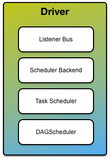

== Driver

A *Spark driver* (_aka_ *an application's driver process*) is a JVM process that hosts link:spark-sparkcontext.adoc[SparkContext] for a Spark application. It is the master node in a Spark application.

It is the cockpit of jobs and tasks execution (using link:spark-dagscheduler.adoc[DAGScheduler] and link:spark-taskscheduler.adoc[Task Scheduler]). It hosts link:spark-webui.adoc[Web UI] for the environment.

.Driver with the services

It splits a Spark application into tasks and schedules them to run on executors.

A driver is where the task scheduler lives and spawns tasks across workers.

A driver coordinates workers and overall execution of tasks.

NOTE: link:spark-shell.adoc[Spark shell] is a Spark application and the driver. It creates a `SparkContext` that is available as `sc`.

Driver requires the additional services (beside the common ones like link:spark-shuffle-manager.adoc[ShuffleManager], link:spark-MemoryManager.adoc[MemoryManager], link:spark-blocktransferservice.adoc[BlockTransferService], link:spark-service-broadcastmanager.adoc[BroadcastManager], link:spark-cachemanager.adoc[CacheManager]):

* Listener Bus
* link:spark-rpc.adoc[RPC Environment]
* link:spark-service-MapOutputTrackerMaster.adoc[MapOutputTrackerMaster] with the name *MapOutputTracker*
* link:spark-BlockManagerMaster.adoc[BlockManagerMaster] with the name *BlockManagerMaster*
* link:spark-http-file-server.adoc[HttpFileServer]
* link:spark-metrics.adoc[MetricsSystem] with the name *driver*
* link:spark-service-outputcommitcoordinator.adoc[OutputCommitCoordinator] with the endpoint's name *OutputCommitCoordinator*

CAUTION: FIXME Diagram of RpcEnv for a driver (and later executors). Perhaps it should be in the notes about RpcEnv?

* High-level control flow of work
* Your Spark application runs as long as the Spark driver.
** Once the driver terminates, so does your Spark application.
* Creates `SparkContext`, `RDD`'s, and executes transformations and actions
* Launches link:spark-taskscheduler-tasks.adoc[tasks]

=== [[driver-memory]] Driver's Memory

It can be set first using link:spark-submit.adoc#command-line-options[spark-submit's `--driver-memory`] command-line option or <<spark_driver_memory, spark.driver.memory>> and falls back to link:spark-submit.adoc#environment-variables[SPARK_DRIVER_MEMORY] if not set earlier.

NOTE: It is printed out to the standard error output in link:spark-submit.adoc#verbose-mode[spark-submit's verbose mode].

=== [[driver-memory]] Driver's Cores

It can be set first using link:spark-submit.adoc#driver-cores[spark-submit's `--driver-cores`] command-line option for link:spark-deploy-mode.adoc#cluster[`cluster` deploy mode].

NOTE: In link:spark-deploy-mode.adoc#client[`client` deploy mode] the driver's memory corresponds to the memory of the JVM process the Spark application runs on.

NOTE: It is printed out to the standard error output in link:spark-submit.adoc#verbose-mode[spark-submit's verbose mode].

=== [[settings]] Settings / System Properties

==== [[spark_driver_extraClassPath]] spark.driver.extraClassPath

`spark.driver.extraClassPath` system property sets the additional classpath entries (e.g. jars and directories) that should be added to the driver's classpath in link:spark-deploy-mode.adoc#cluster[`cluster` deploy mode].

[NOTE]
====
For link:spark-deploy-mode.adoc#client[`client` deploy mode] you can use a properties file or command line to set `spark.driver.extraClassPath`.

Do not use link:spark-configuration.adoc[SparkConf] since it is too late for `client` deploy mode given the JVM has already been set up to start a Spark application.

Refer to link:spark-class.adoc#buildSparkSubmitCommand[`buildSparkSubmitCommand` Internal Method] for the very low-level details of how it is handled internally.
====

`spark.driver.extraClassPath` uses a OS-specific path separator.

NOTE: Use ``spark-submit``'s link:spark-submit.adoc#driver-class-path[`--driver-class-path` command-line option] on command line to override `spark.driver.extraClassPath` from a link:spark-properties.adoc#spark-defaults-conf[Spark properties file].

==== [[spark_driver_libraryPath]] spark.driver.libraryPath

`spark.driver.libraryPath`

==== [[spark_driver_extraLibraryPath]] spark.driver.extraLibraryPath

`spark.driver.extraLibraryPath`

==== [[spark_driver_extraJavaOptions]] spark.driver.extraJavaOptions

`spark.driver.extraJavaOptions` sets the additional JVM options for a driver.

==== [[spark_driver_appUIAddress]] spark.driver.appUIAddress

`spark.driver.appUIAddress` is only used in link:yarn/README.adoc[Spark on YARN]. It is set when link:spark-yarn-client-yarnclientschedulerbackend.adoc#start[YarnClientSchedulerBackend starts] to link:spark-yarn-applicationmaster.adoc#runExecutorLauncher[run ExecutorLauncher] (and link:spark-yarn-applicationmaster.adoc#registerAM[register ApplicationMaster] for the Spark application).

==== [[spark_driver_cores]] spark.driver.cores

`spark.driver.cores` (default: `1`) sets the number of CPU cores assigned for the driver in link:spark-deploy-mode.adoc#cluster[cluster deploy mode].

NOTE: When link:yarn/spark-yarn-client.adoc#creating-instance[Client is created] (for Spark on YARN in cluster mode only), it sets the number of cores for ApplicationManager using `spark.driver.cores`.

Read <<driver-cores, Driver's Cores>> for a closer coverage.

==== [[spark_driver_memory]] spark.driver.memory

`spark.driver.memory` (default: `1g`) sets the driver's memory size (in MiBs).

Read <<driver-memory, Driver's Memory>> for a closer coverage.
