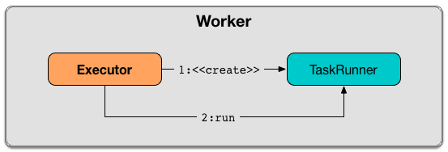

== [[TaskRunner]] TaskRunner

`TaskRunner` is a thread of execution that manages a single individual link:spark-taskscheduler-tasks.adoc[task].

`TaskRunner` is <<creating-instance, created>> exclusively when link:spark-Executor.adoc#launchTask[`Executor` is requested to launch a task].

.Executor creates TaskRunner and runs (almost) immediately


`TaskRunner` can be <<run, run>> or <<kill, killed>> that simply means running or killing the <<task, task this `TaskRunner` object manages>>, respectively.

[[internal-registries]]
.TaskRunner's Internal Registries and Counters
[cols="1,2",options="header",width="100%"]
|===
| Name
| Description

| [[taskId]] `taskId`
| FIXME

Used when...FIXME

| [[threadName]] `threadName`
| FIXME

Used when...FIXME

| [[taskName]] `taskName`
| FIXME

Used when...FIXME

| [[finished]] `finished`
| FIXME

Used when...FIXME

| [[killed]] `killed`
| FIXME

Used when...FIXME

| [[threadId]] `threadId`
| FIXME

Used when...FIXME

| [[startGCTime]] `startGCTime`
| FIXME

Used when...FIXME

| [[task]] `task`
| FIXME

Used when...FIXME

| [[replClassLoader]] `replClassLoader`
| FIXME

Used when...FIXME
|===

[TIP]
====
Enable `INFO` or `DEBUG` logging level for `org.apache.spark.executor.Executor` logger to see what happens inside `TaskRunner` (since `TaskRunner` is an internal class of `Executor`).

Add the following line to `conf/log4j.properties`:

```
log4j.logger.org.apache.spark.executor.Executor=DEBUG
```

Refer to link:spark-logging.adoc[Logging].
====

=== [[creating-instance]] Creating TaskRunner Instance

`TaskRunner` takes the following when created:

1. link:spark-ExecutorBackend.adoc[ExecutorBackend]
2. link:spark-TaskDescription.adoc[TaskDescription]

`TaskRunner` initializes the <<internal-registries, internal registries and counters>>.

=== [[computeTotalGcTime]] `computeTotalGcTime` Method

CAUTION: FIXME

=== [[updateDependencies]] `updateDependencies` Method

CAUTION: FIXME

=== [[setTaskFinishedAndClearInterruptStatus]] `setTaskFinishedAndClearInterruptStatus` Method

CAUTION: FIXME

=== Lifecycle

CAUTION: FIXME Image with state changes

A `TaskRunner` object is created when link:spark-Executor.adoc#launchTask[an executor is requested to launch a task].

It is created with an link:spark-ExecutorBackend.adoc[ExecutorBackend] (to send the task's status updates to), task and attempt ids, task name, and serialized version of the task (as `ByteBuffer`).

=== [[run]] Running Task -- `run` Method

NOTE: `run` is part of https://docs.oracle.com/javase/8/docs/api/java/lang/Runnable.html[java.lang.Runnable] contract that `TaskRunner` follows.

When executed, `run` initializes <<threadId, threadId>> as the current thread identifier (using Java's link:++https://docs.oracle.com/javase/8/docs/api/java/lang/Thread.html#getId--++[Thread])

`run` then sets the name of the current thread as <<threadName, threadName>> (using Java's link:++https://docs.oracle.com/javase/8/docs/api/java/lang/Thread.html#setName-java.lang.String-++[Thread]).

`run` link:spark-taskscheduler-taskmemorymanager.adoc#creating-instance[creates a `TaskMemoryManager`] (using the current link:spark-MemoryManager.adoc[MemoryManager] and <<taskId, taskId>>).

NOTE: `run` uses link:spark-sparkenv.adoc#memoryManager[`SparkEnv` to access the current `MemoryManager`].

`run` starts tracking the time to deserialize a task.

`run` sets the current thread's context classloader (with <<replClassLoader, replClassLoader>>).

`run` link:spark-Serializer.adoc#newInstance[creates a closure `Serializer`].

NOTE: `run` uses `SparkEnv` link:spark-sparkenv.adoc#closureSerializer[to access the current closure `Serializer`].

You should see the following INFO message in the logs:

```
INFO Executor: Running [taskName] (TID [taskId])
```

`run` link:spark-ExecutorBackend.adoc#statusUpdate[notifies `ExecutorBackend`] that <<taskId, taskId>> is in `TaskState.RUNNING` state.

NOTE: `run` uses `ExecutorBackend` that was specified when `TaskRunner` <<creating-instance, was created>>.

`run` <<computeTotalGcTime, computes `startGCTime`>>.

`run` <<updateDependencies, updates dependencies>>.

NOTE: `run` uses link:spark-TaskDescription.adoc[TaskDescription] that is specified when `TaskRunner` <<creating-instance, is created>>.

`run` link:spark-SerializerInstance.adoc#deserialize[deserializes the task] (using the context class loader) and sets its `localProperties` and `TaskMemoryManager`. `run` sets the <<task, task>> internal reference to hold the deserialized task.

NOTE: `run` uses `TaskDescription` link:spark-TaskDescription.adoc#serializedTask[to access serialized task].

If <<killed, killed>> flag is enabled, `run` throws a `TaskKilledException`.

You should see the following DEBUG message in the logs:

```
DEBUG Executor: Task [taskId]'s epoch is [task.epoch]
```

`run` link:spark-service-mapoutputtracker.adoc#updateEpoch[notifies `MapOutputTracker` about the epoch of the task].

NOTE: `run` uses link:spark-sparkenv.adoc#mapOutputTracker[`SparkEnv` to access the current `MapOutputTracker`].

`run` records the current time as the task's start time (as `taskStart`).

`run` link:spark-taskscheduler-tasks.adoc#run[runs the task] (with `taskAttemptId` as <<taskId, taskId>>, `attemptNumber` from `TaskDescription`, and `metricsSystem` as the current link:spark-MetricsSystem.adoc[MetricsSystem]).

NOTE: `run` uses link:spark-sparkenv.adoc#metricsSystem[`SparkEnv` to access the current `MetricsSystem`].

NOTE: The task runs inside a "monitored" block (i.e. `try-finally` block) to detect any memory and lock leaks after the task's `run` finishes regardless of the final outcome - the computed value or an exception thrown.

After the task's run has finished (inside the "finally" block of the "monitored" block), `run` link:spark-blockmanager.adoc#releaseAllLocksForTask[requests `BlockManager` to release all locks of the task] (for the task's <<taskId, taskId>>). The locks are later used for lock leak detection.

`run` then link:spark-taskscheduler-taskmemorymanager.adoc#cleanUpAllAllocatedMemory[requests `TaskMemoryManager` to clean up allocated memory] (that helps finding memory leaks).

If `run` detects memory leak of the managed memory (i.e. the memory freed is greater than `0`) and <<spark_unsafe_exceptionOnMemoryLeak, spark.unsafe.exceptionOnMemoryLeak>> Spark property is enabled (it is not by default) and no exception was reported while the task ran, `run` reports a `SparkException`:

```
Managed memory leak detected; size = [freedMemory] bytes, TID = [taskId]
```

Otherwise, if <<spark_unsafe_exceptionOnMemoryLeak, spark.unsafe.exceptionOnMemoryLeak>> is disabled, you should see the following ERROR message in the logs instead:

```
ERROR Executor: Managed memory leak detected; size = [freedMemory] bytes, TID = [taskId]
```

NOTE: If `run` detects a memory leak, it leads to a `SparkException` or ERROR message in the logs.

If `run` detects lock leaking (i.e. the number of locks released) and <<spark_storage_exceptionOnPinLeak, spark.storage.exceptionOnPinLeak>> Spark property is enabled (it is not by default) and no exception was reported while the task ran, `run` reports a `SparkException`:

```
[releasedLocks] block locks were not released by TID = [taskId]:
[releasedLocks separated by comma]
```

Otherwise, if <<spark_storage_exceptionOnPinLeak, spark.storage.exceptionOnPinLeak>> is disabled or the task reported an exception, you should see the following INFO message in the logs instead:

```
INFO Executor: [releasedLocks] block locks were not released by TID = [taskId]:
[releasedLocks separated by comma]
```

NOTE: If `run` detects any lock leak, it leads to a `SparkException` or INFO message in the logs.

Rigth after the "monitored" block, `run` records the current time as the task's finish time (as `taskFinish`).

If the link:spark-taskscheduler-tasks.adoc#kill[task was killed] (while it was running), `run` reports a `TaskKilledException` (and the `TaskRunner` exits).

`run` link:spark-Serializer.adoc#newInstance[creates a `Serializer`] and link:spark-Serializer.adoc#serialize[serializes the task's result]. `run` measures the time to serialize the result.

NOTE: `run` uses `SparkEnv` link:spark-sparkenv.adoc#serializer[to access the current `Serializer`]. `SparkEnv` was specified when link:spark-Executor.adoc#creating-instance[the owning `Executor` was created].

IMPORTANT: This is when `TaskExecutor` serializes the computed value of a task to be sent back to the driver.

`run` records the link:spark-taskscheduler-tasks.adoc#metrics[task metrics]:

* link:spark-taskscheduler-taskmetrics.adoc#setExecutorDeserializeTime[executorDeserializeTime]
* link:spark-taskscheduler-taskmetrics.adoc#setExecutorDeserializeCpuTime[executorDeserializeCpuTime]
* link:spark-taskscheduler-taskmetrics.adoc#setExecutorRunTime[executorRunTime]
* link:spark-taskscheduler-taskmetrics.adoc#setExecutorCpuTime[executorCpuTime]
* link:spark-taskscheduler-taskmetrics.adoc#setJvmGCTime[jvmGCTime]
* link:spark-taskscheduler-taskmetrics.adoc#setResultSerializationTime[resultSerializationTime]

`run` link:spark-taskscheduler-tasks.adoc#collectAccumulatorUpdates[collects the latest values of internal and external accumulators used in the task].

`run` creates a link:spark-taskscheduler-TaskResult.adoc#DirectTaskResult[DirectTaskResult] (with the serialized result and the latest values of accumulators).

`run` link:spark-Serializer.adoc#serialize[serializes the `DirectTaskResult`] and gets the byte buffer's limit.

NOTE: A serialized `DirectTaskResult` is Java's https://docs.oracle.com/javase/8/docs/api/java/nio/ByteBuffer.html[java.nio.ByteBuffer].

`run` selects the proper serialized version of the result before link:spark-ExecutorBackend.adoc#statusUpdate[sending it to `ExecutorBackend`].

`run` branches off based on the serialized `DirectTaskResult` byte buffer's limit.

When link:spark-Executor.adoc#maxResultSize[maxResultSize] is greater than `0` and the serialized `DirectTaskResult` buffer limit exceeds it, the following WARN message is displayed in the logs:

```
WARN Executor: Finished [taskName] (TID [taskId]). Result is larger than maxResultSize ([resultSize] > [maxResultSize]), dropping it.
```

TIP: Read about link:spark-TaskSetManager.adoc#spark.driver.maxResultSize[spark.driver.maxResultSize].

```
$ ./bin/spark-shell -c spark.driver.maxResultSize=1m

scala> sc.version
res0: String = 2.0.0-SNAPSHOT

scala> sc.getConf.get("spark.driver.maxResultSize")
res1: String = 1m

scala> sc.range(0, 1024 * 1024 + 10, 1).collect
WARN Executor: Finished task 4.0 in stage 0.0 (TID 4). Result is larger than maxResultSize (1031.4 KB > 1024.0 KB), dropping it.
...
ERROR TaskSetManager: Total size of serialized results of 1 tasks (1031.4 KB) is bigger than spark.driver.maxResultSize (1024.0 KB)
...
org.apache.spark.SparkException: Job aborted due to stage failure: Total size of serialized results of 1 tasks (1031.4 KB) is bigger than spark.driver.maxResultSize (1024.0 KB)
  at org.apache.spark.scheduler.DAGScheduler.org$apache$spark$scheduler$DAGScheduler$$failJobAndIndependentStages(DAGScheduler.scala:1448)
...
```

In this case, `run` creates a link:spark-taskscheduler-TaskResult.adoc#IndirectTaskResult[IndirectTaskResult] (with a `TaskResultBlockId` for the task's <<taskId, taskId>> and `resultSize`) and link:spark-Serializer.adoc#serialize[serializes it].

[[run-result-sent-via-blockmanager]]
When `maxResultSize` is not positive or `resultSize` is smaller than `maxResultSize` but greater than link:spark-Executor.adoc#maxDirectResultSize[maxDirectResultSize], `run` creates a `TaskResultBlockId` for the task's <<taskId, taskId>> and link:spark-blockmanager.adoc#putBytes[stores the serialized `DirectTaskResult` in `BlockManager`] (as the `TaskResultBlockId` with `MEMORY_AND_DISK_SER` storage level).

You should see the following INFO message in the logs:

```
INFO Executor: Finished [taskName] (TID [taskId]). [resultSize] bytes result sent via BlockManager)
```

In this case, `run` creates a link:spark-taskscheduler-TaskResult.adoc#IndirectTaskResult[IndirectTaskResult] (with a `TaskResultBlockId` for the task's <<taskId, taskId>> and `resultSize`) and link:spark-Serializer.adoc#serialize[serializes it].

NOTE: The difference between the two above cases is that the result is dropped or stored in `BlockManager` with `MEMORY_AND_DISK_SER` storage level.

When the two cases above do not hold, you should see the following INFO message in the logs:

```
INFO Executor: Finished [taskName] (TID [taskId]). [resultSize] bytes result sent to driver
```

`run` uses the serialized `DirectTaskResult` byte buffer as the final `serializedResult`.

NOTE: The final `serializedResult` is either a link:spark-taskscheduler-TaskResult.adoc#IndirectTaskResult[IndirectTaskResult] (possibly with the block stored in `BlockManager`) or a link:spark-taskscheduler-TaskResult.adoc#DirectTaskResult[DirectTaskResult].

`run` link:spark-ExecutorBackend.adoc#statusUpdate[notifies `ExecutorBackend`] that <<taskId, taskId>> is in `TaskState.FINISHED` state with the serialized result and removes <<taskId, taskId>> from the owning executor's link:spark-Executor.adoc#runningTasks[ runningTasks] registry.

NOTE: `run` uses `ExecutorBackend` that is specified when `TaskRunner` <<creating-instance, is created>>.

NOTE: `TaskRunner` is Java's https://docs.oracle.com/javase/8/docs/api/java/lang/Runnable.html[Runnable] and the contract requires that once a `TaskRunner` has completed execution it must not be restarted.

When `run` catches a exception while executing the task, `run` acts according to its type (as presented in the following "run's Exception Cases" table and the following sections linked from the table).

.run's Exception Cases, TaskState and Serialized ByteBuffer
[cols="1,1,2",options="header",width="100%"]
|===
| Exception Type
| TaskState
| Serialized ByteBuffer

| <<run-FetchFailedException, FetchFailedException>>
| `FAILED`
| `TaskFailedReason`

| <<run-TaskKilledException, TaskKilledException>>
| `KILLED`
| `TaskKilled`

| <<run-InterruptedException, InterruptedException>>
| `KILLED`
| `TaskKilled`

| <<run-CommitDeniedException, CommitDeniedException>>
| `FAILED`
| `TaskFailedReason`

| <<run-Throwable, Throwable>>
| `FAILED`
| `ExceptionFailure`

|===

==== [[run-FetchFailedException]] FetchFailedException

When link:spark-TaskRunner-FetchFailedException.adoc[FetchFailedException] is reported while running a task, `run` <<setTaskFinishedAndClearInterruptStatus, setTaskFinishedAndClearInterruptStatus>>.

`run` link:spark-TaskRunner-FetchFailedException.adoc#toTaskFailedReason[requests `FetchFailedException` for the `TaskFailedReason`], serializes it and link:spark-ExecutorBackend.adoc#statusUpdate[notifies `ExecutorBackend` that the task has failed] (with <<taskId, taskId>>, `TaskState.FAILED`, and a serialized reason).

NOTE: `ExecutorBackend` was specified when <<creating-instance, `TaskRunner` was created>>.

NOTE:  `run` uses a closure link:spark-Serializer.adoc[Serializer] to serialize the failure reason. The `Serializer` was created before `run` ran the task.

==== [[run-TaskKilledException]] TaskKilledException

When `TaskKilledException` is reported while running a task, you should see the following INFO message in the logs:

```
INFO Executor killed [taskName] (TID [taskId])
```

`run` then <<setTaskFinishedAndClearInterruptStatus, setTaskFinishedAndClearInterruptStatus>> and link:spark-ExecutorBackend.adoc#statusUpdate[notifies `ExecutorBackend` that the task has been killed] (with <<taskId, taskId>>, `TaskState.KILLED`, and a serialized `TaskKilled` object).

==== [[run-InterruptedException]] InterruptedException (with Task Killed)

When `InterruptedException` is reported while running a task, and the task has been killed, you should see the following INFO message in the logs:

```
INFO Executor interrupted and killed [taskName] (TID [taskId])
```

`run` then <<setTaskFinishedAndClearInterruptStatus, setTaskFinishedAndClearInterruptStatus>> and link:spark-ExecutorBackend.adoc#statusUpdate[notifies `ExecutorBackend` that the task has been killed] (with <<taskId, taskId>>, `TaskState.KILLED`, and a serialized `TaskKilled` object).

NOTE: The difference between this `InterruptedException` and <<run-TaskKilledException, TaskKilledException>> is the INFO message in the logs.

==== [[run-CommitDeniedException]] CommitDeniedException

When `CommitDeniedException` is reported while running a task, `run` <<setTaskFinishedAndClearInterruptStatus, setTaskFinishedAndClearInterruptStatus>> and link:spark-ExecutorBackend.adoc#statusUpdate[notifies `ExecutorBackend` that the task has failed] (with <<taskId, taskId>>, `TaskState.FAILED`, and a serialized `TaskKilled` object).

NOTE: The difference between this `CommitDeniedException` and <<run-FetchFailedException, FetchFailedException>> is just the reason being sent to `ExecutorBackend`.

==== [[run-Throwable]] Throwable

When `run` catches a `Throwable`, you should see the following ERROR message in the logs (followed by the exception).

```
ERROR Exception in [taskName] (TID [taskId])
```

`run` then records the following task metrics (only when <<task, Task>> is available):

* link:spark-taskscheduler-taskmetrics.adoc#setExecutorRunTime[executorRunTime]
* link:spark-taskscheduler-taskmetrics.adoc#setJvmGCTime[jvmGCTime]

`run` then link:spark-taskscheduler-tasks.adoc#collectAccumulatorUpdates[collects the latest values of internal and external accumulators] (with `taskFailed` flag enabled to inform that the collection is for a failed task).

Otherwise, when <<task, Task>> is not available, the accumulator collection is empty.

`run` converts the task accumulators to collection of `AccumulableInfo`, creates a `ExceptionFailure` (with the accumulators), and link:spark-Serializer.adoc#serialize[serializes them].

NOTE: `run` uses a closure link:spark-Serializer.adoc[Serializer] to serialize the `ExceptionFailure`.

CAUTION: FIXME Why does `run` create `new ExceptionFailure(t, accUpdates).withAccums(accums)`, i.e. accumulators occur twice in the object.

`run` <<setTaskFinishedAndClearInterruptStatus, setTaskFinishedAndClearInterruptStatus>> and link:spark-ExecutorBackend.adoc#statusUpdate[notifies `ExecutorBackend` that the task has failed] (with <<taskId, taskId>>, `TaskState.FAILED`, and the serialized `ExceptionFailure`).

`run` may also trigger `SparkUncaughtExceptionHandler.uncaughtException(t)` if this is a fatal error.

NOTE: The difference between this most `Throwable` case and other `FAILED` cases (i.e. <<run-FetchFailedException, FetchFailedException>> and <<run-CommitDeniedException, CommitDeniedException>>) is just the serialized `ExceptionFailure` vs a reason being sent to `ExecutorBackend`, respectively.

=== [[kill]] Killing Task -- `kill` Method

[source, scala]
----
kill(interruptThread: Boolean): Unit
----

`kill` marks the `TaskRunner` as <<killed, killed>> and link:spark-taskscheduler-tasks.adoc#kill[kills the task] (if available and not <<finished, finished>> already).

NOTE: `kill` passes the input `interruptThread` on to the task itself while killing it.

When executed, you should see the following INFO message in the logs:

```
INFO TaskRunner: Executor is trying to kill [taskName] (TID [taskId])
```

NOTE: <<killed, killed>> flag is checked periodically in <<run, run>> to stop executing the task. Once killed, the task will eventually stop.

=== [[settings]] Settings

.Spark Properties
[cols="1,1,2",options="header",width="100%”]
|===
| Spark Property
| Default Value
| Description

| [[spark_unsafe_exceptionOnMemoryLeak]] `spark.unsafe.exceptionOnMemoryLeak`
| `false`
| FIXME

| [[spark_storage_exceptionOnPinLeak]] `spark.storage.exceptionOnPinLeak`
| `false`
| FIXME
|===
