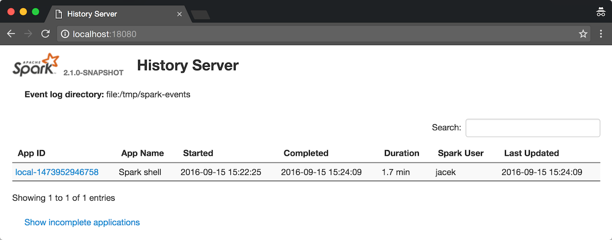

== Spark History Server

*Spark History Server* is the web UI for link:spark-scheduler-listeners-eventlogginglistener.adoc[completed] and running (aka _incomplete_) Spark applications. It is an extension of Spark's link:spark-webui.adoc[web UI].

.History Server's web UI


TIP: Enable collecting events in your Spark applications using link:spark-scheduler-listeners-eventlogginglistener.adoc#spark_eventLog_enabled[spark.eventLog.enabled] Spark property.

You can start History Server by executing <<start_history_server_sh, `start-history-server.sh` shell script>> and stop it using <<stop_history_server_sh, `stop-history-server.sh`>>.

`start-history-server.sh` accepts `--properties-file [propertiesFile]` command-line option that specifies the properties file with the custom link:spark-properties.adoc[Spark properties].

```
$ ./sbin/start-history-server.sh --properties-file history.properties
```

If not specified explicitly, Spark History Server uses the default configuration file, i.e. link:spark-properties.adoc#spark-defaults-conf[spark-defaults.conf].

[TIP]
====
Enable `INFO` logging level for `org.apache.spark.deploy.history` logger to see what happens inside.

Add the following line to `conf/log4j.properties`:

```
log4j.logger.org.apache.spark.deploy.history=INFO
```

Refer to link:spark-logging.adoc[Logging].
====

=== [[start_history_server_sh]] Starting History Server -- `start-history-server.sh` script

You can start a `HistoryServer` instance by executing `$SPARK_HOME/sbin/start-history-server.sh` script (where `SPARK_HOME` is the directory of your Spark installation).

```
$ ./sbin/start-history-server.sh
starting org.apache.spark.deploy.history.HistoryServer, logging to .../spark/logs/spark-jacek-org.apache.spark.deploy.history.HistoryServer-1-japila.out
```

Internally, `start-history-server.sh` script starts link:spark-history-server-HistoryServer.adoc#main[org.apache.spark.deploy.history.HistoryServer] standalone application for execution (using `spark-daemon.sh` shell script).

```
$ ./bin/spark-class org.apache.spark.deploy.history.HistoryServer
```

TIP: Using the more explicit approach with `spark-class` to start Spark History Server could be easier to trace execution by seeing the logs printed out to the standard output and hence terminal directly.

When started, it prints out the following INFO message to the logs:

```
INFO HistoryServer: Started daemon with process name: [processName]
```

It registers signal handlers (using `SignalUtils`) for `TERM`, `HUP`, `INT` to log their execution:

```
ERROR HistoryServer: RECEIVED SIGNAL [signal]
```

It inits security if enabled (using `spark.history.kerberos.enabled` setting).

CAUTION: FIXME Describe `initSecurity`

It creates a `SecurityManager`.

It creates a link:spark-history-server-FsHistoryProvider.adoc#ApplicationHistoryProvider[ApplicationHistoryProvider] (by reading <<spark_history_provider, spark.history.provider>>).

It link:spark-history-server-HistoryServer.adoc#creating-instance[creates a `HistoryServer`] and requests it to bind to <<spark_history_ui_port, spark.history.ui.port>> port.

[TIP]
====
The host's IP can be specified using `SPARK_LOCAL_IP` environment variable (defaults to `0.0.0.0`).
====

You should see the following INFO message in the logs:

```
INFO HistoryServer: Bound HistoryServer to [host], and started at [webUrl]
```

It registers a shutdown hook to call `stop` on the `HistoryServer` instance.

TIP: Use <<stop_history_server, stop-history-server.sh>> shell script to to stop a running History Server.

=== [[stop_history_server_sh]] Stopping History Server -- `stop-history-server.sh` script

You can stop a running instance of `HistoryServer` using `$SPARK_HOME/sbin/stop-history-server.sh` shell script.

```
$ ./sbin/stop-history-server.sh
stopping org.apache.spark.deploy.history.HistoryServer
```

=== [[settings]] Settings

.Spark Properties
[cols="1,1,2",options="header",width="100%"]
|===
| Setting | Default Value | Description
| [[spark_history_ui_port]] `spark.history.ui.port` | `18080` | The port of the History Server's UI.
| [[spark_history_fs_logDirectory]] `spark.history.fs.logDirectory` | `file:/tmp/spark-events` | The directory with the event logs. The directory has to exist before starting History Server.
| `spark.history.retainedApplications` | `50` | How many Spark applications to retain.
| `spark.history.ui.maxApplications` | (unbounded) | how many Spark applications to show in the UI.
| `spark.history.kerberos.enabled` | `false` | Enable security when working with HDFS with security enabled (Kerberos).
| `spark.history.kerberos.principal` | (empty) | Kerberos principal. Required when `spark.history.kerberos.enabled` is enabled.
| `spark.history.kerberos.keytab` | (empty) | Keytab to use for login to Kerberos. Required when `spark.history.kerberos.enabled` is enabled.
| [[spark_history_provider]] `spark.history.provider` | link:spark-history-server-FsHistoryProvider.adoc[org.apache.spark.deploy.history.FsHistoryProvider] | The fully-qualified class name for a link:spark-history-server-FsHistoryProvider.adoc#ApplicationHistoryProvider[ApplicationHistoryProvider].
|===
