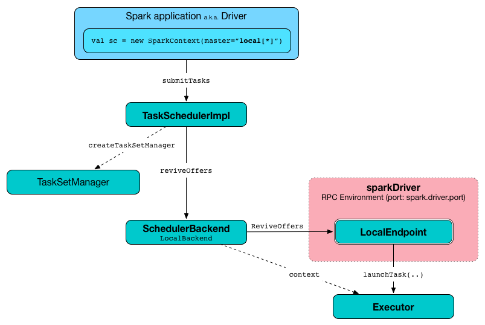

== Spark local (pseudo-cluster)

You can run Spark in *local mode*. In this non-distributed single-JVM deployment mode, Spark spawns all the execution components - link:spark-driver.adoc[driver], link:spark-Executor.adoc[executor], link:spark-LocalSchedulerBackend.adoc[LocalSchedulerBackend], and link:spark-master.adoc[master] - in the same single JVM. The default parallelism is the number of threads as specified in the <<masterURL, master URL>>. This is the only mode where a driver is used for execution.

.Architecture of Spark local
image::diagrams/spark-local-architecture.png[align="center"]

The local mode is very convenient for testing, debugging or demonstration purposes as it requires no earlier setup to launch Spark applications.

This mode of operation is also called  http://spark.apache.org/docs/latest/programming-guide.html#initializing-spark[Spark in-process] or (less commonly) *a local version of Spark*.

`SparkContext.isLocal` returns `true` when Spark runs in local mode.

```
scala> sc.isLocal
res0: Boolean = true
```

link:spark-shell.adoc[Spark shell] defaults to local mode with `local[*]` as the link:spark-deployment-environments.adoc#master-urls[the master URL].

```
scala> sc.master
res0: String = local[*]
```

Tasks are not re-executed on failure in local mode (unless <<masterURL, local-with-retries master URL>> is used).

The link:spark-TaskScheduler.adoc[task scheduler] in local mode works with link:spark-LocalSchedulerBackend.adoc[LocalSchedulerBackend] task scheduler backend.

=== [[masterURL]] Master URL

You can run Spark in local mode using `local`, `local[n]` or the most general `local[*]` for link:spark-deployment-environments.adoc#master-urls[the master URL].

The URL says how many threads can be used in total:

* `local` uses 1 thread only.

* `local[n]` uses `n` threads.

* `local[*]` uses as many threads as the number of processors available to the Java virtual machine (it uses https://docs.oracle.com/javase/8/docs/api/java/lang/Runtime.html#availableProcessors--[Runtime.getRuntime.availableProcessors()] to know the number).

CAUTION: FIXME What happens when there's less cores than `n` in the master URL? It is a question from twitter.

* [[local-with-retries]] `local[N, maxFailures]` (called *local-with-retries*) with `N` being `*` or the number of threads to use (as explained above) and `maxFailures` being the value of link:spark-TaskScheduler.adoc#spark_task_maxFailures[spark.task.maxFailures].

=== [[task-submission]] Task Submission a.k.a. reviveOffers

.TaskSchedulerImpl.submitTasks in local mode


When `ReviveOffers` or `StatusUpdate` messages are received, link:spark-LocalEndpoint.adoc[LocalEndpoint] places an offer to `TaskSchedulerImpl` (using `TaskSchedulerImpl.resourceOffers`).

If there is one or more tasks that match the offer, they are launched (using `executor.launchTask` method).

The number of tasks to be launched is controlled by the number of threads as specified in <<masterURL, master URL>>. The executor uses threads to spawn the tasks.
