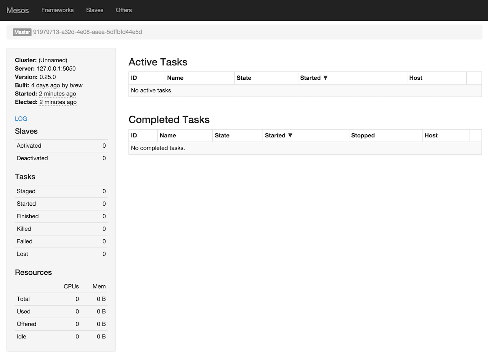

== Spark on Mesos

.Spark on Mesos Architecture
image::../images/spark-mesos.png[align="center"]

=== Running Spark on Mesos

A Mesos cluster needs at least one Mesos Master to coordinate and dispatch tasks onto Mesos Slaves.

```
$ mesos-master --registry=in_memory --ip=127.0.0.1
I0401 00:12:01.955883 1916461824 main.cpp:237] Build: 2016-03-17 14:20:58 by brew
I0401 00:12:01.956457 1916461824 main.cpp:239] Version: 0.28.0
I0401 00:12:01.956538 1916461824 main.cpp:260] Using 'HierarchicalDRF' allocator
I0401 00:12:01.957381 1916461824 main.cpp:471] Starting Mesos master
I0401 00:12:01.964118 1916461824 master.cpp:375] Master 9867c491-5370-48cc-8e25-e1aff1d86542 (localhost) started on 127.0.0.1:5050
...
```

Visit the management console at http://localhost:5050.

.Mesos Management Console


Run Mesos Slave onto which Master will dispatch jobs.

```
$ mesos-slave --master=127.0.0.1:5050
I0401 00:15:05.850455 1916461824 main.cpp:223] Build: 2016-03-17 14:20:58 by brew
I0401 00:15:05.850772 1916461824 main.cpp:225] Version: 0.28.0
I0401 00:15:05.852812 1916461824 containerizer.cpp:149] Using isolation: posix/cpu,posix/mem,filesystem/posix
I0401 00:15:05.866186 1916461824 main.cpp:328] Starting Mesos slave
I0401 00:15:05.869470 218980352 slave.cpp:193] Slave started on 1)@10.1.47.199:5051
...
I0401 00:15:05.906355 218980352 slave.cpp:832] Detecting new master
I0401 00:15:06.762917 220590080 slave.cpp:971] Registered with master master@127.0.0.1:5050; given slave ID 9867c491-5370-48cc-8e25-e1aff1d86542-S0
...
```

Switch to the management console at http://localhost:5050/#/slaves to see the slaves available.

.Mesos Management Console (Slaves tab) with one slave running
image::../images/mesos-console-slaves.png[align="center"]

[IMPORTANT]
====
You have to export `MESOS_NATIVE_JAVA_LIBRARY` environment variable before connecting to the Mesos cluster.

```
$ export MESOS_NATIVE_JAVA_LIBRARY=/usr/local/lib/libmesos.dylib
```
====

[NOTE]
====
The preferred approach to launch Spark on Mesos and to give the location of Spark binaries is through <<settings, spark.executor.uri>> setting.

```
--conf spark.executor.uri=/Users/jacek/Downloads/spark-1.5.2-bin-hadoop2.6.tgz
```

For us, on a bleeding edge of Spark development, it is very convenient to use <<settings, spark.mesos.executor.home>> setting, instead.

```
-c spark.mesos.executor.home=`pwd`
```
====

```
$ ./bin/spark-shell --master mesos://127.0.0.1:5050 -c spark.mesos.executor.home=`pwd`
...
I0401 00:17:41.806743 581939200 sched.cpp:222] Version: 0.28.0
I0401 00:17:41.808825 579805184 sched.cpp:326] New master detected at master@127.0.0.1:5050
I0401 00:17:41.808976 579805184 sched.cpp:336] No credentials provided. Attempting to register without authentication
I0401 00:17:41.809605 579268608 sched.cpp:703] Framework registered with 9867c491-5370-48cc-8e25-e1aff1d86542-0001
Spark context available as sc (master = mesos://127.0.0.1:5050, app id = 9867c491-5370-48cc-8e25-e1aff1d86542-0001).
...
```

In http://localhost:5050/#/frameworks[Frameworks tab] you should see a single active framework for `spark-shell`.

.Mesos Management Console (Frameworks tab) with Spark shell active
image::../images/spark-mesos-frameworks-one-active.png[align="center"]

TIP: Consult slave logs under `/tmp/mesos/slaves` when facing troubles.

IMPORTANT: Ensure that the versions of Spark of `spark-shell` and as pointed out by `spark.executor.uri` are the same or compatible.

```
scala> sc.parallelize(0 to 10, 8).count
res0: Long = 11
```

.Completed tasks in Mesos Management Console
image::../images/spark-mesos-completed-tasks.png[align="center"]

Stop Spark shell.

```
scala> Stopping spark context.
I1119 16:01:37.831179 206073856 sched.cpp:1771] Asked to stop the driver
I1119 16:01:37.831310 698224640 sched.cpp:1040] Stopping framework '91979713-a32d-4e08-aaea-5dffbfd44e5d-0002'
```

=== [[CoarseMesosSchedulerBackend]] CoarseMesosSchedulerBackend

`CoarseMesosSchedulerBackend` is the link:spark-SchedulerBackend.adoc[scheduler backend] for Spark on Mesos.

It requires a link:spark-TaskScheduler.adoc[Task Scheduler], link:spark-sparkcontext.adoc[Spark context], `mesos://` master URL, and link:spark-security.adoc[Security Manager].

It is a specialized link:../spark-CoarseGrainedSchedulerBackend.adoc[CoarseGrainedSchedulerBackend] and implements Mesos's http://mesos.apache.org/api/latest/java/org/apache/mesos/Scheduler.html[org.apache.mesos.Scheduler] interface.

It accepts only two failures before blacklisting a Mesos slave (it is hardcoded and not configurable).

It tracks:

* the number of tasks already submitted (`nextMesosTaskId`)
* the number of cores per task (`coresByTaskId`)
* the total number of cores acquired (`totalCoresAcquired`)
* slave ids with executors (`slaveIdsWithExecutors`)
* slave ids per host (`slaveIdToHost`)
* task ids per slave (`taskIdToSlaveId`)
* How many times tasks on each slave failed (`failuresBySlaveId`)

TIP: `createSchedulerDriver` instantiates Mesos's org.apache.mesos.MesosSchedulerDriver

CoarseMesosSchedulerBackend starts the *MesosSchedulerUtils-mesos-driver* daemon thread with Mesos's http://mesos.apache.org/api/latest/java/org/apache/mesos/MesosSchedulerDriver.html[org.apache.mesos.MesosSchedulerDriver].

==== [[settings]] Settings

* `spark.cores.max` (default: `Int.MaxValue`) - maximum number of cores to acquire
* `spark.mesos.extra.cores` (default: `0`) - extra cores per slave (`extraCoresPerSlave`) FIXME
* `spark.mesos.constraints` (default: (empty)) - offer constraints FIXME `slaveOfferConstraints`
* `spark.mesos.rejectOfferDurationForUnmetConstraints` (default: `120s`) - reject offers with mismatched constraints in seconds
* `spark.mesos.executor.home` (default: `SPARK_HOME`) - the home directory of Spark for executors. It is only required when no `spark.executor.uri` is set.

=== [[MesosExternalShuffleClient]] MesosExternalShuffleClient

FIXME

=== [[MesosSchedulerBackend]] (Fine)MesosSchedulerBackend

When <<settings, spark.mesos.coarse>> is `false`, Spark on Mesos uses `MesosSchedulerBackend`

==== [[reviveOffers]] reviveOffers

It calls `mesosDriver.reviveOffers()`.

CAUTION: FIXME

=== [[settings]] Settings

* `spark.mesos.coarse` (default: `true`) controls whether the scheduler backend for Mesos works in coarse- (`CoarseMesosSchedulerBackend`) or fine-grained mode (`MesosSchedulerBackend`).

[CAUTION]
====
FIXME Review

*  https://github.com/apache/spark/blob/master/core/src/main/scala/org/apache/spark/scheduler/cluster/mesos/MesosClusterScheduler.scala[MesosClusterScheduler.scala]
* MesosExternalShuffleService
====

=== Schedulers in Mesos

Available scheduler modes:

* *fine-grained mode*
* *coarse-grained mode* - `spark.mesos.coarse=true`

The main difference between these two scheduler modes is the number of tasks per Spark executor per single Mesos executor. In fine-grained mode, there is a single task in a single Spark executor that shares a single Mesos executor with the other Spark executors. In coarse-grained mode, there is a single Spark executor per Mesos executor with many Spark tasks.

*Coarse-grained mode* pre-starts all the executor backends, e.g. link:spark-ExecutorBackend.adoc[Executor Backends], so it has the least overhead comparing to *fine-grain mode*. Since the executors are up before tasks get launched, it is better for interactive sessions. It also means that the resources are locked up in a task.

Spark on Mesos supports link:spark-dynamic-allocation.adoc[dynamic allocation] in the Mesos coarse-grained scheduler since Spark 1.5. It can add/remove executors based on load, i.e. kills idle executors and adds executors when tasks queue up. It needs an link:spark-ShuffleManager.adoc[external shuffle service] on each node.

Mesos Fine-Grained Mode offers a better resource utilization. It has a slower startup for tasks and hence  it is fine for batch and relatively static streaming.

=== Commands

The following command is how you could execute a Spark application on Mesos:

```
./bin/spark-submit --master mesos://iq-cluster-master:5050 --total-executor-cores 2 --executor-memory 3G --conf spark.mesos.role=dev ./examples/src/main/python/pi.py 100
```

=== Other Findings

From https://developer.ibm.com/bluemix/2015/09/09/four-reasons-pay-attention-to-apache-mesos/[Four reasons to pay attention to Apache Mesos]:

> Spark workloads can also be sensitive to the physical characteristics of the infrastructure, such as memory size of the node, access to fast solid state disk, or proximity to the data source.

> to run Spark workloads well you need a resource manager that not only can handle the rapid swings in load inherent in analytics processing, but one that can do to smartly. Matching of the task to the RIGHT resources is crucial and awareness of the physical environment is a must. Mesos is designed to manage this problem on behalf of workloads like Spark.
