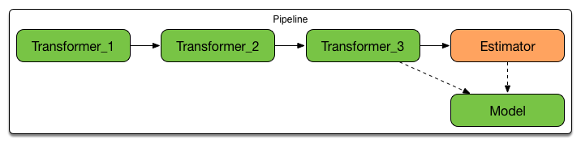

== ML Pipelines - High-Level API for MLlib

NOTE: Both http://scikit-learn.org/stable/modules/generated/sklearn.pipeline.Pipeline.html[scikit-learn] and http://graphlab.com/learn/userguide/index.html#Deployment[GraphLab] have the concept of *pipelines* built into their system.

Use of a machine learning algorithm is only one component of a *predictive analytic workflow*. There can also be additional *pre-processing steps* for the machine learning algorithm to work.

NOTE: It appears that what is called a _RDD computation_ (Spark Core) or a _DataFrame manipulation_ (Spark SQL) or a _continuous DStream computation_ (Spark Streaming) is called a *Machine Learning algorithm* in Spark MLlib.

A typical standard machine learning workflow is as follows:

1. Loading data (aka _data ingestion_)
2. Extracting features (aka _feature extraction_)
3. Training model (aka _model training_)
4. Evaluate (or _predictionize_)

You may also think of two additional steps before the final model becomes production ready and hence of any use:

1. Testing model (aka _model testing_)
2. Selecting the best model (aka _model selection_ or _model tuning_)
3. Deploying model (aka _model deployment and integration_)

The goal of the *Pipeline API* (_aka_ *Spark ML* or *spark.ml* given the package the API lives in) is to let users quickly and easily assemble and configure practical distributed machine learning pipelines (_aka_ workflows) by standardizing the APIs for different Machine Learning concepts.

The ML Pipeline API is a new DataFrame-based API developed under the `spark.ml` package.

NOTE: The old RDD-based API has been developed in parallel under the `spark.mllib` package. It has been proposed to switch RDD-based MLlib APIs to maintenance mode in Spark 2.0.

NOTE: The Pipeline API lives under https://spark.apache.org/docs/latest/api/scala/index.html#org.apache.spark.ml.package[org.apache.spark.ml] package.

The key concepts of Pipeline API (aka *spark.ml Components*):

* <<pipelines, Pipelines>> and <<PipelineStage, PipelineStages>>
* link:spark-mllib-transformers.adoc[Transformers]
** link:spark-mllib-models.adoc[Models]
* link:spark-mllib-estimators.adoc[Estimators]
* link:spark-mllib-evaluators.adoc[Evaluators]
* link:spark-mllib-params.adoc[Params (and ParamMaps)]

.Pipeline with Transformers and Estimator (and corresponding Model)


The beauty of using Spark ML is that the *ML dataset* is simply a link:spark-sql-dataframe.adoc[DataFrame] (and all calculations are simply link:spark-sql-udfs.adoc[UDF applications] on columns).

Given the Pipeline Components, a typical machine learning pipeline is as follows:

* You use a collection of `Transformer` instances to prepare input `DataFrame` - the dataset with proper input data (in columns) for a chosen ML algorithm.
* You then fit (aka _build_) a `Model`.
* With a `Model` you can calculate predictions (in `prediction` column) on `features` input column through DataFrame transformation.

Example: In text classification, preprocessing steps like n-gram extraction, and TF-IDF feature weighting are often necessary before training of a classification model like an SVM.

Upon deploying a model, your system must not only know the SVM weights to apply to input features, but also transform raw data into the format the model is trained on.

* Pipeline for text categorization
* Pipeline for image classification

Pipelines are like a query plan in a database system.

Components of ML Pipeline:

* *Pipeline Construction Framework* – A DSL for the construction of pipelines that includes concepts of *Nodes* and *Pipelines*.
** Nodes are data transformation steps (link:spark-mllib-transformers.adoc[Transformers])
** Pipelines are a DAG of Nodes.
+
Pipelines become objects that can be saved out and applied in real-time to new data.

It can help creating domain-specific feature transformers, general purpose transformers, statistical utilities and nodes.

You could eventually `save` or `load` machine learning components as described in link:spark-mllib-pipelines-persistence.adoc[Persisting Machine Learning Components].

NOTE: A *machine learning component* is any object that belongs to Pipeline API, e.g. <<Pipeline, Pipeline>>, link:spark-mllib-models.adoc#LinearRegressionModel[LinearRegressionModel], etc.

=== [[features]] Features of Pipeline API

The features of the Pipeline API in Spark MLlib:

* link:spark-sql-dataframe.adoc[DataFrame] as a dataset format
* ML Pipelines API is similar to http://scikit-learn.org/stable/modules/generated/sklearn.pipeline.Pipeline.html[scikit-learn]
* Easy debugging (via inspecting columns added during execution)
* Parameter tuning
* Compositions (to build more complex pipelines out of existing ones)

=== [[pipelines]][[Pipeline]] Pipelines

A *ML pipeline* (or a *ML workflow*) is a sequence of link:spark-mllib-transformers.adoc[Transformers] and link:spark-mllib-estimators.adoc[Estimators] to fit a link:spark-mllib-models.adoc#PipelineModel[PipelineModel] to an input dataset.

[source, scala]
----
pipeline: DataFrame =[fit]=> DataFrame (using transformers and estimators)
----

A pipeline is represented by https://spark.apache.org/docs/latest/api/scala/index.html#org.apache.spark.ml.Pipeline[Pipeline] class.

```
import org.apache.spark.ml.Pipeline
```

`Pipeline` is also an link:spark-mllib-estimators.adoc[Estimator] (so it is acceptable to set up a `Pipeline` with other `Pipeline` instances).

The `Pipeline` object can `read` or `load` pipelines (refer to link:spark-mllib-pipelines-persistence.adoc[Persisting Machine Learning Components] page).

[source, scala]
----
read: MLReader[Pipeline]
load(path: String): Pipeline
----

You can create a `Pipeline` with an optional `uid` identifier. It is of the format `pipeline_[randomUid]` when unspecified.

[source, scala]
----
val pipeline = new Pipeline()

scala> println(pipeline.uid)
pipeline_94be47c3b709

val pipeline = new Pipeline("my_pipeline")

scala> println(pipeline.uid)
my_pipeline
----

The identifier `uid` is used to create an instance of link:spark-mllib-models.adoc#PipelineModel[PipelineModel] to return from `fit(dataset: DataFrame): PipelineModel` method.

[source, scala]
----
scala> val pipeline = new Pipeline("my_pipeline")
pipeline: org.apache.spark.ml.Pipeline = my_pipeline

scala> val df = (0 to 9).toDF("num")
df: org.apache.spark.sql.DataFrame = [num: int]

scala> val model = pipeline.setStages(Array()).fit(df)
model: org.apache.spark.ml.PipelineModel = my_pipeline
----

The `stages` mandatory parameter can be set using `setStages(value: Array[PipelineStage]): this.type` method.

==== [[Pipeline-fit]] Pipeline Fitting (fit method)

[source, scala]
----
fit(dataset: DataFrame): PipelineModel
----

The `fit` method returns a link:spark-mllib-models.adoc#PipelineModel[PipelineModel] that holds a collection of `Transformer` objects that are results of  `Estimator.fit` method for every `Estimator` in the Pipeline (with possibly-modified `dataset`) or simply input `Transformer` objects. The input `dataset` DataFrame is passed to `transform` for every `Transformer` instance in the Pipeline.

It first transforms the schema of the input `dataset` DataFrame.

It then searches for the index of the last `Estimator` to calculate link:spark-mllib-transformers.adoc[Transformers] for `Estimator` and simply return `Transformer` back up to the index in the pipeline. For each `Estimator` the `fit` method is called with the input `dataset`. The result DataFrame is passed to the next `Transformer` in the chain.

NOTE: An `IllegalArgumentException` exception is thrown when a stage is neither `Estimator` or `Transformer`.

`transform` method is called for every `Transformer` calculated but the last one (that is the result of executing `fit` on the last `Estimator`).

The calculated Transformers are collected.

After the last `Estimator` there can only be `Transformer` stages.

The method returns a `PipelineModel` with `uid` and transformers. The parent `Estimator` is the `Pipeline` itself.

=== [[PipelineStage]] PipelineStage

The https://spark.apache.org/docs/latest/api/scala/index.html#org.apache.spark.ml.PipelineStage[PipelineStage] abstract class represents a single stage in a <<Pipeline, Pipeline>>.

`PipelineStage` has the following direct implementations (of which few are abstract classes, too):

* link:spark-mllib-estimators.adoc[Estimators]
* link:spark-mllib-models.adoc[Models]
* <<Pipeline, Pipeline>>
* link:spark-mllib-estimators.adoc#Predictor[Predictor]
* link:spark-mllib-transformers.adoc[Transformer]

Each `PipelineStage` transforms schema using `transformSchema` family of methods:

```
transformSchema(schema: StructType): StructType
transformSchema(schema: StructType, logging: Boolean): StructType
```

NOTE: link:spark-sql-dataframe-structtype.adoc[StructType] describes a schema of a DataFrame.

[TIP]
====
Enable `DEBUG` logging level for the respective `PipelineStage` implementations to see what happens beneath.
====

=== [[i-want-more]] Further reading or watching

* https://amplab.cs.berkeley.edu/ml-pipelines/[ML Pipelines]
* https://databricks.com/blog/2015/01/07/ml-pipelines-a-new-high-level-api-for-mllib.html[ML Pipelines: A New High-Level API for MLlib]
* (video) https://youtu.be/OednhGRp938[Building, Debugging, and Tuning Spark Machine Learning Pipelines - Joseph Bradley (Databricks)]
* (video) https://youtu.be/7gHlgk8F58w[Spark MLlib: Making Practical Machine Learning Easy and Scalable]
