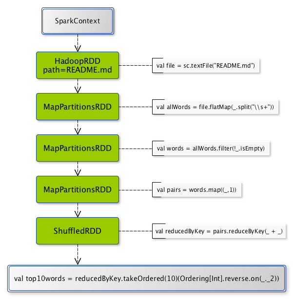

== Operations - Transformations and Actions

=== [[transformations]] Transformations

*Transformations* are lazy operations on a RDD that return another RDD object or an array of RDDs, e.g. `map`,  `filter`, `reduceByKey`, `join`, `cogroup`, `randomSplit`, etc.

Transformations are lazy and are not executed immediately, but only after an action has been executed.

NOTE: There are a couple of transformations that do trigger jobs, e.g. `sortBy`, `zipWithIndex`, etc.

.From SparkContext by transformations to the result

You can chain transformations to create *pipelines* of lazy computations.

[source,scala]
----
scala> val file = sc.textFile("README.md")
file: org.apache.spark.rdd.RDD[String] = MapPartitionsRDD[54] at textFile at <console>:24

scala> val allWords = file.flatMap(_.split("\\s+"))
allWords: org.apache.spark.rdd.RDD[String] = MapPartitionsRDD[55] at flatMap at <console>:26

scala> val words = allWords.filter(!_.isEmpty)
words: org.apache.spark.rdd.RDD[String] = MapPartitionsRDD[56] at filter at <console>:28

scala> val pairs = words.map((_,1))
pairs: org.apache.spark.rdd.RDD[(String, Int)] = MapPartitionsRDD[57] at map at <console>:30

scala> val reducedByKey = pairs.reduceByKey(_ + _)
reducedByKey: org.apache.spark.rdd.RDD[(String, Int)] = ShuffledRDD[59] at reduceByKey at <console>:32

scala> val top10words = reducedByKey.takeOrdered(10)(Ordering[Int].reverse.on(_._2))
INFO SparkContext: Starting job: takeOrdered at <console>:34
...
INFO DAGScheduler: Job 18 finished: takeOrdered at <console>:34, took 0.074386 s
top10words: Array[(String, Int)] = Array((the,21), (to,14), (Spark,13), (for,11), (and,10), (##,8), (a,8), (run,7), (can,6), (is,6))
----

There are two kinds of transformations:

* <<narrow-transformations, narrow transformations>>
* <<wide-transformations, wide transformations>>

==== [[narrow-transformations]] Narrow Transformations

*Narrow transformations* are the result of `map`, `filter` and such that is from the data from a single partition only, i.e. it is self-sustained.

An output RDD has partitions with records that originate from a single partition in the parent RDD. Only a limited subset of partitions used to calculate the result.

Spark groups narrow transformations as a stage.

==== [[wide-transformations]] Wide Transformations

*Wide transformations* are the result of `groupByKey` and `reduceByKey`. The data required to compute the records in a single partition may reside in many partitions of the parent RDD.

All of the tuples with the same key must end up in the same partition, processed by the same task. To satisfy these operations, Spark must execute link:spark-rdd-shuffle.adoc[RDD shuffle], which transfers data across cluster and results in a new stage with a new set of partitions.

=== [[actions]] Actions

*Actions* are operations that return a value, i.e. any RDD operation that returns any value but `RDD[T]` is an action.

They trigger execution of <<transformations, RDD transformations>> to return values. Simply put, an action evaluates the link:spark-rdd.adoc#lineage[RDD lineage graph].

You can think of actions as a valve and until no action is fired, the data to be processed is not even in the pipes, i.e. transformations. Only actions can materialize the entire processing pipeline with real data.

Actions in http://spark.apache.org/docs/latest/api/scala/index.html#org.apache.spark.rdd.RDD[org.apache.spark.rdd.RDD]:

* `aggregate`
* `collect`
* `count`
* `countApprox*`
* `countByValue*`
* `first`
* `fold`
* `foreach`
* `foreachPartition`
* `max`
* `min`
* `reduce`
* link:spark-io.adoc#saving-rdds-to-files[saveAs* actions], e.g. `saveAsTextFile`, `saveAsHadoopFile`
* `take`
* `takeOrdered`
* `takeSample`
* `toLocalIterator`
* `top`
* `treeAggregate`
* `treeReduce`

Actions run link:spark-dagscheduler-jobs.adoc[jobs] using link:spark-sparkcontext.adoc#running-jobs[SparkContext.runJob] or directly link:spark-dagscheduler.adoc#runJob[DAGScheduler.runJob].

[source,scala]
----
scala> words.count  // <1>
res0: Long = 502
----
<1> `words` is an RDD of `String`.

TIP: You should `cache` an RDD you work with when you want to execute two or more actions on it for better performance. Refer to link:spark-rdd-caching.adoc[RDD Caching / Persistence].

Before calling an action, Spark does closure/function cleaning (using `SparkContext.clean`) to make it ready for serialization and sending over the wire to executors. Cleaning can throw a `SparkException` if the computation cannot be cleaned.

NOTE: Spark uses `ClosureCleaner` to clean closures.

=== Gotchas - things to watch for

Even if you don't access it explicitly it cannot be referenced inside a closure as it is serialized and carried around across executors.

See https://issues.apache.org/jira/browse/SPARK-5063
