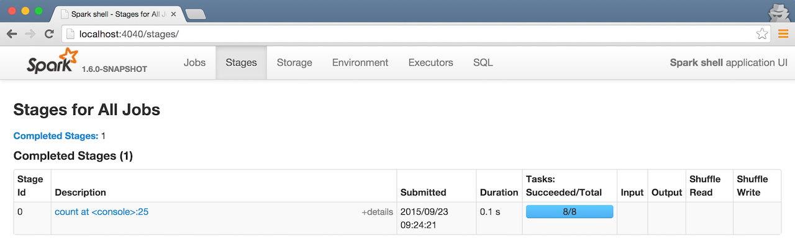
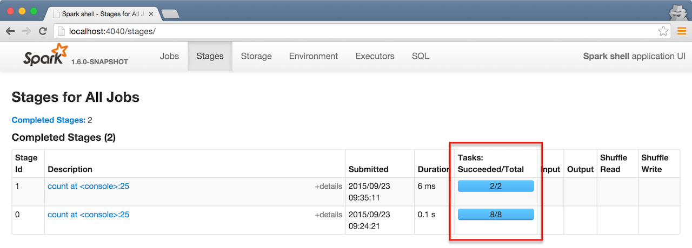

== Partitions and Partitioning

=== Introduction

Depending on how you look at Spark (programmer, devop, admin), an RDD is about the content (developer's and data scientist's perspective) or how it gets spread out over a cluster (performance), i.e. how many partitions an RDD represents.

A *partition* (aka _split_) is a logical chunk of a large distributed data set.

[CAUTION]
====
FIXME

1. How does the number of partitions map to the number of tasks? How to verify it?
2. How does the mapping between partitions and tasks correspond to data locality if any?
====

Spark manages data using partitions that helps  parallelize distributed data processing with minimal network traffic for sending data between executors.

By default, Spark tries to read data into an RDD from the nodes that are close to it. Since Spark usually accesses distributed partitioned data, to optimize transformation operations it creates partitions to hold the data chunks.

There is a one-to-one correspondence between how data is laid out in data storage like HDFS or Cassandra (it is partitioned for the same reasons).

Features:

* size
* number
* partitioning scheme
* node distribution
* repartitioning

[TIP]
====
Read the following documentations to learn what experts say on the topic:

* https://databricks.gitbooks.io/databricks-spark-knowledge-base/content/performance_optimization/how_many_partitions_does_an_rdd_have.html[How Many Partitions Does An RDD Have?]
* https://spark.apache.org/docs/latest/tuning.html[Tuning Spark] (the official documentation of Spark)
====

By default, a partition is created for each HDFS partition, which by default is 64MB (from http://spark.apache.org/docs/latest/programming-guide.html#external-datasets[Spark's Programming Guide]).

RDDs get partitioned automatically without programmer intervention. However, there are times when you'd like to adjust the size and number of partitions or the partitioning scheme according to the needs of your application.

You use `def getPartitions: Array[Partition]` method on a RDD to know the set of partitions in this RDD.

As noted in https://github.com/databricks/spark-knowledgebase/blob/master/performance_optimization/how_many_partitions_does_an_rdd_have.md#view-task-execution-against-partitions-using-the-ui[View Task Execution Against Partitions Using the UI]:

> When a stage executes, you can see the number of partitions for a given stage in the Spark UI.

Start `spark-shell` and see it yourself!

```
scala> sc.parallelize(1 to 100).count
res0: Long = 100
```

When you execute the Spark job, i.e. `sc.parallelize(1 to 100).count`, you should see the following in http://localhost:4040/jobs[Spark shell application UI].

.The number of partition as Total tasks in UI


The reason for `8` Tasks in Total is that I'm on a 8-core laptop and by default the number of partitions is the number of _all_ available cores.

```
$ sysctl -n hw.ncpu
8
```

You can request for the minimum number of partitions, using the second input parameter to many transformations.

```
scala> sc.parallelize(1 to 100, 2).count
res1: Long = 100
```

.Total tasks in UI shows 2 partitions


You can always ask for the number of partitions using `partitions` method of a RDD:

```
scala> val ints = sc.parallelize(1 to 100, 4)
ints: org.apache.spark.rdd.RDD[Int] = ParallelCollectionRDD[1] at parallelize at <console>:24

scala> ints.partitions.size
res2: Int = 4
```

In general, smaller/more numerous partitions allow work to be distributed among more workers, but larger/fewer partitions allow work to be done in larger chunks,  which may result in the work getting done more quickly as long as all workers are kept busy, due to reduced overhead.

Increasing partitions count will make each partition to have less data (or not at all!)

Spark can only run 1 concurrent task for every partition of an RDD, up to the number of cores in your cluster. So if you have a cluster with 50 cores, you want your RDDs to at least have 50 partitions (and probably http://spark.apache.org/docs/latest/tuning.html#level-of-parallelism[2-3x times that]).

As far as choosing a "good" number of partitions, you generally want at least as many as the number of executors for parallelism. You can get this computed value by calling `sc.defaultParallelism`.

Also, the number of partitions determines how many files get generated by actions that save RDDs to files.

The maximum size of a partition is ultimately limited by the available memory of an executor.

In the first RDD transformation, e.g. reading from a file using `sc.textFile(path, partition)`, the `partition` parameter will be applied to all further transformations and actions on this RDD.

Partitions get redistributed among nodes whenever `shuffle` occurs. Repartitioning may cause `shuffle` to occur in some situations,  but it is not guaranteed to occur in all cases. And it usually happens during action stage.

When creating an RDD by reading a file using `rdd = SparkContext().textFile("hdfs://.../file.txt")` the number of partitions may be smaller. Ideally, you would get the same number of blocks as you see in HDFS, but if the lines in your file are too long (longer than the block size), there will be fewer partitions.

Preferred way to set up the number of partitions for an RDD is to directly pass it as the second input parameter in the call like `rdd = sc.textFile("hdfs://.../file.txt", 400)`, where `400` is the number of partitions. In this case, the partitioning makes for 400 splits that would be done by the Hadoop's `TextInputFormat`, not Spark and it would work much faster. It's also that the code spawns 400 concurrent tasks to try to load `file.txt` directly into 400 partitions.

It will only work as described for uncompressed files.

When using `textFile` with compressed files (`file.txt.gz` not `file.txt` or similar), Spark disables splitting that makes for an RDD with only 1 partition (as reads against gzipped files cannot be parallelized). In this case, to change the number of partitions you should do <<repartitioning, repartitioning>>.

Some operations, e.g. `map`, `flatMap`, `filter`, don't preserve partitioning.

`map`, `flatMap`, `filter` operations apply a function to every partition.

=== [[repartitioning]][[repartition]] Repartitioning RDD -- `repartition` Transformation

[source, scala]
----
repartition(numPartitions: Int)(implicit ord: Ordering[T] = null): RDD[T]
----

`repartition` is <<coalesce, coalesce>> with `numPartitions` and `shuffle` enabled.

With the following computation you can see that `repartition(5)` causes 5 tasks to be started using `NODE_LOCAL` link:spark-data-locality.adoc[data locality].

```
scala> lines.repartition(5).count
...
15/10/07 08:10:00 INFO DAGScheduler: Submitting 5 missing tasks from ResultStage 7 (MapPartitionsRDD[19] at repartition at <console>:27)
15/10/07 08:10:00 INFO TaskSchedulerImpl: Adding task set 7.0 with 5 tasks
15/10/07 08:10:00 INFO TaskSetManager: Starting task 0.0 in stage 7.0 (TID 17, localhost, partition 0,NODE_LOCAL, 2089 bytes)
15/10/07 08:10:00 INFO TaskSetManager: Starting task 1.0 in stage 7.0 (TID 18, localhost, partition 1,NODE_LOCAL, 2089 bytes)
15/10/07 08:10:00 INFO TaskSetManager: Starting task 2.0 in stage 7.0 (TID 19, localhost, partition 2,NODE_LOCAL, 2089 bytes)
15/10/07 08:10:00 INFO TaskSetManager: Starting task 3.0 in stage 7.0 (TID 20, localhost, partition 3,NODE_LOCAL, 2089 bytes)
15/10/07 08:10:00 INFO TaskSetManager: Starting task 4.0 in stage 7.0 (TID 21, localhost, partition 4,NODE_LOCAL, 2089 bytes)
...
```

You can see a change after executing `repartition(1)` causes 2 tasks to be started using `PROCESS_LOCAL` link:spark-data-locality.adoc[data locality].

```
scala> lines.repartition(1).count
...
15/10/07 08:14:09 INFO DAGScheduler: Submitting 2 missing tasks from ShuffleMapStage 8 (MapPartitionsRDD[20] at repartition at <console>:27)
15/10/07 08:14:09 INFO TaskSchedulerImpl: Adding task set 8.0 with 2 tasks
15/10/07 08:14:09 INFO TaskSetManager: Starting task 0.0 in stage 8.0 (TID 22, localhost, partition 0,PROCESS_LOCAL, 2058 bytes)
15/10/07 08:14:09 INFO TaskSetManager: Starting task 1.0 in stage 8.0 (TID 23, localhost, partition 1,PROCESS_LOCAL, 2058 bytes)
...
```

Please note that Spark disables splitting for compressed files and creates RDDs with only 1 partition. In such cases, it's helpful to use `sc.textFile('demo.gz')` and do repartitioning using `rdd.repartition(100)` as follows:

```
rdd = sc.textFile('demo.gz')
rdd = rdd.repartition(100)
```

With the lines, you end up with `rdd` to be exactly 100 partitions of roughly equal in size.

* `rdd.repartition(N)` does a `shuffle` to split data to match `N`
** partitioning is done on round robin basis

TIP: If partitioning scheme doesn't work for you, you can write your own custom partitioner.

TIP: It's useful to get familiar with https://hadoop.apache.org/docs/current/api/org/apache/hadoop/mapred/TextInputFormat.html[Hadoop's TextInputFormat].

=== [[coalesce]] `coalesce` Transformation

[source, scala]
----
coalesce(numPartitions: Int, shuffle: Boolean = false)(implicit ord: Ordering[T] = null): RDD[T]
----

The `coalesce` transformation is used to change the number of partitions. It can trigger link:spark-rdd-shuffle.adoc[RDD shuffling] depending on the `shuffle` flag (disabled by default, i.e. `false`).

In the following sample, you `parallelize` a local 10-number sequence and `coalesce` it first without and then with shuffling (note the `shuffle` parameter being `false` and `true`, respectively).

TIP: Use link:spark-rdd-lineage.adoc#toDebugString[toDebugString] to check out the link:spark-rdd-lineage.adoc[RDD lineage graph].

```
scala> val rdd = sc.parallelize(0 to 10, 8)
rdd: org.apache.spark.rdd.RDD[Int] = ParallelCollectionRDD[0] at parallelize at <console>:24

scala> rdd.partitions.size
res0: Int = 8

scala> rdd.coalesce(numPartitions=8, shuffle=false)   // <1>
res1: org.apache.spark.rdd.RDD[Int] = CoalescedRDD[1] at coalesce at <console>:27

scala> res1.toDebugString
res2: String =
(8) CoalescedRDD[1] at coalesce at <console>:27 []
 |  ParallelCollectionRDD[0] at parallelize at <console>:24 []

scala> rdd.coalesce(numPartitions=8, shuffle=true)
res3: org.apache.spark.rdd.RDD[Int] = MapPartitionsRDD[5] at coalesce at <console>:27

scala> res3.toDebugString
res4: String =
(8) MapPartitionsRDD[5] at coalesce at <console>:27 []
 |  CoalescedRDD[4] at coalesce at <console>:27 []
 |  ShuffledRDD[3] at coalesce at <console>:27 []
 +-(8) MapPartitionsRDD[2] at coalesce at <console>:27 []
    |  ParallelCollectionRDD[0] at parallelize at <console>:24 []
```
<1> `shuffle` is `false` by default and it's explicitly used here for demo purposes. Note the number of partitions that remains the same as the number of partitions in the source RDD `rdd`.

=== [[settings]] Settings

.Spark Properties
[cols="1,1,2",options="header",width="100%"]
|===
| Spark Property
| Default Value
| Description

| [[spark.default.parallelism]][[spark_default_parallelism]] `spark.default.parallelism`
| (varies per deployment environment)
a| Sets up the number of partitions to use for link:spark-rdd-HashPartitioner.adoc[HashPartitioner]. It corresponds to link:spark-SchedulerBackend.adoc#defaultParallelism[default parallelism] of a scheduler backend.

More specifically, `spark.default.parallelism` corresponds to:

* The number of threads for link:spark-LocalSchedulerBackend.adoc[LocalSchedulerBackend].
* the number of CPU cores in link:spark-mesos.adoc#defaultParallelism[Spark on Mesos] and defaults to `8`.
* Maximum of `totalCoreCount` and `2` in link:spark-CoarseGrainedSchedulerBackend.adoc#defaultParallelism[CoarseGrainedSchedulerBackend].
|===
