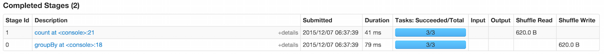

== ShuffledRDD

*ShuffledRDD* is an RDD of (key, value) pairs. It is a shuffle step (the result RDD) for transformations that trigger link:spark-rdd-shuffle.adoc[shuffle] at execution. Such transformations ultimately call `coalesce` transformation with `shuffle` input parameter `true` (default: `false`).

By default, the map-side combining flag (`mapSideCombine`) is `false`. It can however be changed using `ShuffledRDD.setMapSideCombine(mapSideCombine: Boolean)` method (and is used in link:spark-rdd-pairrdd-functions.adoc#combineByKeyWithClassTag[PairRDDFunctions.combineByKeyWithClassTag] that sets it `true` by default).

The only dependency of ShuffledRDD is a single-element collection of link:spark-rdd-dependencies.adoc#ShuffleDependency[ShuffleDependency]. Partitions are of type `ShuffledRDDPartition`.

Let's have a look at the below example with `groupBy` transformation:

```
scala> val r = sc.parallelize(0 to 9, 3).groupBy(_ / 3)
r: org.apache.spark.rdd.RDD[(Int, Iterable[Int])] = ShuffledRDD[2] at groupBy at <console>:18

scala> r.toDebugString
res0: String =
(3) ShuffledRDD[2] at groupBy at <console>:18 []
 +-(3) MapPartitionsRDD[1] at groupBy at <console>:18 []
    |  ParallelCollectionRDD[0] at parallelize at <console>:18 []
```

As you may have noticed, `groupBy` transformation adds `ShuffledRDD` RDD that will execute shuffling at execution time (as depicted in the following screenshot).

.Two stages in a job due to shuffling


It can be the result of RDD transformations using Scala implicits:

* `repartitionAndSortWithinPartitions`
* `sortByKey` (be very careful due to https://issues.apache.org/jira/browse/SPARK-1021[[SPARK-1021\]
sortByKey() launches a cluster job when it shouldn't])
* `partitionBy` (only when the input partitioner is different from the current one in an RDD)

It uses link:spark-rdd-partitions.adoc#partitioner[Partitioner].

It uses link:spark-service-MapOutputTrackerMaster.adoc[MapOutputTrackerMaster] to get preferred locations for a shuffle, i.e. a ShuffleDependency.
