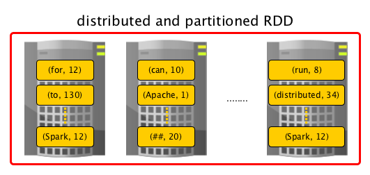

== [[RDD]] RDD -- Resilient Distributed Dataset

*Resilient Distributed Dataset* (aka *RDD*) is the primary data abstraction in Apache Spark and the core of Spark (that I often refer to as "Spark Core").

.The origins of RDD
****
The original paper that gave birth to the concept of RDD is https://cs.stanford.edu/~matei/papers/2012/nsdi_spark.pdf[Resilient Distributed Datasets: A Fault-Tolerant Abstraction for In-Memory Cluster Computing] by Matei Zaharia, et al.
****

A RDD is a resilient and distributed collection of records spread over <<getPartitions, one or many partitions>>.

NOTE: One could compare RDDs to collections in Scala, i.e. a RDD is computed on many JVMs while a Scala collection lives on a single JVM.

Using RDD Spark hides data partitioning and so distribution that in turn allowed them to design parallel computational framework with a higher-level programming interface (API) for four mainstream programming languages.

The features of RDDs (decomposing the name):

* *Resilient*, i.e. fault-tolerant with the help of <<lineage, RDD lineage graph>> and so able to recompute missing or damaged partitions due to node failures.
* *Distributed* with data residing on multiple nodes in a link:spark-cluster.adoc[cluster].
* *Dataset* is a collection of link:spark-rdd-partitions.adoc[partitioned data] with primitive values or values of values, e.g. tuples or other objects (that represent records of the data you work with).

.RDDs
image::diagrams/spark-rdds.png[align="center"]

From the scaladoc of http://spark.apache.org/docs/latest/api/scala/index.html#org.apache.spark.rdd.RDD[org.apache.spark.rdd.RDD]:

> A Resilient Distributed Dataset (RDD), the basic abstraction in Spark. Represents an immutable, partitioned collection of elements that can be operated on in parallel.

From the original paper about RDD - https://cs.stanford.edu/~matei/papers/2012/nsdi_spark.pdf[Resilient Distributed Datasets: A Fault-Tolerant Abstraction for In-Memory Cluster Computing]:

> Resilient Distributed Datasets (RDDs) are a distributed memory abstraction that lets programmers perform in-memory computations on large clusters in a fault-tolerant manner.

Beside the above traits (that are directly embedded in the name of the data abstraction - RDD) it has the following additional traits:

* *In-Memory*, i.e. data inside RDD is stored in memory as much (size) and long (time) as possible.
* *Immutable* or *Read-Only*, i.e. it does not change once created and can only be transformed using transformations to new RDDs.
* *Lazy evaluated*, i.e. the data inside RDD is not available or transformed until an action is executed that triggers the execution.
* *Cacheable*, i.e. you can hold all the data in a persistent "storage" like memory (default and the most preferred) or disk (the least preferred due to access speed).
* *Parallel*, i.e. process data in parallel.
* *Typed* -- RDD records have types, e.g. `Long` in `RDD[Long]` or `(Int, String)` in `RDD[(Int, String)]`.
* *Partitioned* -- records are partitioned (split into logical partitions) and distributed across nodes in a cluster.
* *Location-Stickiness* -- `RDD` can define <<preferredLocations, placement preferences>> to compute partitions (as close to the records as possible).

NOTE: *Preferred location* (aka _locality preferences_ or _placement preferences_ or _locality info_) is information about the locations of RDD records (that Spark's link:spark-dagscheduler.adoc#preferred-locations[DAGScheduler] uses to place computing partitions on to have the tasks as close to the data as possible).

Computing partitions in a RDD is a distributed process by design and to achieve even *data distribution* as well as leverage link:spark-data-locality.adoc[data locality] (in distributed systems like HDFS or Cassandra in which data is partitioned by default), they are *partitioned* to a fixed number of link:spark-rdd-partitions.adoc[partitions] - logical chunks (parts) of data. The logical division is for processing only and internally it is not divided whatsoever. Each partition comprises of *records*.

.RDDs


link:spark-rdd-partitions.adoc[Partitions are the units of parallelism]. You can control the number of partitions of a RDD using link:spark-rdd-partitions.adoc#repartition[repartition] or link:spark-rdd-partitions.adoc#coalesce[coalesce] transformations. Spark tries to be as close to data as possible without wasting time to send data across network by means of link:spark-rdd-shuffle.adoc[RDD shuffling], and creates as many partitions as required to follow the storage layout and thus optimize data access. It leads to a one-to-one mapping between (physical) data in distributed data storage, e.g. HDFS or Cassandra, and partitions.

RDDs support two kinds of operations:

* <<transformations, transformations>> - lazy operations that return another RDD.
* <<actions, actions>> - operations that trigger computation and return values.

The motivation to create RDD were (https://www.cs.berkeley.edu/~matei/papers/2012/nsdi_spark.pdf[after the authors]) two types of applications that current computing frameworks handle inefficiently:

* *iterative algorithms* in machine learning and graph computations.
* *interactive data mining tools* as ad-hoc queries on the same dataset.

The goal is to reuse intermediate in-memory results across multiple data-intensive workloads with no need for copying large amounts of data over the
network.

Technically, RDDs follow the <<contract, contract>> defined by the five main intrinsic properties:

* List of link:spark-rdd-dependencies.adoc[parent RDDs] that are the dependencies of the RDD.

* An array of link:spark-rdd-partitions.adoc[partitions] that a dataset is divided to.

* A <<compute, compute function>> to do a computation on partitions.

* An optional link:spark-rdd-Partitioner.adoc[Partitioner] that defines how keys are hashed, and the pairs partitioned (for key-value RDDs)

* Optional <<getPreferredLocations, preferred locations>> (aka *locality info*), i.e. hosts for a partition where the records live or are the closest to read from.

This RDD abstraction supports an expressive set of operations without having to modify scheduler for each one.

[[context]]
An RDD is a named (by `name`) and uniquely identified (by `id`) entity in a link:spark-sparkcontext.adoc[SparkContext] (available as `context` property).

RDDs live in one and only one link:spark-sparkcontext.adoc[SparkContext] that creates a logical boundary.

NOTE: RDDs cannot be shared between `SparkContexts` (see link:spark-sparkcontext.adoc#sparkcontext-and-rdd[SparkContext and RDDs]).

An RDD can optionally have a friendly name accessible using `name` that can be changed using `=`:

```
scala> val ns = sc.parallelize(0 to 10)
ns: org.apache.spark.rdd.RDD[Int] = ParallelCollectionRDD[2] at parallelize at <console>:24

scala> ns.id
res0: Int = 2

scala> ns.name
res1: String = null

scala> ns.name = "Friendly name"
ns.name: String = Friendly name

scala> ns.name
res2: String = Friendly name

scala> ns.toDebugString
res3: String = (8) Friendly name ParallelCollectionRDD[2] at parallelize at <console>:24 []
```

RDDs are a container of instructions on how to materialize big (arrays of) distributed data, and how to split it into partitions so Spark (using link:spark-Executor.adoc[executors]) can hold some of them.

In general data distribution can help executing processing in parallel so a task processes a chunk of data that it could eventually keep in memory.

Spark does jobs in parallel, and RDDs are split into partitions to be processed and written in parallel. Inside a partition, data is processed sequentially.

Saving partitions results in part-files instead of one single file (unless there is a single partition).

=== [[checkpointRDD]] `checkpointRDD` Internal Method

CAUTION: FIXME

=== [[isCheckpointedAndMaterialized]] `isCheckpointedAndMaterialized` Method

CAUTION: FIXME

=== [[getNarrowAncestors]] `getNarrowAncestors` Method

CAUTION: FIXME

=== [[toLocalIterator]] `toLocalIterator` Method

CAUTION: FIXME

=== [[cache]] `cache` Method

CAUTION: FIXME

=== [[persist]] `persist` Methods

[source, scala]
----
persist(): this.type
persist(newLevel: StorageLevel): this.type
----

Refer to link:spark-rdd-caching.adoc#persist[Persisting RDD -- `persist` Methods].

=== [[persist-internal]] `persist` Internal Method

[source, scala]
----
persist(newLevel: StorageLevel, allowOverride: Boolean): this.type
----

CAUTION: FIXME

NOTE: `persist` is used when `RDD` is requested to <<persist, persist>> itself and <<localCheckpoint, marks itself for local checkpointing>>.

=== [[unpersist]] `unpersist` Method

CAUTION: FIXME

=== [[localCheckpoint]] `localCheckpoint` Method

[source, scala]
----
localCheckpoint(): this.type
----

Refer to link:spark-rdd-checkpointing.adoc#localCheckpoint[Marking RDD for Local Checkpointing -- `localCheckpoint` Method].

=== [[contract]] RDD Contract

[source, scala]
----
abstract class RDD[T] {
  def compute(split: Partition, context: TaskContext): Iterator[T]
  def getPartitions: Array[Partition]
  def getDependencies: Seq[Dependency[_]]
  def getPreferredLocations(split: Partition): Seq[String] = Nil
  val partitioner: Option[Partitioner] = None
}
----

NOTE: `RDD` is an abstract class in Scala.

.RDD Contract
[cols="1,2",options="header",width="100%"]
|===
| Method
| Description

| <<compute, compute>>
| Used exclusively when `RDD` <<computeOrReadCheckpoint, computes a partition (possibly by reading from a checkpoint)>>.

| [[getPartitions]] `getPartitions`
| Used exclusively when `RDD` <<partitions, is requested for its partitions>> (called only once as the value is cached).

| [[getDependencies]] `getDependencies`
| Used when `RDD` <<dependencies, is requested for its dependencies>> (called only once as the value is cached).

| [[getPreferredLocations]] `getPreferredLocations`
| Defines *placement preferences* of a partition.

Used exclusively when `RDD` <<preferredLocations, is requested for the preferred locations of a partition>>.

| [[partitioner]] `partitioner`
| Defines the link:spark-rdd-Partitioner.adoc[Partitioner] of a `RDD`.
|===

=== [[rdd-types]] Types of RDDs

There are some of the most interesting types of RDDs:

* link:spark-rdd-parallelcollectionrdd.adoc[ParallelCollectionRDD]
* link:spark-rdd-cogroupedrdd.adoc[CoGroupedRDD]
* link:spark-rdd-hadooprdd.adoc[HadoopRDD] is an RDD that provides core functionality for reading data stored in HDFS using the older MapReduce API. The most notable use case is the return RDD of `SparkContext.textFile`.
* *MapPartitionsRDD* - a result of calling operations like `map`, `flatMap`, `filter`, link:spark-rdd-transformations.adoc#mapPartitions[mapPartitions], etc.

* *CoalescedRDD* - a result of link:spark-rdd-partitions.adoc#repartition[repartition] or link:spark-rdd-partitions.adoc#coalesce[coalesce] transformations.

* link:spark-rdd-ShuffledRDD.adoc[ShuffledRDD] - a result of shuffling, e.g. after link:spark-rdd-partitions.adoc#repartition[repartition] or link:spark-rdd-partitions.adoc#coalesce[coalesce] transformations.

* *PipedRDD* - an RDD created by piping elements to a forked external process.
* *PairRDD* (implicit conversion by link:spark-rdd-PairRDDFunctions.adoc[PairRDDFunctions]) that is an RDD of key-value pairs that is a result of `groupByKey` and `join` operations.
* *DoubleRDD* (implicit conversion as `org.apache.spark.rdd.DoubleRDDFunctions`) that is an RDD of `Double` type.
* *SequenceFileRDD* (implicit conversion as `org.apache.spark.rdd.SequenceFileRDDFunctions`) that is an RDD that can be saved as a `SequenceFile`.

Appropriate operations of a given RDD type are automatically available on a RDD of the right type, e.g. `RDD[(Int, Int)]`, through implicit conversion in Scala.

=== [[transformations]] Transformations

A *transformation* is a lazy operation on a RDD that returns another RDD, like `map`, `flatMap`, `filter`, `reduceByKey`, `join`, `cogroup`, etc.

TIP: Go in-depth in the section link:spark-rdd-transformations.adoc[Transformations].

=== [[actions]] Actions

An *action* is an operation that triggers execution of <<transformations, RDD transformations>> and returns a value (to a Spark driver - the user program).

TIP: Go in-depth in the section link:spark-rdd-actions.adoc[Actions].

=== [[creating-rdds]] Creating RDDs

==== SparkContext.parallelize

One way to create a RDD is with `SparkContext.parallelize` method. It accepts a collection of elements as shown below (`sc` is a SparkContext instance):

```
scala> val rdd = sc.parallelize(1 to 1000)
rdd: org.apache.spark.rdd.RDD[Int] = ParallelCollectionRDD[0] at parallelize at <console>:25
```

You may also want to randomize the sample data:

```
scala> val data = Seq.fill(10)(util.Random.nextInt)
data: Seq[Int] = List(-964985204, 1662791, -1820544313, -383666422, -111039198, 310967683, 1114081267, 1244509086, 1797452433, 124035586)

scala> val rdd = sc.parallelize(data)
rdd: org.apache.spark.rdd.RDD[Int] = ParallelCollectionRDD[0] at parallelize at <console>:29
```

Given the reason to use Spark to process more data than your own laptop could handle, `SparkContext.parallelize` is mainly used to learn Spark in the Spark shell. `SparkContext.parallelize` requires all the data to be available on a single machine - the Spark driver - that eventually hits the limits of your laptop.

==== SparkContext.makeRDD

CAUTION: FIXME What's the use case for `makeRDD`?

```
scala> sc.makeRDD(0 to 1000)
res0: org.apache.spark.rdd.RDD[Int] = ParallelCollectionRDD[1] at makeRDD at <console>:25
```

==== SparkContext.textFile

One of the easiest ways to create an RDD is to use `SparkContext.textFile` to read files.

You can use the local `README.md` file (and then `flatMap` over the lines inside to have an RDD of words):

```
scala> val words = sc.textFile("README.md").flatMap(_.split("\\W+")).cache
words: org.apache.spark.rdd.RDD[String] = MapPartitionsRDD[27] at flatMap at <console>:24
```

NOTE: You link:spark-rdd-caching.adoc[cache] it so the computation is not performed every time you work with `words`.

==== [[creating-rdds-from-input]] Creating RDDs from Input

Refer to link:spark-io.adoc[Using Input and Output (I/O)] to learn about the IO API to create RDDs.

==== Transformations

RDD transformations by definition transform an RDD into another RDD and hence are the way to create new ones.

Refer to <<transformations, Transformations>> section to learn more.

=== RDDs in Web UI

It is quite informative to look at RDDs in the Web UI that is at http://localhost:4040 for link:spark-shell.adoc[Spark shell].

Execute the following Spark application (type all the lines in `spark-shell`):

[source,scala]
----
val ints = sc.parallelize(1 to 100) // <1>
ints.setName("Hundred ints")        // <2>
ints.cache                          // <3>
ints.count                          // <4>
----
<1> Creates an RDD with hundred of numbers (with as many partitions as possible)
<2> Sets the name of the RDD
<3> Caches the RDD for performance reasons that also makes it visible in Storage tab in the web UI
<4> Executes action (and materializes the RDD)

With the above executed, you should see the following in the Web UI:

.RDD with custom name
image::images/spark-ui-rdd-name.png[]

Click the name of the RDD (under *RDD Name*) and you will get the details of how the RDD is cached.

.RDD Storage Info
image::images/spark-ui-storage-hundred-ints.png[]

Execute the following Spark job and you will see how the number of partitions decreases.

```
ints.repartition(2).count
```

.Number of tasks after `repartition`
image::images/spark-ui-repartition-2.png[]

=== [[partitions]] Accessing RDD Partitions -- `partitions` Final Method

[source, scala]
----
partitions: Array[Partition]
----

`partitions` returns the link:spark-rdd-partitions.adoc[Partitions] of a `RDD`.

`partitions` <<checkpointRDD, requests `CheckpointRDD` for partitions>> (if the RDD is checkpointed) or <<getPartitions, finds them itself>> and cache (in <<partitions_, partitions_>> internal registry that is used next time).

NOTE: Partitions have the property that their internal index should be equal to their position in the owning RDD.

=== [[compute]] Computing Partition (in TaskContext) -- `compute` Method

[source, scala]
----
compute(split: Partition, context: TaskContext): Iterator[T]
----

The abstract `compute` method computes the input `split` link:spark-rdd-partitions.adoc[partition] in the link:spark-taskscheduler-taskcontext.adoc[TaskContext] to produce a collection of values (of type `T`).

`compute` is implemented by any type of RDD in Spark and is called every time the records are requested unless RDD is link:spark-rdd-caching.adoc[cached] or link:spark-rdd-checkpointing.adoc[checkpointed] (and the records can be read from an external storage, but this time closer to the compute node).

When an RDD is link:spark-rdd-caching.adoc[cached], for specified link:spark-rdd-StorageLevel.adoc[storage levels] (i.e. all but `NONE`) link:spark-cachemanager.adoc[`CacheManager` is requested to get or compute partitions].

NOTE: `compute` method runs on the link:spark-driver.adoc[driver].

=== [[preferredLocations]] Defining Placement Preferences of RDD Partition -- `preferredLocations` Final Method

[source, scala]
----
preferredLocations(split: Partition): Seq[String]
----

`preferredLocations` <<checkpointRDD, requests `CheckpointRDD` for placement preferences>> (if the RDD is checkpointed) or <<getPreferredLocations, calculates them itself>>.

[NOTE]
====
`preferredLocations` is a template method that uses  <<getPreferredLocations, getPreferredLocations>> that custom RDDs can override to specify placement preferences for a partition.

<<getPreferredLocations, getPreferredLocations>> defines no placement preferences by default.
====

[NOTE]
====
`preferredLocations` is mainly used when link:spark-dagscheduler.adoc#getPreferredLocs[`DAGScheduler` computes preferred locations for missing partitions].

The other usages are to define the locations by custom RDDs, e.g.

* (Spark Core) link:spark-rdd-blockrdd.adoc[BlockRDD], `CoalescedRDD`, link:spark-rdd-hadooprdd.adoc[HadoopRDD], link:spark-rdd-NewHadoopRDD.adoc[NewHadoopRDD], link:spark-rdd-parallelcollectionrdd.adoc[ParallelCollectionRDD], `ReliableCheckpointRDD`, link:spark-rdd-ShuffledRDD.adoc[ShuffledRDD]

* (Spark SQL) `KafkaSourceRDD`, `ShuffledRowRDD`, `FileScanRDD`, `StateStoreRDD`

* (Spark Streaming) `KafkaRDD`, `WriteAheadLogBackedBlockRDD`
====

=== [[getNumPartitions]] Getting Number of Partitions -- `getNumPartitions` Method

[source, scala]
----
getNumPartitions: Int
----

`getNumPartitions` gives the number of partitions of a RDD.

[source, scala]
----
scala> sc.textFile("README.md").getNumPartitions
res0: Int = 2

scala> sc.textFile("README.md", 5).getNumPartitions
res1: Int = 5
----

=== [[computeOrReadCheckpoint]] Computing Partition (Possibly by Reading From Checkpoint) -- `computeOrReadCheckpoint` Method

[source, scala]
----
computeOrReadCheckpoint(split: Partition, context: TaskContext): Iterator[T]
----

`computeOrReadCheckpoint` reads `split` partition from a checkpoint (<<isCheckpointedAndMaterialized, if available already>>) or <<compute, computes it>> yourself.

NOTE: `computeOrReadCheckpoint` is a `private[spark]` method.

NOTE: `computeOrReadCheckpoint` is used when `RDD` <<iterator, computes records for a partition>> or <<getOrCompute, getOrCompute>>.

=== [[iterator]] Accessing Records For Partition Lazily -- `iterator` Final Method

[source, scala]
----
iterator(split: Partition, context: TaskContext): Iterator[T]
----

`iterator` <<getOrCompute, gets (or computes) `split` partition>> when link:spark-rdd-caching.adoc[cached] or <<computeOrReadCheckpoint, computes it (possibly by reading from checkpoint)>>.

NOTE: `iterator` is a `final` method that, despite being public, considered private and only available for implementing custom RDDs.

=== [[getOrCompute]] Computing RDD Partition -- `getOrCompute` Method

[source, scala]
----
getOrCompute(partition: Partition, context: TaskContext): Iterator[T]
----

CAUTION: FIXME

`getOrCompute` requests link:spark-blockmanager.adoc#getOrElseUpdate[`BlockManager` for a block] and returns a `InterruptibleIterator`.

NOTE: `InterruptibleIterator` delegates to a wrapped `Iterator` and allows for link:spark-taskscheduler-taskcontext.adoc#isInterrupted[task killing functionality].

NOTE: `getOrCompute` is called on Spark executors.

Internally, `getOrCompute` creates a link:spark-blockdatamanager.adoc#RDDBlockId[RDDBlockId] (for the partition in the RDD) that is then used to link:spark-blockmanager.adoc#getOrElseUpdate[retrieve it from `BlockManager` or compute, persist and return its values].

NOTE: `getOrCompute` is a `private[spark]` method that is exclusively used when <<iterator, iterating over partition when a RDD is cached>>.

=== [[dependencies]] RDD Dependencies -- `dependencies` Final Template Method

[source, scala]
----
dependencies: Seq[Dependency[_]]
----

`dependencies` returns the link:spark-rdd-dependencies.adoc[dependencies of a RDD].

NOTE: `dependencies` is a final method that no class in Spark can ever override.

Internally, `dependencies` checks out whether the RDD is link:spark-rdd-checkpointing.adoc[checkpointed] and acts accordingly.

For a RDD being checkpointed, `dependencies` returns a single-element collection with a link:spark-rdd-NarrowDependency.adoc#OneToOneDependency[OneToOneDependency].

For a non-checkpointed RDD, `dependencies` collection is computed using <<contract, `getDependencies` method>>.

NOTE: `getDependencies` method is an abstract method that custom RDDs are required to provide.
