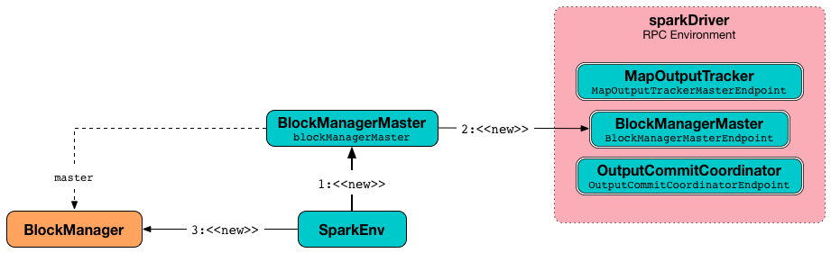

== SparkEnv -- Spark Runtime Environment

*Spark Runtime Environment* (`SparkEnv`) is the runtime environment with Spark's public services that interact with each other to build the entire Spark computing platform for a Spark application.

Spark Runtime Environment is represented by a <<SparkEnv, SparkEnv>> object that holds all the required runtime services for a running Spark application with separate environments for the <<createDriverEnv, driver>> and <<createExecutorEnv, executors>>.

.SparkEnv Services
[frame="topbot",cols="1,1,2",options="header",width="100%"]
|======================
| Property | Service | Description
| serializer | Serializer |
| closureSerializer | Serializer |
| serializerManager | SerializerManager |
| mapOutputTracker | MapOutputTracker |
| shuffleManager | ShuffleManager |
| broadcastManager | BroadcastManager |
| blockManager | BlockManager |
| securityManager | SecurityManager |
| metricsSystem | MetricsSystem |
| memoryManager | MemoryManager |
| outputCommitCoordinator | OutputCommitCoordinator |
| conf | SparkConf
|======================

[TIP]
====
Enable `INFO` or `DEBUG` logging level for `org.apache.spark.SparkEnv` logger to see what happens inside.

Add the following line to `conf/log4j.properties`:

```
log4j.logger.org.apache.spark.SparkEnv=DEBUG
```

Refer to link:spark-logging.adoc[Logging].
====

=== [[SparkEnv]] `SparkEnv` Factory Object

*SparkEnv* holds the public services in a running Spark instance, using <<createDriverEnv, SparkEnv.createDriverEnv()>> for a driver and <<createExecutorEnv, SparkEnv.createExecutorEnv()>> for an executor.

You can access the Spark environment using `SparkEnv.get`.

```
scala> import org.apache.spark._
import org.apache.spark._

scala> SparkEnv.get
res0: org.apache.spark.SparkEnv = org.apache.spark.SparkEnv@2220c5f7
```

=== [[create]] Creating "Base" `SparkEnv` -- `create` Method

[source, scala]
----
create(
  conf: SparkConf,
  executorId: String,
  hostname: String,
  port: Int,
  isDriver: Boolean,
  isLocal: Boolean,
  numUsableCores: Int,
  listenerBus: LiveListenerBus = null,
  mockOutputCommitCoordinator: Option[OutputCommitCoordinator] = None): SparkEnv
----

`create` is a internal helper method to create a "base" `SparkEnv` regardless of the target environment -- be it a driver or an executor.

When executed, `create` creates a `Serializer` (based on <<spark_serializer, spark.serializer>> setting). You should see the following `DEBUG` message in the logs:

```
DEBUG SparkEnv: Using serializer: [serializer]
```

It creates another `Serializer` (based on <<spark_closure_serializer, spark.closure.serializer>>).

It creates a link:spark-shuffle-manager.adoc[ShuffleManager] based on link:spark-shuffle-manager.adoc#spark.shuffle.manager[spark.shuffle.manager] setting.

It creates a link:spark-MemoryManager.adoc[MemoryManager] based on <<spark_memory_useLegacyMode, spark.memory.useLegacyMode>> setting (with link:spark-UnifiedMemoryManager.adoc[UnifiedMemoryManager] being the default and `numCores` the input `numUsableCores`).

It creates a link:spark-blocktransferservice.adoc#NettyBlockTransferService[NettyBlockTransferService].

[[BlockManagerMaster]]
It creates a link:spark-BlockManagerMaster.adoc[BlockManagerMaster] object with the `BlockManagerMaster` RPC endpoint reference (by <<registerOrLookupEndpoint, registering or looking it up by name>> and link:spark-blockmanager-BlockManagerMasterEndpoint.adoc[BlockManagerMasterEndpoint]), the input link:spark-configuration.adoc[SparkConf], and the input `isDriver` flag.

.Creating BlockManager for the Driver


NOTE: `create` registers the *BlockManagerMaster* RPC endpoint for the driver and looks it up for executors.

.Creating BlockManager for Executor
image::images/sparkenv-executor-blockmanager.png[align="center"]

It creates a link:spark-blockmanager.adoc#creating-instance[BlockManager] (using the above `BlockManagerMaster` object and other services).

It creates a link:spark-service-broadcastmanager.adoc[BroadcastManager].

It creates a CacheManager.

It creates a MetricsSystem for a driver and a worker separately.

It initializes `userFiles` temporary directory used for downloading dependencies for a driver while this is the executor's current working directory for an executor.

An OutputCommitCoordinator is created.

NOTE: `create` is called by <<createDriverEnv, createDriverEnv>> and <<createExecutorEnv, createExecutorEnv>>.

=== [[registerOrLookupEndpoint]] Registering or Looking up RPC Endpoint by Name -- `registerOrLookupEndpoint` Method

[source, scala]
----
registerOrLookupEndpoint(name: String, endpointCreator: => RpcEndpoint)
----

`registerOrLookupEndpoint` registers or looks up a RPC endpoint by `name`.

If called from the driver, you should see the following INFO message in the logs:

```
INFO SparkEnv: Registering [name]
```

And the RPC endpoint is registered in the RPC environment.

Otherwise, it obtains a RPC endpoint reference by `name`.

=== [[createDriverEnv]] Creating SparkEnv for Driver -- `createDriverEnv` Method

[source, scala]
----
createDriverEnv(
  conf: SparkConf,
  isLocal: Boolean,
  listenerBus: LiveListenerBus,
  numCores: Int,
  mockOutputCommitCoordinator: Option[OutputCommitCoordinator] = None): SparkEnv
----

`createDriverEnv` creates a `SparkEnv` execution environment for the driver.

.Spark Environment for driver
image::images/sparkenv-driver.png[align="center"]

`createDriverEnv` accepts an instance of link:spark-configuration.adoc[SparkConf], link:spark-deployment-environments.adoc[whether it runs in local mode or not], link:spark-LiveListenerBus.adoc[LiveListenerBus], the number of cores to use for execution in local mode or `0` otherwise, and a link:spark-service-outputcommitcoordinator.adoc[OutputCommitCoordinator] (default: none).

`createDriverEnv` ensures that <<spark_driver_host, spark.driver.host>> and <<spark_driver_port, spark.driver.port>> settings are set in `conf` link:spark-configuration.adoc[SparkConf].

It then passes the call straight on to the <<create, create helper method>> (with `driver` executor id, `isDriver` enabled, and the input parameters).

NOTE: `createDriverEnv` is exclusively used by link:spark-sparkcontext-creating-instance-internals.adoc#createSparkEnv[SparkContext to create a `SparkEnv`] (while a link:spark-sparkcontext.adoc#creating-instance[SparkContext is being created for the driver]).

=== [[createExecutorEnv]] Creating SparkEnv for Executor -- `createExecutorEnv` Method

[source, scala]
----
createExecutorEnv(
  conf: SparkConf,
  executorId: String,
  hostname: String,
  port: Int,
  numCores: Int,
  isLocal: Boolean): SparkEnv
----

`createExecutorEnv` creates an *executor's (execution) environment* that is the Spark execution environment for an executor.

.Spark Environment for executor
image::images/sparkenv-executor.png[align="center"]

`createExecutorEnv` uses link:spark-configuration.adoc[SparkConf], the executor's identifier, hostname, port, the number of cores to use, and whether or not it runs in local mode.

NOTE: The number of cores to use is configured using `--cores` command-line option of `CoarseGrainedExecutorBackend` and is specific to a cluster manager.

It creates an link:spark-service-mapoutputtracker.adoc#MapOutputTrackerWorker[MapOutputTrackerWorker] object and looks up `MapOutputTracker` RPC endpoint. See link:spark-service-mapoutputtracker.adoc[MapOutputTracker].

It creates a MetricsSystem for *executor* and starts it.

An OutputCommitCoordinator is created and *OutputCommitCoordinator* RPC endpoint looked up.

=== [[serializer]] `serializer`

CAUTION: FIXME

=== [[closureSerializer]] `closureSerializer`

CAUTION: FIXME

=== [[get]] Getting Current `SparkEnv` -- `get` Method

CAUTION: FIXME

=== [[stop]] `stop` Method

CAUTION: FIXME

=== [[settings]] Settings

.Spark Properties
[frame="topbot",cols="1,1,2",options="header",width="100%"]
|======================
| Spark Property | Default Value | Description
| [[spark_driver_host]] `spark.driver.host` | | The name of the machine where the driver runs on. It is set when link:spark-sparkcontext.adoc#creating-instance[`SparkContext` is created]
| [[spark_driver_port]] `spark.driver.port` | `0` | The port the driver listens to. It is first set to `0` in the driver when link:spark-sparkcontext.adoc#creating-instance[SparkContext is initialized]. It is later set to the port of link:spark-rpc.adoc[RpcEnv] of the driver (in <<create, SparkEnv.create>>).
| [[spark_serializer]] `spark.serializer` | `org.apache.spark.serializer.JavaSerializer` | The `Serializer`.

[TIP]
====
Enable DEBUG logging level for `org.apache.spark.SparkEnv` logger to see the current value.

```
DEBUG SparkEnv: Using serializer: [serializer]
```
====

| [[spark_closure_serializer]] `spark.closure.serializer` | `org.apache.spark.serializer.JavaSerializer` | The `Serializer`

| [[spark_memory_useLegacyMode]] `spark.memory.useLegacyMode` | `false` | The flag to control the link:spark-MemoryManager.adoc[MemoryManager] in use. When enabled (`true`) it is `StaticMemoryManager` while link:spark-UnifiedMemoryManager.adoc[UnifiedMemoryManager] otherwise (`false`).
|======================
