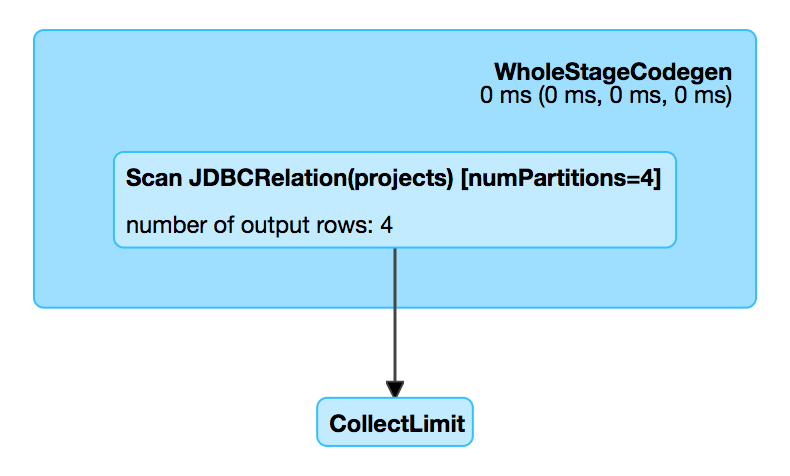

== [[JDBCRelation]] JDBCRelation

`JDBCRelation` is a <<BaseRelation, BaseRelation>> and <<InsertableRelation, InsertableRelation>> with support for <<PrunedFilteredScan, PrunedFilteredScan>>.

`JDBCRelation` is <<creating-instance, created>> when:

* `DataFrameReader` is requested to link:spark-sql-DataFrameReader.adoc#jdbc[load data from external table using JDBC] (with `predicates` for `WHERE` clause per partition)

* `JdbcRelationProvider` link:spark-sql-JdbcRelationProvider.adoc#createRelation-RelationProvider[creates a BaseRelation]

[[toString]]
`JDBCRelation` presents itself with the name of the table and the number of partitions (if given).

```
JDBCRelation([table]) [numPartitions=[number]]
```

.JDBCRelation in web UI (Details for Query)


```
scala> df.explain
== Physical Plan ==
*Scan JDBCRelation(projects) [numPartitions=1] [id#0,name#1,website#2] ReadSchema: struct<id:int,name:string,website:string>
```

=== [[BaseRelation]] JDBCRelation as BaseRelation

`JDBCRelation` is a link:spark-sql-BaseRelation.adoc[BaseRelation] which represents a collection of tuples with a schema.

.JDBCRelation as BaseRelation
[cols="1,2",options="header",width="100%"]
|===
| Method
| Description

| [[needConversion]] `needConversion`
| Disabled (i.e. `false`)

| [[schema]] `schema`
| StructType

| [[sqlContext]] `sqlContext`
| SQLContext from <<sparkSession, SparkSession>>

| [[unhandledFilters]] `unhandledFilters`
| FIXME
|===

=== [[PrunedFilteredScan]] JDBCRelation as PrunedFilteredScan

`JDBCRelation` is a `PrunedFilteredScan`.

.JDBCRelation as PrunedFilteredScan
[cols="1,2",options="header",width="100%"]
|===
| Method
| Description

| [[buildScan]] `buildScan`
| FIXME
|===

=== [[InsertableRelation]] JDBCRelation as InsertableRelation

`JDBCRelation` is a `InsertableRelation`.

.JDBCRelation as InsertableRelation
[cols="1,2",options="header",width="100%"]
|===
| Method
| Description

| [[insert]] `insert`
| FIXME
|===

=== [[columnPartition]] `columnPartition` Method

CAUTION: FIXME Is this still in use?

=== [[creating-instance]] Creating JDBCRelation Instance

`JDBCRelation` takes the following when created:

* [[parts]] RDD link:spark-rdd-partitions.adoc[partitions]
* [[jdbcOptions]] link:spark-sql-DataFrameReader.adoc#JDBCOptions[JDBCOptions]
* [[sparkSession]] link:spark-sql-SparkSession.adoc[SparkSession]
