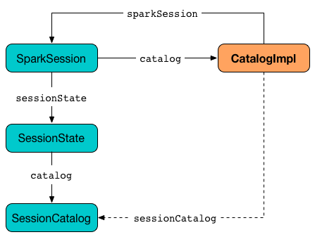
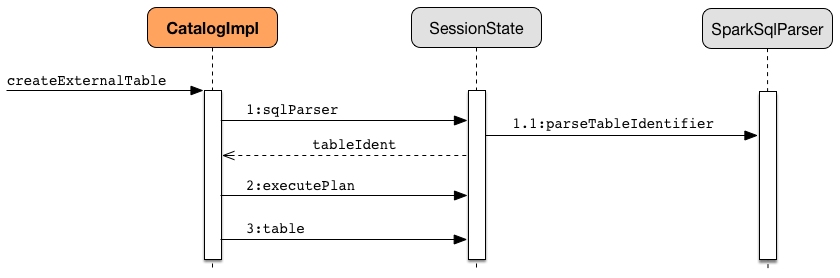

== Catalog

`Catalog` is the <<contract, interface to work with a metastore>>, i.e. a data catalog of  database(s), local and external tables, functions, table columns, and temporary views in Spark SQL.

You can access the current catalog using link:spark-sql-sparksession.adoc#catalog[SparkSession.catalog] attribute.

[source, scala]
----
import org.apache.spark.sql.SparkSession
val spark: SparkSession = ...

scala> spark.catalog
   lazy val catalog: org.apache.spark.sql.catalog.Catalog

scala> spark.catalog
res0: org.apache.spark.sql.catalog.Catalog = org.apache.spark.sql.internal.CatalogImpl@1b42eb0f

scala> spark.catalog.listTables.show
+------------------+--------+-----------+---------+-----------+
|              name|database|description|tableType|isTemporary|
+------------------+--------+-----------+---------+-----------+
|my_permanent_table| default|       null|  MANAGED|      false|
|              strs|    null|       null|TEMPORARY|       true|
+------------------+--------+-----------+---------+-----------+

scala> spark.catalog.clearCache
----

The one and only implementation of the <<contract, Catalog contract>> is <<CatalogImpl, CatalogImpl>>.

=== [[contract]] `Catalog` Contract

[source, scala]
----
package org.apache.spark.sql.catalog

abstract class Catalog {
  def currentDatabase: String
  def setCurrentDatabase(dbName: String): Unit
  def listDatabases(): Dataset[Database]
  def listTables(): Dataset[Table]
  def listTables(dbName: String): Dataset[Table]
  def listFunctions(): Dataset[Function]
  def listFunctions(dbName: String): Dataset[Function]
  def listColumns(tableName: String): Dataset[Column]
  def listColumns(dbName: String, tableName: String): Dataset[Column]
  def createExternalTable(tableName: String, path: String): DataFrame
  def createExternalTable(tableName: String, path: String, source: String): DataFrame
  def createExternalTable(
      tableName: String,
      source: String,
      options: Map[String, String]): DataFrame
  def createExternalTable(
      tableName: String,
      source: String,
      schema: StructType,
      options: Map[String, String]): DataFrame
  def dropTempView(viewName: String): Unit
  def isCached(tableName: String): Boolean
  def cacheTable(tableName: String): Unit
  def uncacheTable(tableName: String): Unit
  def clearCache(): Unit
  def refreshTable(tableName: String): Unit
  def refreshByPath(path: String): Unit
}
----

=== [[CatalogImpl]] CatalogImpl

`CatalogImpl` is the one and only <<contract, Catalog>> that relies on a per-session link:spark-sql-SessionCatalog.adoc[SessionCatalog] (through link:spark-sql-sparksession.adoc[SparkSession]) to obey the <<contract, Catalog contract>>.

.CatalogImpl uses SessionCatalog (through SparkSession)

It lives in `org.apache.spark.sql.internal` package.

==== [[clearCache]] Removing All Cached Tables From In-Memory Cache -- `clearCache` Method

[source, scala]
----
clearCache(): Unit
----

`clearCache` requests link:spark-sql-CacheManager.adoc#clearCache[`CacheManager` to remove all cached tables from in-memory cache].

NOTE: `clearCache` is a part of <<contract, `Catalog` Contract>>.

==== [[createExternalTable]] Creating External Table From Path -- `createExternalTable` Method

[source, scala]
----
createExternalTable(tableName: String, path: String): DataFrame
createExternalTable(tableName: String, path: String, source: String): DataFrame
createExternalTable(
  tableName: String,
  source: String,
  options: Map[String, String]): DataFrame
createExternalTable(
  tableName: String,
  source: String,
  schema: StructType,
  options: Map[String, String]): DataFrame
----

`createExternalTable` creates an external table `tableName` from the given `path` and returns the corresponding link:spark-sql-dataframe.adoc[DataFrame].

[source, scala]
----
import org.apache.spark.sql.SparkSession
val spark: SparkSession = ...

val readmeTable = spark.catalog.createExternalTable("readme", "README.md", "text")
readmeTable: org.apache.spark.sql.DataFrame = [value: string]

scala> spark.catalog.listTables.filter(_.name == "readme").show
+------+--------+-----------+---------+-----------+
|  name|database|description|tableType|isTemporary|
+------+--------+-----------+---------+-----------+
|readme| default|       null| EXTERNAL|      false|
+------+--------+-----------+---------+-----------+

scala> sql("select count(*) as count from readme").show(false)
+-----+
|count|
+-----+
|99   |
+-----+
----

The `source` input parameter is the name of the data source provider for the table, e.g. parquet, json, text. If not specified, `createExternalTable` uses link:spark-sql-settings.adoc#spark.sql.sources.default[spark.sql.sources.default] setting to know the data source format.

NOTE: `source` input parameter must not be `hive` as it leads to a `AnalysisException`.

`createExternalTable` sets the mandatory `path` option when specified explicitly in the input parameter list.

`createExternalTable` parses `tableName` into `TableIdentifier` (using link:spark-sql-sql-parsers.adoc#SparkSqlParser[SparkSqlParser]). It creates a `CatalogTable` and then link:spark-sql-sessionstate.adoc#executePlan[executes] (by link:spark-sql-query-execution.adoc#toRdd[toRDD]) a `CreateTable` link:spark-sql-LogicalPlan.adoc[logical plan]. The result link:spark-sql-dataframe.adoc[DataFrame] is a `Dataset[Row]` with the link:spark-sql-query-execution.adoc[QueryExecution] after executing `SubqueryAlias` logical plan and link:spark-sql-RowEncoder.adoc[RowEncoder].

.CatalogImpl.createExternalTable

