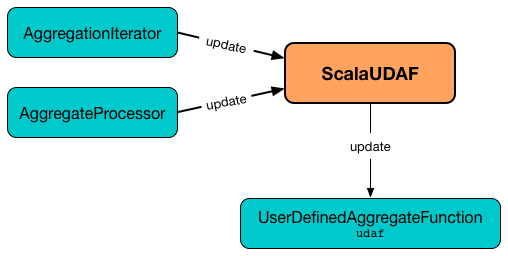
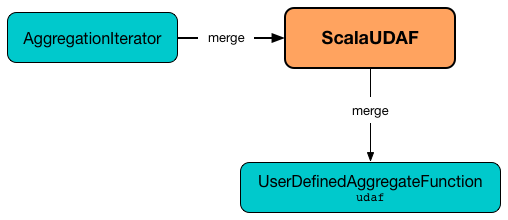

== [[ScalaUDAF]] ScalaUDAF -- Catalyst Expression Adapter for UserDefinedAggregateFunction

`ScalaUDAF` is an link:spark-sql-Expression.adoc[Catalyst expression] adapter to manage the lifecycle of <<udaf, UserDefinedAggregateFunction>> and hook it in Spark SQL's Catalyst execution path.

`ScalaUDAF` is <<creating-instance, created>> when:

* `UserDefinedAggregateFunction` creates a `Column` for a user-defined aggregate function using link:spark-sql-UserDefinedAggregateFunction.adoc#apply[all] and link:spark-sql-UserDefinedAggregateFunction.adoc#distinct[distinct] values (to use the UDAF in link:spark-sql-dataset-operators.adoc[Dataset operators])

* `UDFRegistration` is requested to link:spark-sql-UDFRegistration.adoc#register[register a user-defined aggregate function] (to use the UDAF in link:spark-sql-SparkSession.adoc#sql[SQL mode])

`ScalaUDAF` is a link:spark-sql-Expression-AggregateFunction-ImperativeAggregate.adoc[ImperativeAggregate].

[[ImperativeAggregate-methods]]
.ScalaUDAF's ImperativeAggregate Methods
[width="100%",cols="1,2",options="header"]
|===
| Method Name
| Behaviour

| <<initialize, initialize>>
| Requests <<udaf, UserDefinedAggregateFunction>> to link:spark-sql-UserDefinedAggregateFunction.adoc#initialize[initialize]

| <<merge, merge>>
| Requests <<udaf, UserDefinedAggregateFunction>> to link:spark-sql-UserDefinedAggregateFunction.adoc#merge[merge]

| <<update, update>>
| Requests <<udaf, UserDefinedAggregateFunction>> to link:spark-sql-UserDefinedAggregateFunction.adoc#update[update]
|===

[[eval]]
When evaluated, `ScalaUDAF`...FIXME

`ScalaUDAF` has link:spark-sql-Expression.adoc#NonSQLExpression[no representation in SQL].

[[properties]]
.ScalaUDAF's Properties (in alphabetical order)
[width="100%",cols="1,2",options="header"]
|===
| Name
| Description

| `aggBufferAttributes`
| link:spark-sql-StructType.adoc#toAttributes[AttributeReferences] of <<aggBufferSchema, aggBufferSchema>>

| `aggBufferSchema`
| link:spark-sql-UserDefinedAggregateFunction.adoc#bufferSchema[bufferSchema] of <<udaf, UserDefinedAggregateFunction>>

| `dataType`
| link:spark-sql-DataType.adoc[DataType] of <<udaf, UserDefinedAggregateFunction>>

| `deterministic`
| `deterministic` of <<udaf, UserDefinedAggregateFunction>>

| `inputAggBufferAttributes`
| Copy of <<aggBufferAttributes, aggBufferAttributes>>

| `inputTypes`
| link:spark-sql-DataType.adoc[Data types] from link:spark-sql-UserDefinedAggregateFunction.adoc#inputSchema[inputSchema] of <<udaf, UserDefinedAggregateFunction>>

| `nullable`
| Always enabled (i.e. `true`)
|===

[[internal-registries]]
.ScalaUDAF's Internal Registries and Counters (in alphabetical order)
[cols="1,2",options="header",width="100%"]
|===
| Name
| Description

| [[inputAggregateBuffer]] `inputAggregateBuffer`
| Used when...FIXME

| [[inputProjection]] `inputProjection`
| Used when...FIXME

| [[inputToScalaConverters]] `inputToScalaConverters`
| Used when...FIXME

| [[mutableAggregateBuffer]] `mutableAggregateBuffer`
| Used when...FIXME
|===

=== [[creating-instance]] Creating ScalaUDAF Instance

`ScalaUDAF` takes the following when created:

* [[children]] Children link:spark-sql-Expression.adoc[Catalyst expressions]
* [[udaf]] link:spark-sql-UserDefinedAggregateFunction.adoc[UserDefinedAggregateFunction]
* [[mutableAggBufferOffset]] `mutableAggBufferOffset` (starting with `0`)
* [[inputAggBufferOffset]] `inputAggBufferOffset` (starting with `0`)

`ScalaUDAF` initializes the <<internal-registries, internal registries and counters>>.

=== [[initialize]] `initialize` Method

[source, scala]
----
initialize(buffer: InternalRow): Unit
----

`initialize` sets the input `buffer` link:spark-sql-InternalRow.adoc[internal binary row] as `underlyingBuffer` of <<mutableAggregateBuffer, MutableAggregationBufferImpl>> and requests the <<udaf, UserDefinedAggregateFunction>> to link:spark-sql-UserDefinedAggregateFunction.adoc#initialize[initialize] (with the <<mutableAggregateBuffer, MutableAggregationBufferImpl>>).

.ScalaUDAF initializes UserDefinedAggregateFunction

NOTE: `initialize` is a part of link:spark-sql-Expression-AggregateFunction-ImperativeAggregate.adoc#initialize[ImperativeAggregate Contract].

=== [[update]] `update` Method

[source, scala]
----
update(mutableAggBuffer: InternalRow, inputRow: InternalRow): Unit
----

`update` sets the input `buffer` link:spark-sql-InternalRow.adoc[internal binary row] as `underlyingBuffer` of <<mutableAggregateBuffer, MutableAggregationBufferImpl>> and requests the <<udaf, UserDefinedAggregateFunction>> to link:spark-sql-UserDefinedAggregateFunction.adoc#update[update].

NOTE: `update` uses <<inputProjection, inputProjection>> on the input `input` and converts it using <<inputToScalaConverters, inputToScalaConverters>>.

.ScalaUDAF updates UserDefinedAggregateFunction

NOTE: `update` is a part of link:spark-sql-Expression-AggregateFunction-ImperativeAggregate.adoc#update[ImperativeAggregate Contract].

=== [[merge]] `merge` Method

[source, scala]
----
merge(buffer1: InternalRow, buffer2: InternalRow): Unit
----

`merge` first sets:

* `underlyingBuffer` of <<mutableAggregateBuffer, MutableAggregationBufferImpl>> to the input `buffer1`
* `underlyingInputBuffer` of <<inputAggregateBuffer, InputAggregationBuffer>> to the input `buffer2`

`merge` then requests the <<udaf, UserDefinedAggregateFunction>> to link:spark-sql-UserDefinedAggregateFunction.adoc#merge[merge] (passing in the <<mutableAggregateBuffer, MutableAggregationBufferImpl>> and <<inputAggregateBuffer, InputAggregationBuffer>>).

.ScalaUDAF requests UserDefinedAggregateFunction to merge

NOTE: `merge` is a part of link:spark-sql-Expression-AggregateFunction-ImperativeAggregate.adoc#merge[ImperativeAggregate Contract].
