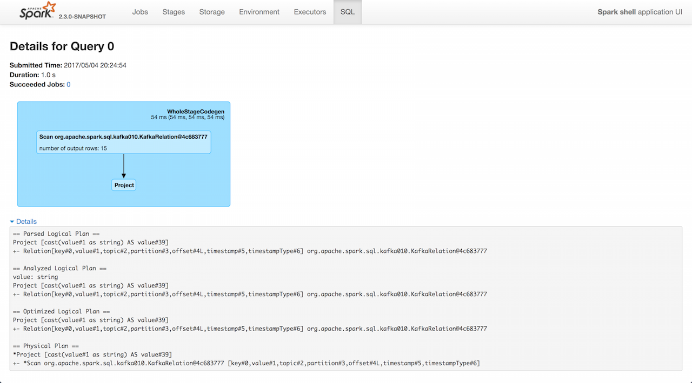

== [[KafkaWriter]] KafkaWriter -- Writing Dataset to Kafka

`KafkaWriter` is used to <<write, write>> the result of a batch or structured streaming query to Apache Kafka (with a new execution id attached so you can see the execution in web UI's SQL tab).

.KafkaWriter (write) in web UI

`KafkaWriter` <<validateQuery, makes sure>> that the schema of the `Dataset` to write records of contains:

1. Required *topic* as a field of type `StringType` or specified explicitly

1. Required *value* as a field of type `StringType` or `BinaryType`

1. Optional *key* as a field of type `StringType` or `BinaryType`

[source, scala]
----
// KafkaWriter is a private `kafka010` package object
// and so the code to use it should also be in the same package
// BEGIN: Use `:paste -raw` in spark-shell
package org.apache.spark.sql.kafka010

object PublicKafkaWriter {
  import org.apache.spark.sql.execution.QueryExecution
  def validateQuery(
      queryExecution: QueryExecution,
      kafkaParameters: Map[String, Object],
      topic: Option[String] = None): Unit = {
    import scala.collection.JavaConversions.mapAsJavaMap
    KafkaWriter.validateQuery(queryExecution, kafkaParameters, topic)
  }
}
// END

import org.apache.spark.sql.kafka010.{PublicKafkaWriter => PKW}

val spark: SparkSession = ...
val q = spark.range(1).select('id)
scala> PKW.validateQuery(
  queryExecution = q.queryExecution,
  kafkaParameters = Map.empty[String, Object])
org.apache.spark.sql.AnalysisException: topic option required when no 'topic' attribute is present. Use the topic option for setting a topic.;
  at org.apache.spark.sql.kafka010.KafkaWriter$$anonfun$2.apply(KafkaWriter.scala:53)
  at org.apache.spark.sql.kafka010.KafkaWriter$$anonfun$2.apply(KafkaWriter.scala:52)
  at scala.Option.getOrElse(Option.scala:121)
  at org.apache.spark.sql.kafka010.KafkaWriter$.validateQuery(KafkaWriter.scala:51)
  at org.apache.spark.sql.kafka010.PublicKafkaWriter$.validateQuery(<pastie>:10)
  ... 50 elided
----

=== [[write]] Writing Query Results to Kafka -- `write` Method

[source, scala]
----
write(
  sparkSession: SparkSession,
  queryExecution: QueryExecution,
  kafkaParameters: ju.Map[String, Object],
  topic: Option[String] = None): Unit
----

`write` link:spark-sql-KafkaWriter-KafkaWriteTask.adoc[creates and executes a KafkaWriteTask] per partition of the ``QueryExecution``'s link:spark-sql-QueryExecution.adoc#toRdd[RDD] (link:spark-sql-SQLExecution.adoc#withNewExecutionId[with a new execution id] attached so you can see the execution in web UI's link:spark-webui-sql.adoc[SQL tab]).

[NOTE]
====
`write` is used when:

* `KafkaSourceProvider` link:spark-sql-DataSourceRegister-KafkaSourceProvider.adoc#createRelation-CreatableRelationProvider[creates a BaseRelation] (after writing the result of a structure query)

* Structured Streaming's `KafkaSink` commits a batch
====

=== [[validateQuery]] Validating QueryExecution -- `validateQuery` Method

[source, scala]
----
validateQuery(
  queryExecution: QueryExecution,
  kafkaParameters: java.util.Map[String, Object],
  topic: Option[String] = None): Unit
----

`validateQuery` validates the schema of the input link:spark-sql-QueryExecution.adoc#analyzed[analyzed] `QueryExecution`, i.e.

1. Whether the required *topic* is available as a field of type `StringType` in the schema or as the input `topic`

1. Whether the optional *key* is available as a field of type `StringType` or `BinaryType` in the schema

1. Whether the required *value* is available as a field of type `StringType` or `BinaryType` in the schema

NOTE: `validateQuery` is used exclusively when `KafkaWriter` <<write, writes the result of a query to Kafka>>.
