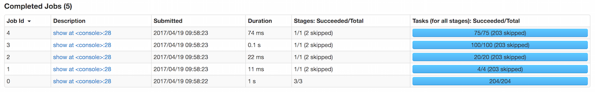
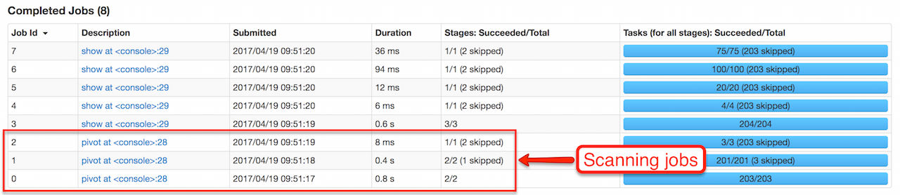

== [[RelationalGroupedDataset]] RelationalGroupedDataset -- Untyped Row-based Grouping

`RelationalGroupedDataset` is an interface to <<operators, calculate aggregates over groups of rows>> in a link:spark-sql-DataFrame.adoc[DataFrame].

NOTE: link:spark-sql-KeyValueGroupedDataset.adoc[KeyValueGroupedDataset] is used for typed aggregates using custom Scala objects (not link:spark-sql-Row.adoc[Rows]).

`RelationalGroupedDataset` is a result of executing the following grouping operators:

* link:spark-sql-basic-aggregation.adoc#groupBy[groupBy]
* link:spark-sql-multi-dimensional-aggregation.adoc#rollup[rollup]
* link:spark-sql-multi-dimensional-aggregation.adoc#cube[cube]
* <<pivot, pivot>> (after link:spark-sql-basic-aggregation.adoc#groupBy[groupBy] operator)

[[operators]]
.RelationalGroupedDataset's Aggregate Operators (in alphabetical order)
[cols="1,3",options="header",width="100%"]
|===
| Operator
| Description

| <<agg, agg>>
|

| `avg`
|

| `count`
|

| `max`
|

| `mean`
|

| `min`
|

| <<pivot, pivot>>
| Pivots on a column (with new columns per distinct value)

| `sum`
|
|===

NOTE: link:spark-sql-SQLConf.adoc#spark.sql.retainGroupColumns[spark.sql.retainGroupColumns] property controls whether to retain columns used for aggregation or not (in `RelationalGroupedDataset` operators). Enabled by default.

=== [[toDF]] Creating DataFrame from Aggregate Expressions -- `toDF` Internal Method

[source, scala]
----
toDF(aggExprs: Seq[Expression]): DataFrame
----

CAUTION: FIXME

Internally, `toDF` branches off per group type.

CAUTION: FIXME

[[toDF-PivotType]] For `PivotType`, `toDF` link:spark-sql-Dataset.adoc#ofRows[creates a DataFrame] with link:spark-sql-LogicalPlan-Pivot.adoc[Pivot] unary logical operator.

=== [[creating-instance]] Creating RelationalGroupedDataset Instance

`RelationalGroupedDataset` takes the following when created:

* [[df]] link:spark-sql-DataFrame.adoc[DataFrame]
* [[groupingExprs]] Grouping link:spark-sql-Expression.adoc[expressions]
* [[groupType]] Group type (to indicate what operation has created it), i.e. `GroupByType`, `CubeType`, `RollupType`, `PivotType`

=== [[agg]] `agg` Operator

[source, scala]
----
agg(aggExpr: (String, String), aggExprs: (String, String)*): DataFrame
agg(exprs: Map[String, String]): DataFrame
agg(expr: Column, exprs: Column*): DataFrame
----

=== [[pivot]] `pivot` Operator

[source, scala]
----
pivot(pivotColumn: String): RelationalGroupedDataset  // <1>
pivot(pivotColumn: String, values: Seq[Any]): RelationalGroupedDataset  // <2>
----
<1> Selects distinct and sorted values on `pivotColumn` and calls the other `pivot` (that results in 3 extra "scanning" jobs)
<2> Preferred as more efficient because the unique values are aleady provided

`pivot` pivots on a `pivotColumn` column, i.e. adds new columns per distinct values in `pivotColumn`.

NOTE: `pivot` is only supported after link:spark-sql-basic-aggregation.adoc#groupBy[groupBy] operation.

NOTE: Only one `pivot` operation is supported on a `RelationalGroupedDataset`.

[source, scala]
----
val visits = Seq(
  (0, "Warsaw", 2015),
  (1, "Warsaw", 2016),
  (2, "Boston", 2017)
).toDF("id", "city", "year")

val q = visits
  .groupBy("city")  // <-- rows in pivot table
  .pivot("year")    // <-- columns (unique values queried)
  .count()          // <-- values in cells
scala> q.show
+------+----+----+----+
|  city|2015|2016|2017|
+------+----+----+----+
|Warsaw|   1|   1|null|
|Boston|null|null|   1|
+------+----+----+----+

scala> q.explain
== Physical Plan ==
HashAggregate(keys=[city#8], functions=[pivotfirst(year#9, count(1) AS `count`#222L, 2015, 2016, 2017, 0, 0)])
+- Exchange hashpartitioning(city#8, 200)
   +- HashAggregate(keys=[city#8], functions=[partial_pivotfirst(year#9, count(1) AS `count`#222L, 2015, 2016, 2017, 0, 0)])
      +- *HashAggregate(keys=[city#8, year#9], functions=[count(1)])
         +- Exchange hashpartitioning(city#8, year#9, 200)
            +- *HashAggregate(keys=[city#8, year#9], functions=[partial_count(1)])
               +- LocalTableScan [city#8, year#9]

scala> visits
  .groupBy('city)
  .pivot("year", Seq("2015")) // <-- one column in pivot table
  .count
  .show
+------+----+
|  city|2015|
+------+----+
|Warsaw|   1|
|Boston|null|
+------+----+
----

IMPORTANT: Use `pivot` with a list of distinct values to pivot on so Spark does not have to compute the list itself (and run three extra "scanning" jobs).

.pivot in web UI (Distinct Values Defined Explicitly)


.pivot in web UI -- Three Extra Scanning Jobs Due to Unspecified Distinct Values


NOTE: link:spark-sql-SQLConf.adoc#spark.sql.pivotMaxValues[spark.sql.pivotMaxValues] (default: `10000`) controls the maximum number of (distinct) values that will be collected without error (when doing `pivot` without specifying the values for the pivot column).

Internally, `pivot` creates a `RelationalGroupedDataset` with `PivotType` group type and `pivotColumn` resolved using the DataFrame's columns with `values` as `Literal` expressions.

[NOTE]
====
<<toDF, toDF>> internal method maps `PivotType` group type to a `DataFrame` with link:spark-sql-LogicalPlan-Pivot.adoc[Pivot] unary logical operator.

```
scala> q.queryExecution.logical
res0: org.apache.spark.sql.catalyst.plans.logical.LogicalPlan =
Pivot [city#8], year#9: int, [2015, 2016, 2017], [count(1) AS count#24L]
+- Project [_1#3 AS id#7, _2#4 AS city#8, _3#5 AS year#9]
   +- LocalRelation [_1#3, _2#4, _3#5]
```
====
