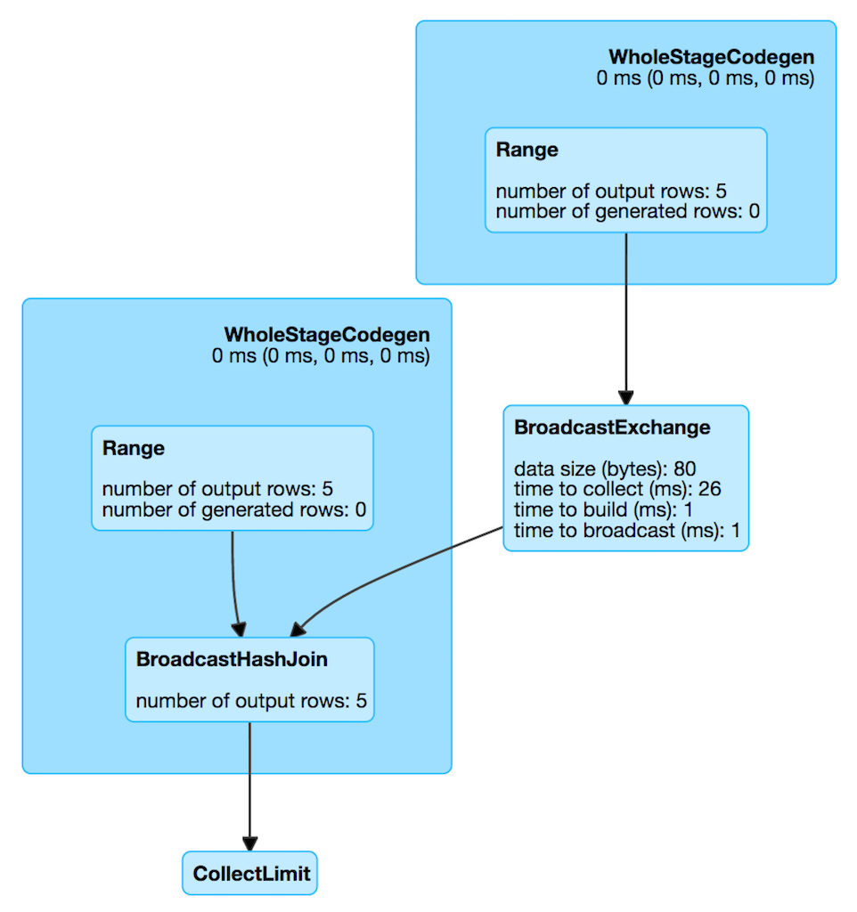

== [[BroadcastExchangeExec]] BroadcastExchangeExec Unary Operator for Broadcasting Joins

`BroadcastExchangeExec` is a link:spark-sql-SparkPlan.adoc#UnaryExecNode[physical operator] (with one <<child, child>> physical operator) to broadcast rows (of a relation) to worker nodes.

`BroadcastExchangeExec` is <<creating-instance, created>> exclusively when `EnsureRequirements` physical query plan optimization link:spark-sql-EnsureRequirements.adoc#ensureDistributionAndOrdering[ensures BroadcastDistribution of the input data of a physical operator] (that _seemingly_ can be either link:spark-sql-SparkPlan-BroadcastHashJoinExec.adoc[BroadcastHashJoinExec] or link:spark-sql-SparkPlan-BroadcastNestedLoopJoinExec.adoc[BroadcastNestedLoopJoinExec] operators).

[source, scala]
----
val t1 = spark.range(5)
val t2 = spark.range(5)
val q = t1.join(t2).where(t1("id") === t2("id"))

scala> q.explain
== Physical Plan ==
*BroadcastHashJoin [id#19L], [id#22L], Inner, BuildRight
:- *Range (0, 5, step=1, splits=Some(8))
+- BroadcastExchange HashedRelationBroadcastMode(List(input[0, bigint, false]))
   +- *Range (0, 5, step=1, splits=Some(8))
----

[[metrics]]
.BroadcastExchangeExec SQLMetrics (in alphabetical order)
[cols="1,2",options="header",width="100%"]
|===
| Name
| Description

| [[broadcastTime]] `broadcastTime`
| time to broadcast (ms)

| [[buildTime]] `buildTime`
| time to build (ms)

| [[collectTime]] `collectTime`
| time to collect (ms)

| [[dataSize]] `dataSize`
| data size (bytes)
|===

.BroadcastExchangeExec in web UI (Details for Query)

[[outputPartitioning]]
`BroadcastExchangeExec` uses link:spark-sql-SparkPlan-Partitioning.adoc#BroadcastPartitioning[BroadcastPartitioning] partitioning scheme (with the input <<mode, BroadcastMode>>).

=== [[creating-instance]] Creating BroadcastExchangeExec Instance

`BroadcastExchangeExec` takes the following when created:

* [[mode]] `BroadcastMode`
* [[child]] Child link:spark-sql-LogicalPlan.adoc[logical plan]

=== [[doPrepare]] Preparing Asynchronous Broadcast (with Rows) -- `doPrepare` Method

[source, scala]
----
doPrepare(): Unit
----

`doPrepare` "materializes" the internal lazily-once-initialized <<relationFuture, asynchronous broadcast>>.

NOTE: `doPrepare` is a part of link:spark-sql-SparkPlan.adoc#doPrepare[SparkPlan Contract] to prepare a physical operator for execution.

=== [[doExecuteBroadcast]] Broadcasting Rows -- `doExecuteBroadcast` Method

[source, scala]
----
def doExecuteBroadcast[T](): broadcast.Broadcast[T]
----

`doExecuteBroadcast` waits until the <<relationFuture, rows are broadcast>>.

NOTE: `doExecuteBroadcast` waits link:spark-sql-SQLConf.adoc#broadcastTimeout[spark.sql.broadcastTimeout] (i.e. 5 minutes).

NOTE: `doExecuteBroadcast` is a part of link:spark-sql-SparkPlan.adoc#doExecuteBroadcast[SparkPlan Contract] to return the result of a structured query as a broadcast variable.

=== [[relationFuture]] Lazily-Once-Initialized Asynchronously-Broadcast `relationFuture` Internal Attribute

[source, scala]
----
relationFuture: Future[broadcast.Broadcast[Any]]
----

When "materialized" (aka _executed_), `relationFuture` finds the current link:spark-sql-SQLExecution.adoc#spark.sql.execution.id[execution id] and sets it to the `Future` thread.

`relationFuture` requests <<child, child physical operator>> to link:spark-sql-SparkPlan.adoc#executeCollect[executeCollect].

`relationFuture` records the time for `executeCollect` in <<collectTime, collectTime>> metrics and the size of the data in <<dataSize, dataSize>> metrics.

NOTE: `relationFuture` accepts a relation with up to 512 millions rows and 8GB in size, and reports a `SparkException` if the conditions are violated.

`relationFuture` requests the input <<mode, BroadcastMode>> to `transform` the internal rows and records the time in <<buildTime, buildTime>> metrics.

`relationFuture` requests the current `SparkContext` to `broadcast` the transformed internal rows and records the time in <<broadcastTime, broadcastTime>> metrics.

In the end, `relationFuture` link:spark-sql-SQLMetric.adoc#postDriverMetricUpdates[posts `SparkListenerDriverAccumUpdates`] (with the execution id and the metrics) and returns the broadcast internal rows.

In case of `OutOfMemoryError`, `relationFuture` reports another `OutOfMemoryError` with the following message:

[options="wrap"]
----
Not enough memory to build and broadcast the table to all worker nodes. As a workaround, you can either disable broadcast by setting spark.sql.autoBroadcastJoinThreshold to -1 or increase the spark driver memory by setting spark.driver.memory to a higher value
----

NOTE: `relationFuture` is executed on a separate thread from a custom https://www.scala-lang.org/api/2.11.8/index.html#scala.concurrent.ExecutionContext[scala.concurrent.ExecutionContext] (built from a cached https://docs.oracle.com/javase/8/docs/api/java/util/concurrent/ThreadPoolExecutor.html[java.util.concurrent.ThreadPoolExecutor] with the prefix *broadcast-exchange* and 128 threads).
