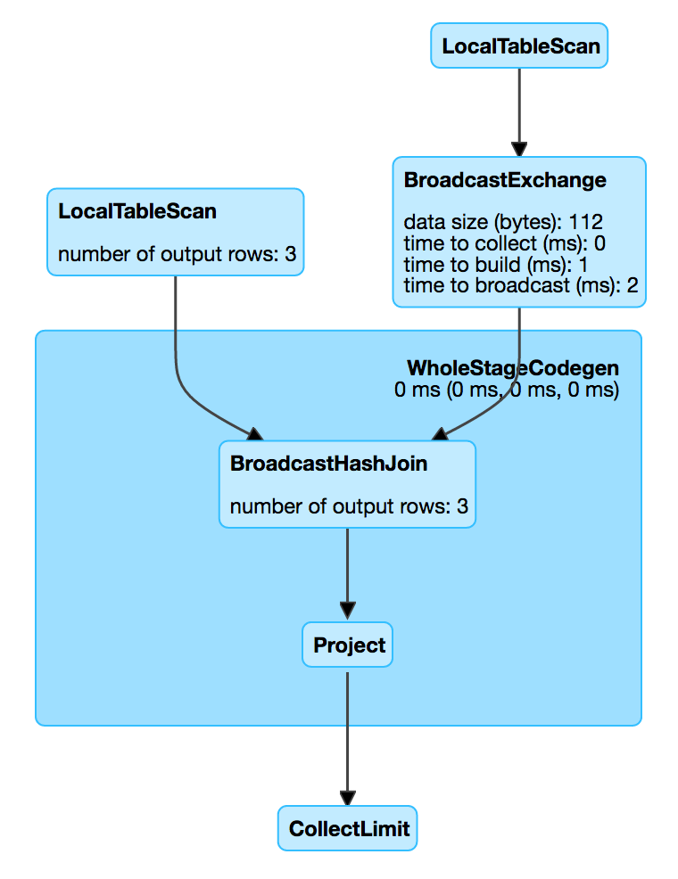

== [[BroadcastHashJoinExec]] BroadcastHashJoinExec Binary Physical Operator

`BroadcastHashJoinExec` is a link:spark-sql-SparkPlan.adoc#BinaryExecNode[binary physical operator] that link:spark-sql-CodegenSupport.adoc[supports code generation] (aka _codegen_).

`BroadcastHashJoinExec` is <<creating-instance, created>> after applying link:spark-sql-SparkStrategy-JoinSelection.adoc[JoinSelection] execution planning strategy to link:spark-sql-SparkStrategy-JoinSelection.adoc#ExtractEquiJoinKeys[ExtractEquiJoinKeys]-destructurable logical query plans (i.e. link:spark-sql-SparkStrategy-JoinSelection.adoc#canBuildRight[INNER, CROSS, LEFT OUTER, LEFT SEMI, LEFT ANTI]) of which the `right` physical operator link:spark-sql-SparkStrategy-JoinSelection.adoc#canBroadcast[can be broadcast].

[source, scala]
----
val tokens = Seq(
  (0, "playing"),
  (1, "with"),
  (2, "BroadcastHashJoinExec")
).toDF("id", "token")

scala> spark.conf.get("spark.sql.autoBroadcastJoinThreshold")
res0: String = 10485760

val q = tokens.join(tokens, Seq("id"), "inner")
scala> q.explain
== Physical Plan ==
*Project [id#15, token#16, token#21]
+- *BroadcastHashJoin [id#15], [id#20], Inner, BuildRight
   :- LocalTableScan [id#15, token#16]
   +- BroadcastExchange HashedRelationBroadcastMode(List(cast(input[0, int, false] as bigint)))
      +- LocalTableScan [id#20, token#21]
----

`BroadcastHashJoinExec` <<requiredChildDistribution, requires that partition requirements>> for the two children physical operators match `BroadcastDistribution` (with `HashedRelationBroadcastMode`) and `UnspecifiedDistribution` (for <<left, left>> and <<right, right>> sides of a join or vice versa).

[[metrics]]
.BroadcastHashJoinExec's SQLMetrics
[cols="1,2",options="header",width="100%"]
|===
| Name
| Description

| [[numOutputRows]] `numOutputRows`
| Number of output rows
|===

.BroadcastHashJoinExec in web UI (Details for Query)

NOTE: The prefix for variable names for `BroadcastHashJoinExec` operators in link:spark-sql-CodegenSupport.adoc[CodegenSupport]-generated code is *bhj*.

[source, scala]
----
scala> q.queryExecution.debug.codegen
Found 1 WholeStageCodegen subtrees.
== Subtree 1 / 1 ==
*Project [id#15, token#16, token#21]
+- *BroadcastHashJoin [id#15], [id#20], Inner, BuildRight
   :- LocalTableScan [id#15, token#16]
   +- BroadcastExchange HashedRelationBroadcastMode(List(cast(input[0, int, false] as bigint)))
      +- LocalTableScan [id#20, token#21]

Generated code:
/* 001 */ public Object generate(Object[] references) {
/* 002 */   return new GeneratedIterator(references);
/* 003 */ }
/* 004 */
/* 005 */ final class GeneratedIterator extends org.apache.spark.sql.execution.BufferedRowIterator {
/* 006 */   private Object[] references;
/* 007 */   private scala.collection.Iterator[] inputs;
/* 008 */   private scala.collection.Iterator inputadapter_input;
/* 009 */   private org.apache.spark.broadcast.TorrentBroadcast bhj_broadcast;
/* 010 */   private org.apache.spark.sql.execution.joins.LongHashedRelation bhj_relation;
/* 011 */   private org.apache.spark.sql.execution.metric.SQLMetric bhj_numOutputRows;
/* 012 */   private UnsafeRow bhj_result;
/* 013 */   private org.apache.spark.sql.catalyst.expressions.codegen.BufferHolder bhj_holder;
/* 014 */   private org.apache.spark.sql.catalyst.expressions.codegen.UnsafeRowWriter bhj_rowWriter;
...
----

[[requiredChildDistribution]]
.BroadcastHashJoinExec's Required Child Output Distributions
[cols="1,2,2",options="header",width="100%"]
|===
| BuildSide
| Left Child
| Right Child

| `BuildLeft`
| `BroadcastDistribution` <1>
| `UnspecifiedDistribution`

| `BuildRight`
| `UnspecifiedDistribution`
| `BroadcastDistribution` <1>
|===
<1> `BroadcastDistribution` uses `HashedRelationBroadcastMode` broadcast mode per `buildKeys`

=== [[creating-instance]] Creating BroadcastHashJoinExec Instance

`BroadcastHashJoinExec` takes the following when created:

* [[leftKeys]] Left join key link:spark-sql-Expression.adoc[expressions]
* [[rightKeys]] Right join key link:spark-sql-Expression.adoc[expressions]
* [[joinType]] link:spark-sql-joins.adoc#join-types[Join type]
* [[buildSide]] `BuildSide`
* [[condition]] Optional join condition link:spark-sql-Expression.adoc[expression]
* [[left]] Left link:spark-sql-SparkPlan.adoc[physical operator]
* [[right]] Right link:spark-sql-SparkPlan.adoc[physical operator]
