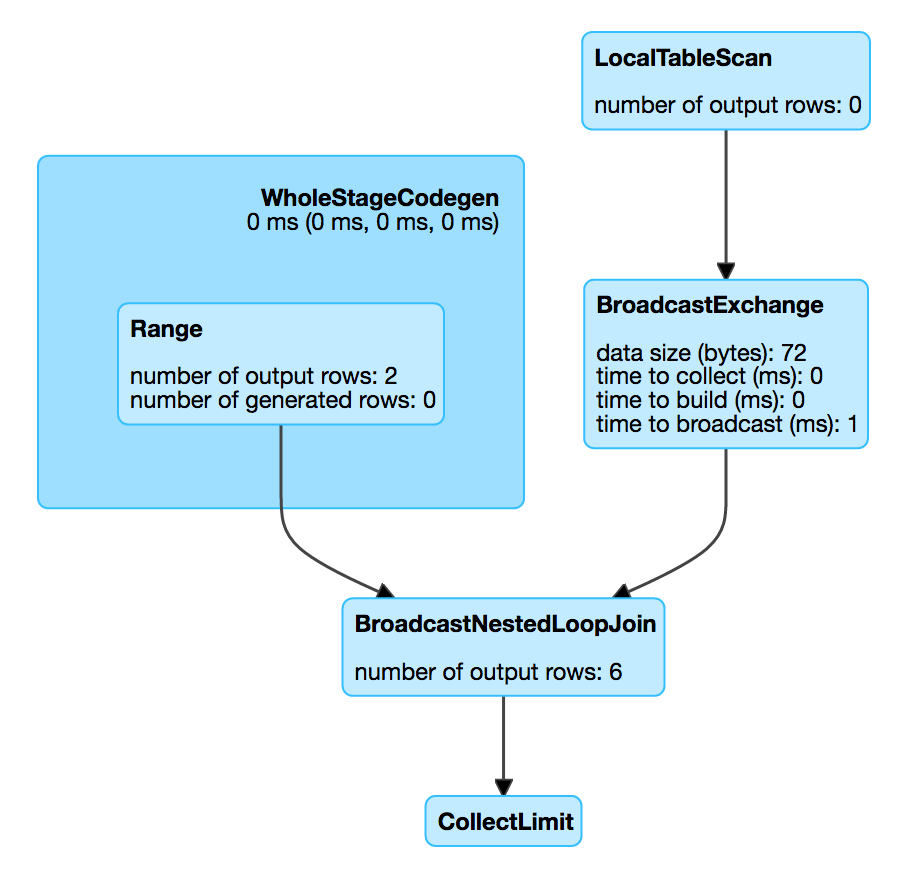

== [[BroadcastNestedLoopJoinExec]] BroadcastNestedLoopJoinExec Binary Physical Operator

`BroadcastNestedLoopJoinExec` is a link:spark-sql-SparkPlan.adoc#BinaryExecNode[binary physical operator] (with two child <<left, left>> and <<right, right>> physical operators) that is <<creating-instance, created>> (and converted to) when link:spark-sql-SparkStrategy-JoinSelection.adoc[JoinSelection] physical plan strategy finds a link:spark-sql-LogicalPlan-Join.adoc[Join] logical operator that meets either case:

1. link:spark-sql-SparkStrategy-JoinSelection.adoc#canBuildRight[canBuildRight] join type and `right` physical operator link:spark-sql-SparkStrategy-JoinSelection.adoc#canBroadcast[broadcastable]
1. link:spark-sql-SparkStrategy-JoinSelection.adoc#canBuildLeft[canBuildLeft] join type and `left` link:spark-sql-SparkStrategy-JoinSelection.adoc#canBroadcast[broadcastable]
1. non-``InnerLike`` join type

NOTE: `BroadcastNestedLoopJoinExec` is the default physical operator when no other operators have matched link:spark-sql-SparkStrategy-JoinSelection.adoc#join-selection-requirements[selection requirements].

[NOTE]
====
link:spark-sql-SparkStrategy-JoinSelection.adoc#canBuildRight[canBuildRight] join types are:

* CROSS, INNER, LEFT ANTI, LEFT OUTER, LEFT SEMI or Existence

link:spark-sql-SparkStrategy-JoinSelection.adoc#canBuildLeft[canBuildLeft] join types are:

* CROSS, INNER, RIGHT OUTER
====

[source, scala]
----
val nums = spark.range(2)
val letters = ('a' to 'c').map(_.toString).toDF("letter")
val q = nums.crossJoin(letters)

scala> q.explain
== Physical Plan ==
BroadcastNestedLoopJoin BuildRight, Cross
:- *Range (0, 2, step=1, splits=Some(8))
+- BroadcastExchange IdentityBroadcastMode
   +- LocalTableScan [letter#69]
----

[[metrics]]
.BroadcastNestedLoopJoinExec's SQLMetrics
[cols="1,2",options="header",width="100%"]
|===
| Name
| Description

| [[numOutputRows]] `numOutputRows`
| Number of output rows
|===

.BroadcastNestedLoopJoinExec in web UI (Details for Query)

[[requiredChildDistribution]]
.BroadcastNestedLoopJoinExec's Required Child Output Distributions
[cols="1,2,2",options="header",width="100%"]
|===
| BuildSide
| Left Child
| Right Child

| `BuildLeft`
| `BroadcastDistribution` <1>
| `UnspecifiedDistribution`

| `BuildRight`
| `UnspecifiedDistribution`
| `BroadcastDistribution` <1>
|===
<1> `BroadcastDistribution` uses `IdentityBroadcastMode` broadcast mode

=== [[creating-instance]] Creating BroadcastNestedLoopJoinExec Instance

`BroadcastNestedLoopJoinExec` takes the following when created:

* [[left]] Left link:spark-sql-SparkPlan.adoc[physical operator]
* [[right]] Right link:spark-sql-SparkPlan.adoc[physical operator]
* [[buildSide]] `BuildSide`
* [[joinType]] link:spark-sql-joins.adoc#join-types[Join type]
* [[condition]] Optional join condition link:spark-sql-Expression.adoc[expressions]
